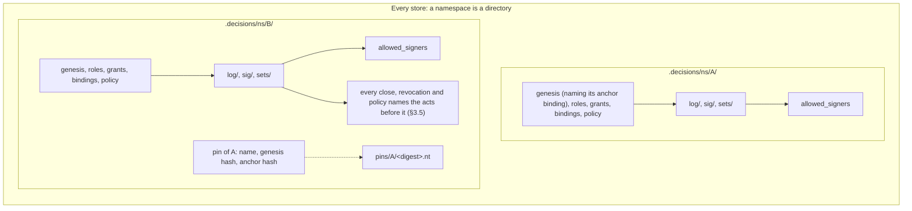
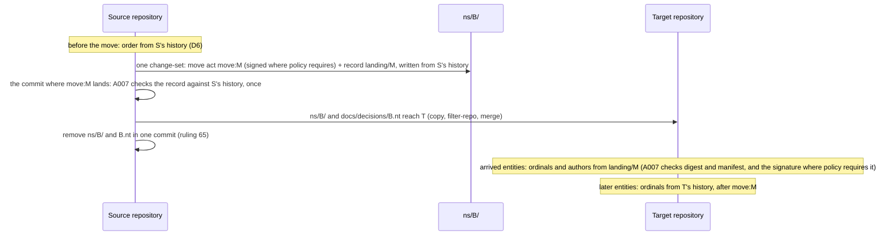

# Namespace independence: design PRD

First draft 7 October 2026; revised the same day after rulings 61 to 81, and again after rulings 82 to 84 (`ledger/rulings/namespace-design-rulings-2026-10-07.md`). Third revision, 9 October 2026: the order of acts comes from the acts, put to the principal as position D with twenty questions. **Fourth revision, 9 October 2026: position D is ruled.** Rulings 85 to 101 (`ledger/rulings/order-from-the-acts-rulings-2026-10-09.md`) answer the twenty questions and one the review raised, and §3.5 now states the ruled design. Ruling 102 (same file, 9 October 2026) answers the one question the fourth revision raised, in §3.5.6.

This document states the ruled design for rulings 32, 41 to 48, 61 to 63, 66 to 78, 80 to 82 and 85 to 102. Rulings 64, 65, 79, 83 and 84 are superseded (by 85, 93, 94 and 95) and rulings 66 and 77 amended (by 87 and 96); the move design they ruled is kept whole in Appendix A.1 as the record of what was weighed.

- **Section 3** gives the design topic by topic, each with the rulings it rests on.
- **Points not separately ruled** are the first draft's leans, which the principal accepted as the basis of the design. They are marked "accepted with the design".
- **Options that were not chosen** are in Appendix A, kept short. The move act, the landing record, the freeze and the arrival rule are in Appendix A.1, superseded.
- **Sections 1 and 2** are kept as they were written before the rulings: they are the record of the problem and of the experiment.
- **The protocol changes in §5** are proposals. The protocol changes with the implementation.

The session record is `ledger/sessions/2026-10-namespace-design.md`. It holds what was read, every experiment's commands and full output, the principal's replies, and what could not be determined. The third revision's record is its section "Order from the acts"; the fourth's is "Principal's replies, 2026-10-09".

**Base.** The first draft was written against `e20fadc`. The second revision was on `846975a`. The third and fourth revisions are on `main` after pull request #128 merged (`918a08d`, then `fac640d`): it carries the ten verification fixes (rulings 49 to 60, `ledger/sessions/2026-10-verification-fixes.md`) and the second revision of this document. The prompt for the third revision was written with `main` at `18ebc86` and #128 unmerged; the repository has moved since, and the repository wins. The third and fourth revisions are therefore one new pull request, not a change to #128. It is opened from a new branch off `main`, because the branch #128 merged from is finished.

**Reading the claims.** Every statement about today's behaviour names a file and a symbol. It is marked *(run)* when an experiment in §2 or an attack store in §3.5 showed it, *(read)* when it comes from reading the code, *(inference)* when it follows from the code but was not run, and *(prototype)* when a verdict under order from the acts was computed by the throwaway script described in the session record, which decides nothing about the format.

## Contents

1. The coupling inventory (record)
2. The extraction experiment (record)
3. The design
   - 3.5 Order from the acts
4. Acceptance criteria
5. Protocol changes
6. Issues
7. Rulings, and the questions they raise
   - Position C and position D, the record of what was weighed
   - The question the rulings raised, ruled

Appendix A. Options considered
   - A.1 The move act, the landing record, the freeze and arrival (rulings 64, 65, 77, 79, 83, 84; superseded by rulings 85, 93, 94 and 95)

---
## 1. The coupling inventory

This section is the specification of the problem. Each entry is a place where the content of one namespace can change a verdict, a derived file or an export of another. Some entries are couplings between a namespace and the repository that holds it, which a move breaks. The design in §3 is complete when every entry has an answer. The answers are collected in §3.13.

Every store below is a git repository with `.decisions/` at its root. "A" and "B" are two namespaces in one store.

### 1.1 Authority

**N1. One genesis grant serves every namespace.**
- *Where.* `authority::view::Authority::genesis` returns the store's one live genesis grant, and `authority::structure::grant_faults` requires its scope to be `*`. Six places read it:
  - `authority::filing::may_file` (D7: who may file a key binding);
  - `verify::acts::policy_verdict` (`A006` on every policy);
  - `verify::acts::revocation_verdict` (a grant's revocation is checked only `auth.genesis()?`);
  - `authority::references::basis_holds` (`fallback-of-genesis` needs a fallback over `*` in the genesis role);
  - `verify::genesis_unbound` (the notice);
  - `author::authority_ops::Author::join_genesis` (a later namespace is opened by "the" genesis holder).
- *Requirements.* LP-6.5, LP-6.28, LP-4.38, LP-8.31.
- *Minimal store.* `init --namespace A --external-ref m`, then `init --namespace B`. B's policy carries `under: <A's genesis grant>`. That grant is filed in the change-set that opened A.
- *Shown.* E4a *(run)*. Without that change-set, B's policy fails `A006` ("no live genesis grant as of the policy"), and both of B's key bindings fail D7.

**N2. `A003` and `A005` count over the whole store.**
- *Where.* `graph::shapes::SHAPES`. `A005` is "a live genesis grant beside another — the store has one trust root". `GRANT_COLLISION` is `A003`. Both run over `graph::turtle::emit(store)`, the union of every namespace. The doc comment on `graph_findings_in` says so: "the shapes hold per store (one genesis per store, `A005`)".
- *Requirements.* LP-6.5, LP-8.19, LP-8.23.
- *Minimal store.* A opened by one holder, and B given a genesis grant of its own (role `steward`, scope `*`, primary).
- *Shown (read).* `A005` fires on both grants, and `A003` fires as well (same role, scope and order). Today a second namespace cannot have its own genesis.

**N3. Role files serve every namespace.**
- *Where.* `store::load_roles` reads one directory, `.decisions/roles/`. `authority::structure::role_faults` refuses a role id declared twice. `authority::view::role_landing` places a role by its file's landing.
- *Requirements.* LP-5.19, LP-6.30, LP-8.27.
- *Minimal store.* A's `init` declares `steward` and `acceptor`. B's `init` declares none and names `acceptor` as its accept role.
- *Shown.* E3 *(run)*: B's opening declared no role.
- *Effect.* B's governance depends on files A's opening landed. One role id cannot mean different capability sets in A and in B.

**N4. A scope of `*` reaches every namespace, and `set:` reaches whatever namespaces file into that set.**
- *Where.* `authority::check::covers`: `(GrantScope::All, _) => true`, and `(GrantScope::Set(s), Target::Decision { set, .. }) => s == set`.
- *Requirement.* LP-6.16.
- *Minimal store.*
  - A `*` grant in A's change-set authorises acts in B: the genesis grant, as in N1.
  - A `set:shared` grant authorises acceptance of a decision of any namespace filed into `shared`.
- *Shown.* E3 *(run)*. second@'s grant `set:set-b` is the grant that authorised their acceptance in `beta.ns`.

**N5. Sets belong to no namespace.**
- *Where.*
  - `store::load_sets` reads one `sets/` directory, and a version may name any declared set (`VersionRaw::set`; `Store::set`).
  - `verify::disposition::stranded` (`L005`) reads the set's current floor.
  - `graph::export::select` exports "the sets those versions name".
  - Set files are not in `landing::TRACKED`, so they are edited in place (LP-5.9: raising a floor).
- *Requirements.* LP-5.9, LP-5.10, LP-8.33, LP-9.11.
- *Minimal store.* C-set *(run)*: one set `shared`, holding one decision of `a.ns` and one of `b.ns`. Raising the floor from T0 to T1 strands both (`L005` on each).

**N6. A close ends the key in every namespace.**
- *Where.*
  - `authority::key_close::same_key`, `closes_of`, `closes_among` and `is_closed` never compare `namespace`.
  - `signing::check::verify_one` asks every close of the matched key.
  - `signing::review::review_closed` lists acceptances under a closed key.
  - `authority::signers::derive_from` takes `valid-before` from the key's earliest close anywhere.
- *Requirements.* LP-4.39, LP-4.13, LP-4.32.
- *Minimal store.* E3 *(run)*. The owner's key K1 is bound in `alpha.ns` and in `beta.ns`. The owner accepts a decision in each, then rotates K1 in `alpha.ns`. Two effects follow:
  - The `beta.ns` acceptance becomes "needs re-acceptance" (it would be `L012` after a deadline).
  - The `beta.ns` line of `allowed_signers` gains `valid-before`.
- *Shown on a move.* E4b *(run)*. Extracted without `alpha.ns`'s rotate, the same acceptance is no longer a review item. The verdict changes on the move.

**N7. Which keys may be bound is judged across namespaces.**
- *Where.* `authority::key_close::refusal`, first two bullets: a key bound to another principal "anywhere in the store", and a key closed "in any namespace".
- *Requirement.* LP-4.37.
- *Minimal store.* Key K is bound to p1 in A. p2's binding of K in B is a schema fault. K is closed for p1 in A, and p1's later binding of K in B is a schema fault.
- *Shown (read).* Covered by `ledger-cli/tests/key_ownership.rs` and `key_across_namespaces.rs`.

**N8. D7 lets a namespace's first key lean on another namespace.**
- *Where.*
  - `authority::filing::self_bound`: the self-bound binding is the genesis holder's "first in the store", checked with `auth.bindings.iter().all(..)` over every namespace.
  - `authority::filing::may_file`: the genesis holder's own first `add` in a later namespace passes on `open_window(auth, b, &b.principal, None)`, a live key in any namespace.
  - `signing::check::carried_over`: keys trusted elsewhere stand in this namespace to verify that binding's signature.
- *Requirements.* LP-4.12, LP-4.38.
- *Minimal store.* E3's `init --namespace beta.ns` *(run)*: "bound … in `beta.ns`, signed by their key trusted elsewhere".
- *Shown.* E4a *(run)*. `beta.ns` alone fails D7 twice:
  - the owner's binding: "has no live key in `beta.ns`";
  - second@'s first key, filed under the genesis grant that is now missing: "names no `under`".

  Every signature in `beta.ns` then fails `L011`.

**N9. A first policy can be signed by a key trusted only in another namespace.**
- *Where.* `signing::check::judge_first_policy` copies every trusted key of the author into the policy's namespace (`KeyBinding { namespace: s.namespace.clone(), ..}`).
- *Requirement.* LP-4.31.
- *Shown.* E4a *(run)*: `L011` on `beta.ns`'s policy once `alpha.ns` is absent.

**N10. One `allowed_signers` file for the store.**
- *Where.* `authority::signers::path` gives the one file `.decisions/allowed_signers`. `derive`, `derive_from` and `check` work on all namespaces at once.
- *Requirements.* LP-4.10, LP-4.32, LP-4.33.
- *Shown.* E4a, E4b and E4d *(run)*. After any move both sides fail `[SIGNERS]` until `ledger identity sync`.
- *Related, found here (read and run).* `signers::write` returns `Ok` without removing the file when nothing binds (`None => Ok(())`). So E4a's leftover file stayed "committed but the log binds no key" after `identity sync`.

**N11. Notices name the store's one genesis holder.**
- *Where.* `verify::genesis_unbound` lists every governed namespace under one holder.
- *Requirement.* LP-8.31.
- *Minimal store.* Two governed namespaces, the genesis holder unbound. The notice names both.

### 1.2 Decisions

**N12. Acceptance ids are resolved across the whole store, first match wins.**
- *Where.*
  - `signing::subject::acceptance_namespace` and `verify::acts::revocation_verdict` (`find(|a| a.id == *acc)`).
  - `authority::references::revocation_refs` builds `filed_acceptances` over every namespace.
  - `verify::view::View` keeps revoked acceptances as a set of ids.
- *Requirements.* LP-5.11, LP-8.8.
- *Minimal store.* Case 3c of `ledger/sessions/2026-10-verification.md` *(run there)*. A change-set in the ungoverned namespace `open.ns` reuses a governed acceptance's id and revokes it in the legacy shape. The governed acceptance is revoked with no grant and no signature.
- *Note.* A session fixing the verified findings may close the duplicate-id half. The cross-namespace half is answered here (§3.7).

**N13. `supersedes` crosses namespaces.**
- *Where.*
  - `graph::shapes` `G001` asks only that the target is a filed decision.
  - `verify::state::supersession` is computed over the whole view and feeds `verify::keys::key_collision` (`L014`), status and coverage.
- *Requirement.* LP-3.31.
- *Minimal store.* C-sup *(run)*. `ledger supersede dec:b.ns/… --by dec:a.ns/…` passes. `b.ns`'s decision then shows "superseded by dec:a.ns/…" in `ledger status`, and `ledger coverage` shows `b.ns: superseded 1`. A key it carried is freed for `L014` (read).

**N14. One change-set can hold entities of several namespaces.**
- *Where.* No rule compares the namespaces of a change-set's entries. `graph::export::restrict` keeps the change-set's header in each export.
- *Requirement.* LP-3.33.
- *Minimal store.* C-cs *(run)*: one change-set with a version of `a.ns` and one of `b.ns`. It is conformant, and its header node appears in both exports (six triples each).
- *Effect.* Extracting one namespace means editing a landed file, which is `L007` (C-cs's first attempt *(run)*). `Author::init_namespace` writes such a file itself: the genesis grant (scope `*`) with A's policy and binding (E3 *(run)*, the change-set marked `*,alpha.ns` by `classify.py`).

**N15. A namespace's export carries other namespaces' authority, and lacks closes made elsewhere.**
- *Where.* `graph::export::select` and `Reach::of`:
  - grants are kept when their scope is `*`, the namespace's `ns:`, or a set its versions name;
  - roles are kept when kept grants and policies name them;
  - `kept.key_bindings.retain(|b| b.namespace == reach.namespace)`.
- *Requirements.* LP-9.11, LP-9.14 (finding 11 of the verification session).
- *Shown.* E4a *(run)*. `beta.ns.nt` carried 36 lines from the change-set that opened `alpha.ns`, so extracting `beta.ns` without that file fails `[EXPORT]`. Finding 11, case 13a: a close in one namespace is invisible in another's export.

**N16. `ledger:set` and `ledger:role` IRIs are not namespaced.**
- *Where.* §9.4's IRI table: `urn:ledger-set:<id>` and `urn:ledger-role:<id>`.
- *Requirement.* LP-9.4 table, LP-9.8.
- *Effect (inference).* Once sets and roles belong to one namespace (§3.1, §3.2), two namespaces may both declare `design`. A reader that loads both exports into one graph merges two sets into one node.

### 1.3 The repository

**N17. Landing order is read from the holding repository's first-parent line.**
- *Where.* `landing::Landing::compute`, `first_parent_adds` (keyed by repo-relative *path*, `--diff-filter=A`) and `TRACKED`. Every order-dependent check reads it:
  - `authority::view::Authority::as_of`;
  - `signing::check` (`subjects`, `governing`, `verify_one`);
  - `verify::acts::unauthorised` (`A006`);
  - `verify::history::findings`.

  Positions also compare entities of different namespaces: B's act against A's genesis grant, against a role A's opening landed, and against a close filed in A.
- *Requirements.* LP-8.24 to LP-8.29.
- *Shown.* E5 *(run)*.
  - The source fails `L011` and `A006`: an unsigned acceptance with no grant, dated before its namespace's first policy and landed after it.
  - Copied into one commit, the namespace is conformant.
  - Merged with its carried history into an existing repository, it is conformant.

  Carrying history into a fresh repository keeps the source's verdict.

**N18. `L009` reads the holding repository's commit authors.**
- *Where.* `blame::introducing_author` (`git log --reverse -S<id> -- <path>`) and `verify::integrity::blame_consistency`.
- *Requirement.* LP-8.32.
- *Shown.*
  - E1a *(run)*: 79 `L009` findings when the files are copied in a commit by someone else.
  - E4c *(run)*: one `L009` when two acceptors' files are copied in one commit authored by one of them.
  - E1c *(run)*: the copy passes when the sole acceptor makes the commit.

**N19. Landed entities may never leave, so a namespace cannot leave the source.**
- *Where.* `verify::history::findings` with `landing::touched_after_landing` (`--diff-filter=DM`).
- *Requirement.* LP-8.30.
- *Shown.* E1d *(run)*: removing `hafeok.ddd`'s 164 log files is 408 `L007` findings. E4d *(run)*: removing `beta.ns`'s files is 28.

**N20. Ids and file names are unique per store, not per namespace.**
- *Where.*
  - Change-set files are `log/<ulid>.yml` and sidecars are `sig/<ulid>.<scheme>.sig` (`signing::load`).
  - `authority::references::duplicate_ids` checks the whole store, and `store::take_log` refuses "change-set appears twice".
- *Requirements.* LP-3.3, LP-3.12, LP-4.7.
- *Effect (inference).* Moving a namespace into a repository that already holds a file of the same name collides. Independent ULIDs make that improbable. Deliberately copying one record into two namespaces (§3.11) is refused today as "filed twice".

**N21. A policy change is looked up by hash across namespaces.**
- *Where.* `signing::check::governing`: `Authority::build(store).policies.iter().find(|p| p.hash == *prior)`.
- *Requirement.* LP-4.9.
- *Effect (read).* A `replaces` naming another namespace's policy is already a schema fault (`authority::references::policy_refs`, "replaces a hash that is no policy of this namespace"). Inference: the signature check in the same run judges it under the other namespace's policy, and reports beside the schema fault. Listed for completeness; the gate already refuses the case.

---

## 2. The extraction experiment

Full commands and output are in the session record. The `ledger` binary was built from `e20fadc`. Unless a case says otherwise, every verification ran with `--export` and blame on.

### 2.1 This repository: `hafeok.ddd` out of `product-cli`

The store holds two namespaces with no policy:
- `hafeok.ddd`: 164 log files, set `ddd-governance`;
- `hafeok.ledger`: 23 log files, set `ledger-design`.

No log file holds both namespaces, and no version names a decision of the other namespace in `based_on`, `revisit_if` or `supersedes`. It holds no authority record and no sidecar. The local clone was shallow and was unshallowed (855 commits, 501 on the first-parent line).

| Case | Means | Result |
| --- | --- | --- |
| E1a | Copy `hafeok.ddd`'s 166 files (log, set, export) into a fresh repository, one commit by `extractor@example` | Fails: 79 `L009`, one per acceptance. Nothing else. |
| E1b | E1a with `--no-blame` | Conformant |
| E1c | E1a, committed by `emk@delegate.dk`, the sole acceptor | Conformant |
| E1d | The source after the 166 files are removed in one commit | Fails: 408 `L007` (164 headers, 85 versions, 80 decisions, 79 acceptances). The export check passes once the `.nt` file leaves with the namespace. |
| E2a | `git filter-repo --paths-from-file` over the same 166 files: history carried, commit ids rewritten | Conformant. 166 files, byte-identical to the source. First-parent order kept: landing indexes 449, 451, 452, 477 map to 0, 1, 2, 3. |
| E2c | E2a's history merged into an existing repository (`merge --allow-unrelated-histories`) | Conformant. Every file lands at the merge commit. |

What this shows:
- **The target side works today, with history carried.** Because `hafeok.ddd` has no policy, nothing in it depends on landing order except `L007`, and that starts afresh in the target.
- **A copy fails only `L009`.** It passes when the person who makes the copy commit is the only acceptor.
- **The source side does not work at all.** Leaving is `L007`.
- **No hash changed and no reference changed form**, in any case.

### 2.2 A governed store: `beta.ns` out of a store shared with `alpha.ns`

E3 built the store with the verbs, as today's rules allow:
- `alpha.ns` opened with the genesis grant and a self-bound K1;
- `beta.ns` opened by joining that genesis, with K1 carried over;
- acceptor grants for the owner in each namespace;
- second@'s first key in `beta.ns`, filed by the genesis holder, with a grant `set:set-b`;
- three signed acceptances;
- the owner rotating K1 to K2 in `alpha.ns`.

It is conformant, with two acceptances (one in each namespace) awaiting re-acceptance because of the rotate in `alpha.ns`.

| Case | Means | Result |
| --- | --- | --- |
| E4a | `beta.ns`'s own files (log files whose every entity reaches only `beta.ns`, their sidecars, `set-b`, the export, both roles, `allowed_signers`), history carried | 8 findings: 2 `SCHEMA` (D7), 3 `L011`, 1 `A006`, 1 `[EXPORT]`, 1 `[SIGNERS]` |
| E4a′ | E4a after `ledger identity sync` | Unchanged. No binding is trusted, so nothing is written, and the old file is not removed. |
| E4b | E4a plus the change-set holding the genesis grant (and `alpha.ns`'s policy and binding), history carried | One `[SIGNERS]`. After `identity sync`: conformant. **The `beta.ns` acceptance is no longer awaiting re-acceptance**, because `alpha.ns`'s rotate stayed behind. |
| E4c | E4b's files copied in one commit authored by the owner | `L009` on second@'s acceptance, and `[SIGNERS]` |
| E4d | The source after `beta.ns`'s own files are removed | 28 `L007`, and `[SIGNERS]` until `identity sync` |

### 2.3 Landing order after a move

E5 builds `gamma.ns` in three commits:
1. a decision;
2. `init --namespace` (first policy, `ssh`);
3. a hand-filed acceptance dated before the policy, landed after it, with no `under` and no sidecar.

| Case | Means | Result |
| --- | --- | --- |
| Source | as built | Fails: `L011` (no signature) and `A006` (no grant), by LP-8.28 |
| E5a | history carried (`filter-repo`) | Same two findings |
| E5b | copied into one commit | **Conformant** |
| E5c | carried history merged into an existing repository | **Conformant** |
| E5d | E5c verified with `--base HEAD~1` | **Conformant** |

A move that collapses landing order is permissive, never strict *(inference, from the code)*. With every entity at one index, `landing::Position::before` and `not_after` reduce to comparing `at`, which is the `Landing::unknown` reading. Pairs that git ordered against their `at` ("landed later, dated earlier") turn from "not before" into "before":
- a backdated act escapes a policy or a close;
- a binding or grant filed after an act starts to enable it;
- a role file landed after an act starts to count for it.

No verdict can get stricter. So the backdating attack D6 closed reopens through a move.

### 2.4 What fails, and why

| Mechanism | Fails on a move because | Inventory |
| --- | --- | --- |
| Landing order | It is the holding repository's first-parent line, keyed by path | N17 |
| `L009` | It reads the introducing commit's author | N18 |
| Landed immutability | Leaving is removal | N19 |
| `allowed_signers` | One file covers every namespace | N10 |
| The export | It carries `*` grants and roles from elsewhere | N15 |
| D7, `A006` on policies, first-policy signature | The genesis, roles and trusted keys sit in another namespace's files | N1, N3, N8, N9 |
| Review items and `valid-before` | A close in another namespace counts | N6 |
| Set files | They are shared, so they must be copied or split | N5 |

---

## 3. The design

*A dashed edge is a pin (§3.6), the only way one namespace reaches another. Nothing in a namespace's verdict is read from the repository's history except `L007` and `L009` (ruling 85, §3.5).*

### 3.1 Layout

*Rulings 62, 63 and 66.*

**Every store** holds each namespace under `.decisions/ns/<namespace>/` (62), and no store has another form (63).

**What each namespace directory holds:**
- `sets/`, `roles/`, `log/` and `sig/`;
- the derived `allowed_signers` (§3.4);
- `pins/` (§3.6);
- once basis bytes are held (LP-7.4, not implemented), `basis/<sha256>`.

The root `.decisions/` holds only `ns/` and the uncommitted `index/` cache. The export stays at `docs/decisions/<ns>.nt`, the path the analyzers read.

**Namespace of a file.** A file's namespace is its directory. A content check refuses an entity that names another namespace (§3.7).

**Each file kind belongs to one namespace** (accepted with the design):

| Kind | Rule |
| --- | --- |
| Sets | A version names a set of its own namespace; a set named across namespaces is a set not declared, so a schema fault. |
| Roles | Declared under the namespace's `roles/`. |
| Sidecars | Under the namespace of the entity they sign. |
| Held basis bytes | Under the namespace whose versions rest on them. Duplicates across namespaces are allowed, because the bytes are content-addressed. |
| Pinned material | Under the dependent (§3.6). |

**The flat layout at the verified commit.** A file at the verified commit or in the working tree at `.decisions/sets/`, `.decisions/roles/`, `.decisions/log/`, `.decisions/sig/` or `.decisions/allowed_signers` is a schema fault. So is a store with no `ns/` directory and any of those paths. The layout is specification revision v1.9, with no format number (66), because no file's content changes.

#### 3.1.1 History written in the flat layout

*Rulings 63 and 82.*

Verification reads earlier commits, and in this repository, as in every store made before v1.9, those commits use the flat layout. Ruling 63 makes the flat layout invalid at the verified commit. It cannot make it disappear from history. Ruling 82 makes reading it a **legacy capability**: an implementation may have it, and it is not part of the verifier profile.

**What verification reads from history today** *(read)*:

| Reader | What it reads | Flat paths it names today |
| --- | --- | --- |
| Landing | `landing::first_parent_adds`: the first commit adding each tracked path. `landing::entity_landings`, `file_versions` and `landed::entities`: the first version holding each entity of a touched file. | `landing::TRACKED`: `.decisions/log`, `.decisions/roles`, `.decisions/sig` |
| Landed immutability (`L007`) | `verify::history::findings`, with `landing::touched_after_landing` and `content_at`: every earlier version of every modified or deleted tracked file | The same |
| `format:` across history | Ruling 58, not yet built: the same walk | The same |
| `L009` | `blame::introducing_author`: `git log --reverse -S<id> -- <path>` | The acceptance's current path |
| The base overlay | `revision::overlay_base`: the base's log files and sidecars that a branch checkout lacks (LP-8.29) | `.decisions/log/`, `.decisions/sig/` |

`revision::load_at`, used by `ledger diff` and `ledger merge`, also reads whole stores at a revision. It is not part of verification.

**What every verifier must do**, with or without the capability:

- **At the verified commit and in the working tree**, read only `ns/`. Refuse the flat paths (above).
- **Before reading history, look for the flat layout in it.** One path-limited query does it: `git log --first-parent --format=%H -- .decisions/log .decisions/roles .decisions/sig` over the verified commit and, when given, the base. If that names any commit, the history predates v1.9.
- **A verifier without the capability refuses such a repository** (82). It reports that it cannot verify it, with exit status 2 ("the gate could not run", LP-8.18), and names the first flat commit. It never reports the repository conformant, and it never passes it by treating the re-layout commit as every entity's landing (the collapse of §2.3). Exit 2 is this design's reading of "refuses"; a finding would say the store is wrong, when it is the verifier that lacks the means.

**What the legacy capability does**, in a verifier that has it:

1. **At the verified commit and in the working tree**, read only `ns/`. Refuse the flat paths (above).
2. **In history**, recognise both path patterns, and read nothing of the flat layout but its files' entities:
   - flat: `.decisions/log/<ulid>.yml`, `.decisions/roles/<id>.yml`, `.decisions/sig/<ulid>.<scheme>.sig`;
   - per namespace: the same three under `.decisions/ns/<ns>/`.

   **How the two are told apart.** By path alone. The flat pattern has `log`, `roles` or `sig` directly under `.decisions/`, and the other has `ns/<ns>/` between. `ns` is not a directory name of the flat layout, so no path matches both. Each path is classified by itself, not each commit by its layout, so the re-layout commit, which deletes one set of paths and adds the other, reads like any other.
3. **Key landing by entity, not by path.**
   - An entity's key is its list and id, as `landed::entities` keys it. A change-set header is keyed by its `cs:` id, not by its file, and a role file or sidecar by its id.
   - An entity of namespace N lands at the first first-parent commit whose tree holds its key at a path of N's directory or, before the re-layout, at a flat path.
   - Flat-era ids were unique per store (N20). So a flat-era key names at most one entity, and nothing needs to attribute a flat-era file to a namespace: the lookup starts from the entity at the verified commit, which knows its namespace.
4. **Judge immutability by entity across paths.**
   - The re-layout deletes every flat file. That is not a removal when each of its entities is present, unchanged, under its namespace's directory in the same commit.
   - Anything else stays `L007`.
5. **Make `L009`'s pickaxe name both paths.** That is the flat path and the namespace path of the acceptance's file: `git log --reverse -S<id> -- .decisions/log/<f> .decisions/ns/<ns>/log/<f>`. *(Inference: `-S` also matches the re-layout commit, where the id leaves one path and enters the other, but `--reverse` puts the original introduction first, and `blame::introducing_author` takes the first line.)*
6. **Read a flat base in the overlay.** When the pull request under verification is the re-layout itself, its base is flat, so the overlay reads both patterns.

**Under ruling 85 the readers shrink** (97; §3.5.7) to `L007` with the `format:` comparison, `L009` and the base overlay: no landing position is computed at all, so the collapse of §2.3 cannot arise, and the capability is smaller by the first row of the table. The refusal stands as ruled (82, 97).

**What is not read from flat history.** No flat semantics: not the store-wide sets (set files are not tracked anyway), roles, genesis or `allowed_signers`. Every verdict is computed at the verified commit, under v1.9's rules. History supplies only three things: positions, earlier content and authors.

**Can one layout be had without reading the old one in history?** No. There are three ways around it, and each is excluded:
- **Treat the re-layout commit as every entity's landing.** That is the collapse of §2.3, which is permissive.
- **Fix the pre-re-layout order in a record.** Ruling 64 writes a record only at a move, and the principal's reply of 7 October says a re-layout uses none.
- **Rewrite history so that it was always in the new layout.** That changes every commit id. It also breaks the assumption D6 rests on: `landing.rs` states that the default branch's history is not rewritten.

**What it costs.**
- *For implementations.* Ruling 82 makes the cost optional. A verifier that wants to verify repositories whose history predates v1.9, as the reference implementation must for this one, carries the flat path pattern in its history reader for good. A verifier without it costs only the detection query, and refuses those repositories. It is used by landing, immutability, the `format:` comparison, `L009` and the base overlay. The cost is bounded: three path patterns and a file grammar it already reads, with no flat semantics.
- *For new stores.* A store created at v1.9 or later never meets it.
- *For test vectors.* A test vector built on a pre-v1.9 history belongs to the legacy capability, not to the verifier profile. The profile's own vectors are: a pre-v1.9 history is refused, never passed.

Ruling 82 answers N-Q1.

### 3.2 Authority records

*Ruling 67; ruling 47. Belonging by directory is accepted with the design.*

**How a record belongs to a namespace.** A grant, grant acceptance, unavailability, availability, revocation or role belongs to the namespace whose directory holds it. Bindings and policies already carry a hashed `namespace`, and the gate requires it to equal the directory (schema fault). No grant gains a namespace field (§3.12).

**What scopes mean.** A scope is read inside its own namespace (ruling 47):

| Scope | Meaning |
| --- | --- |
| `*` | The whole of the grant's own namespace (67) |
| `ns:<own>` | The same as `*` |
| `ns:<other>` | A schema fault: the grant could never have effect |
| `set:<id>` | A set of its own namespace, dots allowed (ruling 59) |
| `pattern:<id>` | Unchanged: it covers no decision (`authority::check::covers`) |

**The genesis grant** keeps its shape: self-granted, scope `*`, primary, with `external_ref` (`authority::structure::grant_faults`; 67). No digest moves.

**The genesis role** is the role of the namespace's live genesis grant, declared in that namespace's `roles/`. Ruling 50's rules hold per namespace: a policy's accept role is never the genesis role, and the genesis role carries no decision capability. `A003` and `A005` count per namespace, because the graph stage runs over each namespace's graph alone (§3.9).

**Opening a namespace.** Every namespace is opened as the first is today:
- its own genesis grant, on its own `external_ref` mandate;
- its own root and accept roles;
- its own first policy;
- the genesis holder's self-bound first binding (§3.3).

`Author::join_genesis` goes away, and `--external-ref` is required every time. One person may hold the genesis of several namespaces, and nothing links them.

### 3.3 Keys

*Ruling 69; ruling 47. The first key per namespace is accepted with the design.*

**Bound and closed per namespace.** The functions of `authority::key_close` compare `namespace`. A close ends the key in its own namespace only (LP-6.32). "A key belongs to one principal" and "a closed key is never bound again" are judged within the namespace. The same key may be bound in several namespaces, and each judges it alone.

**A close in every namespace a writer holds** is one change-set per namespace, filed by one invocation, in one commit (69). Each close gets the same `at`: the time of compromise when given. Each is ordered by D6 in its own namespace only, since no verdict compares across namespaces.

**Repository notices** (69):
- a key closed in one namespace and open in another: "key K of p is closed in A and open in B";
- accepted with the design: one key bound to two principals in two namespaces.

Neither is ever a finding.

**A principal's first key in a namespace.**
- *The genesis holder's first key* is that namespace's self-bound binding, filed by its genesis holder, carrying its genesis mandate, and signed by the key it binds.
- *How it is trusted.* By the rule that trusts the first namespace's today: the first self-bound binding to land for the address, with the window closed by the act that opens the namespace (LP-4.38). It leans on no other namespace, and `signing::check::carried_over` and the store-wide branch of `authority::filing::may_file` go away.
- *Any other principal's first key* is filed by that namespace's genesis holder under that namespace's genesis grant, as today. A `rotate` verifies against the key it closes (ruling 53).

### 3.4 `allowed_signers`

*Accepted with the design.*

One derived file per namespace, `ns/<ns>/allowed_signers`. It holds today's lines for that namespace, with `valid-before` taken from closes in that namespace only. `[SIGNERS]` compares each namespace's committed file with that namespace's trusted bindings. A namespace that binds nothing has no file, and `signers::write` removes a stale one, which it does not do today (N10).

### 3.5 Order from the acts

*Rulings 85 to 101 (`ledger/rulings/order-from-the-acts-rulings-2026-10-09.md`). They supersede D6 of 2 October and rulings 64, 65, 79, 83 and 84; amend rulings 66 and 77, D7's first filer and LP-4.39's "a window closes once"; and leave ruling 82 standing (97). The superseded move design is Appendix A.1.*

**Why.** The superseded move design took a namespace's order from the holding repository's git history (D6) and carried a copy of it across a move in a signed move act. Reviewing it turned up four states it could not get out of: a move act that lands with a stale record fails `A007` on `main` for good, and its refiled act is held by the freeze it created; a move that is called off leaves the namespace frozen in its source; in a namespace with no policy anyone who can merge can file the unsigned move act and freeze the namespace; and a namespace coming back to a repository it once left arrives at its original creation. All four follow from one fact: the order lives outside the namespace. Ruling 85 puts it inside: **a terminating entry names the acts it is after, and landing order decides nothing.**

**The design, as ruled.**
- A terminating entry (a key's close by `rotate` or `revoke`, a grant's revocation or supersession, a policy, first or change) carries in its signed payload the set of acts that are before it, each named as `<id>@sha256:<hash>` in a set-valued field `after` (85, 86).
- An act is before a terminating entry when the entry names it and the act's `at` is strictly earlier (85). This is D6's rule with "named by it" in place of "landed no later". A close dated at the time of compromise (98) still invalidates what came after that time.
- An act the entry does not name is not before it, whatever its `at` (85): fail-closed. An act a writer missed because another pull request merged first is after the entry and is re-accepted.
- An enabling entry (a key binding, a grant, a grant acceptance) covers an act when its signed `at` is no later than the act's (85). A grant's `at` is unsigned today, so grants, grant acceptances, unavailabilities and availabilities are signed first (90, §3.5.4).
- Where several closes end one key, an act stands only if it is before each of them (101, §3.5.1).
- What git still does is `L007` and `L009`, both local to a repository, both restarting in a new one (§3.5.7). Ruling 82's legacy capability shrinks to them and the base overlay (97).
- A move is a copy of the namespace's files: no move act, no landing record, no freeze, no arrival rule (95, §3.5.8).

**The inventory this answers.** Every place a verdict reads landing order today is listed in the session record ("Order from the acts", step 1), with the requirement, the entries involved, and the concrete attack landing order stops. The rows are referred to below by their numbers (O1 to O20), and §3.13 answers N17 to N19 from them.

**The attack table.** Each case below was built with today's verbs and hand-filed records in the scratchpad, verified with today's `ledger`, and then judged under the rule by hand and with a throwaway prototype. Commands and full outputs are in the session record. Case L was not built: it is case B's store read under ruling 101, and is marked *(inference)*.

| Case | Store | Today *(run)* | Under rulings 85 to 101 | How known |
| --- | --- | --- | --- | --- |
| A | A closed key signs an act dated inside its window, landed after the close | `L011`: "not dated and landed before the close" | The close was filed before the act existed, so it does not name it: after, `L011` | Hand, prototype |
| B | A stolen key rotates itself (K1→K2, signed by K1), signs a forged acceptance with K2; the holder's legitimate acceptance under K1 stands before it | B1, the genesis holder's `revoke` of K2 by the verb (`at` = now): conformant; the forged act **and** the legitimate one are review items, citable until the deadline. B2, the revoke hand-filed with `at` one second after the rotate: the forged act is `L011`, the legitimate one a review item | The genesis holder's revoke of K2 names nothing: every K2-signed act is after it, `L011`, whatever its `at`. The thief's rotate closes K1 and names what the thief chooses: naming the legitimate act keeps it a review item; naming nothing makes it `L011` at once. What the thief names is no longer the last word: case L | Hand, prototype (both namings) |
| C | A revoked grantee hand-files an acceptance under the revoked grant, dated before the revocation, signed by their live key | `A006`: the grant "is revoked or superseded, as of the act" | The revocation names the one act then under the grant; the backdated act is not named: `A006` | Hand, prototype |
| D | An acceptance in a namespace put under policy after one pre-policy acceptance, hand-filed with no grant and no signature, dated 60 s before the policy, landed after it | `L011` and `A006`; the pre-policy acceptance stands | The first policy names the pre-policy acceptance and nothing else; the backdated act is governed: `L011` and `A006` | Hand, prototype |
| E1 | The act's pull request is open while the close lands on `main` | On the branch with `--base main`: `L011`. On the merge: `L011` | The close on `main` does not name the branch's act: `L011`. Same verdict, and the remedy is the same: re-accept under the live key | Hand, prototype |
| E2 | The close's pull request is open while an act signed by the key it closes, dated before the close, lands on `main` first | On the close branch with `--base main`: conformant, the act is a review item. On the merge: conformant, review item | The close, written before the act existed, does not name it: **`L011`**, where today it is a review item. `main` is red after the merge. It is put right by re-accepting the act under the live key, or, before the merge, by refiling the close with the act named: `verify --base main` on the close's branch already shows the `L011`. There is no freeze and no `A007` | Hand, prototype |
| F | The closer omits a legitimate earlier act | F1, the verb's close names nothing today and the act is before it by landing: review item. F2, the holder's close hand-filed with `at` in the act's own second: `L011` | Omitted, the act is after the close: `L011`, one re-acceptance. What a backdated `at` already allows today is the same loss (F2); now omission is the default, backdating is a choice | Hand, prototype |
| G | A drawer act: signed by K1 and dated inside its window before the close, filed with the close (G1) and one commit after it (G2) | G1: review item (same commit, `at` decides). G2: `L011` | Named by `<id>@sha256:<hash>` (86), the act's bytes existed when the entry was signed, so a drawer act is before the close whenever it is filed. It is the closer's own act under the closer's own key, so nothing is gained that the closer could not do by filing it first; and where the closer is a thief, ruling 101 applies (case L) | Hand, prototype (G1 and G2, both namings) |
| H | `init --without-key`, then an impostor hand-files a self-bound binding for the holder's address, then the holder files theirs dated one second earlier | The impostor's binding is trusted (first to land). The verb refuses the holder's key. **Hand-filed, the holder's binding is trusted too:** both are in `allowed_signers` and the store is conformant | Nothing orders two self-bound bindings but a name: the genesis grant names its anchor binding (89, §3.5.5), and `--without-key` is gone. The hole gets no separate fix (100) | Hand; today's double trust is *(run)* |
| I | An acceptance lands one commit before the role its grant names; a role file is edited after landing | I1: `A006`, "holds no grant of a role that may do this, as of the act". I2: `L007`, "roles are write-once" | A role has no `at` and no hash, so the rule cannot place it. The grant names its role's content digest (91, §3.5.4); the role's position then does not matter, and an edit is caught by the digest wherever the file sits, as well as by `L007` in the repository | Hand |
| J | A copy of a governed namespace that leaves out the change-set holding its latest close, and a stale clone of the source at the commit before the close | Both conformant: the acceptance under the closed key is plainly valid. (A stale clone with an `origin/HEAD` sees the close through the base overlay, `revision::overlay_base`.) | Unchanged: a truncated copy is an earlier state and verifies as one. Nothing inside the namespace says what its latest entry is. That is the freshness question, §3.5.10 | Hand |
| K | This repository's two namespaces, with no policy, copied into a fresh repository in one commit | By a copier: 91 `L009`. With `--no-blame`: conformant. By the sole acceptor: conformant (E1a to E1c again) | Unchanged: `L009` is git's and restarts in the copy. A namespace with no policy has no portable witness; it moves with its history carried, or is put under policy and re-accepted first (95, §3.5.8) | Hand |
| L | Case B's thief names forged acts in the `rotate`: acceptances signed by K1, dated inside its window, filed with the rotate and named by digest (case G's mechanism). The genesis holder then revokes K1, dated at the compromise (98), naming only the holder's legitimate acceptance | The rotate is K1's one close ("a window closes once", `authority::references::binding_refs`); the forged acts are review items until the deadline, as G1. The genesis holder can close K2 (case B) but cannot close K1 again: a hand-filed second close is `SCHEMA` ("already closed — a window closes once", and D7's "window is already closed"); dated before the rotate, it puts the rotate under the same D7 fault and the K2 act under `L011` *(run)* | K1 has two closes (101). The forged acts are before the rotate and not before the revoke, so not before every close: `L011`. The legitimate acceptance is named by both and dated before both: a review item, as today. The rotate itself is an act K1 signed that the revoke does not name, so it is after the revoke: `L011`, and K2 opens no window (§3.5.1) | Today's column *(run)*: the store was built and verified (session record, "Case L, built and run"). The ruled column by hand *(inference)*: the prototype does not read several closes of one key |

What the table shows:
- In A, C, D, E1 and F2 the verdict under the rulings is the verdict today, reached without reading the repository's history.
- In E2 and F1 the rulings are stricter: an act the closer did not name is refused where today landing order puts it before the close. That is the fail-closed rule, and its cost is one re-acceptance per unnamed act.
- In B the thief's rotate decides what is before it for K1's acts, and a thief who names nothing invalidates the holder's history at once where today it goes to review. The genesis holder's revoke is the remedy for K2 either way; for K1's acts, re-acceptance is the remedy either way, and the rulings move it from the deadline to the merge. In L the thief's naming is overridden: the genesis holder's revoke of K1, dated at the compromise, disowns what the thief named.
- In H today's rule has a hole the anchor closes by naming: `authority::filing::self_bound` reads "first in the store" off `Authority::as_of`, which admits an enabling binding only when its `at` is no later (`not_after`), so a self-bound binding landed second and dated earlier does not see the one landed first, and both are trusted *(run)*. LP-4.38 says the first to land is the one trusted; the code trusts both.
- In I, J and K the rule changes nothing by itself; I needs the role's content bound (91), J is for the pinning design, K is answered by how a namespace moves (95).

Two things the stores showed about today's writers, both *(run)*: no verb takes a time, so a close "with `at` set to the time of compromise" (D6, D7 (5)) can only be hand-filed, which ruling 98 ends; and a close dated before the window it closes finds no window (`authority::filing::closing` over `Authority::as_of`), so the earliest a revoke can be dated is the `at` of the binding it closes (B2), which ruling 98 keeps as the bound.

#### 3.5.1 The rule

*Rulings 85, 90 and 101.*

**LP-8.26 as ruled.**

> **Before.** An act is before a terminating entry (a key's close, a grant's revocation or supersession, a policy) when the entry names it (LP-5.23) and the act's `at` is strictly earlier. An act the entry does not name is not before it, whatever its `at`. A terminating entry applies to every act that is not before it, so a close filed with `at` set to the time of compromise invalidates what it names and dates after that time, and everything it does not name.
>
> **Enabling entries** (a key's binding, a grant, a grant acceptance) cover an act when their signed `at` is no later than the act's.
>
> **Several closes.** Where several closes end one key, an act stands only if it is before each of them.

**Why enabling entries need a signed `at`** (90). The claim "`at` alone places an enabling entry" was tested against the code; it holds only where the `at` is signed.
- A key binding's `at` is in its hashed payload (`authority::payload::binding_map`) and the binding is signed. By `at` alone: holds.
- A grant's `at` is outside its payload (LP-4.22: "A grant's `at` is outside its payload"; `grant_map` discards it), and a grant is unsigned (#82). A grant acceptance has no payload at all. Today `Authority::as_of` places both by landing and `at` *(read)*. Without landing, a grant file written with an earlier `at` would enable every act dated after it, and nothing attests the `at`. A new file is not an edit, so `L007` does not see it. The attack: a revoked holder with a bound key writes a grant to themselves and its acceptance, both dated before their backdated acceptances. Today the grant lands late and enables nothing earlier (case C's mechanism); by `at` alone it would enable them. So grants and grant acceptances are signed with `at` in the payload before order from the acts is implemented (90, #82), and `A006` judges the grantor as of the grant (90). §3.5.4.
- A role file has no `at`, and `Authority::as_of` places it by landing alone (`authority::view::role_landing`, LP-8.27). The grant binds its content instead (91, §3.5.4).
- An unavailability and an availability are placed by landing (`as_of`: `landed(..)`) and their intervals by their own clock. They are signed with the grants (90, §3.5.4).

**Same instant.** Equal `at` is not before, as today (`Position::before` is strict). An act and the entry that ends it in the same second: the act is after.

**No review window for an unnamed act.** An act signed by the key a `rotate` closes, dated before it and not named, is `L011` (85), not a review item. The review window exists for acts a legitimate close could not disown; a `rotate` that names nothing disowns everything on purpose, and a thief's `rotate` that names forged acts is answered by ruling 101. The soft reading is in Appendix A.

**What `at` keeps doing.** Key validity windows (`-Overify-time`), unavailability intervals, expiry, the re-acceptance deadline. Unchanged.

**Several closes of one key** (101; case L). A stolen key K1 can be closed twice.
- *The thief's `rotate`* is a binding signed by K1: it closes K1 and opens K2, and its `after` names what the thief chooses. Named by digest, a forged acceptance signed by K1, dated inside K1's window and filed with the rotate is before that close (case G).
- *The genesis holder's `revoke`* is the genesis holder's act, signed by a key of theirs (case B's genesis key), made under the genesis grant. It may close K1 although the rotate already closed it (101), dated at the time of compromise (98) and no earlier than K1's binding's `at`. Its `after` names the holder's legitimate acts and not the thief's. How the writer arrives at that set is ruled (102, §3.5.6).
- *LP-4.39's "every close" reading.* Every signature check considers all closes of the matched key. An act stands only if it is before each close. A forged act named by the rotate and not by the revoke is before one close and after the other: `L011`. A legitimate act named by both and dated before both stands, as a review item until re-accepted, as today. An act named by neither is after both: `L011`.
- *The thief's new key.* The rotate is an act K1 signed. The genesis holder's revoke does not name it, so it is after the revoke: its signature does not hold (`L011`), the binding it carries is never trusted, and K2 opens no window. Every act signed by K2 is then unsigned by a trusted key and fails as case B's forged act does. The genesis holder may also revoke K2 naming nothing (case B); the verdicts are the same either way. *(Inference: read from 85 and 101 over case L's store. Today's refusal of the second close is run, session record "Case L, built and run"; the ruled verdict is not.)*

This amends "a window closes once" for this case only (101). A second close of a key by anyone else, or of a key a `revoke` closed, stays refused at filing (`binding_refs`), as today.

#### 3.5.2 The encoding

*Rulings 86, 87 and 92.*

**What a name is.** `<id>@sha256:<hash>` (86): ruling 34's form for a pinned token. The digest is what a signature should commit to, and the id is what a reader and a finding need. An id alone can be minted before the act exists (case G); a digest alone is found only by scanning every digest of the family. Every act a terminating entry names has a digest already: an acceptance's and a revocation's content hash (LP-4.24, LP-5.3), a binding's, a policy's and a grant's stored `hash`. A role file has none, and is bound by its grant instead (91, §3.5.4). A name is 102 bytes.

**Where the names sit.** In the signed payload, as a set (86): `after: [..]` through `canon::put_set`, deduplicated, code-point sorted, omitted when empty. The payload is exported field by field (LP-9.3), so an export-only verifier reads the names (§3.5.9). The signed bytes grow with the family (§3.5.3); that is accepted, for policies too. One form of a name, hashed where it is signed.

**Field name.** `after` (86): the entry is after these acts. `after` is a set of strings through `put_set`, so it is hashed when present and omitted when absent: no digest filed before it moves, and an entry that names nothing carries no field.

**Which entries carry it, and what each names.**

| Entry | Names | Reads as |
| --- | --- | --- |
| Key close (`rotate`, `revoke`) | Acts whose signature the closed key made: acceptances, `rev:` revocations, bindings (a further `add` it signed, a `rotate` it signed), policies it signed | What this key signed while it was mine |
| Grant revocation (`rev:` of a `grant:`) | Acts made `under` the grant | What was done under this grant while it stood |
| Grant supersession (a grant whose `supersedes` names another), once grants are signed (#82, 90) | Acts made `under` the superseded grant | The same |
| First policy | Acts of the namespace that stand unchecked: pre-policy acceptances and legacy revocations (LP-5.21, LP-6.29) | What this namespace accepted before it was governed |
| Policy change | Acts of the namespace judged under the policy it replaces, since that policy (88) | What the old policy governed |

**Stray and dangling names** (92). A name outside the entry's family (a close naming an act another key signed) is ignored and reported as a notice; it has no reading. A name that resolves to no filed act is ignored and reported as a notice. Neither is a finding: a schema fault would let a stray name block a close, and a name of an uncommitted act that never lands (99) must be harmless.

**Format 8** (87) holds `after`, `anchor` (§3.5.5) and `role_hash` (§3.5.4). There is no move act. A file carrying any of the three declares `format: 8`; one below 8 carrying any is a schema fault, as `under` is below 7 (LP-6.24).

**An entry filed below format 8 names nothing** (87), so everything is after it. No committed store in this repository or in the fixtures holds a close, a revocation or a policy (`ledger/sessions/2026-10-verification.md`, Summary; §3.11), so no stored verdict changes. A store elsewhere that holds one and is verified from format 8 on sees every act under its closed keys refused; the Appendix C note says so (§5).

**No stored digest moves.** Each field is hashed when present and omitted when absent, under its entity's existing prefix. `CANONICAL_FORM` stays `v1`: the version payload is untouched. Hashed content stays strings only.

#### 3.5.3 Size

*Ruling 88.*

What a terminating entry names is bounded by its family. Measured for this store (`.decisions/log`: 79 acceptances in `hafeok.ddd`, 12 in `hafeok.ledger`, read with a Python YAML walk) and for a store of Varve's size (607 decisions, taken as 607 acceptances; the audit counts 513 acceptances in Varve's interim files), as the canonical array would hold them:

| Form | `hafeok.ddd` (79) | both (91) | Varve-sized (607) |
| --- | --- | --- | --- |
| Ids | 2.6 KB | 3.0 KB | 20 KB |
| Digests | 5.8 KB | 6.7 KB | 45 KB |
| Both, as ruled (86) | 8.3 KB | 9.6 KB | 64 KB |

For comparison, a change-set file of this store is 4 KB and a policy payload today is under 400 bytes. The largest single entry is a first policy over an imported namespace: Varve's first policy would carry 64 KB of names. A key close names what one key signed, and a grant revocation what one grant covered; both are smaller.

**Successive policies** (88). A policy chain is the one family with more than one terminating entry over the same acts. Each policy change names only the acts judged under the policy it replaces, since that policy, so an entry is bounded by one era. The earliest policy that names an act governs it: the act is judged under the policy that one replaces, and for the first policy that is no policy, so the act is a pre-policy act. An act no policy names is under the policy in force at the tip: fail-closed, a change that missed an act does not exempt it. Verification is one scan of the chain, in `replaces` order, which `Authority::policy` already walks. Key closes and grant revocations have no chain: a key closes once, except as ruling 101 allows (§3.5.1), and a grant is revoked once.

With that, the first policy of an imported namespace is the one large entry, and it is written once, in the payload (86).

#### 3.5.4 The unsigned records

*Rulings 90 and 91.*

The rule places an entry by what its signature covers. Four records carry no signature today. For each: what the rule needs, and what the rulings make of it.

| Record | Today *(read)* | Ruled |
| --- | --- | --- |
| Grant | Unsigned (#82). `at` outside the payload. Placed by landing and `at` (`Authority::as_of`). Never role-checked at verification: `verify::acts::unauthorised` judges acceptances, revocations and policies, not grants | Signed by the grantor with `at` in the payload, before order from the acts is implemented (90; #82 as D5 (b) ruled it). `A006` judges the grantor as of the grant (90), through `authorize_named`, as it judges a policy |
| Grant acceptance | Unsigned, no payload, no hash. Placed by landing and `at` | Signed by the holder with `at` in the payload (90). The payload's fields and prefix are settled with #82; this design proposes `{grant, signs, actor, at}` under a new prefix. The weaker form, the grant's `at` placing the pair with the acceptance only checked to exist, is not taken: a grant accepted years later would enable acts in between |
| Role file | Unsigned, no `at`, no hash. Placed by landing alone (LP-6.30, LP-8.27; `role_landing`). Edits are `L007` in the repository (case I2) | The grant names its role's content (91): `role_hash: sha256:<digest>` over the role's canonical form (`id`, `owner`, `may` as a set, `title`, `created_at`, `notes`; `format` outside), under the prefix `ledger.role.v1`. A grant whose role's current content hashes differently is a schema fault. The role's position plays no part (91): the grant fixes what it meant (D5's second part already proposed binding the role's content) |
| Unavailability, availability | Unsigned. Placed by landing; the interval by its own `from`/`until`/`available_at`. `basis` is checked at the parse gate (`authority::references::basis_holds`) | Signed under the pattern ruling 3 gave grants (#82's family), with `at` in the payload (90). Who filed an interval is then attested, and a forged interval can no longer push a primary aside for a fallback |
| Legacy revocation (`acceptance`, `by`) | Unsigned, no hash. Valid only before the first policy (LP-5.21) | Nothing: it is a pre-policy act, and the first policy names it or not |

#82 lands before order from the acts (90), so there is one order in the verifier, never landing for grants beside names for closes. The split that would have kept grants on D6 until #82 is in Appendix A.

#### 3.5.5 The founding

*Rulings 89 and 100.*

What trusts a namespace's first key. Today: the first self-bound binding to land for the genesis holder's address, the window closed by the act that opens the namespace (LP-4.38, `author::genesis_key`), and open after `init --without-key` until a binding lands. Case H shows the window as implemented: two self-bound bindings, both trusted. Under the rulings there is no "first to land" (89).

- **The genesis grant names its anchor** (89): `anchor: sha256:<hash of the genesis holder's self-bound binding>` in `ledger.authority-grant.v1`, hashed when present. That binding is the namespace's first trusted key. No cycle: the binding's payload names the mandate string, not the grant's hash.
- **`init` refuses without a usable key, and `--without-key` is removed** (89). The self-bound binding, the genesis grant and the first policy are filed in one change-set, as `init` writes them with a key since #96; a holder with no key founds nothing until they have one.
- **Two founders.** A second genesis grant is `A005`, as today. It is cleared by the real holder's revocation of the impostor's grant (89), `revoke-grant` over `*`; the one the dependent's pin names (ruling 70) is the one it trusts.
- **Ruling 70's pin material.** With the anchor's hash inside the genesis grant, the genesis hash alone covers both of ruling 70's tokens. Whether a pin keeps two tokens or one is left to the pinning design (89). §3.6 says so.
- **Case H gets no separate fix** (100). Under D6 the hole in `authority::filing::self_bound` would have been a fix of its own; with the anchor there is no "first in the store" to read, and the window `--without-key` opened is gone with the flag.
- **Who signs the statement.** Nobody, until #82 signs grants (90). The genesis grant's hash is the namespace's identity (ruling 71), which the pin names and which `init` writes once. Once grants are signed, the genesis grant is signed by the anchor key: self-certifying, like today's self-bound binding.

D7's other filers are judged as today, against the bindings trusted before them by signed `at`: a first key filed by the genesis holder is signed by the genesis holder's trusted key. This amends D7's first filer only.

#### 3.5.6 The writer

*Rulings 98, 99, 101 and 102.*

How `ledger` computes the names when it files a terminating entry.

- **What it reads.** The store it loads: the working tree, which holds every committed file of the checkout and anything uncommitted (`Author::load`). For a key close: every acceptance, `rev:` revocation, binding and policy whose sidecar the closed key made, found as `signing::check::verify_one` finds the signer, by fingerprint over the subject's bytes. For a grant revocation: every act with `under` naming the grant. For a first policy: every acceptance and legacy revocation of the namespace. For a policy change: every act of the namespace judged under the policy in force, filed since it (88). The verb prints the count and lists the ids; the confirmation at the terminal shows them before signing.
- **Uncommitted acts are named** (99). A close names the acts of its family that the checkout holds, committed or not. A name that never lands is ignored under ruling 92. Nothing is refused that is not refused today.
- **Against which base.** The checkout, and nothing else. Reading a base ref would name acts the checkout does not hold, which the writer cannot verify were signed by the key it is closing. The verifier is where the base matters: `verify --base main` on the entry's branch judges the merge, as today (LP-8.29, `revision::overlay_base`), and names what the entry missed.
- **When the base moves.** An act of the family merges after the entry was written and before it lands: the act is unnamed, so after the entry, and `main` carries a finding once the entry merges (case E2). Put right by re-accepting the act under the live key, or by refiling the entry before it merges: running the verb again on the updated checkout files a new entry naming the current family, and replaces the first while it is uncommitted. Once committed, the first entry stands and a second close is refused ("a window closes once", `binding_refs`), except for the genesis holder's revoke of a rotated key (101, below), so the remedy is re-acceptance. There is no freeze: nothing stops the namespace while the entry is in flight.
- **The genesis holder's revoke takes an `at`** (98): `identity revoke --at <instant>`, the time of compromise, for the genesis holder's revoke. It is refused before the `at` of the binding it closes (98; case B2's bound, `authority::filing::closing`). Acts of the family dated after `--at` are named too (99); they are after the close by date, which is what a close dated at the compromise is for. No other verb takes a time.
- **Closing a key a `rotate` has closed** (101). The genesis holder's `revoke` of a key K1 that a `rotate` already closed files a second close of K1. `binding_refs`' "a window closes once" admits this one case: a `revoke` by the genesis holder, under the genesis grant, of a key whose only close so far is a `rotate`. It does not name the rotate, which is the thief's act.
- **What that revoke names** (102). A terminating entry may name less than ruling 99's default, which is the acts of the entry's family that the checkout holds. The genesis holder's revoke of a compromised key chooses its names as follows: `ledger identity revoke --at <instant> --trusted-to <commit>` names the family as it stood at the last commit the genesis holder trusts. Git is read here by the writer only, as a suggestion; the verifier reads the names and nothing else. The confirmation shows the list, and the holder may strike further ids from it before signing. Like every signed act, it is refused in a non-interactive session. In case L the thief's forged acts, filed after the trusted commit, are not named, however they are dated; a forged act the thief managed to land before it is struck at the confirmation. This answers the question rulings 99 and 101 raised, and issue 15 carries it.

#### 3.5.7 What git still does

*Ruling 97.*

Positions are not read from the repository (85). What is:

| Reader | Still reads git | Why |
| --- | --- | --- |
| `L007`, `verify::history::findings` over `landing::touched_after_landing`, `file_versions`, `content_at` and `landed::entities` | Yes | "This repository never changed or removed what landed in it", including ruling 58's `format:` comparison, role files and sidecars. Local to a repository; restarts in a new one |
| `L009`, `blame::introducing_author` | Yes, for acts no signature covers (94) | The introducing commit's author. Local; restarts |
| The base overlay, `revision::overlay_base` | Yes | A branch verifies with the base's log files and sidecars it lacks, so a close on `main` reaches a branch's acts (case E1). It needs no positions: every entity it adds is judged by names and `at` |
| `Landing::compute`, `Position`, `entity_index`, `Authority::as_of`'s landing parameter, `signing::check::ordered` | No | Replaced by names and `at` (§3.5.11) |

**Ruling 82 stands as written, and its legacy capability shrinks** (97). §3.1.1 lists six readers of flat history. Three remain: `L007`'s walk (entities across both path patterns, with ruling 58's `format:` comparison), `L009`'s pickaxe over both paths, and the base overlay reading a flat base. Landing positions, the one reader whose collapse made a move permissive (§2.3), are gone, so the harm ruling 82 guards against ("never passes it by collapsing landing order") cannot arise; the clause stays as written and is moot. A verifier without the capability still cannot run `L007` or `L009` over flat history, and refuses a pre-v1.9 repository with exit 2 as ruled. The reading that verifies with a notice instead is in Appendix A.

#### 3.5.8 The move

*Rulings 93, 94 and 95.*

**A move is a copy** (95). A governed namespace moves by copying `ns/<ns>/` and `docs/decisions/<ns>.nt` into another repository, by plain copy, by `git filter-repo`, or by merging carried history. No act is filed; there is no move act, no landing record and no freeze. Every verdict in it is computed from its files (§3.5.1 to §3.5.5), so the target reaches the source's verdicts for everything but the two git-local classes.

**`L007` in the target.** Restarts: the copy commit is where every entity landed. Nothing arrived is checked against the source; a later edit or removal in the target is `L007` there. A copy that drops files (case J) is an earlier state, not a finding (§3.5.10).

**`L009` judges only acts that no signature covers** (94). A signed acceptance's witness is its signature; `L009` "stands in for a signature at L0" (`verify/integrity.rs`). In a governed namespace with a signature requirement, `L009` is skipped for acts whose signature holds; it keeps judging pre-policy acts and `[none]` acts. A governed namespace copied in one commit by someone who signed nothing in it is therefore conformant with blame on; a namespace with no policy copied the same way fails `L009` on every acceptance, because nothing else witnesses them (cases K, E1a; E4c). This supersedes ruling 79 and narrows LP-8.32. Carrying history, the sole-actor copy and `--no-blame` are in Appendix A.

**The source** (93). Removing every file of a namespace and its export in one commit is not `L007`: it is a notice naming the commit. Removing part of a namespace stays `L007`. `L007`'s purpose is "changed or removed what landed": a whole namespace leaving is visible in one commit's diff, and nothing left behind depends on it. This supersedes ruling 65, which permitted the removal only after a landed move act; a tombstone and keeping the directory are in Appendix A.

**A namespace with no policy** (95) has no portable witness for its acceptances: they are unsigned, and their only corroboration is the introducing commit's author (`L009`). It moves in one of two ways:
- **with its history carried**, by `filter-repo` or merged history (E2a, E2c): `L009` passes because the commits travel, and the source's commits stay its witness;
- **or it is put under policy and re-accepted first**: `init --namespace` in the source, whose first policy names every pre-policy act; each decision's tip re-accepted under the new key (the Varve import's shape, ruling 61); then a plain copy, under which the new signatures are the witness (94).

Governing it in the target after the copy is not taken (Appendix A): it would make the genesis holder vouch for acts nobody signed.

**AC-1, rewritten**, is in §4.

#### 3.5.9 The export

*Rulings 81 and 86; ruling 51.*

LP-9.3 exports every payload field of every signable entity, so the `after` sets, the `anchor` and the `role_hash` are in the export as literals and the export-only verifier of LP-9.14 can read them. What it can then check:

| Check | Export-only verifier |
| --- | --- |
| Order against a close, a revocation, a policy | Yes: names and `at` are in the payloads |
| D7 trust | Yes: the anchor is named by the genesis grant; every further binding is judged by its filer and its signature, and enabling by signed `at` |
| `A006` as of each act | Yes, once grants and grant acceptances are signed (90, #82) and exported with `at` (they are exported now, LP-9.11) |
| `L012` review | Yes |
| `L007`, ruling 58 | No: no history |
| `L009` | No: no authors (81) |
| Whether the repository verified green | No |
| Whether the export is complete and current | No (§3.5.10) |

So N-Q2's six items become: 1 (green) stays; 2 (order) closes; 3 (trust beyond the anchor) closes; 4 (authorship) stays, narrowed by ruling 94 to acts no signature covers; 5 (anything after the snapshot) stays and is the freshness question; 6 (a move's record) is moot. N-Q5 closes: LP-9.6's "enough of the authority log to verify its acts from the pinned key material" is what the export carries once #82 lands. Ruling 51's amendment of LP-9.14 and LP-9.15 shrinks to the four rows above that say no. Ruling 81 stands: a name is content of the act that carries it, not a fact read from git, and the export still carries no ordinal and no author.

#### 3.5.10 Freshness

*Open, for the pinning design.*

A stale or truncated copy of a namespace verifies elsewhere (case J), as a stale clone does today and as a pinned snapshot does by construction (ruling 72). Nothing inside a namespace says which terminating entry is its latest, so a dependent cannot tell a snapshot taken before a close from one taken after. This is a question for the pinning design and is not designed here: *what, if anything, should a pin or a snapshot carry so that a dependent can tell that a close, a revocation or a policy change has happened in the pinned namespace since the snapshot?* The candidates it should weigh are a digest of the namespace's terminating entries carried by the pin, and a server-side read (`ledger/spec/server-client-protocol.md`), and the answer bears on N-Q2's items 1 and 5.

#### 3.5.11 Cost

Against the code Session B and the ten fixes built.

**Stays as is:** `landing.rs` for `touched_after_landing`, `file_versions`, `content_at`, `entity_landings` and `Landing::compute` as `L007`'s reader; `landed.rs`; `verify/history.rs`; `blame.rs`; `revision.rs`; `authority/key_close.rs`; `authority/signers.rs`; `authority/structure.rs`; `signing/review.rs`; the `ssh` and `dsse` modules; every writer's signing path (`author/sign_ops.rs`).

**Reworked:**
- `landing::Position`, `before` and `not_after`: replaced by a names-and-`at` judgement; `Authority::as_of` takes the act's id and `at` instead of a `Position`, and admits a terminating entry unless it names the act with an earlier `at`, an enabling entry by signed `at`, a role by its grant's `role_hash`; where a key has several closes, each is applied (101).
- `verify/acts.rs`, `verify/genesis_role.rs`, `signing/subject.rs` (no `position`), `signing/check.rs` (`ordered` by `at`; `governing`, `trust_bindings`, `judge_first_policy`, `verify_one` by names; the self-bound branch by `anchor`), `authority/filing.rs` (`self_bound` by anchor), `authority/references.rs` (gains the `role_hash` and `anchor` checks; `binding_refs` admits the genesis holder's second close of a rotated key, 101).
- `authority/payload.rs`: `after` on bindings, revocations, policies (and grants with #82); `anchor` on grants; `role_hash` on grants; `ledger.role.v1`.
- `author/identity_ops.rs`, `authority_ops.rs` (`revoke_grant`, `init_namespace`, `grant`), `policy_ops.rs`, `genesis_key.rs`: compute and print the names; write the anchor; refuse `init` without a usable key and drop `--without-key`; `identity revoke --at`.
- `graph/export.rs` and the emitter: nothing to add if the new fields ride the payload-field emission; `authority::references` for the new schema faults.
- The format constant: `NAMING_FORMAT = 8`, `format::needed_for`.

**Tests rewritten** (the ones that encode D6 by landing; *(read)* from their names and bodies):
- `ledger-core/src/verify/order_grid.rs`, `order_tests.rs`, `order_regressions_tests.rs`: the grid's axis becomes "named or not" × `at`, and the property "an earlier `at` never improves a verdict once the act is unnamed" replaces "once landed after the entry".
- `ledger-core/src/landing_tests.rs`: `before_needs_landing_no_later_and_an_earlier_at` goes; the rest stays for `L007`.
- `ledger-core/src/authority/filing_tests.rs`, `signing/check_tests.rs`, `verify/genesis_role_tests.rs`: positions become names.
- `ledger-cli/tests/`: `role_position.rs` (both tests: the role's position no longer matters; `role_hash` tests replace them), `closed_key.rs` (every case: landed after the close becomes unnamed), `signing.rs` (`a_backdated_acceptance_landed_after_the_close_fails_l011_not_l012`, `a_branch_verified_against_its_base_agrees_with_the_merge_ref`, `a_revocation_ends_the_grant_for_acts_not_before_it`, `a_key_closed_after_the_acceptance_is_a_review_item_then_l012_past_the_deadline`), `legacy_revocation.rs` (the two "landed after the first policy" tests), `trust.rs` (`acts_before_the_first_policy_stand_and_acts_after_it_are_checked`), `pre_policy_binding.rs` (the "before the first policy" cases), `genesis_key.rs` (`bound_at_init_a_forged_self_bound_binding_is_never_trusted`, `unbound_at_init_the_window_stays_open_and_init_says_so`, the `--without-key` tests), `immutability.rs` (`an_acceptance_appended_to_a_landed_file_after_the_close_fails_l011`: the appended act is unnamed), and the second-namespace tests §3.11 already lists.
- **New:** one test per attack row, A to L (§4), the names-size test over this store, `role_hash`, `anchor`, the export-only verifier checking order from an export alone.

**Fixtures:** none of the 15 committed stores holds an authority record, so none changes.

**Issues** are in §6: #82 first as a precondition (90); the naming field, the anchor, `role_hash` and the writers; the move as a copy; the export-only verifier delivering order.

### 3.6 The dependency declaration (pin)

*Rulings 70, 71, 72 and 73. The pin as a trusted-source decision is accepted with the design.*

- **What a pin is.** A trusted-source decision: a version carrying `source_prefix: dec:<ns>/`, `source_method: signed` and `source_keys`, accepted by a holder of `trust-source` (LP-7.8; ruling 4). Its `source_keys` are exactly two tokens (70):
  - `genesis:sha256:<hash of the pinned namespace's genesis grant>`;
  - `anchor:sha256:<hash of its first trusted key binding>`, the genesis holder's self-bound binding.
- **No location.** No server or place appears in it (ruling 42).
- **One name, two namespaces.** Two unrelated namespaces of one name are told apart by genesis grant hash (71). A namespace holds at most one live pin per name, and a second is a schema fault. That is the cost of ruling 34's token, which names a namespace by name.
- **`dec:` prefixes.** A `dec:` prefix with any method other than `signed`, or without the two tokens, is a schema fault.
- **Pinned material** is a snapshot of the pinned namespace's export, held by the dependent at `ns/<ns>/pins/<pinned-ns>/<digest>.nt` (72), inside one repository too. The duplication is the price of a namespace verifying the same wherever it sits.
- **Ungoverned namespaces cannot be pinned** (73). So `hafeok.ddd` and `hafeok.ledger` cannot pin each other until they are governed.
- **Whether a pin keeps both tokens** is for the pinning design (89): with the anchor's hash inside the genesis grant (§3.5.5), the genesis hash alone covers both, and the pin may keep two tokens or one.

What a snapshot holder cannot know is in §3.9, and what it cannot tell about freshness in §3.5.10.

### 3.7 What crosses

*Rulings 75, 76 and 78. The checks for rulings 43 to 45 are accepted with the design.*

| Ruling | Check | Stage | Stores today |
| --- | --- | --- | --- |
| 43 | A version whose `supersedes` names a decision of another namespace. In a store that exists today it is judged on live claims only, a decision's latest version (75), so a revision that drops the edge repairs it (LP-8.21). | File gate, `SCHEMA` | None in this repository or the fixtures |
| 44 | A pinned decision basis whose version, in the vendored snapshot, does not itself carry `exported: true` (78) | Graph, `G008` (77) | None: nothing pins |
| 45 | Every entity in `ns/<ns>/` belongs to `<ns>`. That covers decision ids, the decisions that versions and acceptances name, the `namespace` fields, a revocation's target, the grant of a grant acceptance or interval, and the interval an availability ends. | File gate, `SCHEMA` | This repository: 0 of 187 files mixed |
| 41 | In a file declaring the pinning format, a `dec:` token in `based_on` is a pinned basis of its own namespace or of a pinned one. An unpinned `dec:` token of another namespace is refused (76). Below that format it is opaque (LP-7.27). | File gate, `SCHEMA` | None: 0 `dec:` tokens in this repository |

**N12 is closed twice.**
- Ruling 49 makes a duplicate acceptance id a schema fault.
- Ruling 45's check makes a revocation of another namespace's acceptance one.

### 3.8 The dependency graph

*Rulings 77 and 80. The rest is accepted with the design.*

**Edges and nodes.**
- An edge runs from N to the identity `(name, genesis hash)` of each namespace it pins with a live pin.
- A pinned namespace's own edges are read from its vendored snapshot, since its pins are versions and so are exported.

The graph a namespace sees is therefore built from its own files alone, and its verdict is the same wherever it sits.

**Cycles.** A cycle reachable from a namespace's own edges fails `G007` (77).

**Instability.** It is reported for each namespace of one repository:

> I = Ce / (Ca + Ce)

- Ce is the number of distinct identities the namespace pins.
- Ca is the number of namespaces in the same repository that pin it.
- A namespace with neither is reported as "isolated" (80).

It is a report section (machine-readable key `instability`), never a finding.

### 3.9 The export

*Rulings 74, 81 and 86; ruling 51.*

**What one namespace's export carries.** Everything in its directory, and nothing from another namespace:
- decisions, versions, acceptances, revocations, sets and change-sets;
- its own authority log;
- sidecar nodes;
- its pins;
- the `after` sets, `anchor` and `role_hash`, as payload fields of the entities that carry them (LP-9.3; 86, 87).

The `*` reach of LP-9.11 goes.

**What it does not carry.** It carries no landing ordinals and no introducing authors (81). There are no landing records (95). A name in an `after` set is content of the act that carries it, signed with it, and is not a fact read from git: ruling 81 stands.

**IRIs.** Set and role IRIs carry the namespace: `urn:ledger-set:<ns>/<id>` and `urn:ledger-role:<ns>/<id>` (74).

**The graph stage** runs over each namespace's graph alone.

**What an export-only reader can and cannot check.** Ruling 51 already states three limits in LP-9.15. With order from the acts (§3.5.9):

| Check | Export-only reader |
| --- | --- |
| Order: whether an act is before a policy, a close or a revocation; whether a binding, grant or role enables it | Can: names and signed `at` are in the export |
| D7 trust: the anchor, and every further binding's trust | Can: the anchor is named; further bindings by filer, signature and `at` |
| `A006` as of each act | Can, once grants and grant acceptances are signed with `at` (90, #82) |
| `L009` | Cannot: no authors |
| Landed immutability and ruling 58's `format:` comparison | Cannot: no history |
| Whether the store verified green | Cannot |
| Whether the export is complete and current | Cannot (§3.5.10) |

Once ruling 47 is implemented, ruling 51's one remaining difference (a close in another namespace) disappears, because every close of a namespace's keys is in its own export.

**A dependent holding a pinned snapshot is such a reader.** Of the six things the second revision said it could not know about the pinned namespace (N-Q2), two remain: whether the pinned repository was green when the snapshot was taken, and anything after the snapshot. Order and trust beyond the anchor close; a move's record is moot; authorship narrows to acts no signature covers (94). The two that remain are the freshness question (§3.5.10). No fix is designed here.

### 3.10 Format and classes

*Rulings 66 as amended by 87, 77 as amended by 96, and 89, 91.* Hashed content stays strings only, `CANONICAL_FORM` stays `v1`, and a new field is hashed when present and omitted when absent. No stored digest moves.

| Change | Kind | Format | Digests |
| --- | --- | --- | --- |
| Layout under `ns/`; flat refused at the verified commit; flat history detected, and read only by the legacy capability (82, 97) | Store property | Revision v1.9, no format number (66) | None |
| Sets, roles and authority per namespace; scopes read inside it | Rule change | None | None. Scope strings are unchanged (67). |
| Keys per namespace | Rule change | None | None |
| `allowed_signers` per namespace | Derived file | None | None |
| Landing keyed by entity across layouts, for `L007` and `L009` | Rule change | None | None |
| `after` (set) on key closes, `rev:` revocations and policies (86); `anchor` on the genesis grant (89); `role_hash` on grants (91); with #82, `after` on superseding grants and `at` in the grant, grant-acceptance and interval payloads (90) | Payload fields, each hashed when present | **8** (87) | None: absent on every digest filed before |
| `ledger.role.v1`, a role's canonical form (91) | New hash law element, not stored on the role | 8 | None |
| Pins: `source_prefix`, `source_method`, `source_keys`; the pinned tokens | Version fields | The pinning format, after 8 (66) | Hashed when present, so no existing version moves |
| Export: no `*` reach; namespaced set and role IRIs | Derived file | None | None. Exports regenerate. |

There is no move act and no landing record (87, 95); the second revision's format 8 entity is in Appendix A.1.

**Classes** (77, 96):

| Class | Fails when | Stage |
| --- | --- | --- |
| `G007` | A cycle in the dependencies between namespaces | Graph |
| `G008` | A pinned decision basis names a version not marked `exported` | Graph |

`A007` returns to unused (96), with `A001`, `A002` and `A004` (77).

**Extensions with no new class:**
- `SCHEMA`:
  - a flat path at the verified commit;
  - an entity outside its directory's namespace;
  - `supersedes` across namespaces;
  - scope `ns:<other>`;
  - a set named across namespaces;
  - an unpinned cross-namespace `dec:` token from the pinning format on;
  - two live pins of one name;
  - a `dec:` source that is not `signed` with the two tokens;
  - `after`, `anchor` or `role_hash` in a file below format 8 (87); a grant whose `role_hash` is not its role's current content (91); a genesis grant whose `anchor` names no filed self-bound binding of its holder, and a self-bound binding the genesis grant does not name (89).
- `L011`, `A006`: an act a close, revocation or policy does not name is after it (85); the message names the entry and says "not named by". Where a key has several closes, the message names the close the act is not before (101).
- `L007`'s scope: a re-layout that moves every entity unchanged; a whole namespace removed in one commit, its export included, is a notice naming the commit (93).
- `L009`'s scope: acts no signature covers (94).
- `A005`: a second genesis grant, cleared by revoking the impostor's grant (89).

**Notices** (69, 92, 93): the two key notices; a name outside its entry's family; a name that resolves to no filed act; a whole namespace removed in one commit. **Report** (80): instability.

### 3.11 Migration

*Rulings 63 and 68.*

**Ruling 68 rests on there being no governed store with more than one namespace outside this repository.** Whether there is one is the principal's to answer. No committed store in this repository holds an authority record (`ledger/sessions/2026-10-verification.md`, Summary).

**This repository's store** has two namespaces with no policy, two sets (one per namespace), and 187 log files, none mixed. It has no authority record, sidecar or `allowed_signers`. The re-layout is one commit:
- `.decisions/sets/ddd-governance.yml` and `hafeok.ddd`'s 164 log files go to `.decisions/ns/hafeok.ddd/`;
- `.decisions/sets/ledger-design.yml` and the other 23 log files go to `.decisions/ns/hafeok.ledger/`;
- both exports are regenerated, with namespaced set IRIs (74).

No record is written, and no move act is filed (95). `L007` and `L009` hold for a verifier with the legacy capability of ruling 82, which keys landing by entity and reads both path patterns (§3.1.1; 97). The reference implementation needs that capability, because this repository's history will always predate v1.9. A verifier without it refuses this repository. *Inference: not run, because today's loader reads only the flat layout.* The full history is needed. CI checks out full history (D6 note), and the local clone here was shallow.

**The fixtures.**
- The 15 committed stores under `ledger-cli/tests/fixtures/` each hold one namespace (`fixture.ledger`, `fixture.coverage`, `fixture.forked`, `fixture.two-clocks`) and no authority records. Each moves its `sets/` and `log/` under `.decisions/ns/<namespace>/`. File contents and digests are unchanged, so `UPDATE_FIXTURES=1` should find nothing to refresh.
- `ledger-cli/tests/inbox_fixture` builds its stores with the verbs, so it follows the writer.

**Tests to rewrite** *(read: by grep for the flat paths, and from §1's reading)*:

1. **Tests that write, read or name flat paths.** Each needs its paths moved under `ns/<ns>/`, and its assertions keep their meaning.
   - `ledger-cli/tests/`: `accept_group.rs`, `authority.rs`, `batch.rs`, `binding_accounting.rs`, `cli.rs`, `closed_key.rs`, `digests.rs`, `export.rs`, `export_verifier.rs`, `gate.rs`, `genesis_key.rs`, `graph.rs`, `inbox.rs`, `inbox_failures.rs`, `key_across_namespaces.rs`, `key_ownership.rs`, `keys.rs`, `legacy_revocation.rs`, `merge.rs`, `pre_policy_binding.rs`, `revisit_format.rs`, `role_position.rs`, `show.rs`, `signing.rs`, `trust.rs`, `verbs.rs`, and the helpers `common/mod.rs`, `common/hand.rs` and `common/export_only.rs`.
   - Unit tests in `ledger-core/src/`: `landing_tests.rs`, `store_tests.rs`, `batch_tests.rs`, `author/sign_tests.rs`, `merge/tests.rs`, `verify/order_grid.rs`, and the tests in `merge/driver.rs` and `init.rs`.
   - In `ledger-cli/src/commands/`: `terminal_tests.rs`.
2. **Tests whose meaning changes** (rulings 47 and 68: every namespace has its own genesis).
   - `key_across_namespaces.rs`, all six tests. They become: a close stays in its namespace, the writer files one change-set per namespace in one commit, and the notice appears.
   - `genesis_key.rs`: `a_later_namespaces_first_policy_is_signed_and_unsigned_it_is_l011`, `init_in_a_later_namespace_binds_the_holders_key_there_and_they_sign_with_no_identity_add`, `with_every_key_closed_init_in_a_later_namespace_refuses_and_names_them`, and `with_every_key_closed_and_without_key_init_warns_and_initialises_unbound`. A later namespace is opened with its own genesis.
   - Second-namespace scenarios in `closed_key.rs` (line 165), `policy_authors.rs` (126), `pre_policy_binding.rs` (154, 166, 188), `trust.rs` (291, 308) and `interactive.rs` (164, refusal only).
   - Unit tests over several namespaces in `authority/key_close_tests.rs`, `authority/filing_tests.rs` and `signing/check_tests.rs`.
3. **New tests** for §3.1.1: a history with a flat era and a re-layout commit, verifying with `L007` and `L009` unchanged; a flat path at the verified commit refused.
4. **The tests that encode D6 by landing**, listed in §3.5.11 (85), and the `--without-key` tests of `genesis_key.rs` (89).

**A store made before this lands.**
- *One namespace:* it is re-laid out, as this repository's is.
- *A governed store with more than one namespace:* it is re-founded per namespace (68). There is no copying of shared records and no exemption.

**Draft Appendix C note** for the re-founding:

> #### Namespaces become independent; a store with shared authority is re-founded (spec v1.9 and format 8)
>
> From v1.9 every store holds each namespace under `.decisions/ns/<namespace>/`. Each namespace has its own genesis grant, roles, grants, key bindings, policy and `allowed_signers`, and nothing in one namespace's authority has effect in another (rulings 47, 62, 63).
>
> **Who must act.** A store whose log holds a policy for more than one namespace, filed before v1.9, shared one genesis grant, one set of role files and one set of trusted keys across them. Its namespaces cannot be split, and no migration path is provided (ruling 68). Under v1.9 rules such a store fails verification: each namespace after the first has no genesis grant of its own (`A006` on its policy, D7 on its first key binding).
>
> **What to do.** Re-found each namespace:
>
> 1. Open it in a fresh directory, `.decisions/ns/<namespace>/`, with `ledger init --namespace <namespace> --external-ref <mandate>`. That files its own genesis grant, roles, first policy and self-bound key.
> 2. Grant its roles again.
> 3. File each decision's latest version again, with its key carried, and accept it again under the new authority.
>
> **What is not carried over.** Acceptances, grants and key windows of the old store. The old store's history stays in git as the record of what was accepted under it. Re-founding is a new start, not a migration, and no digest of the old store is reused by the new one.
>
> **A store with one namespace, or with none under policy,** is not re-founded. It moves its files under `ns/<namespace>/` in one commit, and landing follows each entity across the move.

### 3.12 The seam for ruling 48

Accepted with the design. What it leaves open, so that authority can later become its own unit:
1. **No hashed namespace on grants.** A grant belongs to a namespace by where it is filed, so the same grant can later be filed in an authority unit without its hash moving.
2. **A namespace's authority is addressed the way a pin addresses it**, by genesis grant hash and anchor binding hash (70). An authority unit would be pinned by the same two tokens.
3. **Authority records stay in change-sets of their own.** The writer already files grants, grant acceptances, bindings and policies apart from decisions (`init`, `grant new`, `identity`). Keeping that as a writer rule means a later split moves files, not entities out of files.
4. **`under` names a grant id, not a namespace-qualified one.**
5. **Nothing forbids one person holding the genesis of several namespaces.**

Not done here: a pin that carries authority, or one namespace's grant acting in another.

### 3.13 Every inventory entry, answered

| Entry | Answer |
| --- | --- |
| N1 one genesis | Each namespace has its own (§3.2). Shared authority is re-founded (68). |
| N2 `A003`/`A005` store-wide | The graph stage runs per namespace (§3.9) |
| N3 roles store-wide | Per namespace (§3.1, §3.2) |
| N4 `*`, `set:` reach | Read inside the grant's namespace (67; §3.2); sets per namespace (§3.1) |
| N5 sets shared | A set belongs to one namespace (§3.1) |
| N6 a close ends the key everywhere | A close ends it in its namespace; one change-set per namespace; notice (69; §3.3) |
| N7 key refusal store-wide | Per namespace, with a notice (§3.3) |
| N8 D7 leans on other namespaces | Self-bound first binding per namespace (§3.3), named by the genesis grant's `anchor` (89; §3.5.5) |
| N9 first policy, key from elsewhere | The namespace's own key only (§3.3) |
| N10 one `allowed_signers` | One per namespace (§3.4) |
| N11 one genesis holder in notices | Notices per namespace (§5, LP-8.31) |
| N12 acceptance ids across namespaces | Ruling 49, and ruling 45's check (§3.7) |
| N13 `supersedes` crosses | Schema fault on live claims (75; §3.7) |
| N14 mixed change-sets | The directory layout and ruling 45's check (§3.1, §3.7) |
| N15 export reach | Its own namespace only (§3.9) |
| N16 set/role IRIs | Namespaced (74) |
| N17 landing from the holding repository | Order is read from the acts; nothing of a verdict but `L007` and `L009` reads the repository (85; §3.5) |
| N18 `L009` from the holding repository | `L009` restarts in the target and judges only acts no signature covers (94); an ungoverned namespace carries its history or is governed first (95; §3.5.8) |
| N19 cannot leave | Whole-namespace removal in one commit, export included, is a notice (93; §3.5.8) |
| N20 ids per store | Per namespace. Flat-era ids, unique per store, key history lookups (§3.1.1). |
| N21 policy lookup by hash | Per-namespace authority; the schema fault stays |

---

## 4. Acceptance criteria

One list. The criteria of §4.1 hold for the layout, authority, export and pin work; those of §4.2 are order from the acts and the move, one per attack row and one per answer of §3.5. The superseded move design's criteria (AC-1 as it was ruled, AC-64, AC-65, AC-83, AC-84) are in Appendix A.1.

### 4.1 Layout, authority, export and pins

**AC-32.**
- E3's store, rebuilt with a genesis per namespace, with `beta.ns` moved by the three means: each side's findings, review items and notices equal what the namespace had before the move.
- E5's store, moved by copy and by merge, still fails `L011` and `A006` on the backdated acceptance.

**AC-41.** From the pinning format, `dec:<other>/…` without a pin is a schema fault. A pinned token resolves identically whether the pinned namespace sits in the same repository or not.

**AC-42.** A pin holds `source_prefix: dec:<ns>/`, `source_method: signed` and its key tokens (ruling 70, as the pinning design settles their number under ruling 89), and nothing that locates it.

**AC-43.** A latest version whose `supersedes` names another namespace is a schema fault. After a revision that drops the edge, the store is conformant (75).

**AC-44.** A pinned basis naming a version without `exported: true` fails `G008` (78).

**AC-45.** A file under `ns/A/` holding any entity of B is a schema fault, and so is a revocation naming an acceptance of B.

**AC-46.**
- A cycle A→B→A, visible from A through B's snapshot, fails `G007` in either repository.
- `verify --json` carries `instability`, with "isolated" for a namespace with no edges (80).

**AC-47.**
- Two namespaces, each with its own genesis grant: `A003` and `A005` do not fire.
- A rotate in A leaves B's acceptances, review items and `allowed_signers` unchanged.
- The close verb files one change-set per namespace in one commit, and the notice names a key closed in A and open in B (69).

**AC-48.** No grant payload gains a namespace field, and authority records stay in change-sets that hold no decision.

**AC-63.** A store with any flat path at the verified commit is a schema fault.

**AC-82.**
- With the legacy capability, this repository's history, re-laid out in one commit, verifies with every entity's `L009` author and immutability verdict the same as before the re-layout. There are no landing indexes to compare (85).
- Without it, the same repository is refused with exit 2, naming the first flat commit, and is never reported conformant (97).

**AC-68.** A store with two governed namespaces built under today's rules fails v1.9 verification as the draft Appendix C note says.

**AC-81.** No export holds a landing ordinal or an introducing author.

### 4.2 Order from the acts, and the move

**AC-1. The experiment, as a test** (`ledger-cli/tests/namespace_move.rs`, proposed).
- *Setup.* Take a copy of this repository's store with full history, re-laid out (§3.11).
- *Move.* Move `.decisions/ns/hafeok.ddd/` and `docs/decisions/hafeok.ddd.nt` into a fresh repository with its history carried (`git filter-repo`), and into a repository with history of its own by merging the carried history as unrelated history. No act is filed (95). Remove both from the source in one commit.
- *Pass when:*
  - `ledger verify --export` is conformant on both repositories, blame on;
  - every file that existed before the move is byte-identical on the side that holds it, so no hash changed and no reference was rewritten;
  - no file was added on either side;
  - the source's `hafeok.ledger` verdicts, notices and export are identical to before, and the source reports the removal as a notice naming the commit (93);
  - the same namespace copied in one commit by someone other than its acceptor fails `L009` on every acceptance, and passes with `--no-blame`: a namespace with no policy moves with its history or is put under policy first (95).
- *Must also hold:* E3's `beta.ns`, rebuilt with a genesis per namespace and a signature requirement, moved by plain copy by someone who signed nothing in it, is conformant with blame on (94), and its findings, review items and notices equal the source's.
- *The verifier used* has the legacy capability of ruling 82, because this repository's history predates v1.9.

**One per attack row** (the stores of §3.5's table, rebuilt by the test with the verbs and hand-filed records; each verdict as the "Under rulings 85 to 101" column says):

- **AC-D-A.** An acceptance signed by a closed key, dated inside its window, filed after the close and not named by it, is `L011`, and the message says "not named by" the close.
- **AC-D-B.** A `rotate` signed by a stolen key, and a forged acceptance under the key it opens, then the genesis holder's `revoke` of that key naming nothing: the forged acceptance is `L011` whatever its `at`. The holder's acceptance under the first key is a review item when the `rotate` names it and `L011` when it does not.
- **AC-D-C.** An acceptance under a revoked grant, dated before the revocation and not named by it, is `A006`; the acceptance the revocation names stands.
- **AC-D-D.** A first policy naming the namespace's one pre-policy acceptance: that acceptance stands unchecked; an acceptance dated before the policy and not named by it is `L011` and `A006`.
- **AC-D-E.** (E1) An acceptance on a branch, signed by a key whose close lands on `main` naming nothing, is `L011` on the branch with `--base main` and on the merge. (E2) An acceptance that lands on `main` while a close naming only the earlier acts is on a branch is `L011` on the close's branch with `--base main` and on the merge; a close refiled naming it lands green; nothing is `A007` and no later act of the namespace is refused.
- **AC-D-F.** A close whose writer omitted an acceptance of the closed key: that acceptance is `L011`; the verb's own close names every such acceptance in the checkout, committed or not (99), and prints their ids.
- **AC-D-G.** An acceptance named by its key's close, by `<id>@sha256:<hash>`, is before the close whether filed with it or later; a name whose digest matches no filed act is a notice, and an id named with the wrong digest names nothing (92).
- **AC-D-H.** Two self-bound bindings for the genesis holder's address: only the one the genesis grant's `anchor` names is trusted; the other is a schema fault, whatever its `at` and whichever landed first. `init --namespace` with no usable key is refused; `--without-key` is gone (89).
- **AC-D-I.** A grant whose `role_hash` matches its role is conformant whether the role file landed before or after the acts under the grant; a role edited after the grant is a schema fault on the grant in a fresh copy, and `L007` in the repository (91).
- **AC-D-J.** A copy that leaves out the change-set holding the latest close verifies conformant, and the session record of the pinning design cites this criterion as the freshness limit.
- **AC-D-K.** This repository's `hafeok.ddd`, copied in one commit by a non-acceptor, fails `L009` on every acceptance; carried with its history, it passes (95).
- **AC-D-L.** Case B's store, with the `rotate` naming two forged acceptances by digest, one dated inside the window after the compromise and one backdated before it; then the genesis holder's `revoke` of the first key, `--at` the compromise, whose `after` holds the holder's legitimate acceptance and neither forged one (101; how the writer arrives at that set is §7's question). Both forged acceptances are `L011`, and the message names the revoke as the close they are not before. The legitimate acceptance is a review item. The `rotate` is `L011`, and every acceptance signed by the key it opened is refused. A `revoke` dated before the first key's binding is refused at filing (98). A second close of a key whose first close was a `revoke`, or by anyone but the genesis holder, is still refused at filing.

**One per answer of §3.5:**

- **AC-D-1 (the rule).** The order grid of `ledger-core/src/verify/order_tests.rs`, re-axised as named × `at`: an unnamed act never improves its verdict by an earlier `at`; a named act dated before the entry is before it; a named act dated at or after it is not. Where a key has two closes, an act is judged against each (101).
- **AC-D-2 (the encoding).** `after` is a `put_set` of `<id>@sha256:<hash>` strings; a file carrying it declares `format: 8`; the fixture-digest test shows no stored digest moved; an entry filed below format 8 names nothing (86, 87).
- **AC-D-3 (size).** The first policy over this repository's `hafeok.ddd` names 79 acts and the file is under 16 KB; a policy change names only acts since the policy it replaces, an act named by an earlier policy is judged under that policy's predecessor, and an act no policy names is under the tip (88).
- **AC-D-4 (the unsigned records).** A grant's `role_hash` is checked (91); a grant, grant acceptance, unavailability and availability are signed with `at` in the payload, and a forged grant dated early is refused by `A006` on its grantor (90). The `#82` work lands before any `after` is read.
- **AC-D-5 (the founding).** The genesis grant names its anchor; a dependent's pin token for the anchor equals it where the pinning design keeps that token; `A005` on a second founding is cleared by the real holder's revocation of the impostor's genesis grant (89).
- **AC-D-6 (the writer).** `identity rotate` and `identity revoke`, `grant revoke` and `policy set` name every act of the family in the checkout, committed or not, and print the ids (99); `verify --base main` on the entry's branch shows an act merged since as `L011` or `A006`; running the verb again before the entry is committed replaces it with one naming the current family; `identity revoke --at` is accepted for the genesis holder and refused below the closed binding's `at` (98).
- **AC-D-7 (git).** `L007`, ruling 58's comparison and `L009` give the same verdicts as today over this repository's history and over the flat-era tests of §3.1.1; no verifier code path reads a landing index (85, 97).
- **AC-D-8 (the move).** AC-1 above.
- **AC-D-9 (the export).** The export-only verifier (`ledger-cli/tests/common/export_only.rs`'s successor), given one namespace's export and its sidecars, reaches the repository verifier's `L011`, `L012` and `A006` verdicts on the attack stores A to G and L, and says it cannot judge `L007`, `L009`, green and completeness.
- **AC-D-10 (freshness).** None: a question for the pinning design.
- **AC-D-11 (cost).** `cargo t` passes with the tests §3.5.11 names rewritten and no fixture changed.

---

## 5. Protocol changes (proposed)

These are proposals only. Each lands with the implementation that makes it true, and removes the matching **Not implemented** mark. New requirements take the next free number in their section. The layout, authority, export and pin proposals come first; then order from the acts and the move; the superseded move design's proposals are in Appendix A.1.3 and are not made.

### 5.1 Layout, authority, export and pins

**Store and layout (§3)**
- **LP-3.8:** remove "Not implemented" once pins exist.
- **LP-3.18:** mark superseded by LP-3.8 once pins exist.
- **LP-3.30 to LP-3.33:** remove "Not implemented" as each lands, and drop the italic notes on today's behaviour.
- **LP-3.34 (new):** "A store holds each namespace under `.decisions/ns/<namespace>/`, with its own `sets/`, `roles/`, `log/`, `sig/` and `allowed_signers`. A file's namespace is its directory. At the verified commit, a file under `.decisions/` outside `ns/` and `index/` is a schema fault."
- **LP-3.35 (new):** "A verifier looks for the flat paths of revision v1.8 (`.decisions/log/`, `.decisions/roles/`, `.decisions/sig/`) on the first-parent history it reads. A verifier with the legacy capability then reads change-set, role and sidecar files at both those paths and the paths of LP-3.34, told apart by path, and only their entities, for `L007`, `L009` and the base overlay (ruling 97). The capability is not part of the verifier profile (ruling 82). A verifier without it refuses a repository whose history holds a flat path, with exit status 2."
- **LP-3.36 (new):** "Ids, set ids, role ids and file names are unique within a namespace."

**Keys (§4)**
- **LP-4.10, LP-4.32, LP-4.33:** per namespace, at `ns/<ns>/allowed_signers`; `valid-before` from closes in the same namespace; `[SIGNERS]` per namespace.
- **LP-4.31:** delete "or in another …".
- **LP-4.37:** bullets 1 and 2 read "in the namespace".
- **LP-4.39:** its cross-namespace reach is superseded by LP-6.32 (ruling 47). Its "every signature check considers all bindings of the matched key" stays, and gains ruling 101: "The genesis holder's revoke may close a key that a `rotate` has already closed. Where several closes end one key, an act stands only if it is before each of them. A window otherwise closes once."

**Entities (§5)**
- **LP-5.19:** "…one `roles/` directory per namespace."
- **LP-5.22 (new):** "A version names a set of its own namespace."

**Authority (§6)**
- **LP-6.5:** "Each namespace's genesis grant is self-granted, has scope `*`, read as the whole of its namespace, and order `primary`, and carries an `external_ref`. At most one per namespace is live (`A005`); a second is cleared by revoking the impostor's grant (ruling 89)."
- **LP-6.16:** "A grant's scope is read in its own namespace. `ns:<other>` is a schema fault."
- **LP-6.28:** "the genesis grant" is the namespace's.
- **LP-6.31, LP-6.32:** remove "Not implemented" as they land.
- **LP-6.34 (new):** "A writer that closes a key in every namespace it holds files one change-set per namespace, in one commit."

**Basis and pins (§7)**
- **LP-7.11:** "…`source_prefix` `dec:<namespace>/`, method `signed`, and `source_keys` naming the pinned namespace's genesis grant hash (and, as the pinning design settles under ruling 89, its anchor binding hash). A namespace holds at most one live pin per name. The pinned namespace's export snapshot is held at `ns/<ns>/pins/<pinned>/<digest>.nt`, inside one repository as across. An ungoverned namespace cannot be pinned."
- **LP-7.30:** the class is `G007`.
- **LP-7.31:** add "a namespace with no dependency in either direction is reported as isolated."
- **LP-7.32 (new):** "From the pinning format, a `dec:` token in `based_on` names its own namespace or a pinned one; a pinned version carries `exported: true` itself (`G008`)."

**Verification (§8)**
- **LP-8.4:** add `G007` and `G008`. `A007` stays unused (ruling 96).
- **LP-8.19:** "The graph stage runs per namespace, over that namespace's graph alone." Add the classes to the table.
- **LP-8.23:** delete the store-wide note on `A005`.
- **LP-8.30:** add the exceptions "a flat file whose every entity is present unchanged under its namespace's directory in the same commit" and "every file of a namespace and its export removed in one commit, which is a notice naming the commit (ruling 93)".
- **LP-8.31:** notices per namespace, plus the two key notices, a name outside its entry's family, a name that resolves to no filed act (ruling 92), and a whole namespace removed (ruling 93).

**Export (§9)**
- **LP-9.1, LP-9.11:** "The export of a namespace carries every entity of its directory, and no fact read from git: no landing ordinal and no introducing author." Delete the `*` reach.
- **LP-9.4 table:** `urn:ledger-set:<ns>/<id>` and `urn:ledger-role:<ns>/<id>`.
- **LP-9.14:** a policy's `accept_role` is the `ledger:acceptRole` IRI's local part after `urn:ledger-role:<ns>/`.

**Appendix C notes:** v1.9, the layout and the re-founding (§3.11's draft); the pinning format.

### 5.2 Order from the acts, and the move

Each of these supersedes or adds a requirement under rulings 85 to 101; §7 names the ruling behind each.

**Keys (§4)**
- **LP-4.12 (first bullet):** "the genesis holder's **self-bound** first binding in the namespace, carrying the genesis grant's `external_ref` as `mandate`, signed by the key it binds, **and named by the genesis grant's `anchor`** (LP-6.35). A self-bound binding the genesis grant does not name is a schema fault." Delete "Once per store …". (Ruling 89.)
- **LP-4.13:** "An entity signed by a closed key: dated at or after the close, it fails verification at its `at` (`L011`); **not named by the close, whatever its date, it is `L011`; named by it and dated before it,** an acceptance is a review item ("needs re-acceptance") until a later valid acceptance of the same version by the same actor affirms it, and `L012` once the policy's `reaccept_within_days` deadline (from the close) has passed. **Where the key has several closes, the entity stands only if it is before each of them** (LP-4.39)." (Rulings 85, 101.)
- **LP-4.22 table:** add `after` (set) to the key binding, revocation and namespace policy rows; add `anchor`, `role_hash`, `after` and `at` to the grant row (`at` with #82); add `at` to the grant acceptance, unavailability and availability rows (#82). Add the row "Role (canonical form only) | `ledger.role.v1` | `id`, `owner`, `may` (set), `title`, `created_at`, `notes`". Replace the paragraph after the table with: "What is outside each payload: the stored `hash` itself, and the record's own `at` on a grant until #82. `under`, `after`, `anchor` and `role_hash` are hashed when present and omitted when absent, so no digest filed before them moves." (Rulings 86, 87, 90, 91.)
- **LP-4.38:** "A writer that opens a namespace files its genesis grant, root and accept roles, first policy and the genesis holder's self-bound binding in one change-set, the grant naming the binding as its `anchor`. It refuses to open a namespace without a usable key." (Ruling 89.)

**Entities (§5)**
- **§5 table:** no new entity. The format 8 row reads "format 8: `after`, `anchor`, `role_hash`." (Ruling 87.)
- **LP-5.23 (new):** "**Names.** A key close (`rotate`, `revoke`), a `rev:` revocation of a grant, a grant that supersedes another, and a policy carry `after`: the set of acts before them, each as `<id>@sha256:<content hash>`, canonicalised as a set. A key close names acts the closed key signed; a grant's revocation or supersession names acts made under the grant; a first policy names the namespace's pre-policy acts; a policy change names the acts judged under the policy it replaces, since that policy. A name outside the entry's family, or one that resolves to no filed act, is ignored and reported as a notice. A writer names the acts of the family its checkout holds, committed or not. A file carrying `after`, `anchor` or `role_hash` declares `format: 8`; one below 8 carrying any is a schema fault. An entry filed below format 8 names nothing." (Rulings 86, 87, 88, 92, 99.)

**Authority (§6)**
- **LP-6.27:** "…re-judged **as of its `at`, against the authority records as LP-8.26 places them**…" and "A grant's revocation is checked once the store has a genesis" unchanged. (Ruling 85.)
- **LP-6.29:** "…before its namespace's first policy it stands unchecked; one **the first policy does not name** fails `A006`." (Rulings 85, 88.)
- **LP-6.30:** superseded by LP-6.36. "A role takes effect from its own landing" goes. (Ruling 91.)
- **LP-6.33 (new):** "A namespace moves by copying its files. No act records a move. In the target, `L007` and `L009` restart at the copy commit; in the source, removing every file of the namespace and its export in one commit is a notice naming the commit, and removing part of it is `L007`. A namespace with no policy moves with its history carried, or is put under policy and re-accepted first." (Rulings 93, 95.)
- **LP-6.35 (new):** "**Anchor.** The genesis grant names the genesis holder's self-bound binding by its hash in `anchor`. That binding is the namespace's first trusted key. A self-bound binding the genesis grant does not name is a schema fault and never trusted. A dependent's pin names the genesis grant (LP-7.11)." (Ruling 89.)
- **LP-6.36 (new):** "**A grant binds its role's content.** A grant carries `role_hash`, the digest of its role's canonical form under `ledger.role.v1`. A grant whose role's content hashes differently is a schema fault. A role file's position plays no part in any verdict." (Ruling 91.)
- **LP-6.37 (new, with #82):** "A grant, a grant acceptance, an unavailability and an availability are signed by the grantor or the holder, with `at` in their payloads. `A006` judges a grant's grantor as of the grant. Until they are signed, order from the acts is not implemented." (Ruling 90.)
- **LP-6.38 (new):** "The genesis holder's revoke takes an `at`, the time of compromise, no earlier than the `at` of the binding it closes. It may close a key a `rotate` has already closed." (Rulings 98, 101.)

**Verification (§8)**
- **LP-8.24:** "An entity's **landing commit** is read for `L007` (LP-8.30) and `L009` (LP-8.32) only, as the first commit on the first-parent history of the verified commit whose version of the entity's file contains the entity. No verdict of sections 4 or 6 reads it." (Ruling 85.)
- **LP-8.26:** replaced by §3.5.1's text. (Rulings 85, 101.)
- **LP-8.27:** superseded by LP-6.36. (Ruling 91.)
- **LP-8.28:** "**A policy governs every act it does not name.** An act the first policy names, dated earlier, is a pre-policy act (D5 (c)); every other act of the namespace is governed, whatever its `at`. A policy change governs every act judged under the policy it replaces that it does not name; the earliest policy that names an act governs it, and an act no policy names is under the policy in force at the tip." (Ruling 88.)
- **LP-8.29:** keep the base overlay; delete "computes landing against the base": "A verifier given a base ref reads the base's log files and sidecars a branch checkout lacks, so a branch verifies as its merge would."
- **LP-8.32:** "`L009` reads the author of the commit that introduced an acceptance … **It judges acceptances no signature covers: pre-policy acts, and acts in a namespace whose policy is `[none]`. A signed acceptance's witness is its signature.**" (Ruling 94.)
- **LP-8.34 (new):** "**Order from the acts.** A terminating entry carries the acts before it (LP-5.23). An act is before it when named and dated earlier; otherwise after. An enabling entry covers an act when its signed `at` is no later. Landing order decides nothing; a verifier reads no position from the repository." (Ruling 85.)
- **LP-8.35:** not added; the freeze is superseded (ruling 95).

**Export (§9)**
- **LP-9.6:** remove "Not implemented" once #82 lands: the export then carries the authority log, with `after`, `anchor` and `role_hash`, from which an export-only verifier judges order, trust and `A006`.
- **LP-9.14:** add "`after` is the set of `ledger:after` literals; `anchor` the `ledger:anchor` literal; `role_hash` the `ledger:roleHash` literal."
- **LP-9.15:** "The export-only verifier's limit. It cannot check, and a verifier in the repository does: landed immutability and ruling 58's comparison (`L007`); the introducing author (`L009`); whether the repository verified green; whether the export is complete and current." Delete "landing order" and "which bindings are trusted".

**Appendix C note:** format 8, "Order from the acts": `after`, `anchor`, `role_hash`, `ledger.role.v1`; no move act; an entry below format 8 names nothing; no stored digest moves; no committed store holds a terminating entry, and a store elsewhere that holds one sees every act under its closed keys refused from format 8 on.

---

## 6. Issues

One per unit of work, in order. Sizes are S, M and L. The order is kept: layout and authority first, then #82, then order from the acts and the move, then the export, then pins after the basis work.

| # | Title | Cites | Size | Depends on | Appendix C note |
| --- | --- | --- | --- | --- | --- |
| 1 | Load every store from `ns/<ns>/`; refuse flat paths at the verified commit | §3.1 | L | — | Yes (v1.9) |
| 2 | Detect flat history and refuse it with exit 2; the legacy capability (82, 97): read both path patterns in history for `L007`, the `format:` comparison, `L009` and the base overlay, by entity | §3.1.1, §3.5.7 | M | 1 | Yes (v1.9) |
| 3 | Refuse an entity outside its directory's namespace, including revocation targets (ruling 45) | §3.7 | S | 1 | Yes |
| 4 | Refuse `supersedes` into another namespace on live claims (rulings 43, 75) | §3.7 | S | 1 | No |
| 5 | Authority per namespace: genesis, roles, grants; scopes read inside it; graph stage per namespace | §3.2 | L | 1 | Yes |
| 6 | Keys per namespace: `key_close`, D7, first policy; remove `carried_over`; the two notices | §3.3 | M | 5 | Yes |
| 7 | `allowed_signers` per namespace; remove a stale file | §3.4 | S | 1, 6 | Yes |
| 8 | Writer: open every namespace with its own genesis; close a key in every namespace held | §3.2, §3.3 | M | 5, 6 | No |
| 9 | Re-lay out the fixtures; rewrite the tests of §3.11; the re-founding note | §3.11 | M | 1 to 8 | Yes (the re-founding note) |
| 10 | Re-lay out this repository's store and regenerate its exports | §3.11 | S | 2, 9 | No |
| 11 | #82 (ruling 90): sign grants, grant acceptances, unavailabilities and availabilities, `at` in their payloads; `A006` on the grantor as of the grant | §3.5.4 | M | 5 | Yes (format 8, first part) |
| 12 | Order from the acts (format 8; rulings 85 to 88, 92): `after` on key closes, revocations, superseding grants and policies; `Authority::as_of` by names and `at`, every close of a key applied (101); `L011`/`A006` messages; names outside the family and dangling names as notices; an entry below format 8 names nothing | §3.5.1 to §3.5.3 | L | 2, 5, 11 | Yes (format 8) |
| 13 | The founding (rulings 89, 100): `anchor` on the genesis grant; `init` refuses without a usable key; `--without-key` removed; `A005` cleared by revoking an impostor's genesis | §3.5.5 | S | 12 | With 12 |
| 14 | `role_hash` on grants, `ledger.role.v1`; roles leave `Authority::as_of`'s landing (ruling 91) | §3.5.4 | S | 12 | With 12 |
| 15 | Writers compute the names (ruling 99): `identity rotate` and `identity revoke`, `grant revoke`, `grant new --supersedes`, `policy set`, `init --namespace`; print and confirm the ids; `identity revoke --at` for the genesis holder, bounded below by the closed binding's `at` (98), admitted over a key a `rotate` closed (101); how that revoke leaves the thief's acts unnamed: `--trusted-to <commit>` and striking ids at the confirmation (102) | §3.5.6 | M | 12 to 14 | No |
| 16 | The move (rulings 93 to 95): whole-namespace removal as a notice; `L009` scoped to acts no signature covers; a namespace with no policy moves with its history or is governed first; AC-1 | §3.5.8 | S | 10, 12 | Yes (`L007`, `L009` scope) |
| 17 | Rewrite the D6 tests of §3.5.11; the attack-row tests AC-D-A to AC-D-L; AC-D-1 to AC-D-7 | §4.2 | M | 12 to 16 | No |
| 18 | Export per namespace: drop `*` reach; namespaced set and role IRIs; the new literals | §3.9 | S | 5, 12 | Yes; the analyzers' reader is told |
| 19 | Ship the export-only verifier (ruling 51): order, trust and `A006` from the export; LP-9.15's four remaining limits; AC-D-9 | §3.5.9 | M | 11, 18 | No |
| 20 | Pins as trusted-source decisions; their key tokens (rulings 70, 89); vendored snapshots; one pin per name; ungoverned not pinnable (the pinning format); the freshness question answered or deferred | §3.6, §3.5.10 | L | 18; the basis work | Yes |
| 21 | Unpinned cross-namespace `dec:` refused; `G008` | §3.7 | S | 20 | Yes |
| 22 | Dependency graph: `G007`, the instability report | §3.8 | M | 20 | Yes |

**What changed from the third revision.** The twenty-two issues and their order stand; the rulings settled what each one builds, and none changed size.
- Issue 12 gains the "every close" reading of ruling 101: `Authority::as_of` applies each close of a key. Within L.
- Issue 15 gains `identity revoke --at` as ruled (98), its admission over a rotated key (101), and the writer's treatment of a thief's acts: `--trusted-to <commit>` and the confirmation's strike list (102). Within M.
- Issue 16 cites rulings 93 to 95 in place of the leans.
- Issue 17 gains the attack-row test AC-D-L.
- Issue 20 carries the pin's token count to the pinning design (89).
- Issues 1 to 10 and 18 to 22 are unchanged in substance; 2 cites ruling 97.

**Order:** 1 to 10 (layout and authority), then 11 (#82), then 12 to 17 (order from the acts and the move), then 18 and 19 (the export), then 20 to 22 (pins, waiting on the basis work).

---

## 7. Rulings, and the questions they raise

The nineteen questions of the first draft are ruled:

| Question | Ruling | In short |
| --- | --- | --- |
| Q1 layout | 62 | `.decisions/ns/<namespace>/` |
| Q2 one-namespace form | 63 | None. Every store uses the layout. |
| Q3 landing after a move | 64 | Record written once at departure, fixed by a signed move act; D6 before. **Superseded by 85 and 95.** |
| Q4 leaving the source | 65 | Whole removal after a landed move act. **Superseded by 93.** |
| Q5 format numbers | 66 | v1.9, no format number; pins after format 8. **Amended by 87:** format 8 is `after`, `anchor`, `role_hash`, and there is no move act. |
| Q6 genesis scope | 67 | `*`, read as this namespace |
| Q7 shared authority | 68 | No migration path; re-found |
| Q8 a close in every namespace | 69 | One change-set per namespace in one commit; notice |
| Q9 key material | 70 | Genesis grant hash and first trusted binding hash. Whether a pin keeps both tokens is for the pinning design (89). |
| Q10 one name | 71 | Genesis hash; one live pin per name |
| Q11 pinned material | 72 | Export snapshot held by the dependent, in one repository too |
| Q12 ungoverned pin | 73 | Not possible |
| Q13 IRIs | 74 | Namespaced |
| Q14 `supersedes` in existing stores | 75 | Live claims only |
| Q15 unpinned `dec:` | 76 | Refused from the pinning format |
| Q16 class ids | 77 | `G007`, `G008`; `A001`, `A002`, `A004` unused. **Amended by 96:** `A007` unused too. |
| Q17 `exported` | 78 | On the pinned version itself |
| Q18 `L009` on arrival | 79 | Against the record's author. **Superseded by 94.** |
| Q19 isolated | 80 | Reported as "isolated" |

Ruling 81 follows from 64 and stands under 85: the export carries no ordinals or authors, and a name is content of the act that carries it.

### The questions the second revision's rulings raised

| Question | Ruling | In short |
| --- | --- | --- |
| N-Q1 the flat layout in history | 82 | A legacy capability, outside the verifier profile. A verifier without it refuses pre-v1.9 history. **Stands (97);** the capability shrinks to `L007`, `L009` and the base overlay. (§3.1.1, §3.5.7) |
| N-Q3 frozen at the move act | 83 | Frozen in the source from the move act on. **Superseded by 95:** no freeze. |
| N-Q4 a move act with no policy | 84 | A move act always exists. **Superseded by 95:** there is no move act. |

### The twenty questions of the third revision, ruled

The third revision put position D to the principal with twenty questions, each with its options and a lean. The rulings of 9 October answer every one as the lean was, and one more.

| Question | Ruling | In short |
| --- | --- | --- |
| 1 Position C or D | 85 | D. Order comes from the acts; landing order decides nothing. Supersedes D6 and ruling 64. (§3.5.1) |
| 2 What a name is | 86 | `<id>@sha256:<hash>` |
| 3 Where the names sit | 86 | In the signed payload, as a set; policies too |
| 4 The field name | 86 | `after` |
| 5 Format 8's content | 87 | `after`, `anchor`, `role_hash`; no move act. Amends 66. |
| 6 An entry below format 8 | 87 | Names nothing |
| 7 Successive policies | 88 | Since the policy it replaces; the earliest policy that names an act governs it; unnamed, the tip |
| 8 The founding | 89 | The genesis grant names its anchor; no "first to land"; `init` refuses without a key, `--without-key` removed; a second genesis is `A005`, cleared by revoking it; the pin's token count is for the pinning design. Amends D7's first filer. |
| 9 #82 before D | 90 | Grants, grant acceptances, unavailabilities and availabilities signed with `at` first; `A006` on the grantor as of the grant |
| 10 `role_hash` | 91 | A grant names its role's content under `ledger.role.v1`; position plays no part |
| 11 Strict or soft | 85 | Strict: an unnamed act is not before, whatever its `at` |
| 12 Stray and dangling names | 92 | Notices |
| 13 The move's source | 93 | Whole removal in one commit is a notice; part stays `L007`. Supersedes 65. |
| 14 `L009`'s scope | 94 | Acts no signature covers. Supersedes 79. |
| 15 An ungoverned namespace's move | 95 | A move is a copy; no move act, record or freeze; a namespace with no policy moves with its history carried or is governed and re-accepted first. Supersedes 83 and 84. |
| 16 `A007` | 96 | Unused. Amends 77. |
| 17 Ruling 82 | 97 | Stands as written; the capability shrinks |
| 18 `identity revoke --at` | 98 | The genesis holder's revoke takes the time of compromise, bounded below by the closed binding's `at` |
| 19 The writer's refusals | 99 | Names the acts of the family the checkout holds, committed or not; a name that never lands is ignored (92) |
| 20 Case H's double trust | 100 | Closed by the anchor (89); no separate fix under D6 |
| The review's question: a thief's `rotate` that names forged acts | 101 | The genesis holder's revoke may close a key a `rotate` already closed; an act stands only if before each close (LP-4.39); the thief's names do not keep forged acts standing. Amends "a window closes once" for this case. (§3.5.1, case L) |

### Position C and position D, the record of what was weighed

Side by side, as the third revision put them. Position D is ruled (85); this is kept as the record.

**D6 as it was ruled (C) against D.**

| | C: landing order and `at` (ruled 2 October) | D: named by the entry, and `at` (ruled 9 October, 85) |
| --- | --- | --- |
| Rule | An act is before a terminating entry when it landed no later on the first-parent history and its `at` is earlier; in one commit, `at` decides | An act is before a terminating entry when the entry names it and its `at` is earlier |
| Who controls the evidence | Whoever can rewrite the default branch's history; the ruleset holds that | The signer of the terminating entry, for what is before it; nobody, for what is after: unnamed is after. Where a key has several closes, each signer's word is needed (101) |
| Backdated act under a closed key | `L011` (case A) | `L011` |
| Act merged while the close's pull request is open | Review item (case E2) | `L011`; re-accept or refile the close |
| Closer omits an act | Not possible: landing names it | `L011`; one re-acceptance |
| A thief's `rotate` | The holder's earlier acts are review items | Review items if the `rotate` names them, `L011` if not; the genesis holder's revoke at the compromise overrides what the thief named (101) |
| Enabling entries | Landing no later and `at` no later | Signed `at` alone; grants and grant acceptances signed first (90) |
| A role file | Placed by landing (LP-6.30) | Bound by content (`role_hash`, 91); position plays no part |
| The first key | First self-bound binding to land (LP-4.38); as implemented, two can be trusted (case H) | Named by the genesis grant's `anchor` (89) |
| Export-only verifier | Cannot check order or trust | Checks both |
| A move | Needs an order carried from the source: a landing record and a move act, a freeze, an arrival rule (rulings 64, 65, 83, 84) | A copy of the files (95) |
| What git still does | Order, `L007`, `L009` | `L007`, `L009` |
| Cost | Re-signing on open branches at a key close; the move design's four stuck states | Re-acceptance of every act an entry did not name; #82 first; format 8 on three entities; the founding needs a key |
| Assumption stated | The default branch's history is not rewritten | A terminating entry's signer names what they vouch for, and is held to it by the signature |

**What each earlier ruling became.**

| Ruling | As it was ruled | Now | By |
| --- | --- | --- | --- |
| D6 (2 October) | Landing order and `at` | Names and `at`; landing order decides nothing | 85 |
| D7's first filer | The first self-bound binding to land | The binding the genesis grant's `anchor` names | 89 |
| 64 | Order before a move rests on a landing record written once at departure, fixed by a signed move act; D6 before | No record, no move act; order from the acts before and after any move | 85 |
| 65 | After a landed move act the whole namespace may be removed in one commit; part stays a finding | Whole removal in one commit is a notice with no act; part stays `L007` | 93 |
| 66 | Layout v1.9, no format number; the move act is format 8; pins after | Layout v1.9 unchanged; format 8 is `after`, `anchor`, `role_hash`; no move act; pins after | 87 |
| 77 | `G007`, `G008`, `A007`; `A001`, `A002`, `A004` unused | `G007`, `G008`; `A007` unused too | 96 |
| 79 | `L009` for an arrived acceptance compares its actor with the author in the landing record | `L009` judges only acts no signature covers; it restarts in the target | 94 |
| 82 | Reading the flat layout in history is a legacy capability; a verifier without it refuses pre-v1.9 history | Stands as written; the capability shrinks to `L007`, `L009` and the base overlay | 97 |
| 83 | A namespace is frozen in its source from its move act on | No freeze; an act an entry missed is after it and re-accepted, or the entry is refiled before it merges | 95 |
| 84 | A move act always exists, signed where policy requires, unsigned and unchecked with no policy | No move act. A namespace with no policy moves with its history or is put under policy first | 95 |
| LP-4.39's "a window closes once" | A key closes once | The genesis holder's revoke may close a key a `rotate` already closed; an act stands only if before each close | 101 |

**Rulings 61 to 81, one by one.**

| Ruling | Now |
| --- | --- |
| 61 allocation at import | Untouched |
| 62 `.decisions/ns/<namespace>/` | Untouched |
| 63 every store uses the layout | Untouched |
| 64 | Superseded by 85 |
| 65 | Superseded by 93 |
| 66 | Amended by 87 |
| 67 genesis scope `*` | Untouched |
| 68 re-founding | Untouched |
| 69 a close per namespace, notice | Untouched; each close names its own namespace's acts |
| 70 pin key material: genesis hash and first trusted binding hash | Untouched in substance; with `anchor` inside the genesis grant the second token is derivable from the first, and whether the pin keeps both is for the pinning design (89) |
| 71 one name, genesis hash | Untouched |
| 72 pinned material is a snapshot | Untouched; freshness is a question for the pinning design (§3.5.10) |
| 73 ungoverned not pinnable | Untouched |
| 74 namespaced IRIs | Untouched |
| 75 `supersedes` on live claims | Untouched |
| 76 unpinned `dec:` refused | Untouched |
| 77 | Amended by 96 |
| 78 `exported` on the pinned version | Untouched |
| 79 | Superseded by 94 |
| 80 isolated | Untouched |
| 81 no ordinals or authors in the export | Untouched; names are act content |

D6, D7 and D9 of 2 October: D6 is superseded by 85; D7 is amended in its first filer (89) and keeps the other three; D9 is untouched, and `A006`'s named-grant check gains the grant's own `A006` with #82 (90). D5 (c)'s position rule becomes "named by the first policy" (88). D8 is untouched.

### The question the rulings raised, ruled

One question was raised, and it is ruled. Nothing else in rulings 85 to 101 conflicts with a standing ruling or with another of them; where a ruling supersedes or amends an earlier one, it says so.

| Question | Ruling | In short |
| --- | --- | --- |
| What the genesis holder's revoke names, under rulings 99 and 101 (§3.5.6; case L). Ruling 99 has the writer name the acts of the family the checkout holds; ruling 101 has the revoke of a key a thief's `rotate` closed not name the thief's forged acts, which the checkout holds and which a thief can backdate to before `--at`. | 102 | A terminating entry may name less than ruling 99's default. `identity revoke --at <instant> --trusted-to <commit>` names the family as it stood at the last commit the genesis holder trusts; git is the writer's suggestion only, the verifier reads the names; the confirmation shows the list and the holder may strike further ids; refused in a non-interactive session. |

### Open, for the pinning design

- **N-Q2, what a pinned snapshot cannot tell its holder** (81; §3.5.9), now two things: whether the pinned repository was green when the snapshot was taken, and anything after the snapshot. With it, **the freshness question** (§3.5.10): what, if anything, a pin or a snapshot carries so that a dependent can tell that a close, a revocation or a policy change has happened in the pinned namespace since the snapshot.
- **The pin's key tokens** (89): whether a pin keeps ruling 70's two tokens or the genesis grant hash alone, now that the anchor is inside the genesis grant.

N-Q5, LP-9.6 against ruling 81, is closed: once #82 lands (90) the export carries the authority log with its names, and an export-only verifier judges order, trust and `A006` from it (§3.5.9).

---

## Appendix A. Options considered

The options the rulings did not choose, kept short. The first draft (`git show 4a35c9b:ledger/prd/namespace-independence-prd.md`) and the third revision (`git show 3f57212:ledger/prd/namespace-independence-prd.md`, §3.5) give their costs in full. A.1 holds the move design of rulings 64, 65, 79, 83 and 84 whole, superseded.

| Topic | Not chosen | Chosen |
| --- | --- | --- |
| Layout (Q1, Q2) | A flat layout with a per-file namespace rule; the flat layout kept as the form of a one-namespace store | 62, 63 |
| Landing after a move (Q3) | A record held byte-identical to git on every commit (excluded by merge order, ruling 64); carrying history only, into fresh repositories; `at` alone for moved entities; a per-namespace hash chain of change-sets; moving only namespaces with no policy; the move act with its landing record (64, A.1) | 85, 95 |
| Leaving the source (Q4) | The source keeping a frozen copy; a tombstone file in the removal commit; whole removal only after a landed move act (65) | 93 |
| Format (Q5) | A format number for the layout; format 8 as the move act (66) | 66 as amended by 87 |
| Genesis scope (Q6) | `ns:<own>` on new genesis grants; rewriting `*` (moves digests) | 67 |
| Shared authority (Q7) | Copy shared records byte-identically into each namespace, carry their landing, accept a carried-over first key signed by its own key, and exempt any residue by record (the first draft's M2 to M4); store-wide rules for old files | 68 |
| A close everywhere (Q8) | One act across namespaces (breaks ruling 45); a store-level close list (breaks ruling 47); no notice | 69 |
| Key material (Q9) | Genesis hash alone; a set of public keys; the policy hash | 70; the token count for the pinning design (89) |
| One name (Q10) | A local alias in the token (changes ruling 34's form) | 71 |
| Pinned material (Q11) | Vendored log files; the named versions only | 72 |
| Ungoverned pins (Q12) | `content-addressed` pins | 73 |
| IRIs (Q13) | Unchanged IRIs | 74 |
| `supersedes` (Q14) | Judged on every version | 75 |
| Unpinned `dec:` (Q15) | Opaque forever | 76 |
| Class ids (Q16) | `A007` as a move mismatch (77) | 77 as amended by 96 |
| `exported` (Q17) | On the decision's tip | 78 |
| `L009` on arrival (Q18) | Skipped and reported; against a landing record's author (79); over every arrived acceptance; the copier as sole actor; `--no-blame` | 94 |
| Export (with 64) | Ordinals and authors in the export, which the first draft leaned to | 81 |
| `allowed_signers` (not asked) | One file per store; none committed | Accepted with the design |
| Authority belonging (not asked) | A hashed `namespace` on grants | Accepted with the design |
| The pin's form (not asked) | A new `dependency` authority record | Accepted with the design |
| The rule (third revision, 1 and 11) | Position C, D6 as ruled; a review window for an unnamed act dated before a `rotate` | 85 |
| The encoding (2 to 4) | Names by id alone (a promise about the future, case G); by digest alone (found only by scanning); in the entity with the set's digest in the payload | 86 |
| Format 8 and legacy entries (5, 6) | An entry below format 8 placed by D6 as a legacy reading | 87 |
| Successive policies (7) | Every policy naming every earlier act | 88 |
| The founding (8) | The first policy naming the anchor; `--without-key` kept with the anchor supplied by a later policy change | 89 |
| The unsigned records (9, 10) | D for closes, revocations and policies with grants left on D6 until #82; a role with a signed payload and `at`; the grant's `at` alone placing the grant acceptance | 90, 91 |
| Stray and dangling names (12) | Schema faults | 92 |
| The move's source (13) | A tombstone `ns/<ns>/moved`; nothing leaves | 93 |
| An ungoverned namespace's move (15) | Governed in the target after the copy, the first policy naming the arrived unsigned acts | 95 |
| Ruling 82 (17) | A verifier without the capability verifying with a notice | 97 |
| The writer (18, 19) | No verb takes a time; a close refusing while an uncommitted act of the family exists | 98, 99 |
| Case H (20) | A fix of its own under D6: "first to land" by landing index rather than `at` | 100 |

### A.1 The move act, the landing record, the freeze and arrival (rulings 64, 65, 77, 79, 83, 84; superseded by rulings 85, 93, 94 and 95)

The move design as the second revision stated it in §3.5, with its acceptance criteria, protocol proposals and issue, kept whole as the record of what was weighed. It is superseded: ruling 85 takes order from the acts, 93 permits whole removal with no act, 94 narrows `L009`, and 95 makes a move a copy with no move act, no landing record and no freeze. Nothing here is to be built. Where it says "§3.1.1" or "§3.9" it refers to those sections as they stood in the second revision.

#### A.1.1 Landing order and the move (the second revision's §3.5)

*Rulings 64, 65, 66, 77, 79, 83 and 84.*

**Before a move.** Order is read from the holding repository's history, as D6 says (64), with landing keyed by entity (§3.1.1). There is no record.

**Why there is no continuous record** (the principal's reasoning for ruling 64, accepted here and not shown wrong). An entity's ordinal is its position on the default branch, and a pull request cannot know it, because another may merge first. A record held byte-identical to git on every commit would therefore:
- make every two open pull requests in a namespace conflict in that file;
- turn the default branch red after a merge, until someone regenerated the record.

**A re-layout inside one repository** uses no record and no move act. It needs only landing keyed by entity across both path patterns (§3.1.1).

**The move act** is a new signable entity, `move:<ULID>`, in format 8 (66). Its closed payload `ledger.namespace-move.v1` is:
- `id` and `namespace`;
- `landing`: the digest of the record;
- `manifest`: the digest of the sorted list of every file path under `ns/<ns>/` with each file's SHA-256, excluding the act's own change-set file, its sidecar and the record;
- `by`, `under` and `at`.

**Every move has a move act** (84), whatever the namespace's governance.
- *In a namespace under policy*, it is the genesis holder's act, made under the genesis grant and judged by `A006` like a policy (LP-6.28). It is signed where the policy requires a signature, and under `[none]` it is governed and unsigned.
- *In a namespace with no policy*, it is unsigned and unchecked, like every act there (84): no `under`, no role check, no sidecar. Anyone may file it.

**The record: when it is written.** Once, at departure. The writer that files the move act also writes `ns/<ns>/landing/<move-ulid>`, in the same commit. The file is named by the move act's ULID, so a later move adds a file and never edits one. It has one line per landed entity of the namespace, each with:
- the entity's key;
- its ordinal: the dense rank of its landing commit among the namespace's landing commits on the first-parent line;
- for an acceptance, the email of the author of the commit that introduced it.

The writer derives it from the history its checkout stands on, and refuses while any entity of the namespace is uncommitted. The move act and the record are not rows. The move act's ordinal is defined as one after the record's last.

**Who checks it against git, and at which commit.** The source's verifier, at the commit where the move act lands. A007 fails unless:
- every entity of the namespace that landed before that commit has a row equal to what git gives, in ordinal and in introducing author;
- the record's digest is the act's `landing`;
- the manifest is the namespace's files at that commit;
- nothing of the namespace lands at that commit but the act, its sidecar and the record.

**The namespace is frozen in its source from its move act on** (83). Any entity of it that lands there after that commit is `A007`. It is filed again in the target, after arrival.

Later verifications of the source reach the same answer from the same history, so this is one check, made once in substance. After the removal (below), nothing of the record is re-read.

On a pull request, the check runs against the base (LP-8.29) and gives what the merge will give. If another pull request lands an entity of the namespace first, the move act's pull request fails `A007` and the move act is refiled on the new tip (83): a new move act and a new record, written from the history that now includes that entity. That is the one place where ruling 64's merge-order point remains: confined to the move, not spread over every pull request.

**Departure** (65). After a landed move act, removing every file of `ns/<ns>/` and `docs/decisions/<ns>.nt` in one commit is not `L007`. Removing part of a namespace stays `L007`. The source's history keeps the act, and `verify::history` reads it through `content_at`. Adding the move act is within "no hash changes" (65).

**What the target reads.**
- *The arrival commit* is the first commit on the target's first-parent line whose tree holds `ns/<ns>/`. The arrived entities are those present in it.
- *For arrived entities*, ordinals and introducing authors come from the latest record: the one named by the namespace's latest move act. A007 fails unless:
  - the record's digest is that act's `landing`;
  - the arrived files match its `manifest`;
  - every arrived entity, other than the move acts, their sidecars and the records, has a row;
  - where the namespace is under policy, the move act verifies under the namespace's own authority as judged in record order.

  The move act's ordinal is one after the record's last. Every check of section 8 then runs on those positions, as at the source. `L009` compares an arrived acceptance's actor with the record's author (79).
- *For entities that land later*, ordinals come from the target's history: the move act's ordinal plus the dense rank of each entity's landing commit among the namespace's later landing commits. `L009` reads the target's git.

**A second move.** The writer writes a new record, named by the new move act:
- rows for entities that arrived by the earlier move copy that record's ordinals and authors unchanged;
- rows for entities that landed since come from the current repository's history, after the earlier move act.

The new act's digest covers it. Earlier records and move acts stay as landed files. Wherever the namespace sits, the verifier checks that each record agrees with the one before it on every row the earlier one holds, so a later move cannot rewrite an earlier one's order.

**No continuous check.** There is no derived-file stage for the record, and no `[LANDING]` stage. A record is checked only where a move act exists:
- in the source, at the act's landing commit;
- in the target, at arrival;
- between successive records.

**A namespace with no policy** (84). Order decides nothing there except `L007`, and `L007` restarts at arrival. Nothing in such a namespace can be signed, because a key binding needs a policy (`authority::references::binding_refs`), so its move act is unsigned and unchecked.

What still runs is everything that checks the record rather than the act. This is this design's reading of "unchecked": it applies to who filed the act, not to whether the record is true.
- In the source, the record must equal git at the act's landing commit, and the namespace is frozen after it (83).
- In the target, the record's digest and the manifest must match.
- `L009` reads the record's authors (79). Those rows are unattested, as is every act in such a namespace.

#### A.1.2 The ruled design's acceptance criteria

**AC-1 (as ruled). The experiment, as a test** (`ledger-cli/tests/namespace_move.rs`, proposed).
- *Setup.* Take a copy of this repository's store with full history, re-laid out (§3.11).
- *Move.* File a move act and its record in `hafeok.ddd`. The namespace has no policy, so the act is unsigned and unchecked (84): no `under`, no sidecar. Then move `.decisions/ns/hafeok.ddd/` and `docs/decisions/hafeok.ddd.nt` into a fresh repository by plain copy in one commit, by someone who is not the acceptor. Remove both from the source in one commit.
- *Pass when:*
  - `ledger verify --export` is conformant on both repositories;
  - every file that existed before the move is byte-identical on the side that holds it, so no hash changed and no reference was rewritten;
  - the move act and its record are the only files added (65);
  - the source's `hafeok.ledger` verdicts, notices and export are identical to before.
- *Must also hold:* the test passes again when the move is made by `git filter-repo`, and by merging carried history into a repository with history of its own.
- *Also checked:* the source's record equals what git gives at the act's landing commit, and an entity of `hafeok.ddd` landed in the source after the act is `A007` (83).
- *The verifier used* has the legacy capability of ruling 82, because this repository's history predates v1.9.

**AC-64.**
- Two pull requests open at once, each adding an entity to one namespace, merge in either order with no conflict in any derived file and no red default branch.
- A move act whose pull request merges after another lands an entity of its namespace fails `A007`.

**AC-65.** Removing part of a namespace is `L007`. Removing all of it after a landed move act is not.

**AC-83.**
- An entity of a namespace landing in its source after its move act is `A007`.
- A move act refiled on the new tip after that failure lands green.

**AC-84.**
- A namespace under an `ssh` policy cannot move without a signed move act: an unsigned one is `L011`, and one not made under the genesis grant is `A006`.
- A namespace with no policy moves with an unsigned move act, and its record is still checked.

#### A.1.3 The ruled design's protocol proposals

- **LP-3.34:** add ", and, after a move act, `landing/`" to the directory list.
- **LP-3.35:** add "and never passes it by collapsing landing order" to the refusal.
- **LP-4.22 and LP-4.25 tables:** add the move act: `ledger.namespace-move.v1`, fields `id`, `namespace`, `landing`, `manifest`, `by`, `under`, `at`; signed by its `by` in its `namespace`.
- **§5 table:** add "Namespace move | `move:<ULID>` | Yes, `ledger.namespace-move.v1` | By policy | A namespace's departure: the digest of its landing record and of its files. Format 8."
- **LP-6.33 (new):** "Every move has a move act. In a namespace under policy it is the genesis holder's act, judged like a policy (`A006`), and signed where the policy requires a signature. In a namespace with no policy it is unsigned and unchecked, like every act there (ruling 84)."
- **LP-8.4, LP-8.19:** add `A007`.
- **LP-8.24:** "An entity's landing commit is the first commit on the first-parent history of the verified commit whose tree holds the entity, by its key, at a path of its namespace or, before the re-layout, at a flat path (LP-3.35). An entity that arrived by a move takes its ordinal from the record of its namespace's latest move act (LP-8.34)."
- **LP-8.30:** add the exception "a whole namespace removed in one commit after a landed move act of that namespace".
- **LP-8.32:** "…for an arrived acceptance, the author in the landing record."
- **LP-8.34 (new):** "**Landing record.** A writer filing a move act writes, in the same commit, `ns/<ns>/landing/<move-ulid>`: one line per landed entity of the namespace, with its ordinal and, for an acceptance, its introducing author, read from the history the act was filed on. The source checks it against git at the commit where the act lands. The target reads it for arrived entities. A mismatch is `A007`. No record is held before a move."
- **LP-8.35 (new):** "**Departure.** A namespace is frozen in its source from its move act on: an entity of it that lands there afterwards is `A007`, and a move act that lands after another entity of its namespace is refiled (ruling 83)."
- **LP-9.1, LP-9.11:** "…except its landing records…"; the export carries the move acts with their `landing` and `manifest` digests.
- **LP-9.15:** add `A007` to what an export-only verifier cannot check.
- **Appendix C note:** format 8, the move act.

#### A.1.4 The ruled design's issue

| # | Title | Cites | Size | Depends on | Appendix C note |
| --- | --- | --- | --- | --- | --- |
| 11 (second revision) | Namespace move act (format 8) with its landing record, written at departure: the source check, departure, arrival, successive records, `A007` | A.1.1 | L | 2, 5 | Yes (format 8) |
| 12 (second revision) | Acceptance tests AC-1 (as ruled), AC-32, AC-63 to AC-65, AC-82 to AC-84 | A.1.2 | S | 3, 10, 11 | No |
