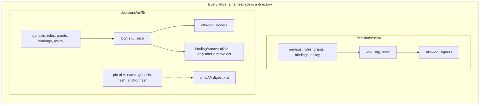
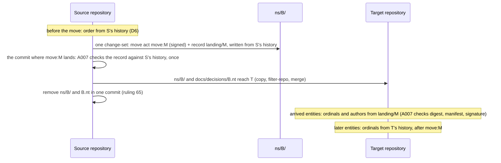

# Namespace independence: design PRD

First draft 7 October 2026; revised the same day after rulings 61 to 81 (`ledger/rulings/namespace-design-rulings-2026-10-07.md`).

This document states the ruled design for rulings 32 and 41 to 48.

- **Section 3** gives the design topic by topic, each with the rulings it rests on.
- **Points not separately ruled** are the first draft's leans, which the principal accepted as the basis of the design. They are marked "accepted with the design".
- **Options that were not chosen** are in Appendix A.
- **Sections 1 and 2** are kept as they were written before the rulings: they are the record of the problem and of the experiment.
- **The protocol changes in §5** are proposals. The protocol changes with the implementation.

The session record is `ledger/sessions/2026-10-namespace-design.md`. It holds what was read, every experiment's commands and full output, the principal's replies, and what could not be determined.

**Base.** The first draft was written against `e20fadc`. The revision is on `846975a`, which adds rulings 49 to 60 (`ledger/rulings/verification-rulings-2026-10-07.md`) and amends LP-9.14 and LP-9.15 (ruling 51). Where those bear on this design, the text says so.

**Reading the claims.** Every statement about today's behaviour names a file and a symbol. It is marked *(run)* when an experiment in §2 showed it, *(read)* when it comes from reading the code, and *(inference)* when it follows from the code but was not run.

## Contents

1. The coupling inventory (record)
2. The extraction experiment (record)
3. The design
4. Acceptance criteria
5. Protocol changes
6. Issues
7. Rulings, and the questions they raise

Appendix A. Options considered

---

## 1. The coupling inventory

This section is the specification of the problem. Each entry is a place where the content of one namespace can change a verdict, a derived file or an export of another. Some entries are couplings between a namespace and the repository that holds it, which a move breaks. The design in §3 is complete when every entry has an answer. The answers are collected in §3.13.

Every store below is a git repository with `.decisions/` at its root. "A" and "B" are two namespaces in one store.

### 1.1 Authority

**N1. One genesis grant serves every namespace.**
- *Where.* `authority::view::Authority::genesis` returns the store's one live genesis grant, and `authority::structure::grant_faults` requires its scope to be `*`. Six places read it:
  - `authority::filing::may_file` (D7: who may file a key binding);
  - `verify::acts::policy_verdict` (`A006` on every policy);
  - `verify::acts::revocation_verdict` (a grant's revocation is checked only `auth.genesis()?`);
  - `authority::references::basis_holds` (`fallback-of-genesis` needs a fallback over `*` in the genesis role);
  - `verify::genesis_unbound` (the notice);
  - `author::authority_ops::Author::join_genesis` (a later namespace is opened by "the" genesis holder).
- *Requirements.* LP-6.5, LP-6.28, LP-4.38, LP-8.31.
- *Minimal store.* `init --namespace A --external-ref m`, then `init --namespace B`. B's policy carries `under: <A's genesis grant>`. That grant is filed in the change-set that opened A.
- *Shown.* E4a *(run)*. Without that change-set, B's policy fails `A006` ("no live genesis grant as of the policy"), and both of B's key bindings fail D7.

**N2. `A003` and `A005` count over the whole store.**
- *Where.* `graph::shapes::SHAPES`. `A005` is "a live genesis grant beside another — the store has one trust root". `GRANT_COLLISION` is `A003`. Both run over `graph::turtle::emit(store)`, the union of every namespace. The doc comment on `graph_findings_in` says so: "the shapes hold per store (one genesis per store, `A005`)".
- *Requirements.* LP-6.5, LP-8.19, LP-8.23.
- *Minimal store.* A opened by one holder, and B given a genesis grant of its own (role `steward`, scope `*`, primary).
- *Shown (read).* `A005` fires on both grants, and `A003` fires as well (same role, scope and order). Today a second namespace cannot have its own genesis.

**N3. Role files serve every namespace.**
- *Where.* `store::load_roles` reads one directory, `.decisions/roles/`. `authority::structure::role_faults` refuses a role id declared twice. `authority::view::role_landing` places a role by its file's landing.
- *Requirements.* LP-5.19, LP-6.30, LP-8.27.
- *Minimal store.* A's `init` declares `steward` and `acceptor`. B's `init` declares none and names `acceptor` as its accept role.
- *Shown.* E3 *(run)*: B's opening declared no role.
- *Effect.* B's governance depends on files A's opening landed. One role id cannot mean different capability sets in A and in B.

**N4. A scope of `*` reaches every namespace, and `set:` reaches whatever namespaces file into that set.**
- *Where.* `authority::check::covers`: `(GrantScope::All, _) => true`, and `(GrantScope::Set(s), Target::Decision { set, .. }) => s == set`.
- *Requirement.* LP-6.16.
- *Minimal store.*
  - A `*` grant in A's change-set authorises acts in B: the genesis grant, as in N1.
  - A `set:shared` grant authorises acceptance of a decision of any namespace filed into `shared`.
- *Shown.* E3 *(run)*. second@'s grant `set:set-b` is the grant that authorised their acceptance in `beta.ns`.

**N5. Sets belong to no namespace.**
- *Where.*
  - `store::load_sets` reads one `sets/` directory, and a version may name any declared set (`VersionRaw::set`; `Store::set`).
  - `verify::disposition::stranded` (`L005`) reads the set's current floor.
  - `graph::export::select` exports "the sets those versions name".
  - Set files are not in `landing::TRACKED`, so they are edited in place (LP-5.9: raising a floor).
- *Requirements.* LP-5.9, LP-5.10, LP-8.33, LP-9.11.
- *Minimal store.* C-set *(run)*: one set `shared`, holding one decision of `a.ns` and one of `b.ns`. Raising the floor from T0 to T1 strands both (`L005` on each).

**N6. A close ends the key in every namespace.**
- *Where.*
  - `authority::key_close::same_key`, `closes_of`, `closes_among` and `is_closed` never compare `namespace`.
  - `signing::check::verify_one` asks every close of the matched key.
  - `signing::review::review_closed` lists acceptances under a closed key.
  - `authority::signers::derive_from` takes `valid-before` from the key's earliest close anywhere.
- *Requirements.* LP-4.39, LP-4.13, LP-4.32.
- *Minimal store.* E3 *(run)*. The owner's key K1 is bound in `alpha.ns` and in `beta.ns`. The owner accepts a decision in each, then rotates K1 in `alpha.ns`. Two effects follow:
  - The `beta.ns` acceptance becomes "needs re-acceptance" (it would be `L012` after a deadline).
  - The `beta.ns` line of `allowed_signers` gains `valid-before`.
- *Shown on a move.* E4b *(run)*. Extracted without `alpha.ns`'s rotate, the same acceptance is no longer a review item. The verdict changes on the move.

**N7. Which keys may be bound is judged across namespaces.**
- *Where.* `authority::key_close::refusal`, first two bullets: a key bound to another principal "anywhere in the store", and a key closed "in any namespace".
- *Requirement.* LP-4.37.
- *Minimal store.* Key K is bound to p1 in A. p2's binding of K in B is a schema fault. K is closed for p1 in A, and p1's later binding of K in B is a schema fault.
- *Shown (read).* Covered by `ledger-cli/tests/key_ownership.rs` and `key_across_namespaces.rs`.

**N8. D7 lets a namespace's first key lean on another namespace.**
- *Where.*
  - `authority::filing::self_bound`: the self-bound binding is the genesis holder's "first in the store", checked with `auth.bindings.iter().all(..)` over every namespace.
  - `authority::filing::may_file`: the genesis holder's own first `add` in a later namespace passes on `open_window(auth, b, &b.principal, None)`, a live key in any namespace.
  - `signing::check::carried_over`: keys trusted elsewhere stand in this namespace to verify that binding's signature.
- *Requirements.* LP-4.12, LP-4.38.
- *Minimal store.* E3's `init --namespace beta.ns` *(run)*: "bound … in `beta.ns`, signed by their key trusted elsewhere".
- *Shown.* E4a *(run)*. `beta.ns` alone fails D7 twice:
  - the owner's binding: "has no live key in `beta.ns`";
  - second@'s first key, filed under the genesis grant that is now missing: "names no `under`".

  Every signature in `beta.ns` then fails `L011`.

**N9. A first policy can be signed by a key trusted only in another namespace.**
- *Where.* `signing::check::judge_first_policy` copies every trusted key of the author into the policy's namespace (`KeyBinding { namespace: s.namespace.clone(), ..}`).
- *Requirement.* LP-4.31.
- *Shown.* E4a *(run)*: `L011` on `beta.ns`'s policy once `alpha.ns` is absent.

**N10. One `allowed_signers` file for the store.**
- *Where.* `authority::signers::path` gives the one file `.decisions/allowed_signers`. `derive`, `derive_from` and `check` work on all namespaces at once.
- *Requirements.* LP-4.10, LP-4.32, LP-4.33.
- *Shown.* E4a, E4b and E4d *(run)*. After any move both sides fail `[SIGNERS]` until `ledger identity sync`.
- *Related, found here (read and run).* `signers::write` returns `Ok` without removing the file when nothing binds (`None => Ok(())`). So E4a's leftover file stayed "committed but the log binds no key" after `identity sync`.

**N11. Notices name the store's one genesis holder.**
- *Where.* `verify::genesis_unbound` lists every governed namespace under one holder.
- *Requirement.* LP-8.31.
- *Minimal store.* Two governed namespaces, the genesis holder unbound. The notice names both.

### 1.2 Decisions

**N12. Acceptance ids are resolved across the whole store, first match wins.**
- *Where.*
  - `signing::subject::acceptance_namespace` and `verify::acts::revocation_verdict` (`find(|a| a.id == *acc)`).
  - `authority::references::revocation_refs` builds `filed_acceptances` over every namespace.
  - `verify::view::View` keeps revoked acceptances as a set of ids.
- *Requirements.* LP-5.11, LP-8.8.
- *Minimal store.* Case 3c of `ledger/sessions/2026-10-verification.md` *(run there)*. A change-set in the ungoverned namespace `open.ns` reuses a governed acceptance's id and revokes it in the legacy shape. The governed acceptance is revoked with no grant and no signature.
- *Note.* A session fixing the verified findings may close the duplicate-id half. The cross-namespace half is answered here (§3.7).

**N13. `supersedes` crosses namespaces.**
- *Where.*
  - `graph::shapes` `G001` asks only that the target is a filed decision.
  - `verify::state::supersession` is computed over the whole view and feeds `verify::keys::key_collision` (`L014`), status and coverage.
- *Requirement.* LP-3.31.
- *Minimal store.* C-sup *(run)*. `ledger supersede dec:b.ns/… --by dec:a.ns/…` passes. `b.ns`'s decision then shows "superseded by dec:a.ns/…" in `ledger status`, and `ledger coverage` shows `b.ns: superseded 1`. A key it carried is freed for `L014` (read).

**N14. One change-set can hold entities of several namespaces.**
- *Where.* No rule compares the namespaces of a change-set's entries. `graph::export::restrict` keeps the change-set's header in each export.
- *Requirement.* LP-3.33.
- *Minimal store.* C-cs *(run)*: one change-set with a version of `a.ns` and one of `b.ns`. It is conformant, and its header node appears in both exports (six triples each).
- *Effect.* Extracting one namespace means editing a landed file, which is `L007` (C-cs's first attempt *(run)*). `Author::init_namespace` writes such a file itself: the genesis grant (scope `*`) with A's policy and binding (E3 *(run)*, the change-set marked `*,alpha.ns` by `classify.py`).

**N15. A namespace's export carries other namespaces' authority, and lacks closes made elsewhere.**
- *Where.* `graph::export::select` and `Reach::of`:
  - grants are kept when their scope is `*`, the namespace's `ns:`, or a set its versions name;
  - roles are kept when kept grants and policies name them;
  - `kept.key_bindings.retain(|b| b.namespace == reach.namespace)`.
- *Requirements.* LP-9.11, LP-9.14 (finding 11 of the verification session).
- *Shown.* E4a *(run)*. `beta.ns.nt` carried 36 lines from the change-set that opened `alpha.ns`, so extracting `beta.ns` without that file fails `[EXPORT]`. Finding 11, case 13a: a close in one namespace is invisible in another's export.

**N16. `ledger:set` and `ledger:role` IRIs are not namespaced.**
- *Where.* §9.4's IRI table: `urn:ledger-set:<id>` and `urn:ledger-role:<id>`.
- *Requirement.* LP-9.4 table, LP-9.8.
- *Effect (inference).* Once sets and roles belong to one namespace (§3.1, §3.2), two namespaces may both declare `design`. A reader that loads both exports into one graph merges two sets into one node.

### 1.3 The repository

**N17. Landing order is read from the holding repository's first-parent line.**
- *Where.* `landing::Landing::compute`, `first_parent_adds` (keyed by repo-relative *path*, `--diff-filter=A`) and `TRACKED`. Every order-dependent check reads it:
  - `authority::view::Authority::as_of`;
  - `signing::check` (`subjects`, `governing`, `verify_one`);
  - `verify::acts::unauthorised` (`A006`);
  - `verify::history::findings`.

  Positions also compare entities of different namespaces: B's act against A's genesis grant, against a role A's opening landed, and against a close filed in A.
- *Requirements.* LP-8.24 to LP-8.29.
- *Shown.* E5 *(run)*.
  - The source fails `L011` and `A006`: an unsigned acceptance with no grant, dated before its namespace's first policy and landed after it.
  - Copied into one commit, the namespace is conformant.
  - Merged with its carried history into an existing repository, it is conformant.

  Carrying history into a fresh repository keeps the source's verdict.

**N18. `L009` reads the holding repository's commit authors.**
- *Where.* `blame::introducing_author` (`git log --reverse -S<id> -- <path>`) and `verify::integrity::blame_consistency`.
- *Requirement.* LP-8.32.
- *Shown.*
  - E1a *(run)*: 79 `L009` findings when the files are copied in a commit by someone else.
  - E4c *(run)*: one `L009` when two acceptors' files are copied in one commit authored by one of them.
  - E1c *(run)*: the copy passes when the sole acceptor makes the commit.

**N19. Landed entities may never leave, so a namespace cannot leave the source.**
- *Where.* `verify::history::findings` with `landing::touched_after_landing` (`--diff-filter=DM`).
- *Requirement.* LP-8.30.
- *Shown.* E1d *(run)*: removing `hafeok.ddd`'s 164 log files is 408 `L007` findings. E4d *(run)*: removing `beta.ns`'s files is 28.

**N20. Ids and file names are unique per store, not per namespace.**
- *Where.*
  - Change-set files are `log/<ulid>.yml` and sidecars are `sig/<ulid>.<scheme>.sig` (`signing::load`).
  - `authority::references::duplicate_ids` checks the whole store, and `store::take_log` refuses "change-set appears twice".
- *Requirements.* LP-3.3, LP-3.12, LP-4.7.
- *Effect (inference).* Moving a namespace into a repository that already holds a file of the same name collides. Independent ULIDs make that improbable. Deliberately copying one record into two namespaces (§3.11) is refused today as "filed twice".

**N21. A policy change is looked up by hash across namespaces.**
- *Where.* `signing::check::governing`: `Authority::build(store).policies.iter().find(|p| p.hash == *prior)`.
- *Requirement.* LP-4.9.
- *Effect (read).* A `replaces` naming another namespace's policy is already a schema fault (`authority::references::policy_refs`, "replaces a hash that is no policy of this namespace"). Inference: the signature check in the same run judges it under the other namespace's policy, and reports beside the schema fault. Listed for completeness; the gate already refuses the case.

---

## 2. The extraction experiment

Full commands and output are in the session record. The `ledger` binary was built from `e20fadc`. Unless a case says otherwise, every verification ran with `--export` and blame on.

### 2.1 This repository: `hafeok.ddd` out of `product-cli`

The store holds two namespaces with no policy:
- `hafeok.ddd`: 164 log files, set `ddd-governance`;
- `hafeok.ledger`: 23 log files, set `ledger-design`.

No log file holds both namespaces, and no version names a decision of the other namespace in `based_on`, `revisit_if` or `supersedes`. It holds no authority record and no sidecar. The local clone was shallow and was unshallowed (855 commits, 501 on the first-parent line).

| Case | Means | Result |
| --- | --- | --- |
| E1a | Copy `hafeok.ddd`'s 166 files (log, set, export) into a fresh repository, one commit by `extractor@example` | Fails: 79 `L009`, one per acceptance. Nothing else. |
| E1b | E1a with `--no-blame` | Conformant |
| E1c | E1a, committed by `emk@delegate.dk`, the sole acceptor | Conformant |
| E1d | The source after the 166 files are removed in one commit | Fails: 408 `L007` (164 headers, 85 versions, 80 decisions, 79 acceptances). The export check passes once the `.nt` file leaves with the namespace. |
| E2a | `git filter-repo --paths-from-file` over the same 166 files: history carried, commit ids rewritten | Conformant. 166 files, byte-identical to the source. First-parent order kept: landing indexes 449, 451, 452, 477 map to 0, 1, 2, 3. |
| E2c | E2a's history merged into an existing repository (`merge --allow-unrelated-histories`) | Conformant. Every file lands at the merge commit. |

What this shows:
- **The target side works today, with history carried.** Because `hafeok.ddd` has no policy, nothing in it depends on landing order except `L007`, and that starts afresh in the target.
- **A copy fails only `L009`.** It passes when the person who makes the copy commit is the only acceptor.
- **The source side does not work at all.** Leaving is `L007`.
- **No hash changed and no reference changed form**, in any case.

### 2.2 A governed store: `beta.ns` out of a store shared with `alpha.ns`

E3 built the store with the verbs, as today's rules allow:
- `alpha.ns` opened with the genesis grant and a self-bound K1;
- `beta.ns` opened by joining that genesis, with K1 carried over;
- acceptor grants for the owner in each namespace;
- second@'s first key in `beta.ns`, filed by the genesis holder, with a grant `set:set-b`;
- three signed acceptances;
- the owner rotating K1 to K2 in `alpha.ns`.

It is conformant, with two acceptances (one in each namespace) awaiting re-acceptance because of the rotate in `alpha.ns`.

| Case | Means | Result |
| --- | --- | --- |
| E4a | `beta.ns`'s own files (log files whose every entity reaches only `beta.ns`, their sidecars, `set-b`, the export, both roles, `allowed_signers`), history carried | 8 findings: 2 `SCHEMA` (D7), 3 `L011`, 1 `A006`, 1 `[EXPORT]`, 1 `[SIGNERS]` |
| E4a′ | E4a after `ledger identity sync` | Unchanged. No binding is trusted, so nothing is written, and the old file is not removed. |
| E4b | E4a plus the change-set holding the genesis grant (and `alpha.ns`'s policy and binding), history carried | One `[SIGNERS]`. After `identity sync`: conformant. **The `beta.ns` acceptance is no longer awaiting re-acceptance**, because `alpha.ns`'s rotate stayed behind. |
| E4c | E4b's files copied in one commit authored by the owner | `L009` on second@'s acceptance, and `[SIGNERS]` |
| E4d | The source after `beta.ns`'s own files are removed | 28 `L007`, and `[SIGNERS]` until `identity sync` |

### 2.3 Landing order after a move

E5 builds `gamma.ns` in three commits:
1. a decision;
2. `init --namespace` (first policy, `ssh`);
3. a hand-filed acceptance dated before the policy, landed after it, with no `under` and no sidecar.

| Case | Means | Result |
| --- | --- | --- |
| Source | as built | Fails: `L011` (no signature) and `A006` (no grant), by LP-8.28 |
| E5a | history carried (`filter-repo`) | Same two findings |
| E5b | copied into one commit | **Conformant** |
| E5c | carried history merged into an existing repository | **Conformant** |
| E5d | E5c verified with `--base HEAD~1` | **Conformant** |

A move that collapses landing order is permissive, never strict *(inference, from the code)*. With every entity at one index, `landing::Position::before` and `not_after` reduce to comparing `at`, which is the `Landing::unknown` reading. Pairs that git ordered against their `at` ("landed later, dated earlier") turn from "not before" into "before":
- a backdated act escapes a policy or a close;
- a binding or grant filed after an act starts to enable it;
- a role file landed after an act starts to count for it.

No verdict can get stricter. So the backdating attack D6 closed reopens through a move.

### 2.4 What fails, and why

| Mechanism | Fails on a move because | Inventory |
| --- | --- | --- |
| Landing order | It is the holding repository's first-parent line, keyed by path | N17 |
| `L009` | It reads the introducing commit's author | N18 |
| Landed immutability | Leaving is removal | N19 |
| `allowed_signers` | One file covers every namespace | N10 |
| The export | It carries `*` grants and roles from elsewhere | N15 |
| D7, `A006` on policies, first-policy signature | The genesis, roles and trusted keys sit in another namespace's files | N1, N3, N8, N9 |
| Review items and `valid-before` | A close in another namespace counts | N6 |
| Set files | They are shared, so they must be copied or split | N5 |

---

## 3. The design

*A dashed edge is a pin (§3.6), the only way one namespace reaches another.*

### 3.1 Layout

*Rulings 62, 63 and 66.*

**Every store** holds each namespace under `.decisions/ns/<namespace>/` (62), and no store has another form (63).

**What each namespace directory holds:**
- `sets/`, `roles/`, `log/` and `sig/`;
- the derived `allowed_signers` (§3.4);
- after a move act, `landing/<move-ulid>` (§3.5);
- `pins/` (§3.6);
- once basis bytes are held (LP-7.4, not implemented), `basis/<sha256>`.

The root `.decisions/` holds only `ns/` and the uncommitted `index/` cache. The export stays at `docs/decisions/<ns>.nt`, the path the analyzers read.

**Namespace of a file.** A file's namespace is its directory. A content check refuses an entity that names another namespace (§3.7).

**Each file kind belongs to one namespace** (accepted with the design):

| Kind | Rule |
| --- | --- |
| Sets | A version names a set of its own namespace; a set named across namespaces is a set not declared, so a schema fault. |
| Roles | Declared under the namespace's `roles/`. |
| Sidecars | Under the namespace of the entity they sign. |
| Held basis bytes | Under the namespace whose versions rest on them. Duplicates across namespaces are allowed, because the bytes are content-addressed. |
| Pinned material | Under the dependent (§3.6). |

**The flat layout at the verified commit.** A file at the verified commit or in the working tree at `.decisions/sets/`, `.decisions/roles/`, `.decisions/log/`, `.decisions/sig/` or `.decisions/allowed_signers` is a schema fault. So is a store with no `ns/` directory and any of those paths. The layout is specification revision v1.9, with no format number (66), because no file's content changes.

#### 3.1.1 History written in the flat layout

Verification reads earlier commits, and in this repository, as in every store made before v1.9, those commits use the flat layout. Ruling 63 makes the flat layout invalid at the verified commit. It cannot make it disappear from history.

**What verification reads from history today** *(read)*:

| Reader | What it reads | Flat paths it names today |
| --- | --- | --- |
| Landing | `landing::first_parent_adds`: the first commit adding each tracked path. `landing::entity_landings`, `file_versions` and `landed::entities`: the first version holding each entity of a touched file. | `landing::TRACKED`: `.decisions/log`, `.decisions/roles`, `.decisions/sig` |
| Landed immutability (`L007`) | `verify::history::findings`, with `landing::touched_after_landing` and `content_at`: every earlier version of every modified or deleted tracked file | The same |
| `format:` across history | Ruling 58, not yet built: the same walk | The same |
| `L009` | `blame::introducing_author`: `git log --reverse -S<id> -- <path>` | The acceptance's current path |
| The base overlay | `revision::overlay_base`: the base's log files and sidecars that a branch checkout lacks (LP-8.29) | `.decisions/log/`, `.decisions/sig/` |
| Departure | §3.5: a landed move act read from history | — (new) |

`revision::load_at`, used by `ledger diff` and `ledger merge`, also reads whole stores at a revision. It is not part of verification.

**What an implementation must do.**

1. **At the verified commit and in the working tree**, read only `ns/`. Refuse the flat paths (above).
2. **In history**, recognise both path patterns, and read nothing of the flat layout but its files' entities:
   - flat: `.decisions/log/<ulid>.yml`, `.decisions/roles/<id>.yml`, `.decisions/sig/<ulid>.<scheme>.sig`;
   - per namespace: the same three under `.decisions/ns/<ns>/`.

   **How the two are told apart.** By path alone. The flat pattern has `log`, `roles` or `sig` directly under `.decisions/`, and the other has `ns/<ns>/` between. `ns` is not a directory name of the flat layout, so no path matches both. Each path is classified by itself, not each commit by its layout, so the re-layout commit, which deletes one set of paths and adds the other, reads like any other.
3. **Key landing by entity, not by path.**
   - An entity's key is its list and id, as `landed::entities` keys it. A change-set header is keyed by its `cs:` id, not by its file, and a role file or sidecar by its id.
   - An entity of namespace N lands at the first first-parent commit whose tree holds its key at a path of N's directory or, before the re-layout, at a flat path.
   - Flat-era ids were unique per store (N20). So a flat-era key names at most one entity, and nothing needs to attribute a flat-era file to a namespace: the lookup starts from the entity at the verified commit, which knows its namespace.
4. **Judge immutability by entity across paths.**
   - The re-layout deletes every flat file. That is not a removal when each of its entities is present, unchanged, under its namespace's directory in the same commit.
   - Anything else stays `L007`.
5. **Make `L009`'s pickaxe name both paths.** That is the flat path and the namespace path of the acceptance's file: `git log --reverse -S<id> -- .decisions/log/<f> .decisions/ns/<ns>/log/<f>`. *(Inference: `-S` also matches the re-layout commit, where the id leaves one path and enters the other, but `--reverse` puts the original introduction first, and `blame::introducing_author` takes the first line.)*
6. **Read a flat base in the overlay.** When the pull request under verification is the re-layout itself, its base is flat, so the overlay reads both patterns.

**What is not read from flat history.** No flat semantics: not the store-wide sets (set files are not tracked anyway), roles, genesis or `allowed_signers`. Every verdict is computed at the verified commit, under v1.9's rules. History supplies only three things: positions, earlier content and authors.

**Can one layout be had without reading the old one in history?** No. There are three ways around it, and each is excluded:
- **Treat the re-layout commit as every entity's landing.** That is the collapse of §2.3, which is permissive.
- **Fix the pre-re-layout order in a record.** Ruling 64 writes a record only at a move, and the principal's reply of 7 October says a re-layout uses none.
- **Rewrite history so that it was always in the new layout.** That changes every commit id. It also breaks the assumption D6 rests on: `landing.rs` states that the default branch's history is not rewritten.

**What it costs.**
- *For implementations.* Every implementation that verifies a repository whose history predates v1.9 carries the flat path pattern in its history reader for good. It is used by landing, immutability, the `format:` comparison, `L009` and the base overlay. The cost is bounded: three path patterns and a file grammar it already reads, with no flat semantics.
- *For new stores.* A store created at v1.9 or later never meets it.
- *For test vectors.* Any test vector built on a pre-v1.9 history has to exercise it.

This is question N-Q1 (§7).

### 3.2 Authority records

*Ruling 67; ruling 47. Belonging by directory is accepted with the design.*

**How a record belongs to a namespace.** A grant, grant acceptance, unavailability, availability, revocation or role belongs to the namespace whose directory holds it. Bindings and policies already carry a hashed `namespace`, and the gate requires it to equal the directory (schema fault). No grant gains a namespace field (§3.12).

**What scopes mean.** A scope is read inside its own namespace (ruling 47):

| Scope | Meaning |
| --- | --- |
| `*` | The whole of the grant's own namespace (67) |
| `ns:<own>` | The same as `*` |
| `ns:<other>` | A schema fault: the grant could never have effect |
| `set:<id>` | A set of its own namespace, dots allowed (ruling 59) |
| `pattern:<id>` | Unchanged: it covers no decision (`authority::check::covers`) |

**The genesis grant** keeps its shape: self-granted, scope `*`, primary, with `external_ref` (`authority::structure::grant_faults`; 67). No digest moves.

**The genesis role** is the role of the namespace's live genesis grant, declared in that namespace's `roles/`. Ruling 50's rules hold per namespace: a policy's accept role is never the genesis role, and the genesis role carries no decision capability. `A003` and `A005` count per namespace, because the graph stage runs over each namespace's graph alone (§3.9).

**Opening a namespace.** Every namespace is opened as the first is today:
- its own genesis grant, on its own `external_ref` mandate;
- its own root and accept roles;
- its own first policy;
- the genesis holder's self-bound first binding (§3.3).

`Author::join_genesis` goes away, and `--external-ref` is required every time. One person may hold the genesis of several namespaces, and nothing links them.

### 3.3 Keys

*Ruling 69; ruling 47. The first key per namespace is accepted with the design.*

**Bound and closed per namespace.** The functions of `authority::key_close` compare `namespace`. A close ends the key in its own namespace only (LP-6.32). "A key belongs to one principal" and "a closed key is never bound again" are judged within the namespace. The same key may be bound in several namespaces, and each judges it alone.

**A close in every namespace a writer holds** is one change-set per namespace, filed by one invocation, in one commit (69). Each close gets the same `at`: the time of compromise when given. Each is ordered by D6 in its own namespace only, since no verdict compares across namespaces.

**Repository notices** (69):
- a key closed in one namespace and open in another: "key K of p is closed in A and open in B";
- accepted with the design: one key bound to two principals in two namespaces.

Neither is ever a finding.

**A principal's first key in a namespace.**
- *The genesis holder's first key* is that namespace's self-bound binding, filed by its genesis holder, carrying its genesis mandate, and signed by the key it binds.
- *How it is trusted.* By the rule that trusts the first namespace's today: the first self-bound binding to land for the address, with the window closed by the act that opens the namespace (LP-4.38). It leans on no other namespace, and `signing::check::carried_over` and the store-wide branch of `authority::filing::may_file` go away.
- *Any other principal's first key* is filed by that namespace's genesis holder under that namespace's genesis grant, as today. A `rotate` verifies against the key it closes (ruling 53).

### 3.4 `allowed_signers`

*Accepted with the design.*

One derived file per namespace, `ns/<ns>/allowed_signers`. It holds today's lines for that namespace, with `valid-before` taken from closes in that namespace only. `[SIGNERS]` compares each namespace's committed file with that namespace's trusted bindings. A namespace that binds nothing has no file, and `signers::write` removes a stale one, which it does not do today (N10).

### 3.5 Landing order and the move

*Rulings 64, 65, 66, 77 and 79.*

**Before a move.** Order is read from the holding repository's history, as D6 says (64), with landing keyed by entity (§3.1.1). There is no record.

**Why there is no continuous record** (the principal's reasoning for ruling 64, accepted here and not shown wrong). An entity's ordinal is its position on the default branch, and a pull request cannot know it, because another may merge first. A record held byte-identical to git on every commit would therefore:
- make every two open pull requests in a namespace conflict in that file;
- turn the default branch red after a merge, until someone regenerated the record.

**A re-layout inside one repository** uses no record and no move act. It needs only landing keyed by entity across both path patterns (§3.1.1).

**The move act** is a new signable entity, `move:<ULID>`, in format 8 (66). Its closed payload `ledger.namespace-move.v1` is:
- `id` and `namespace`;
- `landing`: the digest of the record;
- `manifest`: the digest of the sorted list of every file path under `ns/<ns>/` with each file's SHA-256, excluding the act's own change-set file, its sidecar and the record;
- `by`, `under` and `at`.

It is the genesis holder's act, made under the genesis grant and judged by `A006` like a policy (LP-6.28). It is signed when policy requires (but see N-Q4 for a namespace with no policy).

**The record: when it is written.** Once, at departure. The writer that files the move act also writes `ns/<ns>/landing/<move-ulid>`, in the same commit. The file is named by the move act's ULID, so a later move adds a file and never edits one. It has one line per landed entity of the namespace, each with:
- the entity's key;
- its ordinal: the dense rank of its landing commit among the namespace's landing commits on the first-parent line;
- for an acceptance, the email of the author of the commit that introduced it.

The writer derives it from the history its checkout stands on, and refuses while any entity of the namespace is uncommitted. The move act and the record are not rows. The move act's ordinal is defined as one after the record's last.

**Who checks it against git, and at which commit.** The source's verifier, at the commit where the move act lands. A007 fails unless:
- every entity of the namespace that landed before that commit has a row equal to what git gives, in ordinal and in introducing author;
- the record's digest is the act's `landing`;
- the manifest is the namespace's files at that commit;
- nothing of the namespace lands at that commit but the act, its sidecar and the record.

Any entity of the namespace landing after that commit is also A007, because the namespace is frozen in the source from its move act on (N-Q3).

Later verifications of the source reach the same answer from the same history, so this is one check, made once in substance. After the removal (below), nothing of the record is re-read.

On a pull request, the check runs against the base (LP-8.29) and gives what the merge will give. If another pull request lands an entity of the namespace first, the move act's pull request fails A007 and is refiled on the new tip. That is the one place where ruling 64's merge-order point remains: confined to the move, not spread over every pull request.

**Departure** (65). After a landed move act, removing every file of `ns/<ns>/` and `docs/decisions/<ns>.nt` in one commit is not `L007`. Removing part of a namespace stays `L007`. The source's history keeps the act, and `verify::history` reads it through `content_at`. Adding the move act is within "no hash changes" (65).

**What the target reads.**
- *The arrival commit* is the first commit on the target's first-parent line whose tree holds `ns/<ns>/`. The arrived entities are those present in it.
- *For arrived entities*, ordinals and introducing authors come from the latest record: the one named by the namespace's latest move act. A007 fails unless:
  - the record's digest is that act's `landing`;
  - the arrived files match its `manifest`;
  - every arrived entity, other than the move acts, their sidecars and the records, has a row;
  - the move act verifies under the namespace's own authority as judged in record order.

  The move act's ordinal is one after the record's last. Every check of section 8 then runs on those positions, as at the source. `L009` compares an arrived acceptance's actor with the record's author (79).
- *For entities that land later*, ordinals come from the target's history: the move act's ordinal plus the dense rank of each entity's landing commit among the namespace's later landing commits. `L009` reads the target's git.

**A second move.** The writer writes a new record, named by the new move act:
- rows for entities that arrived by the earlier move copy that record's ordinals and authors unchanged;
- rows for entities that landed since come from the current repository's history, after the earlier move act.

The new act's digest covers it. Earlier records and move acts stay as landed files. Wherever the namespace sits, the verifier checks that each record agrees with the one before it on every row the earlier one holds, so a later move cannot rewrite an earlier one's order.

**No continuous check.** There is no derived-file stage for the record, and no `[LANDING]` stage. A record is checked only where a move act exists:
- in the source, at the act's landing commit;
- in the target, at arrival;
- between successive records.

**A namespace with no policy.** Order decides nothing there except `L007`, and `L007` restarts at arrival. Ruling 64 calls the move act signed, but nothing in such a namespace can be signed: a key binding needs a policy (`authority::references::binding_refs`). That is N-Q4.

### 3.6 The dependency declaration (pin)

*Rulings 70, 71, 72 and 73. The pin as a trusted-source decision is accepted with the design.*

- **What a pin is.** A trusted-source decision: a version carrying `source_prefix: dec:<ns>/`, `source_method: signed` and `source_keys`, accepted by a holder of `trust-source` (LP-7.8; ruling 4). Its `source_keys` are exactly two tokens (70):
  - `genesis:sha256:<hash of the pinned namespace's genesis grant>`;
  - `anchor:sha256:<hash of its first trusted key binding>`, the genesis holder's self-bound binding.
- **No location.** No server or place appears in it (ruling 42).
- **One name, two namespaces.** Two unrelated namespaces of one name are told apart by genesis grant hash (71). A namespace holds at most one live pin per name, and a second is a schema fault. That is the cost of ruling 34's token, which names a namespace by name.
- **`dec:` prefixes.** A `dec:` prefix with any method other than `signed`, or without the two tokens, is a schema fault.
- **Pinned material** is a snapshot of the pinned namespace's export, held by the dependent at `ns/<ns>/pins/<pinned-ns>/<digest>.nt` (72), inside one repository too. The duplication is the price of a namespace verifying the same wherever it sits.
- **Ungoverned namespaces cannot be pinned** (73). So `hafeok.ddd` and `hafeok.ledger` cannot pin each other until they are governed.

What a snapshot holder cannot know is in §3.9.

### 3.7 What crosses

*Rulings 75, 76 and 78. The checks for rulings 43 to 45 are accepted with the design.*

| Ruling | Check | Stage | Stores today |
| --- | --- | --- | --- |
| 43 | A version whose `supersedes` names a decision of another namespace. In a store that exists today it is judged on live claims only, a decision's latest version (75), so a revision that drops the edge repairs it (LP-8.21). | File gate, `SCHEMA` | None in this repository or the fixtures |
| 44 | A pinned decision basis whose version, in the vendored snapshot, does not itself carry `exported: true` (78) | Graph, `G008` (77) | None: nothing pins |
| 45 | Every entity in `ns/<ns>/` belongs to `<ns>`. That covers decision ids, the decisions that versions and acceptances name, the `namespace` fields, a revocation's target, the grant of a grant acceptance or interval, and the interval an availability ends. | File gate, `SCHEMA` | This repository: 0 of 187 files mixed |
| 41 | In a file declaring the pinning format, a `dec:` token in `based_on` is a pinned basis of its own namespace or of a pinned one. An unpinned `dec:` token of another namespace is refused (76). Below that format it is opaque (LP-7.27). | File gate, `SCHEMA` | None: 0 `dec:` tokens in this repository |

**N12 is closed twice.**
- Ruling 49 makes a duplicate acceptance id a schema fault.
- Ruling 45's check makes a revocation of another namespace's acceptance one.

### 3.8 The dependency graph

*Rulings 77 and 80. The rest is accepted with the design.*

**Edges and nodes.**
- An edge runs from N to the identity `(name, genesis hash)` of each namespace it pins with a live pin.
- A pinned namespace's own edges are read from its vendored snapshot, since its pins are versions and so are exported.

The graph a namespace sees is therefore built from its own files alone, and its verdict is the same wherever it sits.

**Cycles.** A cycle reachable from a namespace's own edges fails `G007` (77).

**Instability.** It is reported for each namespace of one repository:

> I = Ce / (Ca + Ce)

- Ce is the number of distinct identities the namespace pins.
- Ca is the number of namespaces in the same repository that pin it.
- A namespace with neither is reported as "isolated" (80).

It is a report section (machine-readable key `instability`), never a finding.

### 3.9 The export

*Rulings 74 and 81; ruling 51.*

**What one namespace's export carries.** Everything in its directory, and nothing from another namespace:
- decisions, versions, acceptances, revocations, sets and change-sets;
- its own authority log;
- sidecar nodes;
- its pins;
- its move acts, with their `landing` and `manifest` digests as payload fields.

The `*` reach of LP-9.11 goes.

**What it does not carry.** It carries no landing ordinals and no introducing authors (81). The landing records are not emitted either: they are facts read from git.

**IRIs.** Set and role IRIs carry the namespace: `urn:ledger-set:<ns>/<id>` and `urn:ledger-role:<ns>/<id>` (74).

**The graph stage** runs over each namespace's graph alone.

**What an export-only reader can no longer check.** Ruling 51 already states three limits in LP-9.15. Ruling 81 keeps this list long:

| Check | Why it cannot |
| --- | --- |
| D6 order | Whether an act is before a policy, a close or a revocation; whether a binding, grant or role enables it. These need landing, which the export does not carry. |
| D7 trust | "The first self-bound binding to land", and every further binding's trust as of its position. LP-9.15 as amended takes every binding node as trusted. |
| `L009` | No authors |
| Landed immutability and ruling 58's `format:` comparison | No history |
| `A007` | The records are not in the export. The reader sees the move act and its digests, but not the rows they cover. |
| Whether the store verified green | The export carries no verdict. LP-9.15's guarantee is conditional on it. |

Once ruling 47 is implemented, ruling 51's one remaining difference (a close in another namespace) disappears, because every close of a namespace's keys is in its own export.

**A dependent holding a pinned snapshot is such a reader.** About the pinned namespace, it cannot know:
1. whether the pinned namespace's repository verified green at the commit the snapshot was taken from. The snapshot is a byte copy and carries no verdict;
2. any order-dependent verdict on a pinned act. A backdated acceptance that the pinned repository fails (`L011`, `A006`; §2.3) looks valid in the snapshot;
3. which of the pinned namespace's bindings were trusted, beyond the anchor the pin names. *(Inference: D7's filer rules can be judged by `at`; "first to land", and enabling by landing, cannot.)*
4. who deposited each acceptance (`L009`);
5. whether anything changed in the pinned namespace after the snapshot: a revocation, a close or a move;
6. whether a move act in the snapshot matched its record.

No fix is designed here. This is question N-Q2, for the pinning design. It also bears on LP-9.6 (N-Q5).

### 3.10 Format and classes

*Rulings 66 and 77.* Hashed content stays strings only, `CANONICAL_FORM` stays `v1`, and a new field is hashed when present and omitted when absent. No stored digest moves.

| Change | Kind | Format | Digests |
| --- | --- | --- | --- |
| Layout under `ns/`; flat refused at the verified commit; both patterns read in history | Store property | Revision v1.9, no format number (66) | None |
| Sets, roles and authority per namespace; scopes read inside it | Rule change | None | None. Scope strings are unchanged (67). |
| Keys per namespace | Rule change | None | None |
| `allowed_signers` per namespace | Derived file | None | None |
| Landing keyed by entity across layouts | Rule change | None | None |
| Move act `move:<ULID>`, `ledger.namespace-move.v1` | New signable entity | **8** (66) | New entity |
| Landing record `ns/<ns>/landing/<move-ulid>` | Unhashed file, written once with a move act, covered by the act's digest | 8, with the act | None |
| Pins: `source_prefix`, `source_method`, `source_keys`; the pinned tokens | Version fields | The pinning format, after 8 (66) | Hashed when present, so no existing version moves |
| Export: no `*` reach; namespaced set and role IRIs | Derived file | None | None. Exports regenerate. |

**Classes** (77):

| Class | Fails when | Stage |
| --- | --- | --- |
| `G007` | A cycle in the dependencies between namespaces | Graph |
| `G008` | A pinned decision basis names a version not marked `exported` | Graph |
| `A007` | A move mismatch: a record against git at the act's landing, an arrival against its record, digest or manifest, successive records disagreeing, or an entity landing after its namespace's move act in the source | Graph |

`A001`, `A002` and `A004` stay unused (77).

**Extensions with no new class:**
- `SCHEMA`:
  - a flat path at the verified commit;
  - an entity outside its directory's namespace;
  - `supersedes` across namespaces;
  - scope `ns:<other>`;
  - a set named across namespaces;
  - an unpinned cross-namespace `dec:` token from the pinning format on;
  - two live pins of one name;
  - a `dec:` source that is not `signed` with the two tokens.
- `A006`: a move act not made under the genesis grant.
- `L007`'s scope: a whole namespace leaving after its move act; a re-layout that moves every entity unchanged.

**Notices** (69): the two key notices. **Report** (80): instability.

### 3.11 Migration

*Rulings 63 and 68.*

**Ruling 68 rests on there being no governed store with more than one namespace outside this repository.** Whether there is one is the principal's to answer. No committed store in this repository holds an authority record (`ledger/sessions/2026-10-verification.md`, Summary).

**This repository's store** has two namespaces with no policy, two sets (one per namespace), and 187 log files, none mixed. It has no authority record, sidecar or `allowed_signers`. The re-layout is one commit:
- `.decisions/sets/ddd-governance.yml` and `hafeok.ddd`'s 164 log files go to `.decisions/ns/hafeok.ddd/`;
- `.decisions/sets/ledger-design.yml` and the other 23 log files go to `.decisions/ns/hafeok.ledger/`;
- both exports are regenerated, with namespaced set IRIs (74).

No record is written, and no move act is filed. Landing and `L009` hold because §3.1.1 keys landing by entity and reads both path patterns. *Inference: not run, because today's loader reads only the flat layout.* The full history is needed. CI checks out full history (D6 note), and the local clone here was shallow.

**The fixtures.**
- The 15 committed stores under `ledger-cli/tests/fixtures/` each hold one namespace (`fixture.ledger`, `fixture.coverage`, `fixture.forked`, `fixture.two-clocks`) and no authority records. Each moves its `sets/` and `log/` under `.decisions/ns/<namespace>/`. File contents and digests are unchanged, so `UPDATE_FIXTURES=1` should find nothing to refresh.
- `ledger-cli/tests/inbox_fixture` builds its stores with the verbs, so it follows the writer.

**Tests to rewrite** *(read: by grep for the flat paths, and from §1's reading)*:

1. **Tests that write, read or name flat paths.** Each needs its paths moved under `ns/<ns>/`, and its assertions keep their meaning.
   - `ledger-cli/tests/`: `accept_group.rs`, `authority.rs`, `batch.rs`, `binding_accounting.rs`, `cli.rs`, `closed_key.rs`, `digests.rs`, `export.rs`, `export_verifier.rs`, `gate.rs`, `genesis_key.rs`, `graph.rs`, `inbox.rs`, `inbox_failures.rs`, `key_across_namespaces.rs`, `key_ownership.rs`, `keys.rs`, `legacy_revocation.rs`, `merge.rs`, `pre_policy_binding.rs`, `revisit_format.rs`, `role_position.rs`, `show.rs`, `signing.rs`, `trust.rs`, `verbs.rs`, and the helpers `common/mod.rs`, `common/hand.rs` and `common/export_only.rs`.
   - Unit tests in `ledger-core/src/`: `landing_tests.rs`, `store_tests.rs`, `batch_tests.rs`, `author/sign_tests.rs`, `merge/tests.rs`, `verify/order_grid.rs`, and the tests in `merge/driver.rs` and `init.rs`.
   - In `ledger-cli/src/commands/`: `terminal_tests.rs`.
2. **Tests whose meaning changes** (rulings 47 and 68: every namespace has its own genesis).
   - `key_across_namespaces.rs`, all six tests. They become: a close stays in its namespace, the writer files one change-set per namespace in one commit, and the notice appears.
   - `genesis_key.rs`: `a_later_namespaces_first_policy_is_signed_and_unsigned_it_is_l011`, `init_in_a_later_namespace_binds_the_holders_key_there_and_they_sign_with_no_identity_add`, `with_every_key_closed_init_in_a_later_namespace_refuses_and_names_them`, and `with_every_key_closed_and_without_key_init_warns_and_initialises_unbound`. A later namespace is opened with its own genesis.
   - Second-namespace scenarios in `closed_key.rs` (line 165), `policy_authors.rs` (126), `pre_policy_binding.rs` (154, 166, 188), `trust.rs` (291, 308) and `interactive.rs` (164, refusal only).
   - Unit tests over several namespaces in `authority/key_close_tests.rs`, `authority/filing_tests.rs` and `signing/check_tests.rs`.
3. **New tests** for §3.1.1: a history with a flat era and a re-layout commit, verifying with landing unchanged; a flat path at the verified commit refused.

**A store made before this lands.**
- *One namespace:* it is re-laid out, as this repository's is.
- *A governed store with more than one namespace:* it is re-founded per namespace (68). There is no copying of shared records and no exemption.

**Draft Appendix C note** for the re-founding:

> #### Namespaces become independent; a store with shared authority is re-founded (spec v1.9 and format 8)
>
> From v1.9 every store holds each namespace under `.decisions/ns/<namespace>/`. Each namespace has its own genesis grant, roles, grants, key bindings, policy and `allowed_signers`, and nothing in one namespace's authority has effect in another (rulings 47, 62, 63).
>
> **Who must act.** A store whose log holds a policy for more than one namespace, filed before v1.9, shared one genesis grant, one set of role files and one set of trusted keys across them. Its namespaces cannot be split, and no migration path is provided (ruling 68). Under v1.9 rules such a store fails verification: each namespace after the first has no genesis grant of its own (`A006` on its policy, D7 on its first key binding).
>
> **What to do.** Re-found each namespace:
>
> 1. Open it in a fresh directory, `.decisions/ns/<namespace>/`, with `ledger init --namespace <namespace> --external-ref <mandate>`. That files its own genesis grant, roles, first policy and self-bound key.
> 2. Grant its roles again.
> 3. File each decision's latest version again, with its key carried, and accept it again under the new authority.
>
> **What is not carried over.** Acceptances, grants and key windows of the old store. The old store's history stays in git as the record of what was accepted under it. Re-founding is a new start, not a migration, and no digest of the old store is reused by the new one.
>
> **A store with one namespace, or with none under policy,** is not re-founded. It moves its files under `ns/<namespace>/` in one commit, and landing follows each entity across the move.

### 3.12 The seam for ruling 48

Accepted with the design. What it leaves open, so that authority can later become its own unit:
1. **No hashed namespace on grants.** A grant belongs to a namespace by where it is filed, so the same grant can later be filed in an authority unit without its hash moving.
2. **A namespace's authority is addressed the way a pin addresses it**, by genesis grant hash and anchor binding hash (70). An authority unit would be pinned by the same two tokens.
3. **Authority records stay in change-sets of their own.** The writer already files grants, grant acceptances, bindings and policies apart from decisions (`init`, `grant new`, `identity`). Keeping that as a writer rule means a later split moves files, not entities out of files.
4. **`under` names a grant id, not a namespace-qualified one.**
5. **Nothing forbids one person holding the genesis of several namespaces.**

Not done here: a pin that carries authority, or one namespace's grant acting in another.

### 3.13 Every inventory entry, answered

| Entry | Answer |
| --- | --- |
| N1 one genesis | Each namespace has its own (§3.2). Shared authority is re-founded (68). |
| N2 `A003`/`A005` store-wide | The graph stage runs per namespace (§3.9) |
| N3 roles store-wide | Per namespace (§3.1, §3.2) |
| N4 `*`, `set:` reach | Read inside the grant's namespace (67; §3.2); sets per namespace (§3.1) |
| N5 sets shared | A set belongs to one namespace (§3.1) |
| N6 a close ends the key everywhere | A close ends it in its namespace; one change-set per namespace; notice (69; §3.3) |
| N7 key refusal store-wide | Per namespace, with a notice (§3.3) |
| N8 D7 leans on other namespaces | Self-bound first binding per namespace (§3.3) |
| N9 first policy, key from elsewhere | The namespace's own key only (§3.3) |
| N10 one `allowed_signers` | One per namespace (§3.4) |
| N11 one genesis holder in notices | Notices per namespace (§5, LP-8.31) |
| N12 acceptance ids across namespaces | Ruling 49, and ruling 45's check (§3.7) |
| N13 `supersedes` crosses | Schema fault on live claims (75; §3.7) |
| N14 mixed change-sets | The directory layout and ruling 45's check (§3.1, §3.7) |
| N15 export reach | Its own namespace only (§3.9) |
| N16 set/role IRIs | Namespaced (74) |
| N17 landing from the holding repository | D6 before a move; the record from a move act on (64; §3.5) |
| N18 `L009` from the holding repository | Record author for arrived acceptances (79) |
| N19 cannot leave | Departure after a move act (65) |
| N20 ids per store | Per namespace. Flat-era ids, unique per store, key history lookups (§3.1.1). |
| N21 policy lookup by hash | Per-namespace authority; the schema fault stays |

---

## 4. Acceptance criteria

**AC-1. The experiment, as a test** (`ledger-cli/tests/namespace_move.rs`, proposed).
- *Setup.* Take a copy of this repository's store with full history, re-laid out (§3.11).
- *Move.* File a move act and its record in `hafeok.ddd`, then move `.decisions/ns/hafeok.ddd/` and `docs/decisions/hafeok.ddd.nt` into a fresh repository by plain copy in one commit, by someone who is not the acceptor. Remove both from the source in one commit.
- *Pass when:*
  - `ledger verify --export` is conformant on both repositories;
  - every file that existed before the move is byte-identical on the side that holds it, so no hash changed and no reference was rewritten;
  - the move act and its record are the only files added (65);
  - the source's `hafeok.ledger` verdicts, notices and export are identical to before.
- *Must also hold:* the test passes again when the move is made by `git filter-repo`, and by merging carried history into a repository with history of its own.
- *Depends on N-Q4:* `hafeok.ddd` has no policy, so its move act cannot be signed.

**AC-32.**
- E3's store, rebuilt with a genesis per namespace, with `beta.ns` moved by the three means: each side's findings, review items and notices equal what the namespace had before the move.
- E5's store, moved by copy and by merge, still fails `L011` and `A006` on the backdated acceptance.

**AC-41.** From the pinning format, `dec:<other>/…` without a pin is a schema fault. A pinned token resolves identically whether the pinned namespace sits in the same repository or not.

**AC-42.** A pin holds `source_prefix: dec:<ns>/`, `source_method: signed` and the `genesis:` and `anchor:` tokens, and nothing that locates it.

**AC-43.** A latest version whose `supersedes` names another namespace is a schema fault. After a revision that drops the edge, the store is conformant (75).

**AC-44.** A pinned basis naming a version without `exported: true` fails `G008` (78).

**AC-45.** A file under `ns/A/` holding any entity of B is a schema fault, and so is a revocation naming an acceptance of B.

**AC-46.**
- A cycle A→B→A, visible from A through B's snapshot, fails `G007` in either repository.
- `verify --json` carries `instability`, with "isolated" for a namespace with no edges (80).

**AC-47.**
- Two namespaces, each with its own genesis grant: `A003` and `A005` do not fire.
- A rotate in A leaves B's acceptances, review items and `allowed_signers` unchanged.
- The close verb files one change-set per namespace in one commit, and the notice names a key closed in A and open in B (69).

**AC-48.** No grant payload gains a namespace field, and authority records stay in change-sets that hold no decision.

**AC-63.**
- A store with any flat path at the verified commit is a schema fault.
- This repository's history, re-laid out in one commit, verifies with every entity's landing index, `L009` author and immutability verdict the same as before the re-layout.

**AC-64.**
- Two pull requests open at once, each adding an entity to one namespace, merge in either order with no conflict in any derived file and no red default branch.
- A move act whose pull request merges after another lands an entity of its namespace fails `A007`.

**AC-65.** Removing part of a namespace is `L007`. Removing all of it after a landed move act is not. An entity of the namespace landing after its move act is `A007`.

**AC-68.** A store with two governed namespaces built under today's rules fails v1.9 verification as the draft Appendix C note says.

**AC-81.** No export holds a landing ordinal or an introducing author.

---

## 5. Protocol changes (proposed)

These are proposals only. Each lands with the implementation that makes it true, and removes the matching **Not implemented** mark. New requirements take the next free number in their section.

**Store and layout (§3)**
- **LP-3.8:** remove "Not implemented" once pins exist.
- **LP-3.18:** mark superseded by LP-3.8 once pins exist.
- **LP-3.30 to LP-3.33:** remove "Not implemented" as each lands, and drop the italic notes on today's behaviour.
- **LP-3.34 (new):** "A store holds each namespace under `.decisions/ns/<namespace>/`, with its own `sets/`, `roles/`, `log/`, `sig/`, `allowed_signers`, and, after a move act, `landing/`. A file's namespace is its directory. At the verified commit, a file under `.decisions/` outside `ns/` and `index/` is a schema fault."
- **LP-3.35 (new):** "In history, a verifier reads change-set, role and sidecar files at both the flat paths of revision v1.8 (`.decisions/log/`, `.decisions/roles/`, `.decisions/sig/`) and the paths of LP-3.34, told apart by path. It reads only their entities."
- **LP-3.36 (new):** "Ids, set ids, role ids and file names are unique within a namespace."

**Keys (§4)**
- **LP-4.10, LP-4.32, LP-4.33:** per namespace, at `ns/<ns>/allowed_signers`; `valid-before` from closes in the same namespace; `[SIGNERS]` per namespace.
- **LP-4.12:** first bullet becomes "the genesis holder's self-bound first binding in the namespace, carrying its genesis `external_ref` as `mandate`, signed by the key it binds." Delete "Once per store …".
- **LP-4.31:** delete "or in another …".
- **LP-4.37:** bullets 1 and 2 read "in the namespace".
- **LP-4.38:** "A writer that opens a namespace files its genesis grant, root and accept roles, first policy and the genesis holder's self-bound binding in one change-set."
- **LP-4.39:** superseded by LP-6.32.
- **LP-4.22 and LP-4.25 tables:** add the move act: `ledger.namespace-move.v1`, fields `id`, `namespace`, `landing`, `manifest`, `by`, `under`, `at`; signed by its `by` in its `namespace`.

**Entities (§5)**
- **§5 table:** add "Namespace move | `move:<ULID>` | Yes, `ledger.namespace-move.v1` | By policy | A namespace's departure: the digest of its landing record and of its files. Format 8."
- **LP-5.19:** "…one `roles/` directory per namespace."
- **LP-5.22 (new):** "A version names a set of its own namespace."

**Authority (§6)**
- **LP-6.5:** "Each namespace's genesis grant is self-granted, has scope `*`, read as the whole of its namespace, and order `primary`, and carries an `external_ref`. At most one per namespace is live (`A005`)."
- **LP-6.16:** "A grant's scope is read in its own namespace. `ns:<other>` is a schema fault."
- **LP-6.28:** "the genesis grant" is the namespace's.
- **LP-6.31, LP-6.32:** remove "Not implemented" as they land.
- **LP-6.33 (new):** "A namespace move is the genesis holder's act, judged like a policy (`A006`)."
- **LP-6.34 (new):** "A writer that closes a key in every namespace it holds files one change-set per namespace, in one commit."

**Basis and pins (§7)**
- **LP-7.11:** "…`source_prefix` `dec:<namespace>/`, method `signed`, and `source_keys` exactly `genesis:sha256:<genesis grant hash>` and `anchor:sha256:<first trusted binding hash>`. A namespace holds at most one live pin per name. The pinned namespace's export snapshot is held at `ns/<ns>/pins/<pinned>/<digest>.nt`, inside one repository as across. An ungoverned namespace cannot be pinned."
- **LP-7.30:** the class is `G007`.
- **LP-7.31:** add "a namespace with no dependency in either direction is reported as isolated."
- **LP-7.32 (new):** "From the pinning format, a `dec:` token in `based_on` names its own namespace or a pinned one; a pinned version carries `exported: true` itself (`G008`)."

**Verification (§8)**
- **LP-8.4:** add `G007`, `G008` and `A007`.
- **LP-8.19:** "The graph stage runs per namespace, over that namespace's graph alone." Add the three classes to the table.
- **LP-8.23:** delete the store-wide note on `A005`.
- **LP-8.24:** "An entity's landing commit is the first commit on the first-parent history of the verified commit whose tree holds the entity, by its key, at a path of its namespace or, before the re-layout, at a flat path (LP-3.35). An entity that arrived by a move takes its ordinal from the record of its namespace's latest move act (LP-8.34)."
- **LP-8.30:** add two exceptions:
  - "a whole namespace removed in one commit after a landed move act of that namespace";
  - "a flat file whose every entity is present unchanged under its namespace's directory in the same commit."
- **LP-8.31:** notices per namespace, plus the two key notices.
- **LP-8.32:** "…for an arrived acceptance, the author in the landing record."
- **LP-8.34 (new):** "**Landing record.** A writer filing a move act writes, in the same commit, `ns/<ns>/landing/<move-ulid>`: one line per landed entity of the namespace, with its ordinal and, for an acceptance, its introducing author, read from the history the act was filed on. The source checks it against git at the commit where the act lands. The target reads it for arrived entities. A mismatch is `A007`. No record is held before a move."
- **LP-8.35 (new):** "**Departure.** From a landed move act on, no entity of its namespace may land in the source (`A007`)."

**Export (§9)**
- **LP-9.1, LP-9.11:** "The export of a namespace carries every entity of its directory except its landing records, and no fact read from git: no landing ordinal and no introducing author." Delete the `*` reach.
- **LP-9.4 table:** `urn:ledger-set:<ns>/<id>` and `urn:ledger-role:<ns>/<id>`.
- **LP-9.14:** a policy's `accept_role` is the `ledger:acceptRole` IRI's local part after `urn:ledger-role:<ns>/`.
- **LP-9.15:** as amended by ruling 51, with these added to what it cannot check: D7 trust; `L009`; landed immutability; `A007`; and whether the store verified green. Once LP-6.32 lands, delete the bullet on a close in another namespace.
- **LP-9.6:** depends on N-Q5.

**Appendix C notes:**
- v1.9, the layout and the re-founding (§3.11's draft);
- format 8, the move act;
- the pinning format.

---

## 6. Issues

One per unit of work, in order. Sizes are S, M and L.

| # | Title | Cites | Size | Depends on | Appendix C note |
| --- | --- | --- | --- | --- | --- |
| 1 | Load every store from `ns/<ns>/`; refuse flat paths at the verified commit | §3.1 | L | — | Yes (v1.9) |
| 2 | Read both path patterns in history; key landing, immutability, the `format:` comparison, `L009` and the base overlay by entity | §3.1.1 | L | 1 | Yes (v1.9) |
| 3 | Refuse an entity outside its directory's namespace, including revocation targets (ruling 45) | §3.7 | S | 1 | Yes |
| 4 | Refuse `supersedes` into another namespace on live claims (rulings 43, 75) | §3.7 | S | 1 | No |
| 5 | Authority per namespace: genesis, roles, grants; scopes read inside it; graph stage per namespace | §3.2 | L | 1 | Yes |
| 6 | Keys per namespace: `key_close`, D7, first policy; remove `carried_over`; the two notices | §3.3 | M | 5 | Yes |
| 7 | `allowed_signers` per namespace; remove a stale file | §3.4 | S | 1, 6 | Yes |
| 8 | Writer: open every namespace with its own genesis; close a key in every namespace held | §3.2, §3.3 | M | 5, 6 | No |
| 9 | Re-lay out the fixtures; rewrite the tests of §3.11; the re-founding note | §3.11 | M | 1 to 8 | Yes (the re-founding note) |
| 10 | Re-lay out this repository's store and regenerate its exports | §3.11 | S | 2, 9 | No |
| 11 | Namespace move act (format 8) with its landing record, written at departure: the source check, departure, arrival, successive records, `A007` | §3.5 | L | 2, 5 | Yes (format 8) |
| 12 | Acceptance tests AC-1, AC-32, AC-63 to AC-65 | §4 | S | 3, 10, 11 | No |
| 13 | Export per namespace: drop `*` reach; namespaced set and role IRIs | §3.9 | S | 5 | Yes; the analyzers' reader is told |
| 14 | Ship the export-only verifier (ruling 51), with LP-9.15's limits | §3.9 | M | 13 | No |
| 15 | Pins as trusted-source decisions with two key tokens; vendored snapshots; one pin per name; ungoverned not pinnable (the pinning format) | §3.6 | L | 13; the basis work | Yes |
| 16 | Unpinned cross-namespace `dec:` refused; `G008` | §3.7 | S | 15 | Yes |
| 17 | Dependency graph: `G007`, the instability report | §3.8 | M | 15 | Yes |

**What changed from the first draft.**
- The landing-record issue is folded into issue 11.
- Issue 2 grows from M to L, because it now reads the flat layout in history.
- Issue 9 shrinks: no M2 to M4.
- The export issue (13) shrinks from M to S: no ordinals or authors.

**Order:** 1 to 10 (layout and authority), then 11 and 12 (the move), then 13 and 14 (the export), then 15 to 17 (pins, waiting on the basis work).

---

## 7. Rulings, and the questions they raise

The nineteen questions of the first draft are ruled:

| Question | Ruling | In short |
| --- | --- | --- |
| Q1 layout | 62 | `.decisions/ns/<namespace>/` |
| Q2 one-namespace form | 63 | None. Every store uses the layout. |
| Q3 landing after a move | 64 | Record written once at departure, fixed by a signed move act; D6 before. Extends D6. |
| Q4 leaving the source | 65 | Whole removal after a landed move act; the act is within "no hash changes" |
| Q5 format numbers | 66 | v1.9, no format number; move act format 8; pins after |
| Q6 genesis scope | 67 | `*`, read as this namespace |
| Q7 shared authority | 68 | No migration path; re-found |
| Q8 a close in every namespace | 69 | One change-set per namespace in one commit; notice |
| Q9 key material | 70 | Genesis grant hash and first trusted binding hash |
| Q10 one name | 71 | Genesis hash; one live pin per name |
| Q11 pinned material | 72 | Export snapshot held by the dependent, in one repository too |
| Q12 ungoverned pin | 73 | Not possible |
| Q13 IRIs | 74 | Namespaced |
| Q14 `supersedes` in existing stores | 75 | Live claims only |
| Q15 unpinned `dec:` | 76 | Refused from the pinning format |
| Q16 class ids | 77 | `G007`, `G008`, `A007`; `A001`, `A002`, `A004` unused |
| Q17 `exported` | 78 | On the pinned version itself |
| Q18 `L009` on arrival | 79 | Against the record's author |
| Q19 isolated | 80 | Reported as "isolated" |

Ruling 81 follows from 64: the export carries no ordinals or authors.

### Questions the rulings raise

**N-Q1. The flat layout in history** (ruling 63; §3.1.1). One layout at the verified commit cannot be had without reading the flat layout in history. The alternatives are a permissive collapse, a record at re-layout, or rewritten history. As specified, every implementation that verifies a repository whose history predates v1.9 reads the flat path pattern in history, for good. Is that accepted?

If not, the remaining choice is between rulings: a record at re-layout, which the reply of 7 October excludes, or a collapse at re-layout, which reopens the laundering path of §2.3.

**N-Q2. What a pinned snapshot cannot tell its holder** (ruling 81; §3.9). This is for the pinning design. A dependent holding a snapshot cannot know:
- whether the pinned namespace's repository was green when the snapshot was taken;
- any order-dependent verdict on a pinned act;
- trust beyond the anchor;
- authorship;
- anything after the snapshot;
- whether a move matched its record.

What, if anything, should a pin or a snapshot carry so that a dependent can know the first and the fifth? No fix is designed here.

**N-Q3. A namespace frozen at its move act** (ruling 65; §3.5). The record is written at departure and checked at the commit where the act lands, so two things follow:
- any entity of the namespace landing after the act in the source is `A007`, and is filed again in the target;
- a move act whose pull request merges after another landing in its namespace fails `A007` and is refiled.

Is freezing the namespace from its move act on what ruling 65 intends?

**N-Q4. A move act in a namespace with no policy** (rulings 64 and 65 against LP-4.35 and `authority::references::binding_refs`). Ruling 64 fixes the record by a signed move act. A namespace with no policy can bind no key, so it can sign nothing. AC-1 moves `hafeok.ddd`, which has no policy. The two rulings cannot both hold for it as written. Options:
- (a) in a namespace with no policy the move act is unsigned and unchecked, as every act there is;
- (b) a namespace is put under policy before it may move;
- (c) a namespace with no policy moves with no move act and no record, and ruling 65's departure rule is extended to it.

**N-Q5. LP-9.6 against ruling 81.** LP-9.6 (not implemented, from the accepted points of 5 October) says the export of a pinned namespace carries "enough of the authority log to verify its acts from the pinned key material". Without landing order, an export can show that signatures hold, but not `A006` as of each act or D7's trust (§3.9). Both cannot hold in full. Options:
- narrow LP-9.6 to signatures and key windows;
- or leave it for the pinning design, with N-Q2.

---

## Appendix A. Options considered

The first draft's options that the rulings did not choose. The first draft (`git show 4a35c9b:ledger/prd/namespace-independence-prd.md`) gives their costs in full.

| Topic | Not chosen | Chosen |
| --- | --- | --- |
| Layout (Q1, Q2) | A flat layout with a per-file namespace rule; the flat layout kept as the form of a one-namespace store | 62, 63 |
| Landing after a move (Q3) | A record held byte-identical to git on every commit, which is what the first draft leaned to (excluded by merge order, ruling 64); carrying history only, into fresh repositories; `at` alone for moved entities; a per-namespace hash chain of change-sets; moving only namespaces with no policy | 64 |
| Leaving the source (Q4) | A whole-directory removal with no act; the source keeping a frozen copy | 65 |
| Format (Q5) | A format number for the layout | 66 |
| Genesis scope (Q6) | `ns:<own>` on new genesis grants; rewriting `*` (moves digests) | 67 |
| Shared authority (Q7) | Copy shared records byte-identically into each namespace, carry their landing, accept a carried-over first key signed by its own key, and exempt any residue by record (the first draft's M2 to M4); store-wide rules for old files | 68 |
| A close everywhere (Q8) | One act across namespaces (breaks ruling 45); a store-level close list (breaks ruling 47); no notice | 69 |
| Key material (Q9) | Genesis hash alone; a set of public keys; the policy hash | 70 |
| One name (Q10) | A local alias in the token (changes ruling 34's form) | 71 |
| Pinned material (Q11) | Vendored log files; the named versions only | 72 |
| Ungoverned pins (Q12) | `content-addressed` pins | 73 |
| IRIs (Q13) | Unchanged IRIs | 74 |
| `supersedes` (Q14) | Judged on every version | 75 |
| Unpinned `dec:` (Q15) | Opaque forever | 76 |
| `exported` (Q17) | On the decision's tip | 78 |
| `L009` on arrival (Q18) | Skipped and reported | 79 |
| Export (with 64) | Ordinals and authors in the export, which the first draft leaned to | 81 |
| `allowed_signers` (not asked) | One file per store; none committed | Accepted with the design |
| Authority belonging (not asked) | A hashed `namespace` on grants | Accepted with the design |
| The pin's form (not asked) | A new `dependency` authority record | Accepted with the design |
