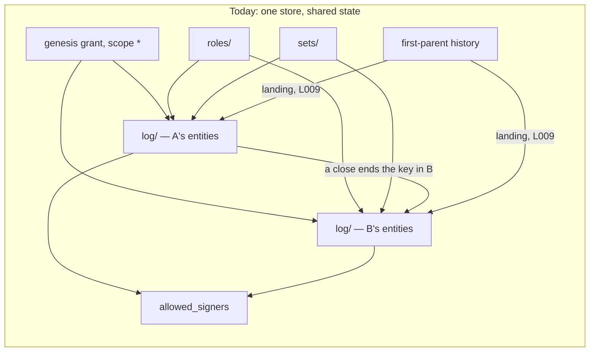
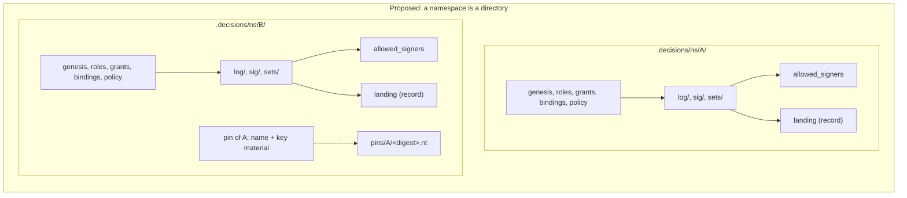
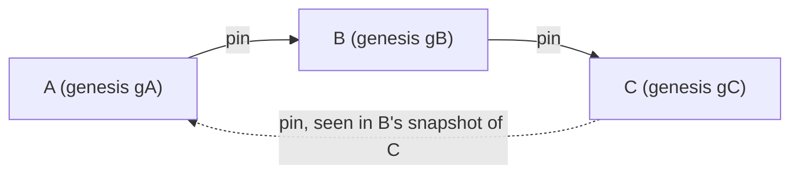

# Namespace independence: design PRD

Draft, 7 October 2026. Design session for rulings 32 and 41 to 48 (`ledger/rulings/absorption-replies-rulings-2026-10-07.md`).

This document decides nothing. At each fork it sets out the options and their costs, then gives one line marked **Lean**. The principal decides. It changes no code and no protocol text. The protocol changes in §5 are proposals, and the protocol will change together with the implementation.

The record of this session is `ledger/sessions/2026-10-namespace-design.md`: what was read, every experiment's commands and full output, and what could not be determined.

**Base.** The prompt was written against `main` at `55c3bcf`. `main` is now at `e20fadc`. The only change since is `ledger/sessions/2026-10-verification.md` (#114), which this design reads. No code changed between the two commits.

**Reading the claims.** Every statement about today's behaviour names a file and a symbol. It is marked *(run)* when an experiment in §2 showed it, *(read)* when it comes from reading the code, and *(inference)* when it follows from the code but was not run.

## Contents

1. The coupling inventory
2. The extraction experiment
3. The design: twelve topics
4. Acceptance criteria
5. Protocol changes
6. Issues
7. Questions for the principal

---

## 1. The coupling inventory

This section is the specification of the problem. Each entry is a place where the content of one namespace can change a verdict, a derived file or an export of another. Some entries are couplings between a namespace and the repository that holds it, which a move breaks. The design in §3 is complete when every entry has an answer. The answers are collected in §3.13.

Every store below is a git repository with `.decisions/` at its root. "A" and "B" are two namespaces in one store.

### 1.1 Authority

**N1. One genesis grant serves every namespace.**
- *Where.* `authority::view::Authority::genesis` returns the store's one live genesis grant, and `authority::structure::grant_faults` requires its scope to be `*`. Six places read it:
  - `authority::filing::may_file` (D7: who may file a key binding);
  - `verify::acts::policy_verdict` (`A006` on every policy);
  - `verify::acts::revocation_verdict` (a grant's revocation is checked only `auth.genesis()?`);
  - `authority::references::basis_holds` (`fallback-of-genesis` needs a fallback over `*` in the genesis role);
  - `verify::genesis_unbound` (the notice);
  - `author::authority_ops::Author::join_genesis` (a later namespace is opened by "the" genesis holder).
- *Requirements.* LP-6.5, LP-6.28, LP-4.38, LP-8.31.
- *Minimal store.* `init --namespace A --external-ref m`, then `init --namespace B`. B's policy carries `under: <A's genesis grant>`. That grant is filed in the change-set that opened A.
- *Shown.* E4a *(run)*. Without that change-set, B's policy fails `A006` ("no live genesis grant as of the policy"), and both of B's key bindings fail D7.

**N2. `A003` and `A005` count over the whole store.**
- *Where.* `graph::shapes::SHAPES`. `A005` is "a live genesis grant beside another — the store has one trust root". `GRANT_COLLISION` is `A003`. Both run over `graph::turtle::emit(store)`, the union of every namespace. The doc comment on `graph_findings_in` says so: "the shapes hold per store (one genesis per store, `A005`)".
- *Requirements.* LP-6.5, LP-8.19, LP-8.23.
- *Minimal store.* A opened by one holder, and B given a genesis grant of its own (role `steward`, scope `*`, primary).
- *Shown (read).* `A005` fires on both grants, and `A003` fires as well (same role, scope and order). Today a second namespace cannot have its own genesis.

**N3. Role files serve every namespace.**
- *Where.* `store::load_roles` reads one directory, `.decisions/roles/`. `authority::structure::role_faults` refuses a role id declared twice. `authority::view::role_landing` places a role by its file's landing.
- *Requirements.* LP-5.19, LP-6.30, LP-8.27.
- *Minimal store.* A's `init` declares `steward` and `acceptor`. B's `init` declares none and names `acceptor` as its accept role.
- *Shown.* E3 *(run)*: B's opening declared no role.
- *Effect.* B's governance depends on files A's opening landed. One role id cannot mean different capability sets in A and in B.

**N4. A scope of `*` reaches every namespace, and `set:` reaches whatever namespaces file into that set.**
- *Where.* `authority::check::covers`: `(GrantScope::All, _) => true`, and `(GrantScope::Set(s), Target::Decision { set, .. }) => s == set`.
- *Requirement.* LP-6.16.
- *Minimal store.*
  - A `*` grant in A's change-set authorises acts in B: the genesis grant, as in N1.
  - A `set:shared` grant authorises acceptance of a decision of any namespace filed into `shared`.
- *Shown.* E3 *(run)*. second@'s grant `set:set-b` is the grant that authorised their acceptance in `beta.ns`.

**N5. Sets belong to no namespace.**
- *Where.*
  - `store::load_sets` reads one `sets/` directory, and a version may name any declared set (`VersionRaw::set`; `Store::set`).
  - `verify::disposition::stranded` (`L005`) reads the set's current floor.
  - `graph::export::select` exports "the sets those versions name".
  - Set files are not in `landing::TRACKED`, so they are edited in place (LP-5.9: raising a floor).
- *Requirements.* LP-5.9, LP-5.10, LP-8.33, LP-9.11.
- *Minimal store.* C-set *(run)*: one set `shared`, holding one decision of `a.ns` and one of `b.ns`. Raising the floor from T0 to T1 strands both (`L005` on each).

**N6. A close ends the key in every namespace.**
- *Where.*
  - `authority::key_close::same_key`, `closes_of`, `closes_among` and `is_closed` never compare `namespace`.
  - `signing::check::verify_one` asks every close of the matched key.
  - `signing::review::review_closed` lists acceptances under a closed key.
  - `authority::signers::derive_from` takes `valid-before` from the key's earliest close anywhere.
- *Requirements.* LP-4.39, LP-4.13, LP-4.32.
- *Minimal store.* E3 *(run)*. The owner's key K1 is bound in `alpha.ns` and in `beta.ns`. The owner accepts a decision in each, then rotates K1 in `alpha.ns`. Two effects follow:
  - The `beta.ns` acceptance becomes "needs re-acceptance" (it would be `L012` after a deadline).
  - The `beta.ns` line of `allowed_signers` gains `valid-before`.
- *Shown on a move.* E4b *(run)*. Extracted without `alpha.ns`'s rotate, the same acceptance is no longer a review item. The verdict changes on the move.

**N7. Which keys may be bound is judged across namespaces.**
- *Where.* `authority::key_close::refusal`, first two bullets: a key bound to another principal "anywhere in the store", and a key closed "in any namespace".
- *Requirement.* LP-4.37.
- *Minimal store.* Key K is bound to p1 in A. p2's binding of K in B is a schema fault. K is closed for p1 in A, and p1's later binding of K in B is a schema fault.
- *Shown (read).* Covered by `ledger-cli/tests/key_ownership.rs` and `key_across_namespaces.rs`.

**N8. D7 lets a namespace's first key lean on another namespace.**
- *Where.*
  - `authority::filing::self_bound`: the self-bound binding is the genesis holder's "first in the store", checked with `auth.bindings.iter().all(..)` over every namespace.
  - `authority::filing::may_file`: the genesis holder's own first `add` in a later namespace passes on `open_window(auth, b, &b.principal, None)`, a live key in any namespace.
  - `signing::check::carried_over`: keys trusted elsewhere stand in this namespace to verify that binding's signature.
- *Requirements.* LP-4.12, LP-4.38.
- *Minimal store.* E3's `init --namespace beta.ns` *(run)*: "bound … in `beta.ns`, signed by their key trusted elsewhere".
- *Shown.* E4a *(run)*. `beta.ns` alone fails D7 twice:
  - the owner's binding: "has no live key in `beta.ns`";
  - second@'s first key, filed under the genesis grant that is now missing: "names no `under`".

  Every signature in `beta.ns` then fails `L011`.

**N9. A first policy can be signed by a key trusted only in another namespace.**
- *Where.* `signing::check::judge_first_policy` copies every trusted key of the author into the policy's namespace (`KeyBinding { namespace: s.namespace.clone(), ..}`).
- *Requirement.* LP-4.31.
- *Shown.* E4a *(run)*: `L011` on `beta.ns`'s policy once `alpha.ns` is absent.

**N10. One `allowed_signers` file for the store.**
- *Where.* `authority::signers::path` gives the one file `.decisions/allowed_signers`. `derive`, `derive_from` and `check` work on all namespaces at once.
- *Requirements.* LP-4.10, LP-4.32, LP-4.33.
- *Shown.* E4a, E4b and E4d *(run)*. After any move both sides fail `[SIGNERS]` until `ledger identity sync`.
- *Related, found here (read and run).* `signers::write` returns `Ok` without removing the file when nothing binds (`None => Ok(())`). So E4a's leftover file stayed "committed but the log binds no key" after `identity sync`.

**N11. Notices name the store's one genesis holder.**
- *Where.* `verify::genesis_unbound` lists every governed namespace under one holder.
- *Requirement.* LP-8.31.
- *Minimal store.* Two governed namespaces, the genesis holder unbound. The notice names both.

### 1.2 Decisions

**N12. Acceptance ids are resolved across the whole store, first match wins.**
- *Where.*
  - `signing::subject::acceptance_namespace` and `verify::acts::revocation_verdict` (`find(|a| a.id == *acc)`).
  - `authority::references::revocation_refs` builds `filed_acceptances` over every namespace.
  - `verify::view::View` keeps revoked acceptances as a set of ids.
- *Requirements.* LP-5.11, LP-8.8.
- *Minimal store.* Case 3c of `ledger/sessions/2026-10-verification.md` *(run there)*. A change-set in the ungoverned namespace `open.ns` reuses a governed acceptance's id and revokes it in the legacy shape. The governed acceptance is revoked with no grant and no signature.
- *Note.* A session fixing the verified findings may close the duplicate-id half. The cross-namespace half is answered here (§3.7).

**N13. `supersedes` crosses namespaces.**
- *Where.*
  - `graph::shapes` `G001` asks only that the target is a filed decision.
  - `verify::state::supersession` is computed over the whole view and feeds `verify::keys::key_collision` (`L014`), status and coverage.
- *Requirement.* LP-3.31.
- *Minimal store.* C-sup *(run)*. `ledger supersede dec:b.ns/… --by dec:a.ns/…` passes. `b.ns`'s decision then shows "superseded by dec:a.ns/…" in `ledger status`, and `ledger coverage` shows `b.ns: superseded 1`. A key it carried is freed for `L014` (read).

**N14. One change-set can hold entities of several namespaces.**
- *Where.* No rule compares the namespaces of a change-set's entries. `graph::export::restrict` keeps the change-set's header in each export.
- *Requirement.* LP-3.33.
- *Minimal store.* C-cs *(run)*: one change-set with a version of `a.ns` and one of `b.ns`. It is conformant, and its header node appears in both exports (six triples each).
- *Effect.* Extracting one namespace means editing a landed file, which is `L007` (C-cs's first attempt *(run)*). `Author::init_namespace` writes such a file itself: the genesis grant (scope `*`) with A's policy and binding (E3 *(run)*, the change-set marked `*,alpha.ns` by `classify.py`).

**N15. A namespace's export carries other namespaces' authority, and lacks closes made elsewhere.**
- *Where.* `graph::export::select` and `Reach::of`:
  - grants are kept when their scope is `*`, the namespace's `ns:`, or a set its versions name;
  - roles are kept when kept grants and policies name them;
  - `kept.key_bindings.retain(|b| b.namespace == reach.namespace)`.
- *Requirements.* LP-9.11, LP-9.14 (finding 11 of the verification session).
- *Shown.* E4a *(run)*. `beta.ns.nt` carried 36 lines from the change-set that opened `alpha.ns`, so extracting `beta.ns` without that file fails `[EXPORT]`. Finding 11, case 13a: a close in one namespace is invisible in another's export.

**N16. `ledger:set` and `ledger:role` IRIs are not namespaced.**
- *Where.* §9.4's IRI table: `urn:ledger-set:<id>` and `urn:ledger-role:<id>`.
- *Requirement.* LP-9.4 table, LP-9.8.
- *Effect (inference).* Once sets and roles belong to one namespace (§3.1, §3.2), two namespaces may both declare `design`. A reader that loads both exports into one graph merges two sets into one node.

### 1.3 The repository

**N17. Landing order is read from the holding repository's first-parent line.**
- *Where.* `landing::Landing::compute`, `first_parent_adds` (keyed by repo-relative *path*, `--diff-filter=A`) and `TRACKED`. Every order-dependent check reads it:
  - `authority::view::Authority::as_of`;
  - `signing::check` (`subjects`, `governing`, `verify_one`);
  - `verify::acts::unauthorised` (`A006`);
  - `verify::history::findings`.

  Positions also compare entities of different namespaces: B's act against A's genesis grant, against a role A's opening landed, and against a close filed in A.
- *Requirements.* LP-8.24 to LP-8.29.
- *Shown.* E5 *(run)*.
  - The source fails `L011` and `A006`: an unsigned acceptance with no grant, dated before its namespace's first policy and landed after it.
  - Copied into one commit, the namespace is conformant.
  - Merged with its carried history into an existing repository, it is conformant.

  Carrying history into a fresh repository keeps the source's verdict.

**N18. `L009` reads the holding repository's commit authors.**
- *Where.* `blame::introducing_author` (`git log --reverse -S<id> -- <path>`) and `verify::integrity::blame_consistency`.
- *Requirement.* LP-8.32.
- *Shown.*
  - E1a *(run)*: 79 `L009` findings when the files are copied in a commit by someone else.
  - E4c *(run)*: one `L009` when two acceptors' files are copied in one commit authored by one of them.
  - E1c *(run)*: the copy passes when the sole acceptor makes the commit.

**N19. Landed entities may never leave, so a namespace cannot leave the source.**
- *Where.* `verify::history::findings` with `landing::touched_after_landing` (`--diff-filter=DM`).
- *Requirement.* LP-8.30.
- *Shown.* E1d *(run)*: removing `hafeok.ddd`'s 164 log files is 408 `L007` findings. E4d *(run)*: removing `beta.ns`'s files is 28.

**N20. Ids and file names are unique per store, not per namespace.**
- *Where.*
  - Change-set files are `log/<ulid>.yml` and sidecars are `sig/<ulid>.<scheme>.sig` (`signing::load`).
  - `authority::references::duplicate_ids` checks the whole store, and `store::take_log` refuses "change-set appears twice".
- *Requirements.* LP-3.3, LP-3.12, LP-4.7.
- *Effect (inference).* Moving a namespace into a repository that already holds a file of the same name collides. Independent ULIDs make that improbable. Deliberately copying one record into two namespaces (§3.11) is refused today as "filed twice".

**N21. A policy change is looked up by hash across namespaces.**
- *Where.* `signing::check::governing`: `Authority::build(store).policies.iter().find(|p| p.hash == *prior)`.
- *Requirement.* LP-4.9.
- *Effect (read).* A `replaces` naming another namespace's policy is already a schema fault (`authority::references::policy_refs`, "replaces a hash that is no policy of this namespace"). Inference: the signature check in the same run judges it under the other namespace's policy, and reports beside the schema fault. Listed for completeness; the gate already refuses the case.

---

## 2. The extraction experiment

Full commands and output are in the session record. The `ledger` binary was built from `e20fadc`. Unless a case says otherwise, every verification ran with `--export` and blame on.

### 2.1 This repository: `hafeok.ddd` out of `product-cli`

The store holds two namespaces with no policy:
- `hafeok.ddd`: 164 log files, set `ddd-governance`;
- `hafeok.ledger`: 23 log files, set `ledger-design`.

No log file holds both namespaces, and no version names a decision of the other namespace in `based_on`, `revisit_if` or `supersedes`. It holds no authority record and no sidecar. The local clone was shallow and was unshallowed (855 commits, 501 on the first-parent line).

| Case | Means | Result |
| --- | --- | --- |
| E1a | Copy `hafeok.ddd`'s 166 files (log, set, export) into a fresh repository, one commit by `extractor@example` | Fails: 79 `L009`, one per acceptance. Nothing else. |
| E1b | E1a with `--no-blame` | Conformant |
| E1c | E1a, committed by `emk@delegate.dk`, the sole acceptor | Conformant |
| E1d | The source after the 166 files are removed in one commit | Fails: 408 `L007` (164 headers, 85 versions, 80 decisions, 79 acceptances). The export check passes once the `.nt` file leaves with the namespace. |
| E2a | `git filter-repo --paths-from-file` over the same 166 files: history carried, commit ids rewritten | Conformant. 166 files, byte-identical to the source. First-parent order kept: landing indexes 449, 451, 452, 477 map to 0, 1, 2, 3. |
| E2c | E2a's history merged into an existing repository (`merge --allow-unrelated-histories`) | Conformant. Every file lands at the merge commit. |

What this shows:
- **The target side works today, with history carried.** Because `hafeok.ddd` has no policy, nothing in it depends on landing order except `L007`, and that starts afresh in the target.
- **A copy fails only `L009`.** It passes when the person who makes the copy commit is the only acceptor.
- **The source side does not work at all.** Leaving is `L007`.
- **No hash changed and no reference changed form**, in any case.

### 2.2 A governed store: `beta.ns` out of a store shared with `alpha.ns`

E3 built the store with the verbs, as today's rules allow:
- `alpha.ns` opened with the genesis grant and a self-bound K1;
- `beta.ns` opened by joining that genesis, with K1 carried over;
- acceptor grants for the owner in each namespace;
- second@'s first key in `beta.ns`, filed by the genesis holder, with a grant `set:set-b`;
- three signed acceptances;
- the owner rotating K1 to K2 in `alpha.ns`.

It is conformant, with two acceptances (one in each namespace) awaiting re-acceptance because of the rotate in `alpha.ns`.

| Case | Means | Result |
| --- | --- | --- |
| E4a | `beta.ns`'s own files (log files whose every entity reaches only `beta.ns`, their sidecars, `set-b`, the export, both roles, `allowed_signers`), history carried | 8 findings: 2 `SCHEMA` (D7), 3 `L011`, 1 `A006`, 1 `[EXPORT]`, 1 `[SIGNERS]` |
| E4a′ | E4a after `ledger identity sync` | Unchanged. No binding is trusted, so nothing is written, and the old file is not removed. |
| E4b | E4a plus the change-set holding the genesis grant (and `alpha.ns`'s policy and binding), history carried | One `[SIGNERS]`. After `identity sync`: conformant. **The `beta.ns` acceptance is no longer awaiting re-acceptance**, because `alpha.ns`'s rotate stayed behind. |
| E4c | E4b's files copied in one commit authored by the owner | `L009` on second@'s acceptance, and `[SIGNERS]` |
| E4d | The source after `beta.ns`'s own files are removed | 28 `L007`, and `[SIGNERS]` until `identity sync` |

### 2.3 Landing order after a move

E5 builds `gamma.ns` in three commits:
1. a decision;
2. `init --namespace` (first policy, `ssh`);
3. a hand-filed acceptance dated before the policy, landed after it, with no `under` and no sidecar.

| Case | Means | Result |
| --- | --- | --- |
| Source | as built | Fails: `L011` (no signature) and `A006` (no grant), by LP-8.28 |
| E5a | history carried (`filter-repo`) | Same two findings |
| E5b | copied into one commit | **Conformant** |
| E5c | carried history merged into an existing repository | **Conformant** |
| E5d | E5c verified with `--base HEAD~1` | **Conformant** |

A move that collapses landing order is permissive, never strict *(inference, from the code)*. With every entity at one index, `landing::Position::before` and `not_after` reduce to comparing `at`, which is the `Landing::unknown` reading. Pairs that git ordered against their `at` ("landed later, dated earlier") turn from "not before" into "before":
- a backdated act escapes a policy or a close;
- a binding or grant filed after an act starts to enable it;
- a role file landed after an act starts to count for it.

No verdict can get stricter. So the backdating attack D6 closed reopens through a move.

### 2.4 What fails, and why

| Mechanism | Fails on a move because | Inventory |
| --- | --- | --- |
| Landing order | It is the holding repository's first-parent line, keyed by path | N17 |
| `L009` | It reads the introducing commit's author | N18 |
| Landed immutability | Leaving is removal | N19 |
| `allowed_signers` | One file covers every namespace | N10 |
| The export | It carries `*` grants and roles from elsewhere | N15 |
| D7, `A006` on policies, first-policy signature | The genesis, roles and trusted keys sit in another namespace's files | N1, N3, N8, N9 |
| Review items and `valid-before` | A close in another namespace counts | N6 |
| Set files | They are shared, so they must be copied or split | N5 |

---

## 3. The design





*Layout proposal (lean of §3.1). A dashed edge is a pin (§3.6), the only way one namespace reaches another.*

### 3.1 Layout

**What must hold.** Extraction moves files and nothing else: no hash and no reference changes form (ruling 32). No file holds two namespaces (ruling 45).

| | 1A: a directory per namespace | 1B: flat, with a rule per file |
| --- | --- | --- |
| Paths | `.decisions/ns/<namespace>/{sets,roles,log,sig}/`, plus `allowed_signers` and (§3.5) `landing` in that directory. `.decisions/index/` stays at the root as the store's cache. The export stays at `docs/decisions/<ns>.nt`. | As today. Each file's namespace is read from its content, or from a new `namespace:` header field on change-sets, sets and roles. |
| Ruling 45 | Structural: a file's namespace is its directory. A content check refuses an entity that names another namespace (§3.7). | A content check only. A grant of scope `*`, a grant acceptance, an unavailability and a revocation have no namespace of their own. Each is resolved through what it names, and some through other files. |
| Extraction | Move one directory and one `.nt` file | Select files by a filter that a tool must implement, and resolve sidecars through their entities |
| Ids per namespace | Two namespaces may hold a set or role of the same id, and a file of the same ULID name | Set and role file names collide in the shared directories. They would need `sets/<ns>--<id>.yml`, which changes the stem rule (LP-3.12). |
| Cost | The loader, every path in the reference implementation, and every test fixture. Landing must follow an entity when its path changes (§3.5). | A new header field is a format bump on three file kinds, and namespace inference is brittle. |

The `ns/` level keeps namespace directories apart from the legacy flat directories. That matters during migration, and because the namespace grammar allows a namespace called `log`.

**The flat layout as the form of a one-namespace store.** Under 1A, a flat store whose entities all belong to one namespace can be read as that namespace's directory. Every existing single-namespace store, including all 15 committed fixtures (one namespace each, by scan), then needs no migration (§3.11). A store with two namespaces must use directories, and a store that mixes the two layouts is a schema fault.

**What each kind of file becomes.**

| Kind | Proposal | Why |
| --- | --- | --- |
| Sets | One namespace each, under `ns/<ns>/sets/`. A version names a set of its own namespace. Naming another namespace's set is a schema fault (it names an undeclared set). | N5: a floor raised in one namespace must not strand another's versions. A `set:` scope then covers only its own namespace (N4). |
| Roles | One namespace each, under `ns/<ns>/roles/` | N3 and ruling 47 |
| Sidecars | Under the namespace of the entity they sign | It is that namespace's act |
| Held basis bytes (LP-7.4, not implemented) | `ns/<ns>/basis/<sha256>`, with duplicates across namespaces allowed | A held basis is evidence for that namespace's versions. The bytes are content-addressed, so two copies cannot disagree. |
| Pinned material (§3.6) | `ns/<ns>/pins/<pinned-ns>/…` | Held by the dependent, so it travels with the dependent |

**Lean:** 1A, with the flat layout kept as the form of a store with one namespace. A set belongs to exactly one namespace.

### 3.2 Authority records

**How a record belongs to one namespace.**

| | 2A: by directory | 2B: by a hashed `namespace` field on every authority record |
| --- | --- | --- |
| Grants, grant acceptances, intervals | Belong to the directory they are filed in | New grants carry `namespace` (hashed when present). Old grants have none, so they still need 2A. |
| Bindings, policies | Already carry `namespace` (hashed). The gate requires it to equal the directory (schema fault). | Same |
| Digests | None move | None move for old records. A new grant's hash binds it to one namespace forever. |
| Ruling 48 | Leaves a grant free to be filed under a later authority unit (§3.12) | Binds grants to namespaces in their hash, which works against a later shared authority unit |

**Lean:** 2A.

**What the scopes mean afterwards.** A grant's scope is read inside its own namespace only. Nothing in one namespace's authority has effect in another (ruling 47).

| Scope | Proposal |
| --- | --- |
| `*` | The whole of the grant's own namespace |
| `ns:<own>` | The same as `*`. Allowed, and redundant. |
| `ns:<other>` | A schema fault: a grant that could never have effect. |
| `set:<id>` | A set of its own namespace (§3.1) |
| `pattern:<id>` | Unchanged. It covers no decision today (`authority::check::covers`). |

The genesis grant keeps its shape rule (scope `*`, self-granted, primary, `external_ref`; `authority::structure::grant_faults`). There are three options:

| | Keep `*`, read as "this namespace" | Require `ns:<own>` on new genesis grants; `*` stays legal on old ones | Rewrite `*` to `ns:<own>` everywhere |
| --- | --- | --- | --- |
| Digests | None move | None move | Every grant hash moves, and every grant acceptance must be re-signed |
| Clarity | `*` reads as "everything" | Explicit, but two spellings exist for one thing | Explicit |

**Lean:** keep `*`, read as this namespace.

**"The genesis role" per namespace** is the role of the namespace's live genesis grant, declared in that namespace's `roles/`. Two namespaces may name their root roles differently. `A005` counts per namespace (§3.9: the graph stage runs per namespace).

**Opening a namespace.** Every namespace is opened as the first one is today:
- its own genesis grant, resting on its own `external_ref` mandate;
- its own root role and accept role;
- its own first policy;
- the genesis holder's self-bound first binding (§3.3).

One person may be the genesis holder of several namespaces, and nothing links them. `Author::join_genesis` goes away. What `init` asks for in a later namespace then changes: `--external-ref` is required every time.

### 3.3 Keys

**Bound and closed per namespace.** The functions in `authority::key_close` compare `namespace`:
- a close ends the key in its own namespace only (ruling 47, LP-6.32);
- "a key belongs to one principal" and "a closed key is never bound again" are judged within the namespace;
- the same key may be bound in several namespaces, and each judges it alone.

**A close in every namespace a writer holds** (ruling 47: "a writer may file a close in every namespace it holds").

| | 3A: one change-set per namespace, filed by one invocation and committed together | 3B: one act that closes in several namespaces | 3C: a store-level close list that every namespace reads |
| --- | --- | --- | --- |
| Ruling 45 | Holds | Broken: one file holds several namespaces | Broken in spirit: one record has effect in several namespaces (ruling 47) |
| Ordering | Each close is ordered in its own namespace only, by D6 there. The verb gives every close the same `at` (the time of compromise, when given), and one git commit lands them together. Order across namespaces is meaningless, because no verdict compares across them. | One landing | One landing |
| After a move | Each namespace keeps its own close | The act cannot be split | Lost by the moved namespace |

**Lean:** 3A.

One risk is left. A holder who closes a compromised key in A and forgets B leaves it live in B. The proposal is a **repository notice**, never a finding: "key K of p is closed in A and open in B". It follows ruling 46's pattern of reports over the namespaces of one repository. A notice for one key bound to two principals in two namespaces is proposed alongside.

**A principal's first key in a second namespace.** Today the genesis holder's first key in a later namespace is "their own `add`, signed by a key of theirs already trusted in another namespace" (N8). Afterwards it is that namespace's self-bound binding:
- filed by its genesis holder;
- carrying its own genesis mandate;
- signed by the key it binds.

It is trusted by the rule that trusts the first namespace's today: the first self-bound binding to land for that address, with the window closed by the act that opens the namespace (LP-4.38). It leans on no other namespace. Any other principal's first key is filed by that namespace's genesis holder under that namespace's genesis grant, as today.

That is as strong as the first namespace is today and no stronger. Trust in each namespace's root starts out of band, from its mandate. A key trusted in one namespace vouching for a key in another is exactly what ruling 47 removes. Authority as its own unit (ruling 48) is where such vouching would return, through a pin.

**Lean:** each namespace's first key is self-bound under its own mandate, and nothing carries over.

### 3.4 `allowed_signers`

| | 4A: one file per namespace, `ns/<ns>/allowed_signers` | 4B: one file per store, the union of every namespace's derivation | 4C: none committed; derived at verification only |
| --- | --- | --- | --- |
| Content | Today's lines for that namespace, with `valid-before` from closes in that namespace only (LP-4.32 as superseded) | The same lines, sorted together | — |
| What `[SIGNERS]` compares | Each namespace's committed file against that namespace's trusted bindings | One file against all | Nothing |
| On a move | The file moves with the directory, and both sides verify | Both sides must regenerate the file, so moving files alone does not verify (E4, N10) | Nothing to move |
| Cost | `ssh-keygen -Y verify -f` takes the namespace's file directly, since every line names that namespace already | None new | Loses the trust root as a reviewable file in every pull request (#65's reason for committing it) |

Whichever is chosen, `signers::write` should remove a stale file when nothing binds. Today it leaves the file (E4a′).

**Lean:** 4A.

### 3.5 Landing order after a move

This is the hard part. Today D6 reads order from the holding repository's history. "Whoever can rewrite the default branch's history" controls the evidence, and an export-only verifier "cannot check" it (`ledger/rulings/signing-rulings-2026-10-d5-d9.md`, D6 table). Ruling 32 asks that a namespace move by moving its files. Git history is not a file of the namespace.

**What depends on landing today** (§8.7, read):
- whether an act is before a policy (pre-policy acts are not role-checked; LP-8.28);
- whether an act is before a key close or a grant revocation (`L011` against `L012`; LP-4.13, LP-8.26);
- whether a binding, grant or grant acceptance enables an act (`not_after`);
- whether a role counts (landing alone; LP-6.30);
- D7's "the first self-bound binding to land is the one trusted";
- landed immutability (`L007`; LP-8.30).

`L009` reads the introducing commit's author. That is the same kind of dependence on the repository.

**What a move does to it** (§2.3). It collapses order. A collapse is permissive and never strict, so a move is a laundering path for backdated acts (E5b, E5c).

**How landing is keyed today.** By repo-relative path (`landing::first_parent_adds`, `Landing::index`). Re-laying a store out into directories (§3.1) changes every path. Read with today's code, every entity would land at the re-layout commit, which is a collapse *(inference: today's loader does not read another layout, so this was not run)*. `L009`'s pickaxe is path-scoped (`-- <path>`), so every acceptance would be attributed to whoever committed the re-layout *(inference, consistent with E1a)*.

**Five options.**

| | 5A: carry the history | 5B: a landing record, closed by a signed move act | 5C: order inside the files (a hash chain) | 5D: `at` alone for moved entities | 5E: never move a governed namespace |
| --- | --- | --- | --- | --- | --- |
| Mechanism | Move with `git filter-repo` or similar, so the namespace's commits become the target's first-parent line | A per-namespace derived file holds each entity's landing ordinal and, for acceptances, the introducing author. It is held byte-identical to git while git can derive it. A signed **move act** fixes its digest at departure, and the target takes pre-move order from the record. | Each change-set names the digest of the namespace's previous change-set | Arrived entities are ordered by `at`, as the export-only verifier does | Moves allowed only for namespaces with no policy |
| Verifiable in the new repository | Yes, from git | Pre-move order: from the record, attested by the namespace's own signature. Post-move order: from git. | Yes, from the files | Not needed | — |
| Who controls pre-move evidence | Whoever rewrote the history while carrying it (`filter-repo` can reorder) | The namespace's genesis holder at departure. The source's own CI held the record equal to git up to the move commit, but the target cannot see that. | Nobody after filing | The signer of each act (D6 position A) | — |
| Into a fresh repository | Works (E2a, E5a) | Works | Works | Works (permissive) | — |
| Into a repository with history of its own | Collapses (E2c, E5c). The namespace's line cannot also be the target's first-parent line. | Works | Works | Works (permissive) | — |
| Re-layout inside one repository | Needs landing keyed by entity, not path | The same operation as extraction, and also checkable against git | Unaffected | — | — |
| Concurrent branches | Unaffected | Unaffected: the record is derived, not authored | Every concurrent branch forks the chain. A merge needs a chain-merge act, or files must be rewritten, which immutability forbids. | Unaffected | — |
| `L009` after a move | Holds: authors are kept (E2a) | The record carries the author, so `L009` compares the actor with it | Not addressed | Skipped and reported | — |
| Format | None | A new signable entity (format 8), a derived file and its stage | Change-sets become hashed, which is a new hashed form for every change-set, and existing stores need an anchoring checkpoint | None | None |
| Ruling 32 | Holds only into a fresh repository | Holds: the record and the act are files of the namespace | Holds | Holds, but reopens D6's backdating gap | Fails for governed namespaces |

**Lean:** 5B. It is the only option that keeps D6's protection across a move into any repository, and it makes re-layout and extraction one operation.

```mermaid
sequenceDiagram
  participant S as Source repository
  participant N as Namespace files (ns/B/)
  participant T as Target repository
  Note over S,N: verify holds ns/B/landing equal to what git derives (stage [LANDING])
  S->>N: file the move act (signed by B's genesis holder): digest of landing, digest of the file manifest
  S->>S: commit; CI verifies green, record still equal to git
  S->>T: copy ns/B/ and docs/decisions/B.nt (any means: copy, filter-repo, merge)
  S->>S: remove ns/B/ and B.nt in one commit: allowed after a landed move act (not L007)
  Note over T: arrived entities: order and authors from the record, which matches the move act's digest
  Note over T: entities landing after the arrival: ordinals continue from git, after the record's last
```

**5B in detail.**

1. **The record.** `ns/<ns>/landing` is a derived file, like `allowed_signers`. It has one line per entity of the namespace, by `landed::key` (`<list>/<id>`, the header, role files, sidecars). Each line carries:
   - the entity's **ordinal**: the dense rank of its landing commit among the namespace's landing commits, not a git index;
   - for an acceptance, the email of the commit author who introduced it.

   Ordinals keep D6's comparison ("landed no later") and drop git ids. `verify` re-derives the record from git and requires the committed file to be byte-identical. That is a new derived-file stage, `[LANDING]`.

   While the namespace has never moved, git and the record agree by construction. Re-laying out a store is then a rename that the record survives. This needs one change: landing is keyed by entity within the namespace, not by path, so that a rename is not a landing (LP-8.24 as amended in §5).
2. **The move act** is a new signable entity, `move:<ULID>`. Its closed payload `ledger.namespace-move.v1` is:
   - `id` and `namespace`;
   - `landing`: the digest of the record as it stands when the act is filed;
   - `manifest`: the digest of the sorted list of every file path under `ns/<ns>/` with each file's SHA-256, excluding the act's own file, its sidecar and the record;
   - `by`, `under` and `at`.

   The act cannot know where it will itself land, so its own line is not in the digest it signs. The writer refuses to file it while any other entity of the namespace is uncommitted. The act's own ordinal is defined as one after the record's last. Once it lands, `[LANDING]` checks that git places it there and that the record's other lines still equal the act's digest.

   It is the genesis holder's act, made under the genesis grant and judged by `A006` like a policy (LP-6.28). It is signed when policy requires. In a namespace with no policy it is unchecked and unsigned, like every other act there.
3. **Departure.** At the source, after a landed move act, removing every file of `ns/<ns>/` (and `docs/decisions/<ns>.nt`) in one commit is not `L007`. Removing part of a namespace stays `L007`. The source's history keeps the act, and `verify::history` reads it through `content_at`.

   The namespace is frozen in the source from its move act on. An entity of it that lands after the act, from a branch that was open during the move, is an `A007` finding. Such an entity is filed again in the target.
4. **Arrival.** In the target, entities that land in the commit that adds the directory are *arrived*. The rules:
   - Their ordinals and acceptance authors come from the record, provided its digest equals the move act's, the manifest matches the arrived files, and the move act verifies under the namespace's own trusted bindings as of its position in the record.
   - Entities landing later get ordinals from target git, after the record's highest.
   - Arrived acceptances are judged by `L009` against the record's author.
   - A mismatch is a finding. The proposal is a new graph-stage class, `A007` (§3.10), because it judges an authority act's attestation over the files.
5. **More than one move.** A later move files a new move act whose record carries the earlier ordinals forward. The chain of move acts in the namespace's log shows every departure.
6. **Ungoverned namespaces.** Order decides nothing there except `L007`, and `L007` restarts at arrival. So the move act is unsigned and attests nothing beyond the manifest. `L009` for arrived acceptances compares with an unattested record. **Inference:** this is no weaker than today, because in an ungoverned namespace anyone may file anything.

**Re-layout and extraction.** As file operations they are the same: a namespace's files move to new paths. As verification:
- under 5A they differ. A re-layout keeps the first-parent line and needs landing to follow renames. An extraction needs the history carried, and works only into a fresh repository.
- under 5B they are the same operation, with one difference. In a re-layout git still agrees with the record, so no move act is needed. In an extraction the move act attests the record.

**Lean:** a re-layout is a rename that the record survives with no move act, and an extraction is the same rename plus a move act.

**Where the rulings meet here.** Ruling 32 ("moved … by moving its files … both sides still verify") and D6 (order from the holding repository's history) cannot both hold as written for a governed namespace moved into a repository with history of its own. The rulings leave three ways out:
- **5A:** D6 holds as written, and a governed namespace moves only into a fresh repository;
- **5B:** D6 is extended so that pre-move order may rest on the namespace's signed record;
- **5D:** D6 yields for moved entities.

That is question Q3 (§7).

### 3.6 The dependency declaration (pin)

**What a pin is.** The 5 October acceptance makes a pin a trusted-source decision with the `signed` method: a version carrying `source_prefix`, `source_method: signed` and `source_keys`, accepted by a holder of `trust-source` (LP-7.8, LP-7.11). Ruling 42 removes the server from it.

| | 6-i: a trusted-source decision (as accepted 5 October) | 6-ii: a new authority record, `dependency` |
| --- | --- | --- |
| Acceptance | A decision proper, accepted with `trust-source` (rulings 4 and 5) | Signed by the genesis holder, like a policy |
| Fits | Ruling 4: "adding a trusted source is a decision proper" | Nothing ruled |
| Cost | Waits for the basis work (decision classes, `trust-source`) | A second mechanism for one idea |

**Lean:** 6-i.

**What "key material" is.**

| | 6a: a set of public keys | 6b: the policy hash in force | 6c: the genesis grant hash | 6d: the genesis grant hash and the hash of the trusted self-bound binding |
| --- | --- | --- | --- | --- |
| Identifies the namespace | No: keys are reused across namespaces (§3.3) | Weakly | Yes. The hash covers the grant's ULID, holder and mandate, so two unrelated namespaces never share it. | Yes |
| Survives rotation | No: every rotation needs a new pin | No: every policy change does | Yes: later keys follow from the pinned namespace's own authority log | Yes |
| Trust without landing order | — | — | Only with the landing ordinals in the export (§3.9). D7 trusts "the first self-bound binding to land", which needs order. | Yes. The anchor binding is named, so no order is needed to find it. |
| Genesis rotation | — | — | Breaks the pin. A `rotate-genesis` act is not implemented, so this is open. | The same |

**Lean:** 6d, carried as two tokens in `source_keys`:
- `genesis:sha256:<grant hash>`;
- `anchor:sha256:<binding hash>`.

**How two unrelated namespaces with one name are told apart** (SC-4.1). By key material. The pin's identity is `(name, genesis hash)`. Because ruling 34 fixes the token as `dec:<ns>/<ULID>@sha256:<hash>`, a pinned basis names a namespace by name only. So a namespace may hold at most one live pin per name, and two pins of one name are a schema fault. The cost: one namespace cannot depend on two unrelated namespaces that share a name. A local alias in the token would change the token form, which ruling 34 fixed, so it is not proposed.

**The fate of `source_prefix` and `dec:<namespace>/`.** `source_prefix` stays as the field whose presence defines the trusted-source class (§6.4). For a namespace pin its value is `dec:<namespace>/`, so the working form becomes the ruled form if the principal agrees. A trusted source with a `dec:` prefix must have method `signed` and the two key tokens. A `dec:` prefix with any other method is a schema fault.

**Ungoverned namespaces.** A namespace with no policy has no genesis grant, so there is no key material to pin with `signed`. Two options:
- such a namespace cannot be pinned;
- it may be pinned `content-addressed`: its version hashes are trusted as content, and no acceptance in it can be checked.

**Lean:** cannot be pinned. A pinned basis is meant to rest on an accepted version, and nothing in an ungoverned namespace is role-checked. Consequence: `hafeok.ddd` and `hafeok.ledger` cannot pin each other until they are governed.

**Where pinned material is held.** LP-7.5 requires the version file of every ancestor in a basis closure to be in the store.

| | Vendored export snapshot | Vendored log files | The named versions only |
| --- | --- | --- | --- |
| What | `ns/<ns>/pins/<pinned-ns>/<digest>.nt`: the pinned namespace's export, byte-copied, named by its digest | The pinned namespace's change-sets and sidecars | Each pinned version and its acceptances |
| Verified how | Export-only (§9.3, LP-9.14), anchored by the pin's key material. With §3.9's ordinals, order is checkable too. | Like a store, but order needs the pinned namespace's landing record | Signatures only. No trust walk from the anchor. |
| Inside one repository | The same, even when the pinned namespace sits beside it (rulings 32 and 41) | The same | The same |

**Lean:** the vendored export snapshot, held by the dependent even inside one repository.

**Inside a repository** the cost of ruling 41 is duplication. If B pins A and both live in one repository, B still holds its own snapshot of A's export. Otherwise B's verdict would depend on A's live files, and B would not verify the same after a move.

### 3.7 What crosses

| Ruling | Check | Stage and class | Stores today |
| --- | --- | --- | --- |
| 43: only `based_on` crosses; `supersedes` never does | A version whose `supersedes` names a decision outside its own namespace. Proposed: judged on **live claims** only (a decision's latest version), as `G005` is, so a store can repair by a revision that drops the edge (LP-8.21). | File gate, `SCHEMA`: decidable from the version alone | This repository: none (0 `supersedes` in 187 files). Fixtures: none. Others: by scan at migration. |
| 44: only an `exported` decision can be pinned | A pinned decision basis `dec:<ns>/<ULID>@sha256:<h>` whose version `h`, in the vendored snapshot, does not carry `exported: true` | Graph stage, new class (§3.10). It needs the vendored version. | None: nothing pins today (LP-7.3 note) |
| 45: no file holds two namespaces | Every entity in `ns/<ns>/` belongs to `<ns>`. This covers decision ids, version and acceptance decisions, `namespace` fields, a revocation's target, a grant acceptance's or interval's grant, and an availability's interval. A revocation must name an acceptance or grant of its own namespace. | File gate, `SCHEMA` | This repository: 0 of 187 files mixed. Writer-made stores with two governed namespaces: the opening change-set mixes the genesis (scope `*`) with A's records (N14). Under per-namespace authority the genesis is A's own, so that file is no longer mixed. |

**Ruling 41 for unpinned tokens.** A `dec:<other-ns>/…` token in `based_on` without `@sha256:` is not a reference in the pinned sense. LP-7.21 keeps unpinned tokens valid. Two options:

| | Refuse it from the pinning format | Keep it opaque |
| --- | --- | --- |
| Rule | In a file declaring the pinning format, a `dec:` token in `based_on` must be pinned, and its namespace must be its own or one it pins (schema fault). Below that format it is opaque, as LP-7.27 already does for the pinned forms. | A `dec:` token without `@sha256:` stays opaque everywhere |
| Ruling 41 | Holds: there is one form of reference into another namespace | A second, unchecked form of cross-namespace reference survives |
| Stores today | None affected: this repository holds 0 `dec:` tokens in `based_on` or `revisit_if` | — |

**Lean:** refuse it from the pinning format.

**Closing N12.** With ruling 45 checked, a revocation can only reach an acceptance of its own namespace. Case 3c then fails as a schema fault, whatever the duplicate-id fix does.

### 3.8 The dependency graph

**Edges.** Each live pin in namespace N adds an edge from N to the pinned identity `(name, genesis hash)`. A pin is live when it is a tip version carrying the source fields, with an unrevoked, unexpired acceptance (LP-7.9).

**Nodes.** Each namespace verified, plus each pinned identity. The edges of a pinned namespace are read from its vendored export snapshot, since its pins are versions and so are exported. The graph a namespace sees is therefore built from that namespace's own files alone. **That is what makes the verdict the same wherever the namespace sits** (ruling 32).

**Acyclic check.** A cycle reachable from a namespace's own edges is a failing class of the graph stage, numbered when it lands (LP-7.30; proposed `G007`). Cycles across repositories are found as far as vendored snapshots reach. A snapshot carries the pinned namespace's pins, so a two-namespace cycle A→B→A is visible from either side.

**Instability** (LP-7.31; ruling 46). For each namespace verified in one repository:

> I = Ce / (Ca + Ce)

- Ce is the number of distinct identities it pins.
- Ca is the number of namespaces in the same repository that pin it.
- A namespace with neither is reported as "isolated", not as 0/0.

It appears in `verify`'s report as a section beside the notices (machine-readable key `instability`). It is never a finding, and an export-only verifier does not compute it.



*A cycle visible from A through B's and C's vendored snapshots is the failing class. Without the dashed edge, instability in a repository holding A and B is: A = 1/(0+1) = 1, B = 1/(1+1) = 0.5.*

### 3.9 The export

**What one namespace's export carries.** Everything in its directory:
- decisions, versions, acceptances, revocations, sets and change-sets;
- its own authority log: genesis, roles, grants, grant acceptances, intervals, bindings with their closes, and policies;
- one node per sidecar;
- its pins, which are versions carrying source fields;
- its move acts.

Nothing from another namespace. The `*` reach of LP-9.11 goes, because a `*` grant now belongs to its own namespace (§3.2).

**Is it enough for an export-only verifier** (finding 11)?

| Check | Today, from one export | After |
| --- | --- | --- |
| Signatures and `allowed_signers` | `valid-before` from closes in other namespaces is missing (13a) | Every close is in the namespace's own export, and a key is bound once per namespace, so "per binding" and "per key" coincide |
| D7 trust | Cannot tell a trusted binding from an untrusted one (13b) | With landing ordinals in the export, D7 can be re-run. For a pinned namespace the anchor (§3.6) fixes the first trusted key. |
| `A006` and D6 order | Cannot | Can, with ordinals |
| `L009` | Cannot | Can, against the record's author |
| Landed immutability | Cannot | Cannot. It stays the limit of LP-9.15, so the reader still relies on the exporting repository having verified green. |

**Lean:** the export carries the landing record: one `ledger:landing` integer and, for acceptances, a `ledger:introducedBy` IRI per entity. With that, one namespace's export is enough for an export-only verifier, except for immutability. Ship the export-only verifier as a library function after this (finding 11's lean).

**IRIs for sets and roles** (N16).

| | `urn:ledger-set:<ns>/<id>` and `urn:ledger-role:<ns>/<id>` | Keep `urn:ledger-set:<id>` |
| --- | --- | --- |
| Effect | Every export changes, with no digest moving. A reader taking "the last segment" (LP-9.8) still gets the id. | A reader must never union two namespaces' exports |
| Coordination | The analyzers' reader | None |

**Lean:** namespace them.

### 3.10 Format and classes

**Hard constraints, checked.** Hashed content stays strings only. `CANONICAL_FORM` stays `v1`. A new field is hashed when present and omitted when absent. **No stored digest moves under any lean**, as the table shows row by row.

| Change | Kind | Format | Digests |
| --- | --- | --- | --- |
| Directory layout (§3.1) | Store property, not file content. A store holding `ns/` is in the new layout. A mixed store is a schema fault. | **No format number.** Files do not change, and LP-3.16 forbids raising `format:` for anything but content. Spec revision v1.9 and a migration note. | None: no file changes |
| Sets, roles and authority records per namespace; scope reading (§3.2) | Rule change | None | None. A grant's scope string is unchanged. Bindings and policies already carry `namespace`. Records copied into several namespaces at migration are byte-identical (§3.11). |
| Keys per namespace; D7 per namespace (§3.3) | Rule change, plus a legacy rule (§3.11) | None | None |
| `allowed_signers` per namespace (§3.4) | Derived file moves | None | None |
| Landing keyed by entity; the landing record and its stage `[LANDING]` (§3.5) | Rule change and derived file | None | None |
| Move act `move:<ULID>`, prefix `ledger.namespace-move.v1`, payload `{id, namespace, landing, manifest, by, under, at}` (§3.5) | New signable entity | **Format 8**, the next free | New entity, so nothing existing moves |
| Pins: `source_prefix`, `source_method`, `source_keys` on a version; the pinned token forms (§3.6) | New version fields | **The pinning format** of LP-7.27: the next free after 8, so 9 if the move act lands first. One format for both, since LP-7.27 and LP-7.11 arrive together. | Hashed when present. Every existing version keeps its bytes (LP-3.29's argument). |
| Export: no `*` reach, landing ordinals, namespaced set and role IRIs (§3.9) | Derived file content | None | None. Exports regenerate. |

**New finding classes** (the `L010` mechanism, LP-8.7, LP-8.22). Numbers are the next free at the time of writing. The last used are `L014`, `G006` and `A006`. `A001`, `A002` and `A004` appear in no class list; whether they are free is the principal's call (Q16).

| Class | Fails when | Stage |
| --- | --- | --- |
| `G007` | A cycle in the dependencies between namespaces (LP-7.30) | Graph |
| `G008` | A pinned decision basis names a version not marked `exported` (ruling 44) | Graph |
| `A007` | An arrived entity disagrees with the move act: the record's digest, the manifest, or the act's signature or authority. Lettered `A` because it judges an authority act's attestation; `G` if the principal prefers. | Graph |

**Rules that extend existing classes**, with no new class:
- `SCHEMA`: an entity outside its directory's namespace (ruling 45); `supersedes` into another namespace (ruling 43); a grant scope `ns:<other>`; a set named across namespaces; an unpinned `dec:` token of another namespace in the pinning format; two pins of one name; a mixed-layout store.
- `A006`: a move act not made under the namespace's genesis grant.
- `L007`'s scope: a whole namespace leaving after a landed move act is not a removal.
- Notices: a key closed in one namespace and open in another; one key bound to two principals in two namespaces.
- Report: the instability section (§3.8).

**Derived-file stage.** `[LANDING]` (§3.5), beside `[SIGNERS]` and `[EXPORT]`.

### 3.11 Migration

**A store with one namespace needs no migration** if the flat layout stays the form of a one-namespace store (§3.1, lean). Its genesis, roles, sets and `allowed_signers` are already its own. Every rule of ruling 47 reads the same over one namespace, and its exports lose nothing because no other namespace's `*` grant reached them.

Two things change even there:
- the landing record and its `[LANDING]` stage, if §3.5's lean is taken: a derived file to generate and commit once;
- the regenerated export (ordinals and IRIs, §3.9).

Neither moves a digest. If directories are required for every store, each single-namespace store needs a re-layout, which by §3.5 is a rename the record survives.

**This repository's store.** Two namespaces with no policy, two sets (one used per namespace), 187 log files with none mixed, no authority records, no sidecars and no `allowed_signers`.
1. Generate each namespace's landing record from the current first-parent line, which the full history provides; the local clone was shallow.
2. In one commit, move `sets/ddd-governance.yml` and `hafeok.ddd`'s 164 log files to `ns/hafeok.ddd/`, and the rest to `ns/hafeok.ledger/`.
3. Regenerate both exports.

`L009` needs the record's authors, or a pickaxe that follows renames (`git log --follow -S`). Otherwise every acceptance is attributed to the person who commits the re-layout. **Inference:** `--follow` works for one path, which is what `blame::introducing_author` passes.

**The fixtures.** The 15 committed fixture stores hold one namespace each and no authority records, so with the flat form kept they need nothing. Tests that build two governed namespaces at run time encode store-wide authority and change meaning (read):
- `ledger-cli/tests/key_across_namespaces.rs`, all six tests. They assert ruling 47's opposite, so they are rewritten to assert that a close stays in its namespace and that the notice appears.
- `ledger-cli/tests/genesis_key.rs`, four tests on a later namespace: `a_later_namespaces_first_policy_is_signed_and_unsigned_it_is_l011`, `init_in_a_later_namespace_binds_the_holders_key_there_…`, and `with_every_key_closed_…` (two tests). Rewritten to open each namespace with its own genesis.
- Second-namespace scenarios in `closed_key.rs` (line 165), `policy_authors.rs` (126), `pre_policy_binding.rs` (154, 166, 188), `trust.rs` (291, 308) and `interactive.rs` (164, refusal only).
- Unit tests over several namespaces in `authority/key_close_tests.rs`, `authority/filing_tests.rs` and `signing/check_tests.rs`.

**A store created before this lands, with two or more governed namespaces** (no such store is committed in this repository).

| Step | What | Digests |
| --- | --- | --- |
| M1 | Re-layout into directories, with each namespace's record seeded from git | None |
| M2 | Copy each shared record into every namespace that used it, byte-identically: the genesis grant and its grant acceptance, its unavailability and availability records, and the role files | None: same ids, same hashes. The duplicate-id check becomes per namespace (N20). |
| M3 | Record each copy's landing as its original first landing, keyed by entity across the store at migration. Otherwise the copies land at the migration commit, after every act made under them, and `A006` fails. | None |
| M4 | A legacy reading of D7. In a namespace opened by joining the genesis (format 7, before the layout), the genesis holder's own first `add`, not self-bound, is that namespace's opening binding when it is signed by the key it binds. | None |

M4 needs the binding to be signed by the key it binds. **Inference:** `ledger init --namespace` binds the holder's configured signing key and signs with the same key (`author::genesis_key`), so writer-made stores meet M4. A hand-made store whose carried-over binding was signed by a *different* key does not. That binding is then refused by D7 forever, and LP-4.35 says every filed binding is trusted or named by a finding. That case needs one of:
- (a) a recorded exemption: the migration's landing record marks the binding as trusted under the store-wide rules, attested like a move act;
- (b) the namespace stays red until re-founded;
- (c) the store keeps store-wide D7 for files below the layout change, so that namespace stays coupled and cannot move.

**Verdicts that change by design** (ruling 47): an acceptance awaiting re-acceptance, or `L012`, only because of a close in another namespace stops being one. The migration note must say so. A writer that wants the old effect files the close in that namespace too (§3.3).

**Lean:** M1 to M4, with (a) for the residue.

### 3.12 The seam for ruling 48

Authority as its own unit, which namespaces depend on by pin, is for later. This design leaves these open, so that it does not block it:

1. **No hashed namespace on grants** (§3.2, 2A). A grant belongs to a namespace by where it is filed. The same grant can later be filed in an authority unit without its hash moving.
2. **A namespace's authority is addressed the way a pin addresses it**, by genesis grant hash and anchor binding hash (§3.6). An authority unit would be pinned by the same two tokens.
3. **Authority records in change-sets of their own.** The writer already files grants, grant acceptances, bindings and policies in change-sets that hold no decision (`init`, `grant new`, `identity`). The proposal keeps that as a writer rule, so that a later split moves files, not entities out of files.
4. **`under` names a grant id, not a namespace-qualified one.** An act made under a grant held in an authority unit can keep the same field.
5. **Nothing here forbids one person holding the genesis of several namespaces.** An authority unit would make that one grant pinned by several namespaces. Today it is several grants.

What this design deliberately does not do: let a pin carry authority, or let one namespace's grant act in another.

### 3.13 Every inventory entry, answered

| Entry | Answer |
| --- | --- |
| N1 one genesis | Each namespace has its own (§3.2). Shared genesis copied at migration (§3.11 M2). |
| N2 `A003`/`A005` store-wide | The graph stage runs per namespace graph (§3.9; §5 LP-8.19) |
| N3 roles store-wide | Roles per namespace (§3.1, §3.2) |
| N4 `*`, `set:` reach | Scopes read inside the grant's namespace (§3.2); sets per namespace (§3.1) |
| N5 sets shared | A set belongs to one namespace (§3.1) |
| N6 close ends key everywhere | A close ends it in its namespace; close in each namespace by one invocation; repository notice (§3.3) |
| N7 key refusal store-wide | Judged per namespace; cross-namespace notice (§3.3) |
| N8 D7 leans on other namespaces | Self-bound first binding per namespace (§3.3); legacy reading M4 (§3.11) |
| N9 first policy, key from elsewhere | Signed by the namespace's own key only (§3.3) |
| N10 one `allowed_signers` | One per namespace (§3.4) |
| N11 one genesis holder in notices | Notices per namespace (§5 LP-8.31) |
| N12 acceptance ids across namespaces | A revocation's target must be in its namespace (§3.7) |
| N13 `supersedes` crosses | Schema fault on live claims (§3.7) |
| N14 mixed change-sets | Schema fault; directory layout (§3.1, §3.7) |
| N15 export reach | The export carries its own namespace only, plus ordinals (§3.9) |
| N16 set/role IRIs | Namespaced (§3.9) |
| N17 landing from the holding repository | Landing record and move act (§3.5) |
| N18 `L009` from the holding repository | Record carries authors (§3.5) |
| N19 cannot leave | Departure after a move act (§3.5) |
| N20 ids per store | Per namespace (§3.1; §5) |
| N21 policy lookup by hash | Per-namespace authority view makes it unreachable; the schema fault stays |

---

## 4. Acceptance criteria

**AC-1. The experiment, as a test** (`ledger-cli/tests/namespace_move.rs`, proposed).
- *Setup.* Take a copy of this repository's store with full history, re-laid out (§3.11).
- *Move.* Move `.decisions/ns/hafeok.ddd/` and `docs/decisions/hafeok.ddd.nt` into a fresh repository by plain copy in one commit, by someone who is not the acceptor. Under §3.5's lean, a move act is filed first.
- *Verify.* Remove both from the source in one commit, then run `ledger verify --export` on both repositories.
- *Pass when:*
  - both are conformant;
  - every file that existed before the move is byte-identical on the side that holds it, so no hash changed and no reference was rewritten;
  - the source's `hafeok.ledger` verdicts, notices and export are identical to before the move.
- *Must also hold:* the test passes again when the move is made by `git filter-repo`, and by merging carried history into a repository with history of its own.

**AC-32. A governed namespace moves without changing a verdict.**
- E3's store, rebuilt under per-namespace rules, with `beta.ns` moved by the same three means. Each side's findings, review items and notices equal what the namespace had before the move.
- E5's store moved by copy and by merge still fails `L011` and `A006` on the backdated acceptance.

**AC-41. One form of reference.** In a file declaring the pinning format, `dec:<other>/…` without a pin, or with a pin of no matching name, is a schema fault. The same token resolves through a pin both when the pinned namespace sits in the same repository and when it does not, and the verdict is identical.

**AC-42. A pin names no location.** A pin holds `source_prefix: dec:<ns>/`, `source_method: signed` and the two key tokens, and nothing else locates it. Two unrelated namespaces named `x` are told apart by their genesis hash. A second pin named `x` is a schema fault.

**AC-43.** A latest version whose `supersedes` names another namespace is a schema fault. After a revision that drops the edge, the store is conformant.

**AC-44.** A pinned basis naming a version without `exported: true` in the vendored snapshot fails `G008`.

**AC-45.** A file under `ns/A/` holding any entity of B is a schema fault, and so is a revocation naming an acceptance of B. Case 3c of the verification session fails.

**AC-46.**
- A cycle A→B→A, visible from A through B's vendored snapshot, fails `G007` in A's repository and in B's.
- `verify --json` carries `instability` for each namespace of the repository, and verification passes with it.

**AC-47.**
- Two namespaces of one repository, each opened with its own genesis grant: `A005` and `A003` do not fire.
- A rotate in A leaves B's acceptances, review items and `allowed_signers` unchanged.
- The close verb files one change-set per namespace in one commit.
- The notice names a key closed in A and open in B.

**AC-48.** No hashed payload gains a namespace field for grants. Authority records stay in change-sets that hold no decision.

---

## 5. Protocol changes (proposed)

These are proposals only. Each lands with the implementation that makes it true, and removes the matching **Not implemented** mark. Each new requirement takes the next free number in its section.

**Store and layout (§3)**
- **LP-3.8:** remove "Not implemented" once pins exist. Keep the text.
- **LP-3.18:** mark superseded by LP-3.8 once pins exist.
- **LP-3.30 to LP-3.33:** remove "Not implemented" as each lands. Replace the italic notes that describe today's behaviour.
- **LP-3.34 (new):** "A store with more than one namespace holds each under `.decisions/ns/<namespace>/`, with its own `sets/`, `roles/`, `log/`, `sig/`, `allowed_signers` and `landing`. A file's namespace is its directory. A store with one namespace MAY keep the flat layout of section 3.1, which is that namespace's directory. A store holding both layouts is a schema fault."
- **LP-3.35 (new):** "Ids, set ids, role ids and file names are unique within a namespace."
- **LP-3.12:** "…filed as `<ulid>.yml` in its namespace's `log/`…"

**Keys and trust (§4)**
- **LP-4.10, LP-4.32, LP-4.33:** "`allowed_signers` is derived per namespace at `ns/<ns>/allowed_signers` … `valid-before` is the `at` of the earliest `rotate` or `revoke` in the same namespace that closed its key … `[SIGNERS]` compares each namespace's file."
- **LP-4.12:** first bullet becomes "the genesis holder's self-bound first binding in the namespace, carrying that namespace's genesis `external_ref` as `mandate`, signed by the key it binds." Delete "Once per store …".
- **LP-4.31:** delete "or in another …". A first policy is judged under its own schemes when its author held a live trusted key of the namespace.
- **LP-4.37:** bullets 1 and 2 read "in the namespace".
- **LP-4.38:** "A writer that opens a namespace files its genesis grant, root role, accept role, first policy and the genesis holder's self-bound binding in one change-set, whatever other namespaces the store holds."
- **LP-4.39:** superseded by LP-6.32.
- **LP-4.25 table:** add "move act | its `by` | its `namespace`".
- **LP-4.22 table:** add the row "Namespace move | `ledger.namespace-move.v1` | `id`, `namespace`, `landing`, `manifest`, `by`, `under`, `at`".

**Entities (§5)**
- **§5 table:** add "Namespace move | `move:<ULID>` | Yes, `ledger.namespace-move.v1` | By policy | A namespace's departure: the digest of its landing record and of its files."
- **LP-5.19:** "…one `roles/` directory per namespace."
- **LP-5.22 (new):** "A version names a set of its own namespace."

**Authority (§6)**
- **LP-6.5:** "Each namespace's genesis grant is self-granted, has scope `*` (the whole of its namespace) and order `primary`, and carries an `external_ref`. At most one genesis grant per namespace is live (`A005`)."
- **LP-6.16:** "A grant's scope is read in its own namespace: `*` and `ns:<own>` cover the namespace, `set:` a set of it, `pattern:` as before. `ns:<other>` is a schema fault."
- **LP-6.28:** "the genesis grant" is the namespace's.
- **LP-6.31, LP-6.32:** remove "Not implemented" as they land.
- **LP-6.33 (new):** "A namespace move is the genesis holder's act, judged like a policy (`A006`)."

**Basis and pins (§7)**
- **LP-7.11:** "…The pin's `source_prefix` is `dec:<namespace>/`, its method `signed`, and its `source_keys` exactly `genesis:sha256:<genesis grant hash>` and `anchor:sha256:<self-bound binding hash>`. A namespace holds at most one live pin per namespace name. The pinned namespace's export is held at `ns/<ns>/pins/<pinned>/<digest>.nt`, inside one repository as across."
- **LP-7.32 (new):** "In a file declaring the pinning format, a `dec:` token in `based_on` is a pinned basis of its own namespace or of a pinned one."
- **LP-7.30:** number the class `G007`.
- **LP-7.31:** add "a namespace with no dependency and no dependent is reported isolated."

**Verification (§8)**
- **LP-8.4:** add `G007`, `G008`, `A007` and the `[LANDING]` stage.
- **LP-8.19:** "The graph stage runs per namespace, over that namespace's graph alone." Add `G007`, `G008` and `A007` to the table.
- **LP-8.23:** delete the store-wide note on `A005`.
- **LP-8.24:** "An entity's landing commit is the first commit on the first-parent history of the verified commit whose tree holds the entity in its namespace, at any path. For an entity that arrived by a move (LP-8.34), its ordinal is the landing record's."
- **LP-8.30:** add "except that every file of a namespace MAY be removed in one commit after a landed move act of that namespace."
- **LP-8.31:** notices are per namespace. Add the two key notices.
- **LP-8.32:** "…for an arrived acceptance, the landing record's author."
- **LP-8.34 (new):** "**Landing record.** Each namespace holds `landing`, one line per entity with its ordinal and, for an acceptance, its introducing author. A verifier re-derives it and requires byte-identity, except for rows fixed by a move act, which MUST equal the move act's digest (`A007`)."

**Export (§9)**
- **LP-9.1, LP-9.11:** "The export of a namespace carries every entity of its directory, the landing ordinals (`ledger:landing`), and an acceptance's introducing author (`ledger:introducedBy`)." Delete the `*` reach.
- **LP-9.4 table:** `urn:ledger-set:<ns>/<id>` and `urn:ledger-role:<ns>/<id>`.
- **LP-9.6:** remove "Not implemented".
- **LP-9.14:** "…`valid-before` from closes in the export … D7 and D6 by the ordinals."
- **LP-9.15:** "…it cannot check landed immutability."

**Appendix C notes:** the layout (v1.9, no format), format 8 (move act), the pinning format, and the verdict changes of ruling 47 (§3.11).

---

## 6. Issues

One per unit of work, in the order to do them. Sizes are S, M and L.

| # | Title | Cites | Size | Depends on | Appendix C note |
| --- | --- | --- | --- | --- | --- |
| 1 | Load a store as namespaces: `ns/<ns>/` directories, and the flat layout as the one-namespace form | §3.1 | L | — | Yes (layout, v1.9) |
| 2 | Key landing by entity within a namespace, not by path; make `L009` follow renames | §3.5 | M | 1 | Yes |
| 3 | Refuse an entity outside its directory's namespace (ruling 45), including revocation targets | §3.7 | S | 1 | Yes |
| 4 | Refuse `supersedes` into another namespace on live claims (ruling 43) | §3.7 | S | 1 | No |
| 5 | Build authority per namespace: genesis, roles and grants; scopes read inside the namespace; graph stage per namespace graph (`A003`, `A005`) | §3.2, §3.9 | L | 1 | Yes |
| 6 | Judge keys per namespace: `key_close`, D7, first policy; remove `carried_over`; add the two notices | §3.3 | M | 5 | Yes |
| 7 | Derive `allowed_signers` per namespace; remove a stale file | §3.4 | S | 1, 6 | Yes |
| 8 | Writer: open every namespace with its own genesis; close a key in every namespace a writer holds | §3.2, §3.3 | M | 5, 6 | No |
| 9 | Migrate multi-namespace stores (M1 to M4); rewrite the tests listed in §3.11 | §3.11 | M | 1 to 8 | Yes |
| 10 | Re-lay out this repository's store and regenerate its exports | §3.11 | S | 9 | No |
| 11 | Landing record and the `[LANDING]` stage | §3.5 | M | 2 | Yes |
| 12 | Namespace move act (format 8): departure exempt from `L007`, arrival judged by the record (`A007`) | §3.5 | L | 11 | Yes (format 8) |
| 13 | Acceptance test AC-1 and AC-32 | §4 | S | 3, 12 | No |
| 14 | Export per namespace: drop `*` reach, carry ordinals and authors, namespace set and role IRIs | §3.9 | M | 5, 11 | Yes; coordinate the analyzers' reader |
| 15 | Ship the export-only verifier (finding 11) | §3.9 | M | 14 | No |
| 16 | Pins as trusted-source decisions with `dec:<ns>/` and two key tokens; vendored snapshots (the pinning format) | §3.6 | L | 14; the basis work (pinned tokens, classes, `trust-source`) | Yes (pinning format) |
| 17 | Only exported versions are pinnable (`G008`); unpinned cross-namespace `dec:` tokens refused | §3.7 | S | 16 | Yes |
| 18 | Dependency graph: cycle class `G007` and the instability report | §3.8 | M | 16 | Yes |

**Order:** 1, 2, 3, 4, 5, 6, 7, 8, 9, 10, then 11, 12, 13, then 14, 15, then 16, 17, 18.

Issues 1 to 10 implement ruling 47 and the layout. Ruling 32 is done with 13. Rulings 41, 42, 44 and 46 wait for the basis work.

---

## 7. Questions for the principal

Questions that change the layout or the format come first, because they gate the rest. Each lists its options, with the lean first.

**Q1. Layout** (§3.1). Options:
- (a) a directory per namespace, `.decisions/ns/<ns>/` (lean);
- (b) the flat layout, with each file's namespace inferred or declared.

**Q2. The one-namespace form** (§3.1, §3.11). Options:
- (a) a flat store with one namespace stays valid as that namespace's directory, so single-namespace stores need no migration (lean);
- (b) every store uses directories.

**Q3. Landing order after a move** (§3.5). Ruling 32 and D6 cannot both hold as written for a governed namespace moved into a repository with history of its own. Options:
- (a) pre-move order may rest on the namespace's own signed landing record, through a move act (lean, 5B);
- (b) D6 holds as written, and a governed namespace moves only into a fresh repository, with its history carried (5A);
- (c) moved entities are ordered by `at` alone, reopening D6's backdating gap for them (5D);
- (d) order in the files themselves, a per-namespace hash chain (5C);
- (e) only namespaces with no policy may move (5E).

**Q4. Leaving the source** (§3.5). Ruling 32 and landed immutability (LP-8.30) cannot both hold: a move removes landed entities. Options:
- (a) after a landed move act, the whole namespace may be removed in one commit (lean);
- (b) a whole-directory removal is allowed with no act;
- (c) the source keeps a frozen copy, so a move is a copy.

  Under (a), AC-1 adds one entity, the move act, to `hafeok.ddd` before the move. No existing hash changes. Is that within "no hash changes"?

**Q5. Format numbers** (§3.10). Options:
- (a) the layout as spec revision v1.9 with no format number; the move act as format 8; pins with the pinning format of LP-7.27, after 8 (lean);
- (b) give the layout a format number. That would mean raising `format:` on every file, which LP-3.16 does not allow.

**Q6. The genesis grant's scope** (§3.2). Options:
- (a) keep `*`, read as "this namespace", with no digest moving (lean);
- (b) require `ns:<own>` on new genesis grants;
- (c) rewrite to `ns:<own>`, which moves every grant hash.

**Q7. Migration of shared authority** (§3.11). Options:
- (a) copy shared records byte-identically into each namespace, keep their original landing, and read a genesis holder's carried-over first `add` signed by its own key as the opening binding; for any residue, a recorded exemption in the migration's record (lean);
- (b) as (a), but the residue stays red until re-founded;
- (c) store-wide rules for files below the layout change, which leaves those namespaces coupled and unmovable.

**Q8. A close in every namespace** (§3.3). Options:
- (a) one change-set per namespace from one invocation, in one commit, plus a repository notice for a key closed in one namespace and open in another (lean);
- (b) the same, without the notice.

**Q9. A pin's key material** (§3.6). Options:
- (a) the genesis grant hash and the trusted self-bound binding hash (lean);
- (b) the genesis grant hash alone;
- (c) a set of public keys;
- (d) the policy hash.

**Q10. Two unrelated namespaces of one name** (§3.6). Options:
- (a) told apart by genesis hash, with at most one live pin per name in a namespace (lean);
- (b) a local alias in the token. That changes the token form ruled by ruling 34.

**Q11. Where pinned material is held** (§3.6). Options:
- (a) a vendored export snapshot held by the dependent, even inside one repository (lean);
- (b) the pinned namespace's log files;
- (c) only the named versions.

**Q12. Pinning an ungoverned namespace** (§3.6). Options:
- (a) not possible (lean);
- (b) `content-addressed`, with no acceptance checked.

**Q13. Set and role IRIs** (§3.9). Options:
- (a) `urn:ledger-set:<ns>/<id>` and `urn:ledger-role:<ns>/<id>` (lean; the analyzers' reader is told);
- (b) unchanged.

**Q14. `supersedes` across namespaces in an existing store** (§3.7). Options:
- (a) judged on live claims only, so a revision can repair it (lean);
- (b) every version.

**Q15. Unpinned `dec:` tokens of another namespace** (§3.7). Options:
- (a) refused from the pinning format (lean);
- (b) opaque forever.

**Q16. Class ids** (§3.10). Options:
- (a) `G007` for cycles, `G008` for a non-exported pin, `A007` for a move mismatch (lean);
- (b) other letters.

  Are `A001`, `A002` and `A004` free, or reserved by the authority shapes?

**Q17. `exported` on which version** (§3.7). Ruling 44 says "a decision marked `exported`". `exported` is a field of a version. Options:
- (a) the pinned version itself carries `exported: true` (lean);
- (b) the decision's tip carries it. A pin then becomes invalid when a later version drops the flag.

**Q18. `L009` for arrived acceptances** (§3.5). Options:
- (a) compared with the landing record's author (lean);
- (b) skipped and reported, as for an uncommitted acceptance.

**Q19. The instability report for an isolated namespace** (§3.8). Options:
- (a) reported as "isolated" (lean);
- (b) omitted.
