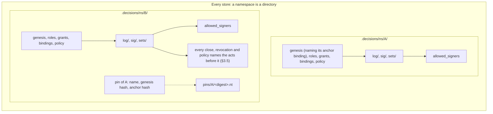
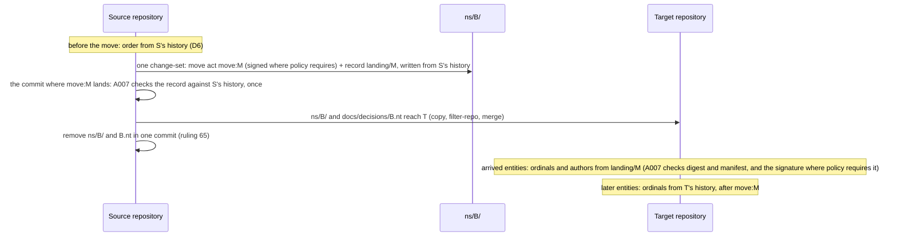

# Namespace independence: design PRD

First draft 7 October 2026; revised the same day after rulings 61 to 81, and again after rulings 82 to 84 (`ledger/rulings/namespace-design-rulings-2026-10-07.md`). Third revision 9 October 2026, proposing that the order of acts comes from the acts; **fourth revision the same day, after rulings 85 to 101 (`ledger/rulings/order-from-the-acts-rulings-2026-10-09.md`), which rule it.**

This document states the ruled design for rulings 32, 41 to 48, 61 to 84 and 85 to 101. Rulings 85 to 101 supersede D6 of 2 October and rulings 64, 65, 79, 83 and 84, and amend rulings 66 and 77, D7's first filer and LP-4.39's "a window closes once"; ruling 82 stands.

- **Section 3** gives the design topic by topic, each with the rulings it rests on.
- **Points not separately ruled** are the first draft's leans, which the principal accepted as the basis of the design. They are marked "accepted with the design".
- **Options that were not chosen** are in Appendix A, kept short. The move act, the landing record, the freeze and the arrival rule, ruled on 7 October and superseded on 9 October, are kept whole in Appendix A.1 as the record of what was weighed.
- **Sections 1 and 2** are kept as they were written before the rulings: they are the record of the problem and of the experiment.
- **The protocol changes in §5** are proposals. The protocol changes with the implementation.

The session record is `ledger/sessions/2026-10-namespace-design.md`. It holds what was read, every experiment's commands and full output, the principal's replies, and what could not be determined. The third revision's record is its section "Order from the acts"; the fourth's is "Principal's replies, 2026-10-09".

**Base.** The first draft was written against `e20fadc`. The second revision was on `846975a`. The third revision was written on `918a08d`, `main` after pull request #128 merged, and was carried to this branch from `main` at `fac640d` as pull request #142. The fourth revision is on #142's branch merged with `main` at `17f9656`.

**Reading the claims.** Every statement about today's behaviour names a file and a symbol. It is marked *(run)* when an experiment in §2 or an attack store in §3.5 showed it, *(read)* when it comes from reading the code, *(inference)* when it follows from the code but was not run, and *(prototype)* when a verdict under the ruled order was computed by the throwaway script described in the session record, which decides nothing about the format.

## Contents

1. The coupling inventory (record)
2. The extraction experiment (record)
3. The design
   - 3.5 Order from the acts (rulings 85 to 101)
4. Acceptance criteria
5. Protocol changes
6. Issues
7. Rulings, and the questions they raise
   - Position C and position D (record)

Appendix A. Options considered
   - A.1 The move act, the landing record, the freeze and arrival (superseded)

---
## 1. The coupling inventory

This section is the specification of the problem. Each entry is a place where the content of one namespace can change a verdict, a derived file or an export of another. Some entries are couplings between a namespace and the repository that holds it, which a move breaks. The design in §3 is complete when every entry has an answer. The answers are collected in §3.13.

Every store below is a git repository with `.decisions/` at its root. "A" and "B" are two namespaces in one store.

### 1.1 Authority

**N1. One genesis grant serves every namespace.**
- *Where.* `authority::view::Authority::genesis` returns the store's one live genesis grant, and `authority::structure::grant_faults` requires its scope to be `*`. Six places read it:
  - `authority::filing::may_file` (D7: who may file a key binding);
  - `verify::acts::policy_verdict` (`A006` on every policy);
  - `verify::acts::revocation_verdict` (a grant's revocation is checked only `auth.genesis()?`);
  - `authority::references::basis_holds` (`fallback-of-genesis` needs a fallback over `*` in the genesis role);
  - `verify::genesis_unbound` (the notice);
  - `author::authority_ops::Author::join_genesis` (a later namespace is opened by "the" genesis holder).
- *Requirements.* LP-6.5, LP-6.28, LP-4.38, LP-8.31.
- *Minimal store.* `init --namespace A --external-ref m`, then `init --namespace B`. B's policy carries `under: <A's genesis grant>`. That grant is filed in the change-set that opened A.
- *Shown.* E4a *(run)*. Without that change-set, B's policy fails `A006` ("no live genesis grant as of the policy"), and both of B's key bindings fail D7.

**N2. `A003` and `A005` count over the whole store.**
- *Where.* `graph::shapes::SHAPES`. `A005` is "a live genesis grant beside another — the store has one trust root". `GRANT_COLLISION` is `A003`. Both run over `graph::turtle::emit(store)`, the union of every namespace. The doc comment on `graph_findings_in` says so: "the shapes hold per store (one genesis per store, `A005`)".
- *Requirements.* LP-6.5, LP-8.19, LP-8.23.
- *Minimal store.* A opened by one holder, and B given a genesis grant of its own (role `steward`, scope `*`, primary).
- *Shown (read).* `A005` fires on both grants, and `A003` fires as well (same role, scope and order). Today a second namespace cannot have its own genesis.

**N3. Role files serve every namespace.**
- *Where.* `store::load_roles` reads one directory, `.decisions/roles/`. `authority::structure::role_faults` refuses a role id declared twice. `authority::view::role_landing` places a role by its file's landing.
- *Requirements.* LP-5.19, LP-6.30, LP-8.27.
- *Minimal store.* A's `init` declares `steward` and `acceptor`. B's `init` declares none and names `acceptor` as its accept role.
- *Shown.* E3 *(run)*: B's opening declared no role.
- *Effect.* B's governance depends on files A's opening landed. One role id cannot mean different capability sets in A and in B.

**N4. A scope of `*` reaches every namespace, and `set:` reaches whatever namespaces file into that set.**
- *Where.* `authority::check::covers`: `(GrantScope::All, _) => true`, and `(GrantScope::Set(s), Target::Decision { set, .. }) => s == set`.
- *Requirement.* LP-6.16.
- *Minimal store.*
  - A `*` grant in A's change-set authorises acts in B: the genesis grant, as in N1.
  - A `set:shared` grant authorises acceptance of a decision of any namespace filed into `shared`.
- *Shown.* E3 *(run)*. second@'s grant `set:set-b` is the grant that authorised their acceptance in `beta.ns`.

**N5. Sets belong to no namespace.**
- *Where.*
  - `store::load_sets` reads one `sets/` directory, and a version may name any declared set (`VersionRaw::set`; `Store::set`).
  - `verify::disposition::stranded` (`L005`) reads the set's current floor.
  - `graph::export::select` exports "the sets those versions name".
  - Set files are not in `landing::TRACKED`, so they are edited in place (LP-5.9: raising a floor).
- *Requirements.* LP-5.9, LP-5.10, LP-8.33, LP-9.11.
- *Minimal store.* C-set *(run)*: one set `shared`, holding one decision of `a.ns` and one of `b.ns`. Raising the floor from T0 to T1 strands both (`L005` on each).

**N6. A close ends the key in every namespace.**
- *Where.*
  - `authority::key_close::same_key`, `closes_of`, `closes_among` and `is_closed` never compare `namespace`.
  - `signing::check::verify_one` asks every close of the matched key.
  - `signing::review::review_closed` lists acceptances under a closed key.
  - `authority::signers::derive_from` takes `valid-before` from the key's earliest close anywhere.
- *Requirements.* LP-4.39, LP-4.13, LP-4.32.
- *Minimal store.* E3 *(run)*. The owner's key K1 is bound in `alpha.ns` and in `beta.ns`. The owner accepts a decision in each, then rotates K1 in `alpha.ns`. Two effects follow:
  - The `beta.ns` acceptance becomes "needs re-acceptance" (it would be `L012` after a deadline).
  - The `beta.ns` line of `allowed_signers` gains `valid-before`.
- *Shown on a move.* E4b *(run)*. Extracted without `alpha.ns`'s rotate, the same acceptance is no longer a review item. The verdict changes on the move.

**N7. Which keys may be bound is judged across namespaces.**
- *Where.* `authority::key_close::refusal`, first two bullets: a key bound to another principal "anywhere in the store", and a key closed "in any namespace".
- *Requirement.* LP-4.37.
- *Minimal store.* Key K is bound to p1 in A. p2's binding of K in B is a schema fault. K is closed for p1 in A, and p1's later binding of K in B is a schema fault.
- *Shown (read).* Covered by `ledger-cli/tests/key_ownership.rs` and `key_across_namespaces.rs`.

**N8. D7 lets a namespace's first key lean on another namespace.**
- *Where.*
  - `authority::filing::self_bound`: the self-bound binding is the genesis holder's "first in the store", checked with `auth.bindings.iter().all(..)` over every namespace.
  - `authority::filing::may_file`: the genesis holder's own first `add` in a later namespace passes on `open_window(auth, b, &b.principal, None)`, a live key in any namespace.
  - `signing::check::carried_over`: keys trusted elsewhere stand in this namespace to verify that binding's signature.
- *Requirements.* LP-4.12, LP-4.38.
- *Minimal store.* E3's `init --namespace beta.ns` *(run)*: "bound … in `beta.ns`, signed by their key trusted elsewhere".
- *Shown.* E4a *(run)*. `beta.ns` alone fails D7 twice:
  - the owner's binding: "has no live key in `beta.ns`";
  - second@'s first key, filed under the genesis grant that is now missing: "names no `under`".

  Every signature in `beta.ns` then fails `L011`.

**N9. A first policy can be signed by a key trusted only in another namespace.**
- *Where.* `signing::check::judge_first_policy` copies every trusted key of the author into the policy's namespace (`KeyBinding { namespace: s.namespace.clone(), ..}`).
- *Requirement.* LP-4.31.
- *Shown.* E4a *(run)*: `L011` on `beta.ns`'s policy once `alpha.ns` is absent.

**N10. One `allowed_signers` file for the store.**
- *Where.* `authority::signers::path` gives the one file `.decisions/allowed_signers`. `derive`, `derive_from` and `check` work on all namespaces at once.
- *Requirements.* LP-4.10, LP-4.32, LP-4.33.
- *Shown.* E4a, E4b and E4d *(run)*. After any move both sides fail `[SIGNERS]` until `ledger identity sync`.
- *Related, found here (read and run).* `signers::write` returns `Ok` without removing the file when nothing binds (`None => Ok(())`). So E4a's leftover file stayed "committed but the log binds no key" after `identity sync`.

**N11. Notices name the store's one genesis holder.**
- *Where.* `verify::genesis_unbound` lists every governed namespace under one holder.
- *Requirement.* LP-8.31.
- *Minimal store.* Two governed namespaces, the genesis holder unbound. The notice names both.

### 1.2 Decisions

**N12. Acceptance ids are resolved across the whole store, first match wins.**
- *Where.*
  - `signing::subject::acceptance_namespace` and `verify::acts::revocation_verdict` (`find(|a| a.id == *acc)`).
  - `authority::references::revocation_refs` builds `filed_acceptances` over every namespace.
  - `verify::view::View` keeps revoked acceptances as a set of ids.
- *Requirements.* LP-5.11, LP-8.8.
- *Minimal store.* Case 3c of `ledger/sessions/2026-10-verification.md` *(run there)*. A change-set in the ungoverned namespace `open.ns` reuses a governed acceptance's id and revokes it in the legacy shape. The governed acceptance is revoked with no grant and no signature.
- *Note.* A session fixing the verified findings may close the duplicate-id half. The cross-namespace half is answered here (§3.7).

**N13. `supersedes` crosses namespaces.**
- *Where.*
  - `graph::shapes` `G001` asks only that the target is a filed decision.
  - `verify::state::supersession` is computed over the whole view and feeds `verify::keys::key_collision` (`L014`), status and coverage.
- *Requirement.* LP-3.31.
- *Minimal store.* C-sup *(run)*. `ledger supersede dec:b.ns/… --by dec:a.ns/…` passes. `b.ns`'s decision then shows "superseded by dec:a.ns/…" in `ledger status`, and `ledger coverage` shows `b.ns: superseded 1`. A key it carried is freed for `L014` (read).

**N14. One change-set can hold entities of several namespaces.**
- *Where.* No rule compares the namespaces of a change-set's entries. `graph::export::restrict` keeps the change-set's header in each export.
- *Requirement.* LP-3.33.
- *Minimal store.* C-cs *(run)*: one change-set with a version of `a.ns` and one of `b.ns`. It is conformant, and its header node appears in both exports (six triples each).
- *Effect.* Extracting one namespace means editing a landed file, which is `L007` (C-cs's first attempt *(run)*). `Author::init_namespace` writes such a file itself: the genesis grant (scope `*`) with A's policy and binding (E3 *(run)*, the change-set marked `*,alpha.ns` by `classify.py`).

**N15. A namespace's export carries other namespaces' authority, and lacks closes made elsewhere.**
- *Where.* `graph::export::select` and `Reach::of`:
  - grants are kept when their scope is `*`, the namespace's `ns:`, or a set its versions name;
  - roles are kept when kept grants and policies name them;
  - `kept.key_bindings.retain(|b| b.namespace == reach.namespace)`.
- *Requirements.* LP-9.11, LP-9.14 (finding 11 of the verification session).
- *Shown.* E4a *(run)*. `beta.ns.nt` carried 36 lines from the change-set that opened `alpha.ns`, so extracting `beta.ns` without that file fails `[EXPORT]`. Finding 11, case 13a: a close in one namespace is invisible in another's export.

**N16. `ledger:set` and `ledger:role` IRIs are not namespaced.**
- *Where.* §9.4's IRI table: `urn:ledger-set:<id>` and `urn:ledger-role:<id>`.
- *Requirement.* LP-9.4 table, LP-9.8.
- *Effect (inference).* Once sets and roles belong to one namespace (§3.1, §3.2), two namespaces may both declare `design`. A reader that loads both exports into one graph merges two sets into one node.

### 1.3 The repository

**N17. Landing order is read from the holding repository's first-parent line.**
- *Where.* `landing::Landing::compute`, `first_parent_adds` (keyed by repo-relative *path*, `--diff-filter=A`) and `TRACKED`. Every order-dependent check reads it:
  - `authority::view::Authority::as_of`;
  - `signing::check` (`subjects`, `governing`, `verify_one`);
  - `verify::acts::unauthorised` (`A006`);
  - `verify::history::findings`.

  Positions also compare entities of different namespaces: B's act against A's genesis grant, against a role A's opening landed, and against a close filed in A.
- *Requirements.* LP-8.24 to LP-8.29.
- *Shown.* E5 *(run)*.
  - The source fails `L011` and `A006`: an unsigned acceptance with no grant, dated before its namespace's first policy and landed after it.
  - Copied into one commit, the namespace is conformant.
  - Merged with its carried history into an existing repository, it is conformant.

  Carrying history into a fresh repository keeps the source's verdict.

**N18. `L009` reads the holding repository's commit authors.**
- *Where.* `blame::introducing_author` (`git log --reverse -S<id> -- <path>`) and `verify::integrity::blame_consistency`.
- *Requirement.* LP-8.32.
- *Shown.*
  - E1a *(run)*: 79 `L009` findings when the files are copied in a commit by someone else.
  - E4c *(run)*: one `L009` when two acceptors' files are copied in one commit authored by one of them.
  - E1c *(run)*: the copy passes when the sole acceptor makes the commit.

**N19. Landed entities may never leave, so a namespace cannot leave the source.**
- *Where.* `verify::history::findings` with `landing::touched_after_landing` (`--diff-filter=DM`).
- *Requirement.* LP-8.30.
- *Shown.* E1d *(run)*: removing `hafeok.ddd`'s 164 log files is 408 `L007` findings. E4d *(run)*: removing `beta.ns`'s files is 28.

**N20. Ids and file names are unique per store, not per namespace.**
- *Where.*
  - Change-set files are `log/<ulid>.yml` and sidecars are `sig/<ulid>.<scheme>.sig` (`signing::load`).
  - `authority::references::duplicate_ids` checks the whole store, and `store::take_log` refuses "change-set appears twice".
- *Requirements.* LP-3.3, LP-3.12, LP-4.7.
- *Effect (inference).* Moving a namespace into a repository that already holds a file of the same name collides. Independent ULIDs make that improbable. Deliberately copying one record into two namespaces (§3.11) is refused today as "filed twice".

**N21. A policy change is looked up by hash across namespaces.**
- *Where.* `signing::check::governing`: `Authority::build(store).policies.iter().find(|p| p.hash == *prior)`.
- *Requirement.* LP-4.9.
- *Effect (read).* A `replaces` naming another namespace's policy is already a schema fault (`authority::references::policy_refs`, "replaces a hash that is no policy of this namespace"). Inference: the signature check in the same run judges it under the other namespace's policy, and reports beside the schema fault. Listed for completeness; the gate already refuses the case.

---

## 2. The extraction experiment

Full commands and output are in the session record. The `ledger` binary was built from `e20fadc`. Unless a case says otherwise, every verification ran with `--export` and blame on.

### 2.1 This repository: `hafeok.ddd` out of `product-cli`

The store holds two namespaces with no policy:
- `hafeok.ddd`: 164 log files, set `ddd-governance`;
- `hafeok.ledger`: 23 log files, set `ledger-design`.

No log file holds both namespaces, and no version names a decision of the other namespace in `based_on`, `revisit_if` or `supersedes`. It holds no authority record and no sidecar. The local clone was shallow and was unshallowed (855 commits, 501 on the first-parent line).

| Case | Means | Result |
| --- | --- | --- |
| E1a | Copy `hafeok.ddd`'s 166 files (log, set, export) into a fresh repository, one commit by `extractor@example` | Fails: 79 `L009`, one per acceptance. Nothing else. |
| E1b | E1a with `--no-blame` | Conformant |
| E1c | E1a, committed by `emk@delegate.dk`, the sole acceptor | Conformant |
| E1d | The source after the 166 files are removed in one commit | Fails: 408 `L007` (164 headers, 85 versions, 80 decisions, 79 acceptances). The export check passes once the `.nt` file leaves with the namespace. |
| E2a | `git filter-repo --paths-from-file` over the same 166 files: history carried, commit ids rewritten | Conformant. 166 files, byte-identical to the source. First-parent order kept: landing indexes 449, 451, 452, 477 map to 0, 1, 2, 3. |
| E2c | E2a's history merged into an existing repository (`merge --allow-unrelated-histories`) | Conformant. Every file lands at the merge commit. |

What this shows:
- **The target side works today, with history carried.** Because `hafeok.ddd` has no policy, nothing in it depends on landing order except `L007`, and that starts afresh in the target.
- **A copy fails only `L009`.** It passes when the person who makes the copy commit is the only acceptor.
- **The source side does not work at all.** Leaving is `L007`.
- **No hash changed and no reference changed form**, in any case.

### 2.2 A governed store: `beta.ns` out of a store shared with `alpha.ns`

E3 built the store with the verbs, as today's rules allow:
- `alpha.ns` opened with the genesis grant and a self-bound K1;
- `beta.ns` opened by joining that genesis, with K1 carried over;
- acceptor grants for the owner in each namespace;
- second@'s first key in `beta.ns`, filed by the genesis holder, with a grant `set:set-b`;
- three signed acceptances;
- the owner rotating K1 to K2 in `alpha.ns`.

It is conformant, with two acceptances (one in each namespace) awaiting re-acceptance because of the rotate in `alpha.ns`.

| Case | Means | Result |
| --- | --- | --- |
| E4a | `beta.ns`'s own files (log files whose every entity reaches only `beta.ns`, their sidecars, `set-b`, the export, both roles, `allowed_signers`), history carried | 8 findings: 2 `SCHEMA` (D7), 3 `L011`, 1 `A006`, 1 `[EXPORT]`, 1 `[SIGNERS]` |
| E4a′ | E4a after `ledger identity sync` | Unchanged. No binding is trusted, so nothing is written, and the old file is not removed. |
| E4b | E4a plus the change-set holding the genesis grant (and `alpha.ns`'s policy and binding), history carried | One `[SIGNERS]`. After `identity sync`: conformant. **The `beta.ns` acceptance is no longer awaiting re-acceptance**, because `alpha.ns`'s rotate stayed behind. |
| E4c | E4b's files copied in one commit authored by the owner | `L009` on second@'s acceptance, and `[SIGNERS]` |
| E4d | The source after `beta.ns`'s own files are removed | 28 `L007`, and `[SIGNERS]` until `identity sync` |

### 2.3 Landing order after a move

E5 builds `gamma.ns` in three commits:
1. a decision;
2. `init --namespace` (first policy, `ssh`);
3. a hand-filed acceptance dated before the policy, landed after it, with no `under` and no sidecar.

| Case | Means | Result |
| --- | --- | --- |
| Source | as built | Fails: `L011` (no signature) and `A006` (no grant), by LP-8.28 |
| E5a | history carried (`filter-repo`) | Same two findings |
| E5b | copied into one commit | **Conformant** |
| E5c | carried history merged into an existing repository | **Conformant** |
| E5d | E5c verified with `--base HEAD~1` | **Conformant** |

A move that collapses landing order is permissive, never strict *(inference, from the code)*. With every entity at one index, `landing::Position::before` and `not_after` reduce to comparing `at`, which is the `Landing::unknown` reading. Pairs that git ordered against their `at` ("landed later, dated earlier") turn from "not before" into "before":
- a backdated act escapes a policy or a close;
- a binding or grant filed after an act starts to enable it;
- a role file landed after an act starts to count for it.

No verdict can get stricter. So the backdating attack D6 closed reopens through a move.

### 2.4 What fails, and why

| Mechanism | Fails on a move because | Inventory |
| --- | --- | --- |
| Landing order | It is the holding repository's first-parent line, keyed by path | N17 |
| `L009` | It reads the introducing commit's author | N18 |
| Landed immutability | Leaving is removal | N19 |
| `allowed_signers` | One file covers every namespace | N10 |
| The export | It carries `*` grants and roles from elsewhere | N15 |
| D7, `A006` on policies, first-policy signature | The genesis, roles and trusted keys sit in another namespace's files | N1, N3, N8, N9 |
| Review items and `valid-before` | A close in another namespace counts | N6 |
| Set files | They are shared, so they must be copied or split | N5 |

---

## 3. The design

*A dashed edge is a pin (§3.6), the only way one namespace reaches another. Nothing in a namespace's verdict is read from the repository's history except `L007` and `L009` (ruling 85; §3.5.7).*

### 3.1 Layout

*Rulings 62, 63 and 66.*

**Every store** holds each namespace under `.decisions/ns/<namespace>/` (62), and no store has another form (63).

**What each namespace directory holds:**
- `sets/`, `roles/`, `log/` and `sig/`;
- the derived `allowed_signers` (§3.4);
- `pins/` (§3.6);
- once basis bytes are held (LP-7.4, not implemented), `basis/<sha256>`.

The root `.decisions/` holds only `ns/` and the uncommitted `index/` cache. The export stays at `docs/decisions/<ns>.nt`, the path the analyzers read.

**Namespace of a file.** A file's namespace is its directory. A content check refuses an entity that names another namespace (§3.7).

**Each file kind belongs to one namespace** (accepted with the design):

| Kind | Rule |
| --- | --- |
| Sets | A version names a set of its own namespace; a set named across namespaces is a set not declared, so a schema fault. |
| Roles | Declared under the namespace's `roles/`. |
| Sidecars | Under the namespace of the entity they sign. |
| Held basis bytes | Under the namespace whose versions rest on them. Duplicates across namespaces are allowed, because the bytes are content-addressed. |
| Pinned material | Under the dependent (§3.6). |

**The flat layout at the verified commit.** A file at the verified commit or in the working tree at `.decisions/sets/`, `.decisions/roles/`, `.decisions/log/`, `.decisions/sig/` or `.decisions/allowed_signers` is a schema fault. So is a store with no `ns/` directory and any of those paths. The layout is specification revision v1.9, with no format number (66), because no file's content changes.

#### 3.1.1 History written in the flat layout

*Rulings 63 and 82.*

Verification reads earlier commits, and in this repository, as in every store made before v1.9, those commits use the flat layout. Ruling 63 makes the flat layout invalid at the verified commit. It cannot make it disappear from history. Ruling 82 makes reading it a **legacy capability**: an implementation may have it, and it is not part of the verifier profile.

**What verification reads from history today** *(read)*:

| Reader | What it reads | Flat paths it names today |
| --- | --- | --- |
| Landing | `landing::first_parent_adds`: the first commit adding each tracked path. `landing::entity_landings`, `file_versions` and `landed::entities`: the first version holding each entity of a touched file. | `landing::TRACKED`: `.decisions/log`, `.decisions/roles`, `.decisions/sig` |
| Landed immutability (`L007`) | `verify::history::findings`, with `landing::touched_after_landing` and `content_at`: every earlier version of every modified or deleted tracked file | The same |
| `format:` across history | Ruling 58, not yet built: the same walk | The same |
| `L009` | `blame::introducing_author`: `git log --reverse -S<id> -- <path>` | The acceptance's current path |
| The base overlay | `revision::overlay_base`: the base's log files and sidecars that a branch checkout lacks (LP-8.29) | `.decisions/log/`, `.decisions/sig/` |

`revision::load_at`, used by `ledger diff` and `ledger merge`, also reads whole stores at a revision. It is not part of verification.

**What every verifier must do**, with or without the capability:

- **At the verified commit and in the working tree**, read only `ns/`. Refuse the flat paths (above).
- **Before reading history, look for the flat layout in it.** One path-limited query does it: `git log --first-parent --format=%H -- .decisions/log .decisions/roles .decisions/sig` over the verified commit and, when given, the base. If that names any commit, the history predates v1.9.
- **A verifier without the capability refuses such a repository** (82). It reports that it cannot verify it, with exit status 2 ("the gate could not run", LP-8.18), and names the first flat commit. It never reports the repository conformant, and it never passes it by treating the re-layout commit as every entity's landing (the collapse of §2.3). Exit 2 is this design's reading of "refuses"; a finding would say the store is wrong, when it is the verifier that lacks the means.

**What the legacy capability does**, in a verifier that has it:

1. **At the verified commit and in the working tree**, read only `ns/`. Refuse the flat paths (above).
2. **In history**, recognise both path patterns, and read nothing of the flat layout but its files' entities:
   - flat: `.decisions/log/<ulid>.yml`, `.decisions/roles/<id>.yml`, `.decisions/sig/<ulid>.<scheme>.sig`;
   - per namespace: the same three under `.decisions/ns/<ns>/`.

   **How the two are told apart.** By path alone. The flat pattern has `log`, `roles` or `sig` directly under `.decisions/`, and the other has `ns/<ns>/` between. `ns` is not a directory name of the flat layout, so no path matches both. Each path is classified by itself, not each commit by its layout, so the re-layout commit, which deletes one set of paths and adds the other, reads like any other.
3. **Key landing by entity, not by path.**
   - An entity's key is its list and id, as `landed::entities` keys it. A change-set header is keyed by its `cs:` id, not by its file, and a role file or sidecar by its id.
   - An entity of namespace N lands at the first first-parent commit whose tree holds its key at a path of N's directory or, before the re-layout, at a flat path.
   - Flat-era ids were unique per store (N20). So a flat-era key names at most one entity, and nothing needs to attribute a flat-era file to a namespace: the lookup starts from the entity at the verified commit, which knows its namespace.
4. **Judge immutability by entity across paths.**
   - The re-layout deletes every flat file. That is not a removal when each of its entities is present, unchanged, under its namespace's directory in the same commit.
   - Anything else stays `L007`.
5. **Make `L009`'s pickaxe name both paths.** That is the flat path and the namespace path of the acceptance's file: `git log --reverse -S<id> -- .decisions/log/<f> .decisions/ns/<ns>/log/<f>`. *(Inference: `-S` also matches the re-layout commit, where the id leaves one path and enters the other, but `--reverse` puts the original introduction first, and `blame::introducing_author` takes the first line.)*
6. **Read a flat base in the overlay.** When the pull request under verification is the re-layout itself, its base is flat, so the overlay reads both patterns.

**Under rulings 85 and 97** (§3.5.7) the readers shrink to `L007`, the `format:` comparison, `L009` and the base overlay: no landing position is computed at all, so the collapse of §2.3 cannot arise, and the capability is smaller by the first row of the table. The refusal stands as ruled (82).

**What is not read from flat history.** No flat semantics: not the store-wide sets (set files are not tracked anyway), roles, genesis or `allowed_signers`. Every verdict is computed at the verified commit, under v1.9's rules. History supplies only three things: positions, earlier content and authors.

**Can one layout be had without reading the old one in history?** No. There are three ways around it, and each is excluded:
- **Treat the re-layout commit as every entity's landing.** That is the collapse of §2.3, which is permissive.
- **Fix the pre-re-layout order in a record.** Ruling 64 writes a record only at a move, and the principal's reply of 7 October says a re-layout uses none.
- **Rewrite history so that it was always in the new layout.** That changes every commit id. It also breaks the assumption D6 rests on: `landing.rs` states that the default branch's history is not rewritten.

**What it costs.**
- *For implementations.* Ruling 82 makes the cost optional. A verifier that wants to verify repositories whose history predates v1.9, as the reference implementation must for this one, carries the flat path pattern in its history reader for good. A verifier without it costs only the detection query, and refuses those repositories. It is used by landing, immutability, the `format:` comparison, `L009` and the base overlay. The cost is bounded: three path patterns and a file grammar it already reads, with no flat semantics.
- *For new stores.* A store created at v1.9 or later never meets it.
- *For test vectors.* A test vector built on a pre-v1.9 history belongs to the legacy capability, not to the verifier profile. The profile's own vectors are: a pre-v1.9 history is refused, never passed.

Ruling 82 answers N-Q1.

### 3.2 Authority records

*Ruling 67; ruling 47. Belonging by directory is accepted with the design.*

**How a record belongs to a namespace.** A grant, grant acceptance, unavailability, availability, revocation or role belongs to the namespace whose directory holds it. Bindings and policies already carry a hashed `namespace`, and the gate requires it to equal the directory (schema fault). No grant gains a namespace field (§3.12).

**What scopes mean.** A scope is read inside its own namespace (ruling 47):

| Scope | Meaning |
| --- | --- |
| `*` | The whole of the grant's own namespace (67) |
| `ns:<own>` | The same as `*` |
| `ns:<other>` | A schema fault: the grant could never have effect |
| `set:<id>` | A set of its own namespace, dots allowed (ruling 59) |
| `pattern:<id>` | Unchanged: it covers no decision (`authority::check::covers`) |

**The genesis grant** keeps its shape: self-granted, scope `*`, primary, with `external_ref` (`authority::structure::grant_faults`; 67). No digest moves.

**The genesis role** is the role of the namespace's live genesis grant, declared in that namespace's `roles/`. Ruling 50's rules hold per namespace: a policy's accept role is never the genesis role, and the genesis role carries no decision capability. `A003` and `A005` count per namespace, because the graph stage runs over each namespace's graph alone (§3.9).

**Opening a namespace.** Every namespace is opened as the first is today:
- its own genesis grant, on its own `external_ref` mandate;
- its own root and accept roles;
- its own first policy;
- the genesis holder's self-bound first binding (§3.3).

`Author::join_genesis` goes away, and `--external-ref` is required every time. One person may hold the genesis of several namespaces, and nothing links them.

### 3.3 Keys

*Ruling 69; ruling 47. The first key per namespace is accepted with the design.*

**Bound and closed per namespace.** The functions of `authority::key_close` compare `namespace`. A close ends the key in its own namespace only (LP-6.32). "A key belongs to one principal" and "a closed key is never bound again" are judged within the namespace. The same key may be bound in several namespaces, and each judges it alone.

**A close in every namespace a writer holds** is one change-set per namespace, filed by one invocation, in one commit (69). Each close gets the same `at`: the time of compromise when given. Each is ordered by D6 in its own namespace only, since no verdict compares across namespaces.

**Repository notices** (69):
- a key closed in one namespace and open in another: "key K of p is closed in A and open in B";
- accepted with the design: one key bound to two principals in two namespaces.

Neither is ever a finding.

**A principal's first key in a namespace.**
- *The genesis holder's first key* is that namespace's self-bound binding, filed by its genesis holder, carrying its genesis mandate, and signed by the key it binds.
- *How it is trusted.* By the rule that trusts the first namespace's today: the first self-bound binding to land for the address, with the window closed by the act that opens the namespace (LP-4.38). It leans on no other namespace, and `signing::check::carried_over` and the store-wide branch of `authority::filing::may_file` go away.
- *Any other principal's first key* is filed by that namespace's genesis holder under that namespace's genesis grant, as today. A `rotate` verifies against the key it closes (ruling 53).

### 3.4 `allowed_signers`

*Accepted with the design.*

One derived file per namespace, `ns/<ns>/allowed_signers`. It holds today's lines for that namespace, with `valid-before` taken from closes in that namespace only. `[SIGNERS]` compares each namespace's committed file with that namespace's trusted bindings. A namespace that binds nothing has no file, and `signers::write` removes a stale one, which it does not do today (N10).

### 3.5 Order from the acts (rulings 85 to 101)

*Rulings 85 to 101 (`ledger/rulings/order-from-the-acts-rulings-2026-10-09.md`). They supersede D6 of 2 October and rulings 64, 65, 79, 83 and 84; the design those rulings gave is Appendix A.1, kept as the record of what was weighed. The options not chosen are in Appendix A.*

**Why.** The superseded move design took a namespace's order from the holding repository's git history (D6) and carried a copy of it across a move in a signed move act. Reviewing it turned up four states it could not get out of: a move act that lands with a stale record fails `A007` on `main` for good, and its refiled act is held by the freeze it created; a move that is called off leaves the namespace frozen in its source; in a namespace with no policy anyone who can merge can file the unsigned move act and freeze the namespace; and a namespace coming back to a repository it once left arrives at its original creation. All four follow from one fact: the order lived outside the namespace. Ruling 85 puts it inside: **a terminating entry names the acts it is after.**

**The design, in one place.**
- A terminating entry (a key's close by `rotate` or `revoke`, a grant's revocation or supersession, a policy, first or change) carries in its signed payload the set of acts that are before it (85, 86).
- An act is before a terminating entry when the entry names it and the act's `at` is strictly earlier (85). An act the entry does not name is not before it, whatever its `at`: fail-closed. An act a writer missed because another pull request merged first is after the entry and is re-accepted.
- An enabling entry (a key binding, a grant, a grant acceptance) covers an act when its signed `at` is no later than the act's (85). Grants, grant acceptances and intervals are signed first (90).
- Landing order decides nothing (85). What git still does is `L007` and `L009`, both local to a repository, both restarting in a new one (97; §3.5.7).
- A move is a copy of the namespace's files: no move act, no landing record, no freeze and no arrival rule (95; §3.5.8).

**The inventory this answers.** Every place a verdict read landing order is listed in the session record ("Order from the acts", step 1, rows O1 to O20) with the requirement, the entries involved and the concrete attack landing order stopped. Under ruling 85, O1 to O15 read names and signed `at` (§3.5.1 to §3.5.5); O16 to O18 stay git's (§3.5.7); O19 and O20 are unchanged.

**The attack table.** Each case was built with today's verbs and hand-filed records in the scratchpad, verified with today's `ledger`, and then judged under the ruled order by hand and with a throwaway prototype. Commands and full outputs are in the session record.

| Case | Store | Today *(run)* | Ruled | How known |
| --- | --- | --- | --- | --- |
| A | A closed key signs an act dated inside its window, landed after the close | `L011`: "not dated and landed before the close" | The close was filed before the act existed, so it does not name it: after, `L011` (85) | Hand, prototype |
| B | A stolen key rotates itself (K1→K2, signed by K1), signs a forged acceptance with K2; the holder's legitimate acceptance under K1 stands before it | B1, the genesis holder's `revoke` of K2 by the verb (`at` = now): conformant; the forged act **and** the legitimate one are review items, citable until the deadline. B2, the revoke hand-filed with `at` one second after the rotate: the forged act is `L011`, the legitimate one a review item | The genesis holder's revoke of K1, dated at the compromise (98, 101), names the legitimate act and not the thief's rotate; the rotate is after it and not trusted, the key it opened is never trusted, and every K2-signed act is `L011`. See L | Hand, prototype |
| C | A revoked grantee hand-files an acceptance under the revoked grant, dated before the revocation, signed by their live key | `A006`: the grant "is revoked or superseded, as of the act" | The revocation names the one act then under the grant; the backdated act is not named: `A006` (85) | Hand, prototype |
| D | An acceptance in a namespace put under policy after one pre-policy acceptance, hand-filed with no grant and no signature, dated 60 s before the policy, landed after it | `L011` and `A006`; the pre-policy acceptance stands | The first policy names the pre-policy acceptance and nothing else; the backdated act is governed: `L011` and `A006` (85, 86) | Hand, prototype |
| E1 | The act's pull request is open while the close lands on `main` | On the branch with `--base main`: `L011`. On the merge: `L011` | The close on `main` does not name the branch's act: `L011`. The remedy is the same: re-accept under the live key | Hand, prototype |
| E2 | The close's pull request is open while an act signed by the key it closes, dated before the close, lands on `main` first | On the close branch with `--base main`: conformant, the act is a review item. On the merge: conformant, review item | The close, written before the act existed, does not name it: **`L011`**. `main` is red after the merge. Put right by re-accepting the act under the live key, or, before the merge, by refiling the close with the act named: `verify --base main` on the close's branch already shows the `L011`. There is no freeze and no `A007` (95, 96) | Hand, prototype |
| F | The closer omits a legitimate earlier act | F1, the verb's close names nothing today and the act is before it by landing: review item. F2, the holder's close hand-filed with `at` in the act's own second: `L011` | Omitted, the act is after the close: `L011`, one re-acceptance (85). What a backdated `at` already allowed is the same loss (F2); now omission is the default and backdating is a choice | Hand, prototype |
| G | A drawer act: signed by K1 and dated inside its window before the close, filed with the close (G1) and one commit after it (G2) | G1: review item (same commit, `at` decides). G2: `L011` | Named as `<id>@sha256:<hash>` (86), the act's bytes existed when the entry was signed, and it is before the close whenever it is filed; it is the closer's own act under the closer's own key, so nothing is gained that the closer could not do by filing it first | Hand, prototype |
| H | `init --without-key`, then an impostor hand-files a self-bound binding for the holder's address, then the holder files theirs dated one second earlier | The impostor's binding is trusted (first to land). The verb refuses the holder's key. **Hand-filed, the holder's binding is trusted too:** both are in `allowed_signers` and the store is conformant | The genesis grant names its anchor binding; the other is a schema fault; `--without-key` is gone (89, 100) | Hand; today's double trust is *(run)* |
| I | An acceptance lands one commit before the role its grant names; a role file is edited after landing | I1: `A006`, "holds no grant of a role that may do this, as of the act". I2: `L007`, "roles are write-once" | The grant names its role's content as `role_hash`; the role's position plays no part; an edit is a schema fault on the grant wherever the file sits, and `L007` in the repository (91) | Hand |
| J | A copy of a governed namespace that leaves out the change-set holding its latest close, and a stale clone of the source at the commit before the close | Both conformant: the acceptance under the closed key is plainly valid. (A stale clone with an `origin/HEAD` sees the close through the base overlay, `revision::overlay_base`.) | Unchanged: a truncated copy is an earlier state and verifies as one. The freshness question, open for the pinning design (§3.5.10) | Hand |
| K | This repository's two namespaces, with no policy, copied into a fresh repository in one commit | By a copier: 91 `L009`. With `--no-blame`: conformant. By the sole acceptor: conformant (E1a to E1c again) | Unchanged: `L009` is git's and restarts. A namespace with no policy moves with its history carried, or is put under policy and re-accepted first (95) | Hand |
| L | The thief, with K1, signs a forged acceptance backdated inside K1's window, rotates K1 to K2 (signed by K1), and signs another with K2; the genesis holder then files a second close of K1, a `revoke` dated at the compromise, naming the holder's legitimate act only | Before the second close: conformant, the legitimate and the forged K1 acts both review items, the K2 act valid. After it: `SCHEMA` on the revoke ("already closed — a window closes once", and D7 "window is already closed"), `SCHEMA` on the rotate (judged as of a position the revoke precedes), `L011` on the K2 act (no key bound) | The second close is allowed (101). The forged K1 act is named by the rotate and not by the revoke, so it is not before each close of its key: `L011`. The legitimate act is named by the revoke; it stands as a review item if the rotate names it too, and is `L011` if the rotate omitted it. The rotate itself is not named by the revoke, so it is after it and not trusted; K2 is never opened, and the K2 act is `L011` | Hand |

What the table shows:
- In A, C, D, E1 and F2 the ruled verdict is the verdict today, reached without reading the repository's history.
- In E2 and F1 the ruled order is stricter: an act the closer did not name is refused where today landing order put it before the close. That is the fail-closed rule, and its cost is one re-acceptance per unnamed act.
- In B and L a thief's `rotate` decides what is before it only until the genesis holder's revoke, dated at the compromise, does not name the same acts (101). A `rotate` that names nothing still disowns the holder's history, and the remedy is re-acceptance, as it is today after the deadline.
- In H today's rule had a hole the anchor closes (89, 100): `authority::filing::self_bound` reads "first in the store" off `Authority::as_of`, which admits an enabling binding only when its `at` is no later (`not_after`), so a self-bound binding landed second and dated earlier does not see the one landed first, and both are trusted *(run)*.
- In I, J and K the ruled order changes nothing by itself; I is answered by `role_hash` (91), J is for the pinning design, K by ruling 95.

Two things the stores showed about today's writers, both *(run)*: no verb takes a time, so a close "with `at` set to the time of compromise" (D6, D7 (5)) could only be hand-filed, which ruling 98 changes; and a close dated before the window it closes finds no window (`authority::filing::closing` over `Authority::as_of`), which is the lower bound ruling 98 states.

#### 3.5.1 The rule

*Rulings 85 and 101.*

**LP-8.26 as ruled.**

> **Before.** An act is before a terminating entry (a key's close, a grant's revocation or supersession, a policy) when the entry names it (LP-5.23) and the act's `at` is strictly earlier. An act the entry does not name is not before it. A terminating entry applies to every act that is not before it, so a close filed with `at` set to the time of compromise invalidates what it names and dates after that time, and everything it does not name.
>
> **Enabling entries** (a key's binding, a grant, a grant acceptance) cover an act when their signed `at` is no later than the act's.
>
> **Several closes of one key.** Where more than one close ends a key, an act stands only if it is before each of them (LP-4.39, ruling 101).

**Enabling by `at` holds only where the `at` is signed.** A key binding's `at` is in its hashed payload (`authority::payload::binding_map`) and the binding is signed. A grant's `at` is outside its payload (LP-4.22; `grant_map` discards it) and a grant is unsigned; a grant acceptance has no payload at all; intervals are unsigned. Without landing, a grant file written with an earlier `at` would enable every act dated after it, and a new file is not an edit, so `L007` would not see it. Ruling 90 therefore signs grants, grant acceptances, unavailabilities and availabilities, with `at` in their payloads, before order from the acts is implemented (§3.5.4). A role file has no `at`; ruling 91 binds its content to the grant instead (§3.5.4).

**Same instant.** Equal `at` is not before, as today (`Position::before` is strict). An act and the entry that ends it in the same second: the act is after.

**Strict.** An unnamed act dated before a `rotate` is `L011`, not a review item (85, Q11). The review window is for acts a close names; a `rotate` that names nothing disowns everything on purpose, and the hole D6 closed (a thief filing backdated acts with the `rotate`) stays closed.

**What `at` keeps doing.** Key validity windows (`-Overify-time`), unavailability intervals, expiry, the re-acceptance deadline. Unchanged.

**A key closed twice** (101). Today a window closes once: `authority::references::binding_refs` makes a second close of one binding a schema fault, and `authority::filing::closing` refuses it ("already closed") *(run, case L)*. Ruling 101 amends that for one case: the genesis holder's `revoke` may close a key that a `rotate` has already closed. The two closes are:
- **the thief's `rotate`**: the principal's own act on their open binding, signed by the key it closes (ruling 53), so trusted as a binding; it closes K1 and opens K2, and it names what the thief chooses, forged acts included;
- **the genesis holder's `revoke` of K1's binding**, under the genesis grant, signed by the genesis holder's key, dated at the compromise (98), naming the holder's legitimate acts and nothing the thief made.

Under LP-4.39's "every close" reading, every signature check asks over all closes of the matched key, and an act stands only if it is before each of them. A forged act the `rotate` names and the `revoke` does not is after the `revoke`: `L011`. A legitimate act both name is before both: a review item until re-accepted. A legitimate act the `rotate` omitted is after the `rotate`: `L011`, re-accepted, as any omission is. **The thief's new key** falls with the `rotate`: the `rotate` is itself an act signed by K1, the `revoke` does not name it, so it is after the `revoke` and is not trusted; the key it opened is never bound, and every act signed with K2 is `L011` as signed by a key bound to nobody. No separate revoke of K2 is needed; a writer may still file one, and it names nothing. The amendment is for this case only: a `rotate` after a `revoke`, a second `revoke`, or a `rotate` after a `rotate` stay "a window closes once".

#### 3.5.2 The encoding

*Rulings 86, 87 and 92.*

**A name** is `<id>@sha256:<hash>` (86): the act's id, and its content hash. Every act a terminating entry names has a digest already: an acceptance's and a revocation's content hash (LP-4.24, LP-5.3), a binding's, a policy's and a grant's stored `hash`. The id is what a reader and a finding use; the digest is what the signature commits to, so a name cannot be minted before the act exists (case G).

**Where it sits.** In the signed payload, as the set-valued field `after`, through `canon::put_set`: deduplicated, code-point sorted, omitted when empty (86). Policies carry it the same way. The payload is exported field by field (LP-9.3), so an export-only verifier reads the names (§3.5.9). An entry that names nothing carries no field, and no digest filed before the field moves.

**Which entries carry it, and what each names.**

| Entry | Names | Reads as |
| --- | --- | --- |
| Key close (`rotate`, `revoke`) | Acts whose signature the closed key made: acceptances, `rev:` revocations, bindings (a further `add` it signed, a `rotate` it signed), policies it signed | What this key signed while it was mine |
| Grant revocation (`rev:` of a `grant:`) | Acts made `under` the grant | What was done under this grant while it stood |
| Grant supersession (a grant whose `supersedes` names another), signed under ruling 90 | Acts made `under` the superseded grant | The same |
| First policy | Acts of the namespace that stand unchecked: pre-policy acceptances and legacy revocations (LP-5.21, LP-6.29) | What this namespace accepted before it was governed |
| Policy change | Acts of the namespace judged under the policy it replaces, since that policy (88) | What the old policy governed |

**Stray and dangling names** (92). A name outside the entry's family (a close naming an act another key signed) and a name that resolves to no filed act are ignored and reported as notices. A stray name never blocks a close, and a name that never lands is harmless.

**Format number** (87). Format 8 holds `after`, `anchor` (§3.5.5) and `role_hash` (§3.5.4). There is no move act. A file carrying any of the three declares `format: 8`; one below 8 carrying any is a schema fault, as `under` is below 7 (LP-6.24). An entry filed below format 8 names nothing, so everything is after it. No committed store in this repository or in the fixtures holds a close, a revocation or a policy (`ledger/sessions/2026-10-verification.md`, Summary; §3.11), so no stored verdict changes; a store elsewhere that holds one sees every act under its closed keys refused once verified at format 8, and Appendix C says so (§5).

**No stored digest moves.** Each field is hashed when present and omitted when absent, under its entity's existing prefix. `CANONICAL_FORM` stays `v1`: the version payload is untouched. Hashed content stays strings only.

#### 3.5.3 Size

*Ruling 88.*

What a terminating entry names is bounded by its family. Measured for this store (79 acceptances in `hafeok.ddd`, 12 in `hafeok.ledger`) and for a store of Varve's size (607 decisions, taken as 607 acceptances; the audit counts 513 in Varve's interim files), as the canonical array holds `<id>@sha256:<hash>` names:

| `hafeok.ddd` (79) | both (91) | Varve-sized (607) |
| --- | --- | --- |
| 8.3 KB | 9.6 KB | 64 KB |

For comparison, a change-set file of this store is 4 KB and a policy payload today is under 400 bytes. The largest single entry is a first policy over an imported namespace, written once. A key close names what one key signed, and a grant revocation what one grant covered; both are smaller.

**Successive policies** (88). A policy change names only the acts judged under the policy it replaces, since that policy. The earliest policy that names an act governs it, through its predecessor; an act no policy names is under the policy in force at the tip. Verification scans the chain in `replaces` order, which `Authority::policy` already walks. Fail-closed holds: an act a change missed is under the tip. Key closes and grant revocations have no chain: a key closes once, ruling 101's case aside, and a grant is revoked once.

#### 3.5.4 The unsigned records

*Rulings 90 and 91.*

The ruled order places an entry by what its signature covers. Four records carried no signature; two rulings close that.

| Record | Today *(read)* | Ruled |
| --- | --- | --- |
| Grant | Unsigned (#82). `at` outside the payload. Placed by landing and `at` (`Authority::as_of`). Never role-checked at verification: `verify::acts::unauthorised` judges acceptances, revocations and policies, not grants | Signed by the grantor, `at` in the payload, before order from the acts is implemented (90). `A006` judges the grantor as of the grant, through `authorize_named` as it judges a policy. A superseding grant carries `after` (86) |
| Grant acceptance | Unsigned, no payload, no hash. Placed by landing and `at` | Signed by the holder, with a payload holding `at` (90), under a prefix of its own (`ledger.grant-acceptance.v1`, proposed in §5) |
| Role file | Unsigned, no `at`, no hash. Placed by landing alone (LP-6.30, LP-8.27; `role_landing`). Edits are `L007` in the repository (case I2) | The grant names its role's content: `role_hash`, a digest under `ledger.role.v1` over the role's canonical form (`id`, `owner`, `may` as a set, `title`, `created_at`, `notes`; `format` outside) (91). A grant whose role's current content hashes differently is a schema fault. A role's position plays no part |
| Unavailability, availability | Unsigned. Placed by landing; the interval by its own `from`/`until`/`available_at`. `basis` is checked at the parse gate (`authority::references::basis_holds`) | Signed by their `by`, with `at` in a payload of their own (90), so a forged interval cannot push a primary aside for a fallback |
| Legacy revocation (`acceptance`, `by`) | Unsigned, no hash. Valid only before the first policy (LP-5.21) | Unchanged: a pre-policy act, named by the first policy or not |

Ruling 90 orders the work: #82 lands first (§6, issue 11), so the verifier never carries two orders at once.

#### 3.5.5 The founding

*Rulings 89 and 100.*

What trusts a namespace's first key. Today: the first self-bound binding to land for the genesis holder's address, the window closed by the act that opens the namespace (LP-4.38, `author::genesis_key`), and open after `init --without-key` until a binding lands; case H shows the window as implemented, two self-bound bindings both trusted. Ruled:

- **The genesis grant names its anchor**: `anchor: sha256:<hash of the genesis holder's self-bound binding>` in `ledger.authority-grant.v1`, hashed when present. There is no cycle: the binding's payload names the mandate string, not the grant's hash. That binding is the namespace's first trusted key; a self-bound binding the genesis grant does not name is a schema fault and never trusted. "First to land" plays no part, and the double trust of case H gets no separate fix (100).
- **`init --namespace` refuses without a usable key**, and `--without-key` is removed. The genesis holder's key, the genesis grant naming it, and the first policy are filed in one change-set, as `init` writes them with a key since #96.
- **Two founders.** A second genesis grant is `A005`, cleared by the real holder revoking the impostor's grant (`revoke-grant` over `*`). The dependent's pin names the genesis hash it trusts (rulings 70, 71).
- **The pin's tokens.** With the anchor inside the genesis grant, the anchor's hash is derivable from the genesis hash. Whether a pin keeps two key tokens (ruling 70) or one is left to the pinning design.

D7's other filers are judged as today, against the bindings trusted before them by signed `at`: a first key filed by the genesis holder, signed by the genesis holder's trusted key; a further `add` and a `rotate` by the principal; a `revoke` by the principal or the genesis holder.

#### 3.5.6 The writer

*Rulings 98, 99 and 101.*

How `ledger` computes the names when it files a terminating entry.

- **What it names** (99). The acts of the entry's family that the checkout holds, committed or not. For a key close: every acceptance, `rev:` revocation, binding and policy whose sidecar the closed key made, found as `signing::check::verify_one` finds the signer, by fingerprint over the subject's bytes. For a grant revocation or supersession: every act with `under` naming the grant. For a first policy: every acceptance and legacy revocation of the namespace. For a policy change: every act of the namespace judged under the policy in force, filed since it. The verb prints the count and lists the ids; the confirmation at the terminal shows them before signing. A name that never lands is ignored (92).
- **Against which base.** The checkout, and nothing else. The verifier is where the base matters: `verify --base main` on the entry's branch judges the merge, as today (LP-8.29, `revision::overlay_base`), and shows what the entry missed.
- **When the base moves.** An act of the family merges after the entry was written and before it lands: the act is unnamed, so after the entry, and `main` carries a finding once the entry merges (case E2). Put right by re-accepting the act under the live key, or by refiling the entry before it merges: running the verb again on the updated checkout files a new entry naming the current family, replacing an uncommitted one. A committed close stands ("a window closes once", ruling 101's case aside), so the remedy for it is re-acceptance. There is no freeze: nothing stops the namespace while the entry is in flight.
- **The genesis holder's revoke takes an `at`** (98): `identity revoke --at <instant>`, the time of compromise, refused before the `at` of the binding it closes (the bound case B2 found). No other verb takes a time.
- **A second close of a key** (101). `identity revoke` by the genesis holder accepts a binding a `rotate` has already closed. It names the acts the genesis holder vouches for: the writer lists the closed key's acts, the `rotate` and everything it opened among them, and the genesis holder strikes what the thief made. The writer refuses a second close in every other case.

#### 3.5.7 What git still does

*Ruling 97.*

Positions are not read from the repository. What is:

| Reader | Still reads git | Why |
| --- | --- | --- |
| `L007`, `verify::history::findings` over `landing::touched_after_landing`, `file_versions`, `content_at` and `landed::entities` | Yes | "This repository never changed or removed what landed in it", including ruling 58's `format:` comparison, role files and sidecars. Local to a repository; restarts in a new one |
| `L009`, `blame::introducing_author` | Yes, for acts no signature covers (94) | The introducing commit's author. Local; restarts |
| The base overlay, `revision::overlay_base` | Yes | A branch verifies with the base's log files and sidecars it lacks, so a close on `main` reaches a branch's acts (case E1). It needs no positions: every entity it adds is judged by names and `at` |
| `Landing::compute`, `Position`, `entity_index`, `Authority::as_of`'s landing parameter, `signing::check::ordered` | No | Replaced by names and `at` (§3.5.11) |

**Ruling 82 stands as written** (97), and its legacy capability shrinks. §3.1.1 lists six readers of flat history; three remain: `L007`'s walk (entities across both path patterns), `L009`'s pickaxe over both paths, and the base overlay reading a flat base. Landing positions, the one reader whose collapse made a move permissive (§2.3), are gone. A verifier without the capability still cannot run `L007` or `L009` over flat history, and still refuses a repository whose history holds a flat path, with exit 2, naming the first flat commit.

#### 3.5.8 The move

*Rulings 93, 94 and 95.*

A namespace moves by copying `ns/<ns>/` and `docs/decisions/<ns>.nt` into another repository: by plain copy, by `git filter-repo`, or by merging carried history (95). No act is filed, no record is written, nothing is frozen. Every verdict in the namespace is computed from its files (§3.5.1 to §3.5.5), so the target reaches the source's verdicts for everything but the two git-local classes.

**`L007` in the target.** Restarts: the copy commit is where every entity landed. Nothing arrived is checked against the source; a later edit or removal in the target is `L007` there. A copy that drops files (case J) is an earlier state, not a finding (§3.5.10).

**`L009`** (94) judges only acts that no signature covers: pre-policy acts, and acts in a namespace whose policy in force is `[none]`. A signed acceptance's witness is its signature. A governed namespace with a signature requirement therefore moves by plain copy with blame on; today's `L009` on every arrived acceptance (cases K and E4c) applies to unsigned acts only.

**The source** (93). Removing every file of a namespace and its export in one commit is a notice naming the commit, not `L007`. Removing part of a namespace stays `L007`. `L007`'s purpose is "changed or removed what landed": a whole namespace leaving is visible in one commit's diff, and nothing left behind depends on it.

**A namespace with no policy** (95) has no portable witness for its acceptances: they are unsigned, and their only corroboration is the introducing commit's author. It moves with its history carried (`git filter-repo --paths-from-file`, or the carried history merged as unrelated history: E2a, E2c, E5a, E5c pass today), or it is put under policy and re-accepted first: `init --namespace`, whose first policy names every pre-policy act (86), then each decision's tip re-accepted under the new key (the Varve import's shape, ruling 61), after which it is a governed namespace and moves by copy. A plain copy of an ungoverned namespace by someone other than its acceptors fails `L009` (case K), and that is correct: git was its witness.

**AC-1** in §4 states the move as a test.

#### 3.5.9 The export

*Rulings 81 and 94; ruling 51.*

LP-9.3 exports every payload field of every signable entity, so the `after` sets, the `anchor` and the `role_hash` are in the export as literals, and the export-only verifier of LP-9.14 reads them. What it checks, against §3.9's table:

| Check | Export-only verifier |
| --- | --- |
| Order against a close, a revocation, a policy | Yes: names and `at` are in the payloads |
| D7 trust | Yes: the anchor is named by the genesis grant; every further binding is judged by its filer and its signature, and enabling by signed `at` |
| `A006` as of each act | Yes: grants and grant acceptances are signed and exported with `at` (90; LP-9.11) |
| `L012` review | Yes |
| `L007`, ruling 58 | No: no history |
| `L009` | No: no authors (81); and it covers unsigned acts only (94) |
| Whether the repository verified green | No |
| Whether the export is complete and current | No (§3.5.10) |

So of N-Q2's six items, 1 (green) stays; 2 (order) closes; 3 (trust beyond the anchor) closes; 4 (authorship) narrows to acts no signature covers; 5 (anything after the snapshot) stays and is the freshness question; 6 (a move's record) is moot. N-Q5 closes: LP-9.6's "enough of the authority log to verify its acts from the pinned key material" is what the export carries once ruling 90 lands. Ruling 51's amendment of LP-9.14 and LP-9.15 shrinks to the four rows above that say no. Ruling 81 stands: a name is content of the act that carries it, not a fact read from git, and the export still carries no ordinal and no author.

#### 3.5.10 Freshness

*Open for the pinning design.*

A stale or truncated copy of a namespace verifies elsewhere (case J), as a stale clone does today and as a pinned snapshot does by construction (ruling 72). Nothing inside a namespace says which terminating entry is its latest, so a dependent cannot tell a snapshot taken before a close from one taken after. The question for the pinning design: *what, if anything, should a pin or a snapshot carry so that a dependent can tell that a close, a revocation or a policy change has happened in the pinned namespace since the snapshot?* It bears on N-Q2's items 1 and 5.

#### 3.5.11 Cost

Against the code Session B and the ten fixes built.

**Stays as is:** `landing.rs` for `touched_after_landing`, `file_versions`, `content_at`, `entity_landings` and `Landing::compute` as `L007`'s reader; `landed.rs`; `verify/history.rs`; `blame.rs`; `revision.rs`; `authority/key_close.rs`; `authority/signers.rs` (`valid-before` already takes a key's earliest close); `authority/structure.rs`; `signing/review.rs`; the `ssh` and `dsse` modules; every writer's signing path (`author/sign_ops.rs`).

**Reworked:**
- `landing::Position`, `before` and `not_after`: replaced by a names-and-`at` judgement; `Authority::as_of` takes the act's id and `at` instead of a `Position`, and admits a terminating entry unless it names the act with an earlier `at`, an enabling entry by signed `at`, a role by its grant's `role_hash`.
- `verify/acts.rs` (and `A006` on grants, 90), `verify/genesis_role.rs`, `signing/subject.rs` (no `position`), `signing/check.rs` (`ordered` by `at`; `governing`, `trust_bindings`, `judge_first_policy`, `verify_one` by names; the self-bound branch by `anchor`), `authority/filing.rs` (`self_bound` by anchor; `closing` allowing the genesis holder's second close of a rotated key, 101), `authority/references.rs` (`role_hash`, `anchor`, the second-close exception, the three notices of ruling 92 and 93).
- `authority/payload.rs`: `after` on bindings, revocations, policies and grants; `anchor`, `role_hash` and `at` on grants; new payloads for grant acceptances and intervals (90); `ledger.role.v1`.
- `author/identity_ops.rs` (names; `--at`; the second close), `authority_ops.rs` (`revoke_grant`, `init_namespace`, `grant`, `accept_grant`), `availability_ops.rs` (signing), `policy_ops.rs`, `genesis_key.rs` (the anchor; no `--without-key`): compute and print the names.
- `graph/export.rs` and the emitter: the new fields ride the payload-field emission; `verify::history` for the whole-namespace notice (93); `verify::integrity::blame_consistency` for ruling 94's scope.
- The format constant: `NAMING_FORMAT = 8`, `format::needed_for`.

**Tests rewritten** (the ones that encode D6 by landing; *(read)* from their names and bodies):
- `ledger-core/src/verify/order_grid.rs`, `order_tests.rs`, `order_regressions_tests.rs`: the grid's axis becomes "named or not" × `at`, and the property "an earlier `at` never improves a verdict once the act is unnamed" replaces "once landed after the entry".
- `ledger-core/src/landing_tests.rs`: `before_needs_landing_no_later_and_an_earlier_at` goes; the rest stays for `L007`.
- `ledger-core/src/authority/filing_tests.rs`, `signing/check_tests.rs`, `verify/genesis_role_tests.rs`: positions become names.
- `ledger-cli/tests/`: `role_position.rs` (both tests: the role's position no longer matters; `role_hash` tests replace them), `closed_key.rs` (every case: landed after the close becomes unnamed), `signing.rs` (`a_backdated_acceptance_landed_after_the_close_fails_l011_not_l012`, `a_branch_verified_against_its_base_agrees_with_the_merge_ref`, `a_revocation_ends_the_grant_for_acts_not_before_it`, `a_key_closed_after_the_acceptance_is_a_review_item_then_l012_past_the_deadline`), `legacy_revocation.rs` (the two "landed after the first policy" tests), `trust.rs` (`acts_before_the_first_policy_stand_and_acts_after_it_are_checked`), `pre_policy_binding.rs` (the "before the first policy" cases), `genesis_key.rs` (`bound_at_init_a_forged_self_bound_binding_is_never_trusted`, `unbound_at_init_the_window_stays_open_and_init_says_so`, every `--without-key` test), `immutability.rs` (`an_acceptance_appended_to_a_landed_file_after_the_close_fails_l011`: the appended act is unnamed), `key_across_namespaces.rs` and `key_ownership.rs` where a second close is refused, and the second-namespace tests §3.11 already lists.
- **New:** one test per attack row (§4), the names-size test over this store, `role_hash`, `anchor`, the second close of ruling 101, the export-only verifier checking order from an export alone.

**Fixtures:** none of the 15 committed stores holds an authority record, so none changes.

**Issues** are re-sized in §6: the move-act issue is dropped; #82 (90) is one M issue ahead of the naming work; the naming field, the anchor, `role_hash`, the writers and the move are one L and four S issues; the export-only verifier stays M and now delivers order.

### 3.6 The dependency declaration (pin)

*Rulings 70, 71, 72 and 73. The pin as a trusted-source decision is accepted with the design.*

- **What a pin is.** A trusted-source decision: a version carrying `source_prefix: dec:<ns>/`, `source_method: signed` and `source_keys`, accepted by a holder of `trust-source` (LP-7.8; ruling 4). Its `source_keys` are exactly two tokens (70):
  - `genesis:sha256:<hash of the pinned namespace's genesis grant>`;
  - `anchor:sha256:<hash of its first trusted key binding>`, the genesis holder's self-bound binding.
- **No location.** No server or place appears in it (ruling 42).
- **One name, two namespaces.** Two unrelated namespaces of one name are told apart by genesis grant hash (71). A namespace holds at most one live pin per name, and a second is a schema fault. That is the cost of ruling 34's token, which names a namespace by name.
- **`dec:` prefixes.** A `dec:` prefix with any method other than `signed`, or without the two tokens, is a schema fault.
- **Pinned material** is a snapshot of the pinned namespace's export, held by the dependent at `ns/<ns>/pins/<pinned-ns>/<digest>.nt` (72), inside one repository too. The duplication is the price of a namespace verifying the same wherever it sits.
- **Ungoverned namespaces cannot be pinned** (73). So `hafeok.ddd` and `hafeok.ledger` cannot pin each other until they are governed.

What a snapshot holder cannot know is in §3.9.

### 3.7 What crosses

*Rulings 75, 76 and 78. The checks for rulings 43 to 45 are accepted with the design.*

| Ruling | Check | Stage | Stores today |
| --- | --- | --- | --- |
| 43 | A version whose `supersedes` names a decision of another namespace. In a store that exists today it is judged on live claims only, a decision's latest version (75), so a revision that drops the edge repairs it (LP-8.21). | File gate, `SCHEMA` | None in this repository or the fixtures |
| 44 | A pinned decision basis whose version, in the vendored snapshot, does not itself carry `exported: true` (78) | Graph, `G008` (77) | None: nothing pins |
| 45 | Every entity in `ns/<ns>/` belongs to `<ns>`. That covers decision ids, the decisions that versions and acceptances name, the `namespace` fields, a revocation's target, the grant of a grant acceptance or interval, and the interval an availability ends. | File gate, `SCHEMA` | This repository: 0 of 187 files mixed |
| 41 | In a file declaring the pinning format, a `dec:` token in `based_on` is a pinned basis of its own namespace or of a pinned one. An unpinned `dec:` token of another namespace is refused (76). Below that format it is opaque (LP-7.27). | File gate, `SCHEMA` | None: 0 `dec:` tokens in this repository |

**N12 is closed twice.**
- Ruling 49 makes a duplicate acceptance id a schema fault.
- Ruling 45's check makes a revocation of another namespace's acceptance one.

### 3.8 The dependency graph

*Rulings 77 and 80. The rest is accepted with the design.*

**Edges and nodes.**
- An edge runs from N to the identity `(name, genesis hash)` of each namespace it pins with a live pin.
- A pinned namespace's own edges are read from its vendored snapshot, since its pins are versions and so are exported.

The graph a namespace sees is therefore built from its own files alone, and its verdict is the same wherever it sits.

**Cycles.** A cycle reachable from a namespace's own edges fails `G007` (77).

**Instability.** It is reported for each namespace of one repository:

> I = Ce / (Ca + Ce)

- Ce is the number of distinct identities the namespace pins.
- Ca is the number of namespaces in the same repository that pin it.
- A namespace with neither is reported as "isolated" (80).

It is a report section (machine-readable key `instability`), never a finding.

### 3.9 The export

*Rulings 74, 81 and 94; ruling 51.*

**What one namespace's export carries.** Everything in its directory, and nothing from another namespace:
- decisions, versions, acceptances, revocations, sets and change-sets;
- its own authority log, every record signed under ruling 90;
- sidecar nodes;
- its pins;
- the `after` sets, `anchor` and `role_hash`, as payload fields of the entities that carry them (LP-9.3).

The `*` reach of LP-9.11 goes.

**What it does not carry.** It carries no landing ordinals and no introducing authors (81). A name in an `after` set is content of the act that carries it, signed with it, and is not a fact read from git.

**IRIs.** Set and role IRIs carry the namespace: `urn:ledger-set:<ns>/<id>` and `urn:ledger-role:<ns>/<id>` (74).

**The graph stage** runs over each namespace's graph alone.

**What an export-only reader can and cannot check** (§3.5.9):

| Check | Export-only verifier |
| --- | --- |
| Order: whether an act is before a policy, a close or a revocation; whether a binding, grant or role enables it | Can: names and signed `at` are in the export (85, 86, 90, 91) |
| D7 trust | Can: the anchor is named (89); further bindings by filer, signature and `at` |
| `A006` as of each act | Can: grants and grant acceptances are signed with `at` (90) |
| `L009` | Cannot: no authors (81). It covers unsigned acts only (94) |
| Landed immutability and ruling 58's `format:` comparison | Cannot: no history |
| Whether the store verified green | Cannot |
| Whether the export is complete and current | Cannot (§3.5.10) |

Once ruling 47 is implemented, ruling 51's one remaining difference (a close in another namespace) disappears, because every close of a namespace's keys is in its own export.

**A dependent holding a pinned snapshot is such a reader.** Of N-Q2's six items it cannot know whether the pinned namespace's repository verified green at the snapshot, who deposited the acts no signature covers, and anything after the snapshot. Order, trust beyond the anchor and a move's record are no longer open. The first and the last of what remains are the freshness question (§3.5.10). No fix is designed here.

### 3.10 Format and classes

*Rulings 66 as amended by 87, 77 as amended by 96, 89, 90 and 91.* Hashed content stays strings only, `CANONICAL_FORM` stays `v1`, and a new field is hashed when present and omitted when absent. No stored digest moves.

| Change | Kind | Format | Digests |
| --- | --- | --- | --- |
| Layout under `ns/`; flat refused at the verified commit; flat history detected, and read only by the legacy capability (82, 97) | Store property | Revision v1.9, no format number (66) | None |
| Sets, roles and authority per namespace; scopes read inside it | Rule change | None | None. Scope strings are unchanged (67). |
| Keys per namespace | Rule change | None | None |
| `allowed_signers` per namespace | Derived file | None | None |
| Landing keyed by entity across layouts, for `L007` and `L009` | Rule change | None | None |
| Grants, grant acceptances, unavailabilities and availabilities signed, `at` in their payloads (90) | Payload fields; two new payloads | 8 | None: `at` on a grant is hashed when present |
| `after` (set) on key closes, `rev:` revocations, superseding grants and policies (86, 87) | Payload field, hashed when present | **8** (87) | None: absent on every digest filed before |
| `anchor` on the genesis grant (89) | Payload field, hashed when present | 8 | None |
| `role_hash` on grants (91); `ledger.role.v1`, a role's canonical form | Payload field; a hash law element not stored on the role | 8 | None |
| Pins: `source_prefix`, `source_method`, `source_keys`; the pinned tokens | Version fields | The pinning format, after 8 (66) | Hashed when present, so no existing version moves |
| Export: no `*` reach; namespaced set and role IRIs | Derived file | None | None. Exports regenerate. |

There is no move act and no landing record (87, 95).

**Classes:**

| Class | Fails when | Stage |
| --- | --- | --- |
| `G007` | A cycle in the dependencies between namespaces (77) | Graph |
| `G008` | A pinned decision basis names a version not marked `exported` (77) | Graph |

`A001`, `A002`, `A004` and `A007` stay unused (77 as amended by 96).

**Extensions with no new class:**
- `SCHEMA`:
  - a flat path at the verified commit;
  - an entity outside its directory's namespace;
  - `supersedes` across namespaces;
  - scope `ns:<other>`;
  - a set named across namespaces;
  - an unpinned cross-namespace `dec:` token from the pinning format on;
  - two live pins of one name;
  - a `dec:` source that is not `signed` with the two tokens;
  - `after`, `anchor` or `role_hash` in a file below format 8; a grant whose `role_hash` is not its role's current content (91); a self-bound binding the genesis grant's `anchor` does not name (89); a second close of a key that is not the genesis holder's `revoke` of a binding a `rotate` closed (101).
- `L011`, `A006`: an act a close, revocation or policy does not name is after it; the message names the entry and says "not named by" (85).
- `A006`: a grant's grantor, as of the grant (90).
- `L007`'s scope: a re-layout that moves every entity unchanged; **a whole namespace removed with its export in one commit is a notice, not `L007`** (93).

**Notices** (69, 92, 93): the two key notices; a name outside its entry's family; a name that resolves to no filed act; a whole namespace removed, naming the commit. **Report** (80): instability.

### 3.11 Migration

*Rulings 63 and 68.*

**Ruling 68 rests on there being no governed store with more than one namespace outside this repository.** Whether there is one is the principal's to answer. No committed store in this repository holds an authority record (`ledger/sessions/2026-10-verification.md`, Summary).

**This repository's store** has two namespaces with no policy, two sets (one per namespace), and 187 log files, none mixed. It has no authority record, sidecar or `allowed_signers`. The re-layout is one commit:
- `.decisions/sets/ddd-governance.yml` and `hafeok.ddd`'s 164 log files go to `.decisions/ns/hafeok.ddd/`;
- `.decisions/sets/ledger-design.yml` and the other 23 log files go to `.decisions/ns/hafeok.ledger/`;
- both exports are regenerated, with namespaced set IRIs (74).

No record is written, and no move act is filed (rulings 87, 95). `L007` and `L009` hold for a verifier with the legacy capability of ruling 82, which keys them by entity and reads both path patterns (§3.1.1); no verdict reads a landing position (ruling 85). The reference implementation needs that capability, because this repository's history will always predate v1.9. A verifier without it refuses this repository. *Inference: not run, because today's loader reads only the flat layout.* The full history is needed. CI checks out full history (D6 note), and the local clone here was shallow.

**The fixtures.**
- The 15 committed stores under `ledger-cli/tests/fixtures/` each hold one namespace (`fixture.ledger`, `fixture.coverage`, `fixture.forked`, `fixture.two-clocks`) and no authority records. Each moves its `sets/` and `log/` under `.decisions/ns/<namespace>/`. File contents and digests are unchanged, so `UPDATE_FIXTURES=1` should find nothing to refresh.
- `ledger-cli/tests/inbox_fixture` builds its stores with the verbs, so it follows the writer.

**Tests to rewrite** *(read: by grep for the flat paths, and from §1's reading)*:

1. **Tests that write, read or name flat paths.** Each needs its paths moved under `ns/<ns>/`, and its assertions keep their meaning.
   - `ledger-cli/tests/`: `accept_group.rs`, `authority.rs`, `batch.rs`, `binding_accounting.rs`, `cli.rs`, `closed_key.rs`, `digests.rs`, `export.rs`, `export_verifier.rs`, `gate.rs`, `genesis_key.rs`, `graph.rs`, `inbox.rs`, `inbox_failures.rs`, `key_across_namespaces.rs`, `key_ownership.rs`, `keys.rs`, `legacy_revocation.rs`, `merge.rs`, `pre_policy_binding.rs`, `revisit_format.rs`, `role_position.rs`, `show.rs`, `signing.rs`, `trust.rs`, `verbs.rs`, and the helpers `common/mod.rs`, `common/hand.rs` and `common/export_only.rs`.
   - Unit tests in `ledger-core/src/`: `landing_tests.rs`, `store_tests.rs`, `batch_tests.rs`, `author/sign_tests.rs`, `merge/tests.rs`, `verify/order_grid.rs`, and the tests in `merge/driver.rs` and `init.rs`.
   - In `ledger-cli/src/commands/`: `terminal_tests.rs`.
2. **Tests whose meaning changes** (rulings 47 and 68: every namespace has its own genesis).
   - `key_across_namespaces.rs`, all six tests. They become: a close stays in its namespace, the writer files one change-set per namespace in one commit, and the notice appears.
   - `genesis_key.rs`: `a_later_namespaces_first_policy_is_signed_and_unsigned_it_is_l011`, `init_in_a_later_namespace_binds_the_holders_key_there_and_they_sign_with_no_identity_add`, `with_every_key_closed_init_in_a_later_namespace_refuses_and_names_them`, and `with_every_key_closed_and_without_key_init_warns_and_initialises_unbound`. A later namespace is opened with its own genesis.
   - Second-namespace scenarios in `closed_key.rs` (line 165), `policy_authors.rs` (126), `pre_policy_binding.rs` (154, 166, 188), `trust.rs` (291, 308) and `interactive.rs` (164, refusal only).
   - Unit tests over several namespaces in `authority/key_close_tests.rs`, `authority/filing_tests.rs` and `signing/check_tests.rs`.
3. **New tests** for §3.1.1: a history with a flat era and a re-layout commit, verifying with `L007` and `L009` unchanged; a flat path at the verified commit refused.
4. **The tests that encode D6 by landing**, listed in §3.5.11 (ruling 85), and every test that opens a namespace with `--without-key`, which binds a key instead (ruling 89).

**A store made before this lands.**
- *One namespace:* it is re-laid out, as this repository's is.
- *A governed store with more than one namespace:* it is re-founded per namespace (68). There is no copying of shared records and no exemption.

**Draft Appendix C note** for the re-founding:

> #### Namespaces become independent; a store with shared authority is re-founded (spec v1.9 and format 8)
>
> From v1.9 every store holds each namespace under `.decisions/ns/<namespace>/`. Each namespace has its own genesis grant, roles, grants, key bindings, policy and `allowed_signers`, and nothing in one namespace's authority has effect in another (rulings 47, 62, 63).
>
> **Who must act.** A store whose log holds a policy for more than one namespace, filed before v1.9, shared one genesis grant, one set of role files and one set of trusted keys across them. Its namespaces cannot be split, and no migration path is provided (ruling 68). Under v1.9 rules such a store fails verification: each namespace after the first has no genesis grant of its own (`A006` on its policy, D7 on its first key binding).
>
> **What to do.** Re-found each namespace:
>
> 1. Open it in a fresh directory, `.decisions/ns/<namespace>/`, with `ledger init --namespace <namespace> --external-ref <mandate>`. That files its own genesis grant, roles, first policy and self-bound key.
> 2. Grant its roles again.
> 3. File each decision's latest version again, with its key carried, and accept it again under the new authority.
>
> **What is not carried over.** Acceptances, grants and key windows of the old store. The old store's history stays in git as the record of what was accepted under it. Re-founding is a new start, not a migration, and no digest of the old store is reused by the new one.
>
> **A store with one namespace, or with none under policy,** is not re-founded. It moves its files under `ns/<namespace>/` in one commit, and `L007` and `L009` follow each entity across the move.

### 3.12 The seam for ruling 48

Accepted with the design. What it leaves open, so that authority can later become its own unit:
1. **No hashed namespace on grants.** A grant belongs to a namespace by where it is filed, so the same grant can later be filed in an authority unit without its hash moving.
2. **A namespace's authority is addressed the way a pin addresses it**, by genesis grant hash and anchor binding hash (70). An authority unit would be pinned by the same two tokens.
3. **Authority records stay in change-sets of their own.** The writer already files grants, grant acceptances, bindings and policies apart from decisions (`init`, `grant new`, `identity`). Keeping that as a writer rule means a later split moves files, not entities out of files.
4. **`under` names a grant id, not a namespace-qualified one.**
5. **Nothing forbids one person holding the genesis of several namespaces.**

Not done here: a pin that carries authority, or one namespace's grant acting in another.

### 3.13 Every inventory entry, answered

| Entry | Answer |
| --- | --- |
| N1 one genesis | Each namespace has its own (§3.2). Shared authority is re-founded (68). |
| N2 `A003`/`A005` store-wide | The graph stage runs per namespace (§3.9) |
| N3 roles store-wide | Per namespace (§3.1, §3.2); a grant binds its role's content (91) |
| N4 `*`, `set:` reach | Read inside the grant's namespace (67; §3.2); sets per namespace (§3.1) |
| N5 sets shared | A set belongs to one namespace (§3.1) |
| N6 a close ends the key everywhere | A close ends it in its namespace; one change-set per namespace; notice (69; §3.3) |
| N7 key refusal store-wide | Per namespace, with a notice (§3.3) |
| N8 D7 leans on other namespaces | Self-bound first binding per namespace, named by the genesis grant's anchor (89; §3.3, §3.5.5) |
| N9 first policy, key from elsewhere | The namespace's own key only (§3.3) |
| N10 one `allowed_signers` | One per namespace (§3.4) |
| N11 one genesis holder in notices | Notices per namespace (§5, LP-8.31) |
| N12 acceptance ids across namespaces | Ruling 49, and ruling 45's check (§3.7) |
| N13 `supersedes` crosses | Schema fault on live claims (75; §3.7) |
| N14 mixed change-sets | The directory layout and ruling 45's check (§3.1, §3.7) |
| N15 export reach | Its own namespace only (§3.9) |
| N16 set/role IRIs | Namespaced (74) |
| N17 landing from the holding repository | Order comes from the acts (85); nothing of a verdict but `L007` and `L009` reads the repository (97; §3.5) |
| N18 `L009` from the holding repository | `L009` restarts in a copy and judges only acts no signature covers (94); an ungoverned namespace carries its history (95; §3.5.8) |
| N19 cannot leave | Whole-namespace removal in one commit is a notice (93; §3.5.8) |
| N20 ids per store | Per namespace. Flat-era ids, unique per store, key history lookups (§3.1.1). |
| N21 policy lookup by hash | Per-namespace authority; the schema fault stays |

---

## 4. Acceptance criteria

One per ruling or attack row, cited by the ruling it holds. The superseded move design's criteria are in Appendix A.1.2.

**AC-1. The experiment, as a test** (`ledger-cli/tests/namespace_move.rs`, proposed; rulings 93, 94, 95).
- *Setup.* Take a copy of this repository's store with full history, re-laid out (§3.11).
- *Move.* Move `.decisions/ns/hafeok.ddd/` and `docs/decisions/hafeok.ddd.nt` into a fresh repository with its history carried (`git filter-repo`), and into a repository with history of its own by merging the carried history as unrelated history. No act is filed. Remove both from the source in one commit.
- *Pass when:*
  - `ledger verify --export` is conformant on both repositories, blame on;
  - every file that existed before the move is byte-identical on the side that holds it, so no hash changed and no reference was rewritten;
  - no file was added on either side;
  - the source's `hafeok.ledger` verdicts, notices and export are identical to before, and the source reports the removal as a notice naming the commit (93);
  - the same namespace copied in one commit by someone other than its acceptor fails `L009` on every acceptance, and passes with `--no-blame`: a namespace with no policy moves with its history or not at all (95).
- *Must also hold:* E3's `beta.ns`, rebuilt with a genesis per namespace and a signature requirement, moved by plain copy by someone who signed nothing in it, is conformant with blame on (94), and its findings, review items and notices equal the source's.
- *The verifier used* has the legacy capability of ruling 82, because this repository's history predates v1.9.

**AC-32.**
- E3's store, rebuilt with a genesis per namespace, with `beta.ns` moved by the three means: each side's findings, review items and notices equal what the namespace had before the move.
- E5's store, moved by copy and by merge, still fails `L011` and `A006` on the backdated acceptance.

**AC-41.** From the pinning format, `dec:<other>/…` without a pin is a schema fault. A pinned token resolves identically whether the pinned namespace sits in the same repository or not.

**AC-42.** A pin holds `source_prefix: dec:<ns>/`, `source_method: signed` and the key tokens the pinning design settles (70, 89), and nothing that locates it.

**AC-43.** A latest version whose `supersedes` names another namespace is a schema fault. After a revision that drops the edge, the store is conformant (75).

**AC-44.** A pinned basis naming a version without `exported: true` fails `G008` (78).

**AC-45.** A file under `ns/A/` holding any entity of B is a schema fault, and so is a revocation naming an acceptance of B.

**AC-46.**
- A cycle A→B→A, visible from A through B's snapshot, fails `G007` in either repository.
- `verify --json` carries `instability`, with "isolated" for a namespace with no edges (80).

**AC-47.**
- Two namespaces, each with its own genesis grant: `A003` and `A005` do not fire.
- A rotate in A leaves B's acceptances, review items and `allowed_signers` unchanged.
- The close verb files one change-set per namespace in one commit, and the notice names a key closed in A and open in B (69).

**AC-48.** No grant payload gains a namespace field, and authority records stay in change-sets that hold no decision.

**AC-63.** A store with any flat path at the verified commit is a schema fault.

**AC-68.** A store with two governed namespaces built under today's rules fails v1.9 verification as the draft Appendix C note says.

**AC-81.** No export holds a landing ordinal or an introducing author.

**AC-82.**
- With the legacy capability, this repository's history, re-laid out in one commit, verifies with every entity's `L009` author and immutability verdict the same as before the re-layout.
- Without it, the same repository is refused with exit 2, naming the first flat commit, and is never reported conformant (97).

**The attack rows** (the stores of §3.5's table, rebuilt by the test with the verbs and hand-filed records; each verdict as the "Ruled" column says):

- **AC-85-A.** An acceptance signed by a closed key, dated inside its window, filed after the close and not named by it, is `L011`, and the message says "not named by" the close.
- **AC-85-B.** A `rotate` signed by a stolen key, and a forged acceptance under the key it opens, then the genesis holder's `revoke` of the stolen key's binding dated at the compromise (98, 101): the forged acceptance is `L011`; the rotate is not trusted; the holder's acceptance under the first key is a review item when both closes name it.
- **AC-85-C.** An acceptance under a revoked grant, dated before the revocation and not named by it, is `A006`; the acceptance the revocation names stands.
- **AC-85-D.** A first policy naming the namespace's one pre-policy acceptance: that acceptance stands unchecked; an acceptance dated before the policy and not named by it is `L011` and `A006`.
- **AC-85-E.** (E1) An acceptance on a branch, signed by a key whose close lands on `main` naming nothing, is `L011` on the branch with `--base main` and on the merge. (E2) An acceptance that lands on `main` while a close naming only the earlier acts is on a branch is `L011` on the close's branch with `--base main` and on the merge; a close refiled naming it lands green; nothing is `A007` and no later act of the namespace is refused (95, 96).
- **AC-85-F.** A close whose writer omitted an acceptance of the closed key: that acceptance is `L011`; the verb's own close names every such acceptance in the checkout and prints their ids (99).
- **AC-86-G.** An acceptance named by its key's close as `<id>@sha256:<hash>` is before the close whether filed with it or later; a name whose digest matches no filed act is a notice, and an id named with the wrong digest names nothing (92).
- **AC-89-H.** Two self-bound bindings for the genesis holder's address: only the one the genesis grant's `anchor` names is trusted; the other is a schema fault, whatever its `at` and whichever landed first (100). `init --namespace` with no usable key is refused, and `--without-key` is not accepted.
- **AC-91-I.** A grant whose `role_hash` matches its role is conformant whether the role file landed before or after the acts under the grant; a role edited after the grant is a schema fault on the grant in a fresh copy, and `L007` in the repository.
- **AC-J.** A copy that leaves out the change-set holding the latest close verifies conformant, and the pinning design's record cites this criterion as the freshness limit.
- **AC-95-K.** This repository's `hafeok.ddd`, copied in one commit by a non-acceptor, fails `L009` on every acceptance; carried with its history, it passes.
- **AC-101-L.** A stolen key's `rotate` naming a forged, backdated acceptance, an acceptance under the key it opens, and then the genesis holder's `revoke` of the same key's binding dated at the compromise naming only the holder's legitimate act: the revoke is accepted at filing and at verification; the forged act is `L011` ("not named by" the revoke); the legitimate act is a review item; the rotate is `L011` and not trusted; the act under the new key is `L011` as signed by a key bound to nobody. A second `revoke` of the same binding, and a `rotate` of a closed binding, stay schema faults.

**The rulings:**

- **AC-85.** The order grid of `ledger-core/src/verify/order_tests.rs`, re-axised as named × `at`: an unnamed act never improves its verdict by an earlier `at`; a named act dated before the entry is before it; a named act dated at or after it is not; no verifier code path reads a landing index for a verdict of sections 4 or 6.
- **AC-86, AC-87.** `after` is a `put_set` of `<id>@sha256:<hash>` strings; a file carrying `after`, `anchor` or `role_hash` declares `format: 8`; the fixture-digest test shows no stored digest moved; an entry filed below format 8 names nothing; no `move:` entity parses.
- **AC-88.** The first policy over this repository's `hafeok.ddd` names 79 acts and the file is under 16 KB; a policy change names only acts since the policy it replaces, and an act named by an earlier policy is judged under that policy's predecessor; an act no policy names is under the tip.
- **AC-90.** A grant, a grant acceptance, an unavailability and an availability each carry a signature where the policy requires one, with `at` in the payload; an unsigned one is `L011`; a grant dated early by a forger is `A006` on its grantor as of the grant; the order-from-the-acts tests run only once these pass.
- **AC-92.** A close naming an act another key signed, and a close naming an id no act carries, are conformant with two notices.
- **AC-93.** Removing part of a namespace is `L007`. Removing all of it with its export in one commit is a notice naming the commit.
- **AC-94.** `L009` fires on an unsigned pre-policy acceptance deposited by someone else, and on a `[none]` namespace's acceptance, and never on an acceptance whose signature holds.
- **AC-97.** `L007`, ruling 58's comparison and `L009` give the same verdicts as today over this repository's history and over the flat-era tests of §3.1.1.
- **AC-98.** `identity revoke --at` is accepted from the genesis holder, refused from anyone else, and refused with an `at` before the closed binding's.
- **AC-99.** `identity rotate`, `identity revoke`, `grant revoke`, `grant new --supersedes` and `policy set` name every act of the family in the checkout, committed or not, and print the ids; `verify --base main` on the entry's branch shows an act merged since as `L011` or `A006`; running the verb again before the entry is committed replaces it with one naming the current family.
- **AC-export.** The export-only verifier (`ledger-cli/tests/common/export_only.rs`'s successor), given one namespace's export and its sidecars, reaches the repository verifier's `L011`, `L012` and `A006` verdicts on the attack stores A to G and L, and says it cannot judge `L007`, `L009`, green and completeness.
- **AC-tests.** `cargo t` passes with the tests §3.5.11 names rewritten and no fixture changed.

---

## 5. Protocol changes (proposed)

These are proposals only. Each lands with the implementation that makes it true, and removes the matching **Not implemented** mark. New requirements take the next free number in their section. The superseded move design's proposals are in Appendix A.1.3.

**Store and layout (§3)**
- **LP-3.8:** remove "Not implemented" once pins exist.
- **LP-3.18:** mark superseded by LP-3.8 once pins exist.
- **LP-3.30 to LP-3.33:** remove "Not implemented" as each lands, and drop the italic notes on today's behaviour.
- **LP-3.34 (new):** "A store holds each namespace under `.decisions/ns/<namespace>/`, with its own `sets/`, `roles/`, `log/`, `sig/` and `allowed_signers`. A file's namespace is its directory. At the verified commit, a file under `.decisions/` outside `ns/` and `index/` is a schema fault."
- **LP-3.35 (new):** "A verifier looks for the flat paths of revision v1.8 (`.decisions/log/`, `.decisions/roles/`, `.decisions/sig/`) on the first-parent history it reads. A verifier with the legacy capability then reads change-set, role and sidecar files at both those paths and the paths of LP-3.34, told apart by path, and only their entities, for `L007`, `L009` and the base overlay. The capability is not part of the verifier profile (ruling 82). A verifier without it refuses a repository whose history holds a flat path, with exit status 2."
- **LP-3.36 (new):** "Ids, set ids, role ids and file names are unique within a namespace."

**Keys (§4)**
- **LP-4.10, LP-4.32, LP-4.33:** per namespace, at `ns/<ns>/allowed_signers`; `valid-before` from closes in the same namespace; `[SIGNERS]` per namespace.
- **LP-4.12 (first bullet):** "the genesis holder's **self-bound** first binding in the namespace, carrying the genesis grant's `external_ref` as `mandate`, signed by the key it binds, and named by the genesis grant's `anchor` (LP-6.35). A self-bound binding the genesis grant does not name is a schema fault." Delete "Once per store …". Last bullet: "a `revoke` is the principal's, or the genesis holder's under the genesis grant; the genesis holder's `revoke` carries an `at` of their choosing, no earlier than the `at` of the binding it closes (ruling 98), and may close a binding a `rotate` has already closed (ruling 101)."
- **LP-4.13:** "An entity signed by a closed key: dated at or after the close, it fails verification at its `at` (`L011`); not named by the close, whatever its date, it is `L011`; named by it and dated before it, an acceptance is a review item ("needs re-acceptance") until a later valid acceptance of the same version by the same actor affirms it, and `L012` once the policy's `reaccept_within_days` deadline (from the close) has passed."
- **LP-4.22 table:** add `after` (set) to the key binding, revocation and namespace policy rows; add `anchor`, `role_hash`, `after` and `at` to the grant row. Add the rows "Grant acceptance | `ledger.grant-acceptance.v1` | `id`, `grant`, `signs`, `actor`, `at`", "Unavailability | `ledger.unavailability.v1` | `id`, `grant`, `from`, `until`, `basis`, `reason`, `by`, `at`", "Availability | `ledger.availability.v1` | `id`, `ends`, `available_at`, `by`, `at`" and "Role (canonical form only) | `ledger.role.v1` | `id`, `owner`, `may` (set), `title`, `created_at`, `notes`". Replace the paragraph after the table with: "What is outside each payload: the stored `hash` itself. `under`, `after`, `anchor`, `role_hash` and a grant's `at` are hashed when present and omitted when absent, so no digest filed before them moves."
- **LP-4.31:** delete "or in another …".
- **LP-4.37:** bullets 1 and 2 read "in the namespace".
- **LP-4.38:** "A writer that opens a namespace files its genesis grant, root and accept roles, first policy and the genesis holder's self-bound binding in one change-set, the grant naming the binding as its `anchor`. It refuses to open a namespace without a usable key (ruling 89)."
- **LP-4.39:** superseded by LP-6.32 for the namespace; its "every close" reading stays and gains: "a key may be closed twice only by the genesis holder's `revoke` of a binding a `rotate` has already closed (ruling 101); any other second close is a schema fault."

**Entities (§5)**
- **§5 table:** no new entity. The format 8 row reads "format 8: `after`, `anchor`, `role_hash`, and signed grants, grant acceptances and intervals."
- **LP-5.19:** "…one `roles/` directory per namespace."
- **LP-5.22 (new):** "A version names a set of its own namespace."
- **LP-5.23 (new):** "**Names.** A key close (`rotate`, `revoke`), a `rev:` revocation of a grant, a grant that supersedes another, and a policy carry `after`: the set of acts before them, each as `<id>@sha256:<content hash>`, canonicalised as a set (ruling 86). A key close names acts the closed key signed; a grant's revocation or supersession names acts made under the grant; a first policy names the namespace's pre-policy acts; a policy change names the acts judged under the policy it replaces, since that policy (ruling 88). A name outside the entry's family, or one that resolves to no filed act, is ignored and reported as a notice (ruling 92). A file carrying `after`, `anchor` or `role_hash` declares `format: 8`; one below 8 carrying any is a schema fault. An entry filed below format 8 names nothing (ruling 87)."

**Authority (§6)**
- **LP-6.5:** "Each namespace's genesis grant is self-granted, has scope `*`, read as the whole of its namespace, and order `primary`, carries an `external_ref` and names its `anchor`. At most one per namespace is live (`A005`)."
- **LP-6.16:** "A grant's scope is read in its own namespace. `ns:<other>` is a schema fault."
- **LP-6.27:** "…re-judged as of its `at`, against the authority records as LP-8.34 places them…", and add "Every grant is re-judged the same way: the grant its grantor names (`under`) must be held by the grantor, of a role that may grant, live, accepted and available at the grant's `at` (ruling 90)."
- **LP-6.28:** "the genesis grant" is the namespace's.
- **LP-6.29:** "…before its namespace's first policy it stands unchecked; one the first policy does not name fails `A006`."
- **LP-6.30:** superseded by LP-6.36.
- **LP-6.31, LP-6.32:** remove "Not implemented" as they land.
- **LP-6.33 (new):** "A namespace moves by copying its files. No act records a move (ruling 95). In the target, `L007` and `L009` restart at the copy commit; in the source, removing every file of the namespace and its export in one commit is a notice naming the commit, and removing part of it is `L007` (ruling 93). A namespace with no policy moves with its history carried, or is put under policy and re-accepted first."
- **LP-6.34 (new):** "A writer that closes a key in every namespace it holds files one change-set per namespace, in one commit."
- **LP-6.35 (new):** "**Anchor.** The genesis grant names the genesis holder's self-bound binding by its hash in `anchor` (ruling 89). That binding is the namespace's first trusted key. A self-bound binding the genesis grant does not name is a schema fault and never trusted."
- **LP-6.36 (new):** "**A grant binds its role's content.** A grant carries `role_hash`, the digest of its role's canonical form under `ledger.role.v1` (ruling 91). A grant whose role's content hashes differently is a schema fault. A role file's position plays no part in any verdict."
- **LP-6.37 (new):** "A grant and a grant acceptance are signed by the grantor and the holder, and an unavailability and an availability by their `by`, each with `at` in its payload, where the namespace's policy requires a signature (ruling 90)."

**Basis and pins (§7)**
- **LP-7.11:** "…`source_prefix` `dec:<namespace>/`, method `signed`, and `source_keys` naming the pinned namespace's genesis grant hash, and its anchor binding's hash where the pinning design keeps both tokens (rulings 70, 89). A namespace holds at most one live pin per name. The pinned namespace's export snapshot is held at `ns/<ns>/pins/<pinned>/<digest>.nt`, inside one repository as across. An ungoverned namespace cannot be pinned."
- **LP-7.30:** the class is `G007`.
- **LP-7.31:** add "a namespace with no dependency in either direction is reported as isolated."
- **LP-7.32 (new):** "From the pinning format, a `dec:` token in `based_on` names its own namespace or a pinned one; a pinned version carries `exported: true` itself (`G008`)."

**Verification (§8)**
- **LP-8.4:** add `G007` and `G008`. `A007` stays unused (ruling 96).
- **LP-8.19:** "The graph stage runs per namespace, over that namespace's graph alone." Add the two classes to the table.
- **LP-8.23:** delete the store-wide note on `A005`.
- **LP-8.24:** "An entity's **landing commit** is read for `L007` (LP-8.30) and `L009` (LP-8.32) only, as the first commit on the first-parent history of the verified commit whose version of the entity's file contains the entity, at a path of its namespace or, before the re-layout, at a flat path (LP-3.35). No verdict of sections 4 or 6 reads it (ruling 85)."
- **LP-8.26:** replaced by §3.5.1's text.
- **LP-8.27:** superseded by LP-6.36.
- **LP-8.28:** "**A policy governs every act it does not name.** An act the first policy names, dated earlier, is a pre-policy act (D5 (c)); every other act of the namespace is governed, whatever its `at`. A policy change governs every act judged under the policy it replaces that it does not name; the earliest policy that names an act governs it through its predecessor (ruling 88)."
- **LP-8.29:** "A verifier given a base ref reads the base's log files and sidecars a branch checkout lacks, so a branch verifies as its merge would." Delete "computes landing against the base".
- **LP-8.30:** add the exceptions "a flat file whose every entity is present unchanged under its namespace's directory in the same commit" and "every file of a namespace and its export removed in one commit, which is a notice (ruling 93)".
- **LP-8.31:** notices per namespace, plus the two key notices, the two name notices (ruling 92) and the removal notice (ruling 93).
- **LP-8.32:** "`L009` reads the author of the commit that introduced an acceptance … It judges acceptances no signature covers: pre-policy acts, and acts in a namespace whose policy in force is `[none]`. A signed acceptance's witness is its signature (ruling 94)."
- **LP-8.34 (new):** "**Order from the acts.** A terminating entry carries the acts before it (LP-5.23). An act is before it when named and dated earlier; otherwise after. Where several closes end one key, an act stands only if it is before each of them. An enabling entry covers an act when its signed `at` is no later. A verifier reads no position from the repository (rulings 85, 101)."

**Export (§9)**
- **LP-9.1, LP-9.11:** "The export of a namespace carries every entity of its directory, and no fact read from git: no landing ordinal and no introducing author." Delete the `*` reach.
- **LP-9.4 table:** `urn:ledger-set:<ns>/<id>` and `urn:ledger-role:<ns>/<id>`.
- **LP-9.6:** remove "Not implemented" once ruling 90 lands: the export then carries the authority log, with `after`, `anchor` and `role_hash`, from which an export-only verifier judges order, trust and `A006`.
- **LP-9.14:** a policy's `accept_role` is the `ledger:acceptRole` IRI's local part after `urn:ledger-role:<ns>/`; add "`after` is the set of `ledger:after` literals; `anchor` the `ledger:anchor` literal; `role_hash` the `ledger:roleHash` literal; a grant's, a grant acceptance's and an interval's `at` is its `prov:generatedAtTime`."
- **LP-9.15:** "The export-only verifier's limit. It cannot check, and a verifier in the repository does: landed immutability and ruling 58's comparison (`L007`); the introducing author of an unsigned act (`L009`); whether the repository verified green; whether the export is complete and current." Delete "landing order" and "which bindings are trusted".

**Appendix C notes:**
- v1.9, the layout and the re-founding (§3.11's draft);
- format 8, "Order from the acts": signed grants, grant acceptances and intervals with `at` (ruling 90); `after`, `anchor`, `role_hash`, `ledger.role.v1` (rulings 86, 87, 89, 91); an entry below format 8 names nothing; `--without-key` removed; the genesis holder's second close (ruling 101); no stored digest moves; no committed store holds a terminating entry;
- the pinning format.

---

## 6. Issues

One per unit of work, in order. Sizes are S, M and L. The order is: layout and authority, then #82, then order from the acts and the move, then the export, then pins after the basis work. There is no move-act issue (rulings 87, 95).

| # | Title | Cites | Size | Depends on | Appendix C note |
| --- | --- | --- | --- | --- | --- |
| 1 | Load every store from `ns/<ns>/`; refuse flat paths at the verified commit | §3.1 | L | — | Yes (v1.9) |
| 2 | Detect flat history and refuse it with exit 2; the legacy capability (82, 97): read both path patterns in history for `L007`, the `format:` comparison, `L009` and the base overlay, by entity | §3.1.1, §3.5.7 | M | 1 | Yes (v1.9) |
| 3 | Refuse an entity outside its directory's namespace, including revocation targets (ruling 45) | §3.7 | S | 1 | Yes |
| 4 | Refuse `supersedes` into another namespace on live claims (rulings 43, 75) | §3.7 | S | 1 | No |
| 5 | Authority per namespace: genesis, roles, grants; scopes read inside it; graph stage per namespace | §3.2 | L | 1 | Yes |
| 6 | Keys per namespace: `key_close`, D7, first policy; remove `carried_over`; the two notices | §3.3 | M | 5 | Yes |
| 7 | `allowed_signers` per namespace; remove a stale file | §3.4 | S | 1, 6 | Yes |
| 8 | Writer: open every namespace with its own genesis; close a key in every namespace held | §3.2, §3.3 | M | 5, 6 | No |
| 9 | Re-lay out the fixtures; rewrite the tests of §3.11; the re-founding note | §3.11 | M | 1 to 8 | Yes (the re-founding note) |
| 10 | Re-lay out this repository's store and regenerate its exports | §3.11 | S | 2, 9 | No |
| 11 | #82 (ruling 90): sign grants, grant acceptances, unavailabilities and availabilities, `at` in their payloads, the three new prefixes; `A006` on the grantor as of the grant | §3.5.4 | M | 5 | Yes (format 8, first part) |
| 12 | Order from the acts (format 8, rulings 85 to 88, 92): `after` on key closes, revocations, superseding grants and policies; `Authority::as_of` by names and `at`; the earliest-policy rule; `L011`/`A006` messages; the two name notices; an entry below format 8 names nothing | §3.5.1 to §3.5.3 | L | 2, 5, 11 | Yes (format 8) |
| 13 | The founding (rulings 89, 100): `anchor` on the genesis grant; `init` refuses without a usable key; `--without-key` removed; `A005` cleared by revoking an impostor's genesis | §3.5.5 | S | 12 | With 12 |
| 14 | `role_hash` on grants, `ledger.role.v1` (ruling 91); roles leave `Authority::as_of`'s landing | §3.5.4 | S | 12 | With 12 |
| 15 | Writers compute the names (ruling 99): `identity rotate`, `identity revoke`, `grant revoke`, `grant new --supersedes`, `policy set`, `init --namespace`; print and confirm the ids; `identity revoke --at` for the genesis holder (ruling 98); the genesis holder's second close of a rotated key (ruling 101) | §3.5.6 | M | 12 to 14 | With 12 (ruling 101) |
| 16 | The move (rulings 93, 94, 95): whole-namespace removal as a notice; `L009` scoped to acts no signature covers; AC-1 | §3.5.8 | S | 10, 12 | Yes (`L007`, `L009` scope) |
| 17 | Rewrite the D6 tests of §3.5.11; the attack-row tests AC-85-A to AC-101-L; AC-85 to AC-99 | §4 | M | 12 to 16 | No |
| 18 | Export per namespace: drop `*` reach; namespaced set and role IRIs; the new literals | §3.9 | S | 5, 12 | Yes; the analyzers' reader is told |
| 19 | Ship the export-only verifier (ruling 51): order, trust and `A006` from the export; LP-9.15's four remaining limits; AC-export | §3.5.9 | M | 11, 18 | No |
| 20 | Pins as trusted-source decisions; the key tokens (rulings 70, 89); vendored snapshots; one pin per name; ungoverned not pinnable (the pinning format); the freshness question answered or deferred | §3.6, §3.5.10 | L | 18; the basis work | Yes |
| 21 | Unpinned cross-namespace `dec:` refused; `G008` | §3.7 | S | 20 | Yes |
| 22 | Dependency graph: `G007`, the instability report | §3.8 | M | 20 | Yes |

**What changed from the third revision.** Issue 11 gains the intervals and the three prefixes (ruling 90). Issue 15 gains `--at` and the second close (rulings 98, 101), and stays M. Issue 17 gains the L row. Issue 20 names the pin's tokens as the pinning design's (ruling 89). Sizes are otherwise unchanged.

**Order:** 1 to 10 (layout and authority), then 11 (#82), then 12 to 17 (order from the acts and the move), then 18 and 19 (the export), then 20 to 22 (pins, waiting on the basis work).

---

## 7. Rulings, and the questions they raise

The nineteen questions of the first draft are ruled:

| Question | Ruling | In short |
| --- | --- | --- |
| Q1 layout | 62 | `.decisions/ns/<namespace>/` |
| Q2 one-namespace form | 63 | None. Every store uses the layout. |
| Q3 landing after a move | 64, superseded by 85 | Order comes from the acts |
| Q4 leaving the source | 65, superseded by 93 | Whole removal in one commit is a notice |
| Q5 format numbers | 66, amended by 87 | v1.9, no format number; format 8 is `after`, `anchor`, `role_hash`; pins after |
| Q6 genesis scope | 67 | `*`, read as this namespace |
| Q7 shared authority | 68 | No migration path; re-found |
| Q8 a close in every namespace | 69 | One change-set per namespace in one commit; notice |
| Q9 key material | 70 | Genesis grant hash and first trusted binding hash; one token or two is the pinning design's (89) |
| Q10 one name | 71 | Genesis hash; one live pin per name |
| Q11 pinned material | 72 | Export snapshot held by the dependent, in one repository too |
| Q12 ungoverned pin | 73 | Not possible |
| Q13 IRIs | 74 | Namespaced |
| Q14 `supersedes` in existing stores | 75 | Live claims only |
| Q15 unpinned `dec:` | 76 | Refused from the pinning format |
| Q16 class ids | 77, amended by 96 | `G007`, `G008`; `A001`, `A002`, `A004`, `A007` unused |
| Q17 `exported` | 78 | On the pinned version itself |
| Q18 `L009` on arrival | 79, superseded by 94 | `L009` judges only acts no signature covers |
| Q19 isolated | 80 | Reported as "isolated" |

Ruling 81 stands: the export carries no ordinals or authors.

### The questions the rulings of 7 October raised

| Question | Ruling | In short |
| --- | --- | --- |
| N-Q1 the flat layout in history | 82, stands (97) | A legacy capability, outside the verifier profile, now for `L007`, `L009` and the base overlay. A verifier without it refuses pre-v1.9 history. (§3.1.1, §3.5.7) |
| N-Q3 frozen at the move act | 83, superseded by 95 | No freeze; a move is a copy |
| N-Q4 a move act with no policy | 84, superseded by 95 | No move act; an ungoverned namespace carries its history or is governed first |

### The twenty questions of the third revision

| Question | Ruling | In short |
| --- | --- | --- |
| Q1 position C or D | 85 | Order comes from the acts; landing order decides nothing |
| Q2 what a name is | 86 | `<id>@sha256:<hash>` |
| Q3 where the names sit | 86 | In the signed payload, as the set `after` |
| Q4 the field name | 86 | `after` |
| Q5 format 8's content | 87 | `after`, `anchor`, `role_hash`; no move act |
| Q6 an entry below format 8 | 87 | Names nothing |
| Q7 successive policies | 88 | Each names the acts since the policy it replaces; the earliest namer governs; unnamed is under the tip |
| Q8 the founding | 89 | The genesis grant names its anchor; no `--without-key`; `A005` cleared by revocation; one token or two is the pinning design's |
| Q9 #82 before D | 90 | Grants, grant acceptances and intervals signed with `at` first; `A006` on the grantor |
| Q10 `role_hash` | 91 | A grant names its role's content under `ledger.role.v1` |
| Q11 strict or soft | 85 | Strict |
| Q12 stray and dangling names | 92 | Notices |
| Q13 the move's source | 93 | Whole removal in one commit is a notice; part stays `L007` |
| Q14 `L009`'s scope | 94 | Acts no signature covers |
| Q15 an ungoverned namespace's move | 95 | History carried, or governed and re-accepted first |
| Q16 `A007` | 96 | Unused |
| Q17 ruling 82 | 97 | Stands; the capability shrinks |
| Q18 `identity revoke --at` | 98 | The genesis holder's revoke takes an `at`, bounded below by the closed binding's |
| Q19 the writer's refusals | 99 | Names what the checkout holds, committed or not |
| Q20 case H under C | 100 | Closed by the anchor; no separate fix |
| (the review's) a key closed twice | 101 | The genesis holder's revoke may close a key a `rotate` closed; an act stands only if before each close |

### Open, for the pinning design

**N-Q2. What a pinned snapshot cannot tell its holder** (ruling 81; §3.5.9). Whether the pinned namespace's repository was green when the snapshot was taken; who deposited the acts no signature covers; anything after the snapshot. Order, trust beyond the anchor and a move's record are no longer open.

**The freshness question** (§3.5.10). What, if anything, a pin or a snapshot carries so that a dependent can tell that a close, a revocation or a policy change has happened in the pinned namespace since the snapshot. N-Q5 is closed by ruling 90 (§3.5.9).

**The pin's tokens** (ruling 89). Whether a pin keeps the two key tokens of ruling 70 or one.

### Questions the rulings of 9 October raise

Two, both small, neither gating the format number; the design proceeds on the stated reading until ruled otherwise.

1. **The new payloads of ruling 90.** The ruling signs grant acceptances, unavailabilities and availabilities, which have no payload today. §5 proposes `ledger.grant-acceptance.v1` over `{id, grant, signs, actor, at}`, `ledger.unavailability.v1` over `{id, grant, from, until, basis, reason, by, at}` and `ledger.availability.v1` over `{id, ends, available_at, by, at}`, each signed by its `actor` or `by` in its namespace where the policy requires a signature, and `L011` when it does not hold. The reading to confirm: the signer of an unavailability declared on the `grantor` or `fallback-of-genesis` basis is its `by`, not the grant's holder.
2. **Which verbs take `--at`.** Ruling 98 gives the genesis holder's revoke an `at`. §3.5.6 reads it as that verb only: `grant revoke` and `policy set` keep `self.now`, and a revocation dated at a compromise is not needed because a grant's revocation names its acts. The reading to confirm: no other verb takes a time.

### Position C and position D (record)

What was weighed on 9 October, kept as the record. Position D is ruled (85 to 101).

| | C: landing order and `at` (D6, ruled 2 October, superseded) | D: named by the entry, and `at` (ruling 85) |
| --- | --- | --- |
| Rule | An act is before a terminating entry when it landed no later on the first-parent history and its `at` is earlier; in one commit, `at` decides | An act is before a terminating entry when the entry names it and its `at` is earlier |
| Who controls the evidence | Whoever can rewrite the default branch's history; the ruleset holds that | The signer of the terminating entry, for what is before it; nobody, for what is after: unnamed is after |
| Backdated act under a closed key | `L011` (case A) | `L011` |
| Act merged while the close's pull request is open | Review item (case E2) | `L011`; re-accept or refile the close |
| Closer omits an act | Not possible: landing names it | `L011`; one re-acceptance |
| A thief's `rotate` | The holder's earlier acts are review items; a second close of the key is a fault | Review items if the `rotate` names them, `L011` if not; the genesis holder's revoke, dated at the compromise, closes the key again and the thief's names do not keep forged acts standing (101) |
| Enabling entries | Landing no later and `at` no later | Signed `at` alone; grants and grant acceptances signed first (90) |
| A role file | Placed by landing (LP-6.30) | Bound by content (`role_hash`, 91); position plays no part |
| The first key | First self-bound binding to land (LP-4.38); as implemented, two can be trusted (case H) | Named by the genesis grant's `anchor` (89) |
| Export-only verifier | Cannot check order or trust | Checks both |
| A move | Needs an order carried from the source: a landing record and a move act, a freeze, an arrival rule (rulings 64, 65, 83, 84) | A copy of the files (95) |
| What git still does | Order, `L007`, `L009` | `L007`, `L009` (97) |
| Cost | Re-signing on open branches at a key close; the move design's four stuck states | Re-acceptance of every act an entry did not name; #82 before D; format 8 on three entities; the founding needs a key |
| Assumption stated | The default branch's history is not rewritten | A terminating entry's signer names what they vouch for, and is held to it by the signature |

**What each ruling of 9 October replaces.**

| Ruling of 7 October (or earlier) | Superseded or amended by | What replaces it |
| --- | --- | --- |
| D6 of 2 October | 85 | LP-8.34, LP-8.26 as in §3.5.1 |
| D7's first filer | 89 | LP-4.12's first bullet, LP-6.35 |
| 64 | 85 | Order from the acts, before and after any move |
| 65 | 93 | Whole removal in one commit as a notice, no act |
| 66 | 87 | Format 8 is `after`, `anchor`, `role_hash` |
| 77 | 96 | `A007` unused |
| 79 | 94 | `L009` over acts no signature covers |
| 82 | stands (97) | The capability shrinks to `L007`, `L009` and the base overlay |
| 83 | 95 | No freeze |
| 84 | 95 | No move act; an ungoverned namespace carries its history or is governed first |
| LP-4.39's "a window closes once" | 101 | The genesis holder's revoke may close a rotated key again |

Rulings 61 to 63, 67 to 76, 78, 80 and 81 are untouched.

---

## Appendix A. Options considered

The options the rulings did not choose. The first draft (`git show 4a35c9b:ledger/prd/namespace-independence-prd.md`) and the third revision (`git show 3f57212:ledger/prd/namespace-independence-prd.md`, §3.5) give their costs in full. A.1 holds the move design of 7 October whole.

| Topic | Not chosen | Ruled |
| --- | --- | --- |
| Layout (Q1, Q2) | A flat layout with a per-file namespace rule; the flat layout kept as the form of a one-namespace store | 62, 63 |
| Landing after a move (Q3) | A record held byte-identical to git on every commit; carrying history only; `at` alone for moved entities; a per-namespace hash chain of change-sets; moving only namespaces with no policy; a record written once at departure with a move act (64, Appendix A.1) | 85 |
| Leaving the source (Q4) | The source keeping a frozen copy; a tombstone file; whole removal only after a move act (65) | 93 |
| Format (Q5) | A format number for the layout; format 8 as the move act (66) | 66, 87 |
| Genesis scope (Q6) | `ns:<own>` on new genesis grants; rewriting `*` (moves digests) | 67 |
| Shared authority (Q7) | Copy shared records into each namespace and carry their landing; store-wide rules for old files | 68 |
| A close everywhere (Q8) | One act across namespaces; a store-level close list; no notice | 69 |
| Key material (Q9) | Genesis hash alone; a set of public keys; the policy hash | 70; one token or two is the pinning design's (89) |
| One name (Q10) | A local alias in the token | 71 |
| Pinned material (Q11) | Vendored log files; the named versions only | 72 |
| Ungoverned pins (Q12) | `content-addressed` pins | 73 |
| IRIs (Q13) | Unchanged IRIs | 74 |
| `supersedes` (Q14) | Judged on every version | 75 |
| Unpinned `dec:` (Q15) | Opaque forever | 76 |
| Class ids (Q16) | `A007` for a move mismatch (77) | 96 |
| `exported` (Q17) | On the decision's tip | 78 |
| `L009` on arrival (Q18) | Skipped and reported; compared with a landing record's author (79) | 94 |
| Export (with 64) | Ordinals and authors in the export | 81 |
| The rule | Position C, D6 as ruled; a review window for an unnamed act before a `rotate` | 85 |
| A name | Ids alone (a promise about the future); digests alone (no lookup) | 86 |
| Where the names sit | In the entity, with the set's digest in the payload | 86 |
| Successive policies | Every policy naming every earlier act | 88 |
| The founding | The first policy naming the anchor; `--without-key` kept with the anchor supplied by a later policy change | 89 |
| The unsigned records | D for closes, revocations and policies with grants left on D6 until #82; a signed role payload with `at` | 90, 91 |
| Stray and dangling names | Schema faults | 92 |
| An ungoverned namespace's move | Governed in the target, the first policy vouching for arrived unsigned acts | 95 |
| Ruling 82 | A verifier without the capability verifying with a notice | 97 |
| A key closed twice | "A window closes once" with no exception, leaving a thief's `rotate` the last word on K1's acts | 101 |
| `allowed_signers` (not asked) | One file per store; none committed | Accepted with the design |
| Authority belonging (not asked) | A hashed `namespace` on grants | Accepted with the design |
| The pin's form (not asked) | A new `dependency` authority record | Accepted with the design |

### A.1 The move act, the landing record, the freeze and arrival (rulings 64, 65, 77, 79, 83, 84; superseded by rulings 85, 93, 94 and 95)

The design of landing order and the move ruled on 7 October, as the second revision stated it in §3.5, kept whole as the record of what was weighed. It is superseded: ruling 85 takes order from the acts, 93 lets a whole namespace leave with no act, 94 scopes `L009` to unsigned acts, and 95 makes a move a copy. Its acceptance criteria, protocol proposals and issue follow it. Where it says "§3.1.1" or "§3.9" it refers to those sections as they stood in the second revision.

#### A.1.1 Landing order and the move (the second revision's §3.5)

*Rulings 64, 65, 66, 77, 79, 83 and 84.*

**Before a move.** Order is read from the holding repository's history, as D6 says (64), with landing keyed by entity (§3.1.1). There is no record.

**Why there is no continuous record** (the principal's reasoning for ruling 64, accepted here and not shown wrong). An entity's ordinal is its position on the default branch, and a pull request cannot know it, because another may merge first. A record held byte-identical to git on every commit would therefore:
- make every two open pull requests in a namespace conflict in that file;
- turn the default branch red after a merge, until someone regenerated the record.

**A re-layout inside one repository** uses no record and no move act. It needs only landing keyed by entity across both path patterns (§3.1.1).

**The move act** is a new signable entity, `move:<ULID>`, in format 8 (66). Its closed payload `ledger.namespace-move.v1` is:
- `id` and `namespace`;
- `landing`: the digest of the record;
- `manifest`: the digest of the sorted list of every file path under `ns/<ns>/` with each file's SHA-256, excluding the act's own change-set file, its sidecar and the record;
- `by`, `under` and `at`.

**Every move has a move act** (84), whatever the namespace's governance.
- *In a namespace under policy*, it is the genesis holder's act, made under the genesis grant and judged by `A006` like a policy (LP-6.28). It is signed where the policy requires a signature, and under `[none]` it is governed and unsigned.
- *In a namespace with no policy*, it is unsigned and unchecked, like every act there (84): no `under`, no role check, no sidecar. Anyone may file it.

**The record: when it is written.** Once, at departure. The writer that files the move act also writes `ns/<ns>/landing/<move-ulid>`, in the same commit. The file is named by the move act's ULID, so a later move adds a file and never edits one. It has one line per landed entity of the namespace, each with:
- the entity's key;
- its ordinal: the dense rank of its landing commit among the namespace's landing commits on the first-parent line;
- for an acceptance, the email of the author of the commit that introduced it.

The writer derives it from the history its checkout stands on, and refuses while any entity of the namespace is uncommitted. The move act and the record are not rows. The move act's ordinal is defined as one after the record's last.

**Who checks it against git, and at which commit.** The source's verifier, at the commit where the move act lands. A007 fails unless:
- every entity of the namespace that landed before that commit has a row equal to what git gives, in ordinal and in introducing author;
- the record's digest is the act's `landing`;
- the manifest is the namespace's files at that commit;
- nothing of the namespace lands at that commit but the act, its sidecar and the record.

**The namespace is frozen in its source from its move act on** (83). Any entity of it that lands there after that commit is `A007`. It is filed again in the target, after arrival.

Later verifications of the source reach the same answer from the same history, so this is one check, made once in substance. After the removal (below), nothing of the record is re-read.

On a pull request, the check runs against the base (LP-8.29) and gives what the merge will give. If another pull request lands an entity of the namespace first, the move act's pull request fails `A007` and the move act is refiled on the new tip (83): a new move act and a new record, written from the history that now includes that entity. That is the one place where ruling 64's merge-order point remains: confined to the move, not spread over every pull request.

**Departure** (65). After a landed move act, removing every file of `ns/<ns>/` and `docs/decisions/<ns>.nt` in one commit is not `L007`. Removing part of a namespace stays `L007`. The source's history keeps the act, and `verify::history` reads it through `content_at`. Adding the move act is within "no hash changes" (65).

**What the target reads.**
- *The arrival commit* is the first commit on the target's first-parent line whose tree holds `ns/<ns>/`. The arrived entities are those present in it.
- *For arrived entities*, ordinals and introducing authors come from the latest record: the one named by the namespace's latest move act. A007 fails unless:
  - the record's digest is that act's `landing`;
  - the arrived files match its `manifest`;
  - every arrived entity, other than the move acts, their sidecars and the records, has a row;
  - where the namespace is under policy, the move act verifies under the namespace's own authority as judged in record order.

  The move act's ordinal is one after the record's last. Every check of section 8 then runs on those positions, as at the source. `L009` compares an arrived acceptance's actor with the record's author (79).
- *For entities that land later*, ordinals come from the target's history: the move act's ordinal plus the dense rank of each entity's landing commit among the namespace's later landing commits. `L009` reads the target's git.

**A second move.** The writer writes a new record, named by the new move act:
- rows for entities that arrived by the earlier move copy that record's ordinals and authors unchanged;
- rows for entities that landed since come from the current repository's history, after the earlier move act.

The new act's digest covers it. Earlier records and move acts stay as landed files. Wherever the namespace sits, the verifier checks that each record agrees with the one before it on every row the earlier one holds, so a later move cannot rewrite an earlier one's order.

**No continuous check.** There is no derived-file stage for the record, and no `[LANDING]` stage. A record is checked only where a move act exists:
- in the source, at the act's landing commit;
- in the target, at arrival;
- between successive records.

**A namespace with no policy** (84). Order decides nothing there except `L007`, and `L007` restarts at arrival. Nothing in such a namespace can be signed, because a key binding needs a policy (`authority::references::binding_refs`), so its move act is unsigned and unchecked.

What still runs is everything that checks the record rather than the act. This is this design's reading of "unchecked": it applies to who filed the act, not to whether the record is true.
- In the source, the record must equal git at the act's landing commit, and the namespace is frozen after it (83).
- In the target, the record's digest and the manifest must match.
- `L009` reads the record's authors (79). Those rows are unattested, as is every act in such a namespace.

#### A.1.2 The superseded design's acceptance criteria

**AC-1 (as ruled). The experiment, as a test** (`ledger-cli/tests/namespace_move.rs`, proposed).
- *Setup.* Take a copy of this repository's store with full history, re-laid out (§3.11).
- *Move.* File a move act and its record in `hafeok.ddd`. The namespace has no policy, so the act is unsigned and unchecked (84): no `under`, no sidecar. Then move `.decisions/ns/hafeok.ddd/` and `docs/decisions/hafeok.ddd.nt` into a fresh repository by plain copy in one commit, by someone who is not the acceptor. Remove both from the source in one commit.
- *Pass when:*
  - `ledger verify --export` is conformant on both repositories;
  - every file that existed before the move is byte-identical on the side that holds it, so no hash changed and no reference was rewritten;
  - the move act and its record are the only files added (65);
  - the source's `hafeok.ledger` verdicts, notices and export are identical to before.
- *Must also hold:* the test passes again when the move is made by `git filter-repo`, and by merging carried history into a repository with history of its own.
- *Also checked:* the source's record equals what git gives at the act's landing commit, and an entity of `hafeok.ddd` landed in the source after the act is `A007` (83).
- *The verifier used* has the legacy capability of ruling 82, because this repository's history predates v1.9.

**AC-64.**
- Two pull requests open at once, each adding an entity to one namespace, merge in either order with no conflict in any derived file and no red default branch.
- A move act whose pull request merges after another lands an entity of its namespace fails `A007`.

**AC-65.** Removing part of a namespace is `L007`. Removing all of it after a landed move act is not.

**AC-83.**
- An entity of a namespace landing in its source after its move act is `A007`.
- A move act refiled on the new tip after that failure lands green.

**AC-84.**
- A namespace under an `ssh` policy cannot move without a signed move act: an unsigned one is `L011`, and one not made under the genesis grant is `A006`.
- A namespace with no policy moves with an unsigned move act, and its record is still checked.

#### A.1.3 The superseded design's protocol proposals

- **LP-3.34:** add ", and, after a move act, `landing/`" to the directory list.
- **LP-3.35:** add "and never passes it by collapsing landing order" to the refusal.
- **LP-4.22 and LP-4.25 tables:** add the move act: `ledger.namespace-move.v1`, fields `id`, `namespace`, `landing`, `manifest`, `by`, `under`, `at`; signed by its `by` in its `namespace`.
- **§5 table:** add "Namespace move | `move:<ULID>` | Yes, `ledger.namespace-move.v1` | By policy | A namespace's departure: the digest of its landing record and of its files. Format 8."
- **LP-6.33 (new):** "Every move has a move act. In a namespace under policy it is the genesis holder's act, judged like a policy (`A006`), and signed where the policy requires a signature. In a namespace with no policy it is unsigned and unchecked, like every act there (ruling 84)."
- **LP-8.4, LP-8.19:** add `A007`.
- **LP-8.24:** "An entity's landing commit is the first commit on the first-parent history of the verified commit whose tree holds the entity, by its key, at a path of its namespace or, before the re-layout, at a flat path (LP-3.35). An entity that arrived by a move takes its ordinal from the record of its namespace's latest move act (LP-8.34)."
- **LP-8.30:** add the exception "a whole namespace removed in one commit after a landed move act of that namespace".
- **LP-8.32:** "…for an arrived acceptance, the author in the landing record."
- **LP-8.34 (new):** "**Landing record.** A writer filing a move act writes, in the same commit, `ns/<ns>/landing/<move-ulid>`: one line per landed entity of the namespace, with its ordinal and, for an acceptance, its introducing author, read from the history the act was filed on. The source checks it against git at the commit where the act lands. The target reads it for arrived entities. A mismatch is `A007`. No record is held before a move."
- **LP-8.35 (new):** "**Departure.** A namespace is frozen in its source from its move act on: an entity of it that lands there afterwards is `A007`, and a move act that lands after another entity of its namespace is refiled (ruling 83)."
- **LP-9.1, LP-9.11:** "…except its landing records…"; the export carries the move acts with their `landing` and `manifest` digests.
- **LP-9.15:** add `A007` to what an export-only verifier cannot check.
- **Appendix C note:** format 8, the move act.

#### A.1.4 The superseded design's issue

| # | Title | Cites | Size | Depends on | Appendix C note |
| --- | --- | --- | --- | --- | --- |
| 11 (second revision) | Namespace move act (format 8) with its landing record, written at departure: the source check, departure, arrival, successive records, `A007` | A.1.1 | L | 2, 5 | Yes (format 8) |
| 12 (second revision) | Acceptance tests AC-1 (as ruled), AC-32, AC-63 to AC-65, AC-82 to AC-84 | A.1.2 | S | 3, 10, 11 | No |

