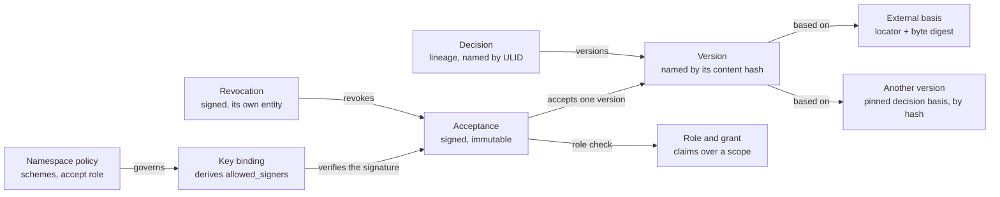
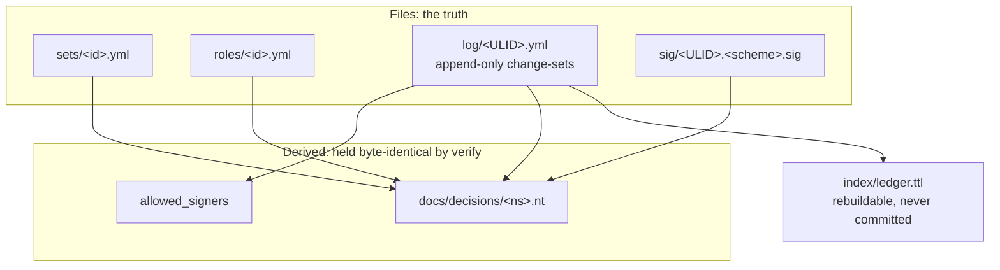

# Decision Ledger Protocol 1.0: Editor's Draft

6 October 2026 · Emil Klein

## Abstract

This document specifies the Decision Ledger Protocol, which makes a decision store verifiable from a repository alone. It is the normative specification of the store's file format, its canonical form and hashes, its signatures, its authority records, the verification gate and the committed export. A companion document specifies the server-client protocol that carries reads and signed writes between a decision server and its clients. Requirements that are ruled but not yet implemented are marked as such.

## Status of This Document

*This section describes the status of this document at the time of writing.*

This is an Editor's Draft dated 6 October 2026. It is written in the form of a W3C specification. It is not a W3C publication, has not been submitted to W3C or to the IETF, and has no standing at either.

This document is the normative specification of the decision ledger's format as of the pull request that absorbed the former format document into it (ruling 22 of 6 October 2026). It is normative for `format: 1` through `format: 7` and incorporates the format specification through its revision v1.8 (Appendix B.1). There is no other normative text for the ledger.

Requirements marked **Not implemented** are ruled but have no implementation yet. They bind a conforming implementation only once they are implemented and the change that implements them removes the mark. Every requirement without that mark describes behaviour the reference implementation has today. Working names that no ruling has fixed are marked **Open**.

Every schema change is a `format` bump with a migration note in Appendix C, added in the same change that makes it. Validation is always against the format an entry declares.

Comments are raised as issues in the repository that hosts this specification. Rulings on its content are the principal's.

## 1. Conformance

Sections 3 to 11 are normative unless marked otherwise. Section 2, sections 12 to 14 and the appendices are non-normative, except Appendix C, whose notes are the normative migration record. Notes, examples and rationale paragraphs inside normative sections are non-normative.

- **Sources.** The rulings of 1, 2, 4, 5 and 6 October 2026, and the format document this text absorbed, whose revisions are listed in Appendix B.1. Where this text and a ruling differ, the ruling wins until the text is corrected.
- **Authority.** The specification and its test vectors are authoritative. Every implementation conforms to them, including the first one. Where this document and the reference implementation disagree, this document wins.
- **Audience.** An implementer building a second implementation, working from this document and its test vectors alone.
- **Keywords.** The key words MUST, MUST NOT, SHOULD and MAY are to be interpreted as described in BCP 14 (RFC 2119, RFC 8174) when, and only when, they appear in capitals.
- **Requirement ids.** `LP-n.m` for the ledger protocol, `SC-n.m` for the server-client protocol, `CF-n` for conformance. In `LP-n.m`, `n` is the section and `m` is a sequence number within it, not a subsection number. Ids are never reused or renumbered, so their order in the text need not be numeric.
- **Not implemented.** Marks a requirement that is ruled but not implemented. See the Status section.
- **Open.** Marks a working name or form that no ruling has fixed.
- **SPARQL and SHACL.** Normative as definitions. No requirement obliges an implementation to run them.
- **Informative citations.** Citations of the PRDs and of the way-of-working document give rationale only and are marked *informative* (ruling 37). Anything an implementation needs is stated in this document.
- **Two protocols.** This document is the ledger protocol. The server-client protocol is a separate document. They are versioned separately, and the second states which versions of the first it carries.

| Profile | Binds | Role |
| --- | --- | --- |
| **W** writer | Ledger protocol | Files entities, signs acts, regenerates derived files. |
| **V** verifier | Ledger protocol | Decides validity of a store from the repository alone. |
| **R** reader | Ledger protocol | Consumes the export only. |
| **S** server | Both | Defined in the server-client protocol. A server is also a verifier. |
| **C** client | Both | Defined in the server-client protocol. A client is also a writer. |

Not protocol: command names, flags, prompts, message text, how a server stores its index, and how a hosted server obtains a signature. The outcomes a verifier reports, including their exit statuses where it reports through one, are protocol (section 8.5).

**The verifier profile is the whole of section 8** (ruling 31): the file gate, the graph stage, the derived-file stages, and the export check of section 9.2 (LP-9.13). A verifier that runs the file gate alone does not conform (LP-8.6). The file format, the canonical form, the hashes, the signatures and the file gate (sections 3 to 5, 8.1 to 8.5 and 8.7) are what a writer or reader of the format reproduces.

### Terminology

| Term | Definition |
| --- | --- |
| Store | The `.decisions/` directory of a git repository, holding one or more namespaces. |
| Entity | One item of one entity list in a change-set file, a change-set's header fields taken together, a set file, a role file, or a signature sidecar (section 8.7). |
| Change-set | One log file. It records one act, which may file several entities. |
| Decision | A lineage of versions identified by `dec:<namespace>/<ULID>` and linked by `parent`. It MAY carry a key (section 3.5). |
| Version | One hashed statement of a decision, identified by its content hash. |
| Act | Filing, revising, superseding, accepting, revoking, reviewing, binding a key or changing policy. |
| Holder | A human identity that holds a live grant. |
| Claim | A capability in the closed vocabulary that a role may exercise. The format calls it a capability (`may`). |
| Basis | What a version rests on: a token in its `based_on` list. A pinned basis names another version or an external basis by hash (section 7). |
| Foundation | The transitive closure of a version's pinned bases. |
| Pin | A declared dependency on another namespace: a trusted-source declaration naming that namespace and the key material that verifies its acts, and no server or location (ruling 42, section 7.5). Not to be confused with a pinned basis token. |
| Finding | A gate class id and the subject it is reported against. |
| Notice | A statement a verifier reports that is not a finding and does not fail verification. |
| Test case | An input and its expected result, described in a manifest. |

## 2. Model at a glance

*This section is non-normative.*

A decision has identity independent of any repository, content-addressed versions, and an acceptance that signs a **hash**, never an id. That is the property that makes acceptance mean something: it names an exact state, not "whatever this decision currently says". Every rule in this document exists to keep that property true across machines, platforms, and independent implementations.

**An acceptance covers a statement and its bases through one hash**



*ledger entities · 9 kinds, 8 references*

An acceptance signs one version hash. That hash covers the version's bases, so the signature reaches the whole foundation without naming it. Authority sits beside the content: the role check and the key binding decide whether the signature counts.



## 3. Store, identity and lexical forms

A store is a directory of files in a git repository, and the files are the truth. Every graph, index and export is a read model over them.

- **LP-3.1** (W, V) Every entity MUST be a file, or an item of an entity list in a file. No fact may exist only in a read model.
- **LP-3.2** (V) A store MUST be verifiable from the repository and its git history alone. A verifier MUST NOT fetch anything.
- **LP-3.3** (W, V) A version is identified by its content hash. A decision is identified by `dec:<namespace>/<ULID>`. Every other log entity is identified by a ULID with its type prefix (section 3.3). A set and a role are identified by an id of the set-id form, which is also the stem of their file. A `set:` grant scope names a set by that id, so it accepts every valid set id, dots included (ruling 59).
- **LP-3.4** (W, V) Hashed content is strings only. A floating-point value is a schema fault. An explicit `null` is absent. A flag is hashed as the string `"true"` when set and omitted otherwise. An integer field of a payload is hashed as its decimal string (section 4.6). The one numeric field in the format, `format`, is not hashed.
- **LP-3.5** (W, V) An entity is immutable once landed. Every change is a new entity. The one exception is a log file's `format:` declaration, which MAY be raised to the lowest format its content needs, with nothing else in the file changed (LP-3.16).
- **LP-3.6** (W, V, R) An identity is an email address (section 3.4). It is stored and hashed as the bare address, and emitted in the export as a `mailto:` IRI.
- **LP-3.7** (W, V) A model is never a holder. An identity that denotes a model or a CI system (LP-3.22) MUST be refused as an acceptance's actor, an escape's `accepted_by`, a judgment's `actor`, and every identity an authority record attributes an act to or gives authority to (LP-8.9 `L006`, `L010`; LP-8.16). Who filed a change-set or a decision (`created_by`) is not refused: a model may author.
- **LP-3.8** (W, V) **Not implemented.** A namespace has no identity outside itself. A reference into another namespace has one form: a pinned token (section 7.3) under a declared dependency, a pin (section 7.5). This holds inside a repository as it does across servers (ruling 41). Until pins are implemented, LP-3.18's free reference is what the format does.
- **LP-3.9** (W, V) A decision key matches `^[A-Z][A-Za-z0-9]{0,63}$`. It is hashed, unique among live decisions of a namespace, and immutable along a decision's chain. A superseded decision's key is free for its successor, which MAY carry it.

### 3.1 Store layout

```
.decisions/
  sets/<set-id>.yml           declared scope: floor, ground, owner
  roles/<role-id>.yml         declared role, written once (format 6)
  log/<changeset-ulid>.yml    append-only; the source of truth
  sig/<ulid>.<scheme>.sig     one signature sidecar per scheme (format 7)
  allowed_signers             derived from key bindings; never edited
  index/                      gitignored; rebuildable cache
docs/decisions/<ns>.nt        the committed export of a namespace
```

| Path | Holds |
| --- | --- |
| `.decisions/sets/<set-id>.yml` | One set per file (section 5.2) |
| `.decisions/roles/<id>.yml` | One role per file (section 5.6) |
| `.decisions/log/<ulid>.yml` | One change-set per file (section 5.3) |
| `.decisions/sig/<ulid>.<scheme>.sig` | One signature sidecar per scheme (section 4.8) |
| `.decisions/allowed_signers` | The derived trust file (section 4.9) |
| `.decisions/index/` | The rebuildable graph index (section 9.1) |
| `.decisions/basis/<sha256>` | **Not implemented, open.** Held basis bytes, named by their digest (section 7.4) |
| `docs/decisions/<ns>.nt` | The committed export of a namespace (section 9) |

- **LP-3.10** (W, V) Files are read with either `.yml` or `.yaml`. Writers emit `.yml`.
- **LP-3.11** (W, V) A log file is written once and never edited. A correction is a new version; a reversal is a revocation.
- **LP-3.12** (V) The file stem MUST equal the id the file declares: `<ulid>.yml` for a change-set whose `id` is `cs:<ulid>`, `<set-id>.yml` for a set, `<role-id>.yml` for a role. A disagreement is a schema fault.
- **LP-3.13** (W) The `index/` directory is a rebuildable cache and is never committed. A store keeps it out of version control so that a rebuild cache can never be committed by accident.

### 3.2 Format declarations

- **LP-3.14** (W, V) Every file declares its `format`. Validation is always against the format an entry declares, never against the newest one. An unknown `format` is a schema fault.
- **LP-3.15** (W, V) A file declares a format in which every field and shape it holds is valid, and a writer declares the lowest such format (ruled 2026-10-05). Two declarations are schema faults:
  - **below what a field needs.** A field or scheme introduced at format N (`merged_from` 2, the `contract:` scheme 3, `revisit_if` 4, `key` and `exported: true` 5, the authority records 6, `under` and policies 7) in a file declaring a lower format;
  - **at or above the format that retired a shape the file uses.** For example, a legacy revocation (`acceptance`, `by`) in a file declaring format 6 or above, the format that retired that shape (section 5.6).

  A higher declaration is otherwise not a fault.
- **LP-3.16** (W, V) A landed file's `format:` may be corrected (ruled 2026-10-05, #81). `format` is not an entity and not hashed content, so changing it alone changes nothing the record fixed. A correction may only **raise** the declaration, only **to the lowest format the file's content needs**, and nothing else in the file may change in the same edit. Any other change is judged entity by entity (LP-8.30). Lowering a declaration, or raising it past what the content needs, is not a correction.

| Format | Introduced | Spec revision |
| --- | --- | --- |
| 1 | the set file, the change-set file, the canonical form | v1.0 |
| 2 | `merged_from` on a version | v1.3 |
| 3 | the `contract:` discharge scheme | v1.4 |
| 4 | `revisit_if` on a version | v1.5 |
| 5 | `key` and `exported` on a version | v1.6 |
| 6 | the authority records and the `rev:` revocation entity | v1.7 |
| 7 | `under`, `at` in the policy payload, signature sidecars | v1.8 |

### 3.3 Identifiers and lexical forms

```
dec:<namespace>/<ulid>     a decision, stable forever
cs:<ulid>                  a change-set
acc:<ulid>                 an acceptance
sha256:<64 lowercase hex>  a version hash
```

| Thing | Form |
| --- | --- |
| Hash | `sha256:` followed by 64 lowercase hex digits. A short form of the first 12 hex digits exists for display only and is never compared. |
| ULID | 26 characters of Crockford base32, `[0-9A-HJKMNP-TV-Z]{26}`, first character at most `7` |
| Entity ids | `dec:<ns>/<ULID>`, `cs:<ULID>`, `acc:<ULID>`, `grant:<ULID>`, `gacc:<ULID>`, `unav:<ULID>`, `avail:<ULID>`, `rev:<ULID>`, `key:<ULID>`, `pol:<ULID>`; **not implemented:** `basis:<ULID>` |
| Set id, role id | lowercase ASCII letters, digits, dashes and dots, at least one character |
| Namespace | dot-separated segments, each of lowercase ASCII letters, digits and dashes, none empty |
| Scope | `*`, `ns:<namespace>`, `set:<set-id>` or `pattern:<id>` |
| Grant order | `primary` or `fallback-N`, N from 1 |
| Instant | RFC 3339 UTC in whole seconds with `Z`, for example `2026-10-04T09:00:00Z` |
| Date | `YYYY-MM-DD` |
| Boolean-valued field | The string `true` when set, absent otherwise |
| Decision key | `^[A-Z][A-Za-z0-9]{0,63}$` |

- **LP-3.17** (W, V) A ULID is 26 characters of Crockford base32 (`0123456789ABCDEFGHJKMNPQRSTVWXYZ`: `I`, `L`, `O`, `U` excluded). The first character MUST NOT exceed `7`; above that overflows the 48-bit millisecond timestamp field. A ULID is generatable offline and sorts lexicographically by creation time.
- **LP-3.18** (W, V) A namespace is an *owning scope*, not a repository path. Repositories may reference decisions in namespaces they do not own. *Implemented. Superseded by ruling 41 once pins exist: a reference into another namespace then takes the one form of LP-3.8.*
- **LP-3.19** (W, V) A decision id is permanent. Supersession mints a new id carrying a `supersedes` edge; it never mutates or reuses one.
- **LP-3.20** (W, V) A decision's namespace is not restated as a separate field. It is inside the id, and a second spelling of one fact is a second thing that can disagree.
- **LP-3.24** (W, V) Every instant in hashed content is RFC 3339 UTC in whole seconds with `Z`. Every date is `YYYY-MM-DD`.

### 3.4 Identities

An identity is an **email address**, normalised to lowercase at parse. The PRD (informative) requires `accepted-by` to *resolve* to a human identity; an address resolves, a display name decorates. Comparing addresses also makes the blame check (`L009`) robust against the punctuation and whitespace drift real `user.name` values carry.

- **LP-3.21** (W, V) An identity has exactly one `@`, a non-empty local part and a non-empty domain, and no whitespace. A dotless domain is legal. It is normalised to lowercase at parse.
- **LP-3.22** (W, V) **Model and CI identities are refused as acceptors** (`L006`). An identity is refused when any of the following holds:
  1. it is a listed vendor no-reply address (`noreply@anthropic.com`, `noreply@openai.com`, `noreply@github.com`, `noreply@google.com`);
  2. it contains the literal `[bot]`;
  3. its domain is `github-actions.*`;
  4. its local part is one of `actions, automation, bot, build, cd, ci, dependabot, do-not-reply, github-actions, gitlab-ci, jenkins, no-reply, noreply, renovate, robot`;
  5. its local part contains, as a **whole token** (split on non-alphanumerics, trailing digits stripped), one of `agent, ai, aider, chatgpt, claude, codex, copilot, cursor, devin, gemini, gpt, llama, llm, mistral, model`.
- **LP-3.23** (V) The list of LP-3.22 is a floor, not a proof.

Whole-token matching is deliberate: `claudia@` and `alain@` are people. `ai@` is refused and the false positive is accepted knowingly. The person uses a fuller address; accepting a model is the worse error by a wide margin.

The list catches the identities a CI system or an agent harness produces *by default*, which is where the failure actually occurs. It cannot catch a model configured with a human-looking address. That gap is closed by review, and by `L009`.

### 3.5 The decision key and the export flag (format 5)

Spec v1.6 (2026-10-02; the ledger CLI PRD §4 as amended 2026-10-01, informative; ruling 2). Two optional version fields:

- **`key`**: the decision's stable human name, the string the analyzers' generator turns into a type name. It matches `^[A-Z][A-Za-z0-9]{0,63}$`; anything else is a `SCHEMA` fault at parse.
- **`exported`**: `true` makes the decision citable from other namespaces. Absent means `false`; an explicit `false` reads as absent.

- **LP-3.25** (W, V) **Immutable once given** (`L013`). A version MUST carry the key its `parent` carries, and the key its `merged_from` carries, whenever that predecessor has one. Giving a keyless decision a key is legal. It is a new version, so the hash moves and the version needs re-acceptance.
- **LP-3.26** (W, V) **Unique among live decisions per namespace** (`L014`). Take each decision's latest version (LP-8.11); drop decisions some other decision's latest version `supersedes`; no two of the rest in one namespace (the namespace inside the id) may carry the same key. A superseded decision's key is therefore free for its successor.
- **LP-3.27** (V) Both rules are file-gate classes, not graph-only: a generated type name depends on each, so an importer of this format MUST enforce them. `L014` also has a graph-stage cross-check (`G006`, section 8.6), which is never its only home.
- **LP-3.28** (W, V) A change-set declares `format: 5` only when one of its versions carries a `key` or `exported: true`; a lower-format file carrying either is a schema fault.
- **LP-3.29** (W, V) `key` joins the hashed field set as a string; `exported` as the string `"true"` when set and nothing when false. Absent keys are omitted, so every version written before format 5 canonicalises to the same bytes and the prefix stays `ledger.decision-version.v1`.

### 3.6 Namespace independence

All of section 3.6 is **not implemented**. Where the implemented format behaves otherwise, it is described where it is specified, with the ruling that will supersede it.

- **LP-3.30** (W, V) **Not implemented.** A namespace verifies the same wherever it sits (ruling 32). Sharing a repository with another namespace changes no rule, so a namespace can be moved to another repository by moving its files: no hash changes, no reference changes form, and both sides still verify. Coupling between namespaces is kept as low as it can be made.
- **LP-3.31** (W, V) **Not implemented.** Only `based_on` crosses a namespace. `supersedes` never names a decision in another namespace (ruling 43). *The implemented format does not refuse it: `G001` asks only that a `supersedes` target is a decision filed anywhere in the store, so a cross-namespace `supersedes` inside one store passes (established by reading).*
- **LP-3.32** (W, V) **Not implemented.** Only a decision marked `exported` (section 3.5) can be pinned from another namespace (ruling 44). *Nothing in the implemented format pins, and `exported` gates nothing: it is read only by the format rule of LP-3.28 and by the export (established by reading).*
- **LP-3.33** (W, V) **Not implemented.** No file holds entities of two namespaces (ruling 45). *The implemented format does not refuse it: no rule compares the namespaces of a change-set's entries, and the export restricts each change-set to one namespace's entries (LP-9.11), which presumes such files. Grants of scope `*` and role files belong to no namespace at all. No committed change-set in this repository holds two namespaces (established by reading).*

## 4. Canonical form, hashing and signatures

One function of an entity's closed field list yields the bytes that are both hashed and signed. Everything about integrity follows from that.

**YAML is the file format; canonical JSON is the hash form.** Routing through a second, restricted serialisation is what makes "a formatting-only edit leaves the hash unchanged" structural rather than a rule someone must remember: quoting style, key order, indentation, comments, line endings and `null`-versus-absent all disappear in the parse, before anything is hashed. It also removes YAML's ambiguity (anchors, tags, four multi-line scalar styles) from the surface a second implementation has to reproduce.

### 4.1 Two versions

Two versions carry the load:

| Version | Governs | Bump when |
|---|---|---|
| `format` | how a *file* is read | a field is added, removed, or re-shaped |
| `CANONICAL_FORM` (section 4.4) | how a *hash* is computed | a hashed field changes meaning |

- **LP-4.15** (W, V) The two versions are independent. A `format` bump that leaves hashed semantics alone keeps every existing acceptance valid. A `CANONICAL_FORM` bump does not, and is therefore a governed act, not a fix. It is required whenever a hashed field changes meaning, gains or loses membership in the hashed set, or is normalised differently.

### 4.2 Hashing

- **LP-4.1** (W, V) An entity's hash is SHA-256 over the canonical serialisation of its closed field list, domain-separated by the prefix of its kind (sections 4.4 and 4.6).
- **LP-4.2** (W, V) A field is hashed when present and omitted when absent. Adding an optional field MUST NOT move any existing digest.
- **LP-4.3** (W, V) The canonical form is `v1`, carried in the version prefix `ledger.decision-version.v1`. A change that moves a digest is a new canonical form and requires a ruling.
- **LP-4.4** (W, V) A set-valued field is serialised in one defined order with duplicates removed (LP-4.18 step 4).

#### The hashed field set of a version

- **LP-4.16** (W, V) A version's hashed field set is exactly these keys, and no others:

```
decision · parent · merged_from · set · statement · allocation ·
discharge · discharge_stage · actor · expectation · exposure ·
accepted_by · review_by · tolerance_floor_at_creation ·
tolerance_override · based_on · revisit_if · supersedes · key · exported
```

`merged_from` joined the set at spec v1.3 (`format: 2`), `revisit_if` at spec v1.5 (`format: 4`), and `key` and `exported` at spec v1.6 (`format: 5`; `exported` canonicalises as `"true"` or is omitted). Because an absent key is omitted from the canonical object (LP-4.18 step 3), every version written before either field existed canonicalises to the same bytes as before: no digest moved, no acceptance was invalidated, and `CANONICAL_FORM` stays `v1`.

Outside the hash: the `hash` field itself (including it would be circular), everything at change-set level (`format`, `id`, `created_at`, `created_by`, `parents`, `note`), and all acceptances and revocations.

- **LP-4.17** (W, V) **Both tolerance inputs are hashed, not the resolved tier.** A `T0` floor with a `T2` override and a native `T2` floor both resolve to an effective `T2`, but they are different provenance and must not collide. That is what keeps override-rate-per-set (PRD §10, informative) computable from hashed content.

**Not implemented.** The basis rulings add `source_prefix`, `source_method` and `source_keys` to the version (section 5.7). Under LP-4.16 they are schema faults today. Each joins the hashed set, hashed when present and omitted when absent, by a format amendment with its migration note.

### 4.3 The algorithm

- **LP-4.18** (W, V) A version's canonical JSON is computed as follows.

1. Parse the file. Take only the hashed field set.
2. **Normalise every string**, in this order:
   a. replace `\r\n` and lone `\r` with `\n`;
   b. normalise to Unicode NFC;
   c. strip leading and trailing ASCII whitespace: space,
      `\t`, `\n`, `\f` and `\r`. Vertical tab (`\v`) is not stripped.
3. **Treat as absent**: a missing key, an explicit `null`, an empty
   collection, and any string that step 2 reduces to the empty string. Absent
   keys are omitted from the object; there is no `null` in the canonical form.
4. **List fields are sets.** `discharge`, `based_on` and `revisit_if` are rendered as their
   members' canonical string forms, deduplicated, then sorted ascending by
   Unicode code point. Reordering a list in a file is formatting.
5. Emit a JSON object with keys sorted ascending by Unicode code point, with
   no insignificant whitespace and no trailing newline. Keys in this format
   are ASCII, where code-point order coincides with RFC 8785's UTF-16
   code-unit order.
6. Strings are escaped per RFC 8785: the two-character forms `\" \\ \b \f \n
   \r \t` where they exist, `\u00XX` for other control characters, and every
   other character emitted literally as UTF-8.
7. **No floating-point value may appear in hashed content.** A float is a
   schema fault. This removes RFC 8785's entire number-serialisation problem;
   the only numeric field in the format (`format`) is not hashed.
8. Dates are `YYYY-MM-DD`. No timestamp is hashed, so time-zone
   normalisation never arises.

Step 8 speaks of the version. The payloads of section 4.6 do hash instants, in the one form of LP-3.24.

Step 2c follows the reference implementation (ruling 33). The absorbed format document listed `\v` among the stripped characters; the implementation never stripped it, so no digest moves. This is the one place where the canonicalisation text departs from the absorbed format document (Appendix B).

### 4.4 The digest

```
version_hash = "sha256:" + lowercase_hex(
    SHA-256( "ledger.decision-version.v1" ‖ 0x0A ‖ canonical_json_utf8 )
)
```

- **LP-4.19** (W, V) The prefix is domain separation **and** a version pin. A future entity type gets its own prefix and can never collide. A `format` bump that changes what a hashed field *means* MUST bump the prefix to `.v2`, with a migration note. Otherwise acceptances signed under the old reading would silently re-point.
- **LP-4.20** (V) A short form (first 12 hex characters) exists for display only and is never compared.

### 4.5 Conformance vector

- **LP-4.21** (W, V) A second implementation MUST reproduce both of these exactly.

Input (a version with `parent`, `discharge_stage`, `actor`, `expectation`,
`exposure`, `accepted_by`, `review_by`, `tolerance_override` and `supersedes`
all absent):

```yaml
decision: dec:hafeok.ledger/01K2C4YQJ3F8M0PT5W7NZ9RDXV
set: ledger-design
statement: Monetary amounts use decimal, never double.
allocation: constraint
discharge: [analyzer:DEC001-no-float-money]
tolerance_floor_at_creation: T1
based_on: [prd:decision-ledger-prd#4.2.1]
```

Canonical JSON (one line, shown wrapped):

```
{"allocation":"constraint","based_on":["prd:decision-ledger-prd#4.2.1"],
"decision":"dec:hafeok.ledger/01K2C4YQJ3F8M0PT5W7NZ9RDXV",
"discharge":["analyzer:DEC001-no-float-money"],"set":"ledger-design",
"statement":"Monetary amounts use decimal, never double.",
"tolerance_floor_at_creation":"T1"}
```

Digest:

```
sha256:ac2a68023018391550b542b1f093104f1f32115d3603e2fda9c37805875437cc
```

The reference implementation's committed fixture stores are further vectors: their stored hashes are real, and a canonicalisation change makes every one of them fail. They are candidates for the test suite of section 11 and bind no one until approved (CF-7).

### 4.6 Payloads beyond the version

- **LP-4.22** (W, V) Each hashed record other than a version is a **closed payload** canonicalised by LP-4.18's law (strings normalised, absent keys omitted, lists as sets, keys code-point sorted, compact) and digested exactly as section 4.4, under its own prefix. The stored `hash` is never inside its own payload.

| Entity | Prefix | Closed field list |
| --- | --- | --- |
| Version | `ledger.decision-version.v1` | LP-4.16 |
| Acceptance | `ledger.acceptance.v1` | `decision`, `version`, `actor`, `at`, `scope` (wire form: `version` or `class:<ref>`), `expires_at` (`YYYY-MM-DD`), `under` |
| Revocation | `ledger.revocation.v1` | `revokes`, `actor`, `at`, `reason`, `under` (the PRD §7 closed payload, informative; `at` as RFC 3339 UTC seconds, LP-3.24) |
| Grant | `ledger.authority-grant.v1` | `id`, `role`, `scope`, `holder`, `granted_by`, `order`, `limits` (set), `genesis` (`"true"` or absent), `external_ref`, `supersedes`, `under` |
| Key binding | `ledger.identity-binding.v1` | `id`, `act`, `principal`, `namespace`, `key_type`, `key`, `closes`, `self_bound` (`"true"` or absent), `mandate`, `by`, `at`, `under` |
| Namespace policy | `ledger.namespace-policy.v1` | `id`, `namespace`, `schemes` (set), `require_sk` (`"true"` or absent), `accept_role`, `reaccept_within_days` (its decimal string), `replaces`, `by`, `under`, `at` |
| Basis entity | **Not implemented, open:** `ledger.basis.v1` | `{locator, digest}` |

- **LP-4.23** (W, V) A legacy revocation (formats 1 to 5) has no stored hash. Its payload is still computable from `{acceptance, by, at, reason}` read as `{revokes, actor, at, reason}`.
- **LP-4.24** (W, V) An acceptance's digest is computed, never stored. Acceptances carried none before v1.8, so none moves. The digest of an acceptance's or revocation's payload is that entity's content hash (LP-5.3).

What is outside each payload: the stored `hash` itself, and the record's own `at` except on a revocation, an acceptance, a key binding and a policy. A grant's `at` is outside its payload (signing grants is tracked in #82). `under` is in every payload that names it, hashed when present and omitted when absent, so no digest filed before it moves.

Every instant is RFC 3339 UTC in whole seconds with `Z` (`2026-10-04T09:00:00Z`).

### 4.7 The signed bytes

- **LP-4.5** (W, V) The signed bytes are exactly the bytes the content hash is computed over:

```
signed_bytes = UTF-8(prefix) || 0x0A || canonical_json_bytes
digest       = "sha256:" || lowercase_hex(SHA-256(signed_bytes))
```

`prefix` is the payload's prefix from section 4.6 (no trailing space), `0x0A` one line feed, and `canonical_json_bytes` the payload under LP-4.18's law, UTF-8, compact. Example: an acceptance of `dec:fixture.ledger/01K…` with no expiry and no `under` signs the bytes
`ledger.acceptance.v1\n{"actor":"owner@customer.example","at":"2026-10-04T09:00:00Z","decision":"dec:fixture.ledger/01K…","scope":"version","version":"sha256:…"}`.

### 4.8 Sidecars and schemes

Spec v1.8 (#70; rulings D1 to D4 of #65 and D5 to D9 of 2 October 2026). A namespace's policy says when a signature is required (D1); a signature is a sidecar (D2); the schemes are `ssh`, `dsse` (verified, never signed by the reference writer) and `none` (D4).

- **LP-4.6** (V) Whether a signature is required is read from namespace policy, never from a tier.
- **LP-4.7** (W, V) A signature is a sidecar at `.decisions/sig/<ulid>.<scheme>.sig`, where `<ulid>` is the ULID of the entity it signs, one per scheme. A verifier MUST verify every sidecar present. A sidecar whose name is not `<ulid>.<ssh|dsse>.sig`, or which names no signable entity, is a schema fault.
- **LP-4.8** (W, V) The inline acceptance field `signature` is retired. It MUST be empty in every format, and any value is a schema fault.
- **LP-4.25** (W, V) The **signable entities** are the acceptance, the revocation of an acceptance (a grant's revocation is signed with the grant, #82), the key binding, and the policy change. Each is signed by:

| Entity | Signer | Signature namespace |
|---|---|---|
| acceptance | its `actor` | the decision's namespace |
| revocation of an acceptance | its `actor` | the revoked acceptance's namespace |
| key binding | its `by` (section 4.10) | its `namespace` |
| policy change (`replaces` present) | its `by` | its `namespace` |
| first policy (no `replaces`), when its `by` held a trusted key at its position (2026-10-05, #96) | its `by` | its `namespace` |

- **LP-4.26** (W, V) `<ns>` in a signature namespace is the ledger namespace of the store that holds the entity, never a parameter and never derived from the principal.

| Scheme | Rule |
| --- | --- |
| `ssh` | LP-4.27 |
| `dsse` | LP-4.28 |
| `none` | LP-4.29 |
| `webauthn` | Reserved. Defined by a later decision. **Not implemented.** |

- **LP-4.27** (W, V) **`ssh`.** An SSHSIG signature [SSHSIG] over the signed bytes, made with the signature namespace `ledger-accept@<ns>`. It verifies when it is valid for the signer's identity under that namespace against the allowed-signers text (section 4.9) restricted to trusted bindings (section 4.10), evaluated at the entity's own `at` (a policy change's too, D8).
- **LP-4.28** (V) **`dsse`.** A sidecar holds one DSSE envelope [DSSE] with `payloadType` `application/vnd.ledger.signed-bytes.v1` and `payload` the base64 of the signed bytes. A signature verifies when it is ed25519 over DSSE's PAE by an `ssh-ed25519` key the signer has bound in the namespace, open at the entity's `at`. The reference writer verifies DSSE and never produces it.
- **LP-4.29** (W, V) **`none`.** No sidecar. Exclusive: a policy lists `none` alone or not at all (ruled 2026-10-04, amending D4). `none` means governed and unsigned: role-checked (`A006`), not signature-checked. It is not restricted to stores that predate signing.

**Example (non-normative).** With OpenSSH, the `ssh` scheme signs with `ssh-keygen -Y sign -f <key> -n ledger-accept@<ns>` over the signed bytes, and verifies with `ssh-keygen -Y verify -f <allowed_signers> -I <signer> -n ledger-accept@<ns> -s <sidecar> -Overify-time=<at>`, where `<at>` is the entity's `at` in the form `YYYYMMDDhhmmssZ`. The sidecar is the armored signature that command writes.

**Example (non-normative).** A `dsse` sidecar:

```json
{"payloadType": "application/vnd.ledger.signed-bytes.v1",
 "payload": "<base64 of the entity's signed bytes>",
 "signatures": [{"keyid": "key:<ulid>", "sig": "<base64>"}]}
```

- **LP-4.30** (V) **Requirement.** The policy in force for the namespace at the entity's position (section 8.7), or for a policy change the policy it replaces (D1), lists the required schemes. Under `[none]` an entity needs no sidecar; under any other policy each listed scheme needs one. A policy listing `none` with another scheme is a schema fault, and a writer refuses to file one. A sidecar that is present always has to verify. An acceptance or revocation before its namespace's first policy is not checked (D5 (c)). **A key binding is never exempt** (ruled 2026-10-05, narrowing D5 (c)): one before its namespace's first policy is judged by D7 and by **that first policy's** requirement (section 4.10).
- **LP-4.9** (W, V) A policy change MUST be signed under the policy in force before it, which is the policy it replaces.
- **LP-4.31** (V) **A namespace's first policy** (2026-10-05, #96) replaces nothing, so no policy is in force before it. It is judged under **its own** schemes, and only when its `by` held a live trusted key at its position: bound in this namespace (in the same change-set, dated with the policy, when the namespace is opened) or in another, which for this check alone stands in this namespace as it does for the genesis holder's later first binding (section 4.10). Then a missing or invalid signature is `L011`. A first policy filed before its author held any trusted key needs none, and stands unsigned. *Superseded by ruling 47 once implemented: a key trusted in another namespace then has no effect here (LP-6.31).*

### 4.9 Trust file

- **LP-4.10** (W, V) `allowed_signers` is derived from key-binding entries. A verifier MUST regenerate it and require the committed file to be byte-identical.
- **LP-4.11** (W, V) Key bindings are append-only: add, rotate and revoke are new entries.
- **LP-4.32** (W, V) The file has one line per key window, in OpenSSH's allowed-signers form, so that an SSHSIG verifier reads it directly:

```
<principal> namespaces="ledger-accept@<ns>",valid-after="<YYYYMMDDhhmmssZ>"[,valid-before="<…>"] <key_type> <key>
```

  - Options are comma-separated, as OpenSSH's grammar requires.
  - `<principal>` is the bare address.
  - `valid-after` is the opening binding's `at`. `valid-before` is the `at` of the earliest `rotate` or `revoke` that closed its **key**, in any namespace, since a close ends the key, not the binding (ruled 2026-10-06, section 4.11). So every line of a closed key carries the end date.
  - Only bindings that open a window (`add`, `rotate`) give a line, and only **trusted** bindings are written (section 4.10). An unsigned or wrongly signed binding never reaches the file.
  - Lines are sorted by code point, joined by LF, and the last line ends with one LF.
  - *Superseded by ruling 47 once implemented: `valid-before` then comes from a close in the binding's own namespace (LP-6.31).*
  - The lines follow a two-line header, each line ending with LF:

```
# Derived from the key-binding entries in .decisions/log by `ledger identity`.
# Never edit by hand: `ledger verify` holds this file byte-identical to the log.
```

  - When no trusted binding opens a key, there is no file.
- **LP-4.33** (V) A verifier re-derives the file and fails a **`[SIGNERS]`** stage when the committed bytes differ, when the log binds keys and no file is committed, or when a file is committed and the log binds none. The stage is outside the file gate's classes, like the export stage.

v1.7 wrote the options space-separated, which OpenSSH refuses as an invalid key. v1.8 corrected the derivation, and no committed store carried the file.

### 4.10 Trusted bindings and the first key (D7)

- **LP-4.34** (V) Key bindings are judged first, in order (section 8.7). A binding is **trusted** when its filer is one D7 allows and, where the policy in force requires a signature, its signature verifies against the bindings already trusted.
- **LP-4.35** (V) **Before the first policy** (ruled 2026-10-05). A binding before its namespace's first policy (D6: landed no later, dated earlier) is judged by D7 and by the requirement of that first policy, as if it were in force. Signed, it is trusted. Unsigned where that policy requires a signature, it is `L011` and never trusted. Under a `[none]` first policy, D7 alone decides it. A binding in a namespace no policy governs at all is a schema fault. **Every filed binding is trusted or named by a finding**; none is left silently untrusted.
- **LP-4.12** (V) D7 allows these filers:
  - the genesis holder's **self-bound** first binding in the store, carrying the genesis grant's `external_ref` as `mandate`, signed by the key it binds. Once per store: in any later namespace the genesis holder's first binding is their own `add`, signed by a key of theirs already trusted in another namespace (for that check alone, that key stands in the new namespace). A key trusted elsewhere vouches for that **first** binding only, never a further `add` (ruled 2026-10-05). Otherwise a key closed in one namespace and live in another could re-enter the namespace it was closed in. So a further key dated before the opening binding, which would turn that binding into a further `add`, is refused. *Superseded by ruling 47 once implemented: the self-bound first binding is then once per namespace, and a key trusted in another namespace vouches for nothing here (LP-6.31);*
  - a principal's **first key** (no open window in the namespace) is filed and signed by the genesis holder: `by` the genesis holder, `principal` the new holder, `under` the genesis grant;
  - every further `add`, and every `rotate`, is the principal's own, signed by a live key of theirs (a `rotate` by the key it closes);
  - a `revoke` is the principal's, or the genesis holder's under the genesis grant.
- **LP-4.36** (V) A binding filed by anyone else is a schema fault (D7); one whose required signature does not verify is `L011`. Neither is trusted, and only trusted bindings reach `allowed_signers`.
- **LP-4.37** (W, V) **Which keys may be bound** (ruled 2026-10-06). A binding that opens a key is refused at filing, and at verification it is a schema fault and never trusted, when, against the bindings trusted before it:
  - **the key belongs to another principal**: it is, or was, bound to a different principal anywhere in the store. A key belongs to one principal;
  - **the key is closed** for its principal, in any namespace (section 4.11). A closed key is never bound again, the genesis holder vouching for it as someone's first key included;

  *Superseded in part by ruling 47 once implemented: both bullets then look at the binding's own namespace only (LP-6.31).*
  - **the key is already open** for its principal in that namespace. A key is bound once per namespace. The same key may be bound in another namespace.
- **LP-4.38** (W) **Opening a namespace** (2026-10-05, #96). A writer that opens a namespace files the genesis holder's self-bound binding in the same change-set as the genesis grant and the first policy, dated with the policy (so the policy is in force at it), whenever the genesis holder has no key in the store. The window in which the first self-bound binding to land for the address, anyone's, is the one trusted is then closed by the act that opens the namespace. With no usable key the writer refuses and names what is missing, unless explicitly told to proceed unbound (ruled 2026-10-05); the verifier then says the window is open (LP-8.31). In a **later namespace**, while the genesis holder holds a live key, the writer binds that key there in the same change-set: their own `add`, signed by a key of theirs already trusted, dated with the policy, so they sign in the new namespace with no separate binding act. If every key of theirs is closed, the writer refuses and names the closed keys, unless explicitly told to proceed unbound; then it warns, binds nothing and signs nothing. *Superseded by ruling 47 once implemented: each namespace then has its own genesis grant and its own self-bound first binding, and a later namespace is opened as the first one is (LP-6.31).*

*Note: in the reference writer the genesis holder's key is the one its git configuration names as the signing key, and "proceed unbound" is an explicit option of the command that opens a namespace.*

### 4.11 Closed keys

- **LP-4.39** (V) A close ends the **key**, not the binding (ruled 2026-10-06). Closing any binding of a principal's key, by `rotate` or `revoke`, in any namespace, the target a trusted binding or not, closes that key (the principal and the key) in every namespace of the store, from the close's position (D6). Every signature check considers all bindings of the matched key, never the first it matched; with several closes, the earliest the act is not before decides. The `L011` finding names the namespace the act is refused in, the namespace of the close, and the close. *Superseded by ruling 47 once implemented: a close then takes effect in its own namespace only, and a writer MAY file a close in every namespace it holds (LP-6.32).*
- **LP-4.13** (V) An entity signed by a closed key: dated at or after the close, it fails verification at its `at` (`L011`); landed after the close, whatever its date, it is `L011`; dated and landed before it, an acceptance is a review item ("needs re-acceptance") until a later valid acceptance of the same version by the same actor affirms it, and `L012` once the policy's `reaccept_within_days` deadline (from the close: the key's earliest, in whichever namespace) has passed.
- **LP-4.14** (V, R) An affirmation is a new acceptance under a live key. The reader takes the latest valid acceptance of a version.

## 5. Entities

A store is made of the entity kinds below. The file unit is the act: one change-set file records one thing someone did, and may file several entities in doing it.

| Entity | Identity | Hashed | Signed | What it records |
| --- | --- | --- | --- | --- |
| Set | Set id | No | No | A declared scope: tolerance floor, ground, owner. One file under `sets/`. |
| Change-set | `cs:<ULID>` | No: its fields are outside every hash | No | The act that filed one or more entities. One file under `log/`. |
| Decision | `dec:<ns>/<ULID>` | No | No | The identity object of a lineage of versions, on its first appearance. Superseded decision to decision. |
| Version | Content hash | Yes, `ledger.decision-version.v1` | No | Set, statement, allocation, discharge, tolerance, bases, reopen edges, and optionally key and `exported`. |
| Acceptance | `acc:<ULID>` | Yes, `ledger.acceptance.v1`, computed and never stored | By policy | A holder accepts one version hash, with scope and optional expiry. |
| Revocation, legacy shape (formats 1–5) | The acceptance it revokes | Computable, not stored | No | A revocation of one acceptance, with a reason. Valid only as a pre-policy act. |
| Revocation (format 6) | `rev:<ULID>` | Yes, `ledger.revocation.v1` | By policy, when it revokes an acceptance | A revocation of one grant or one acceptance, with a reason. |
| Role | Role id | No | No | The claims a role may exercise, and its owner. One file under `roles/`, written once. |
| Grant | `grant:<ULID>` | Yes, `ledger.authority-grant.v1` | No (#82) | A role over a scope to one holder at one order. |
| Grant acceptance | `gacc:<ULID>` | No | No (#82) | The holder accepts a grant by its hash. |
| Unavailability | `unav:<ULID>` | No | No | An interval in which a grant's holder does not hold active authority. |
| Availability | `avail:<ULID>` | No | No | The end of an unavailability, by the grant's holder. |
| Key binding | `key:<ULID>` | Yes, `ledger.identity-binding.v1` | By policy | A key added, rotated or revoked for an identity in a namespace. |
| Namespace policy | `pol:<ULID>` | Yes, `ledger.namespace-policy.v1` | By policy | Required schemes, security-key requirement, accept role, re-acceptance deadline. |
| Signature sidecar | `<ULID>.<scheme>` of the entity it signs | No | Is a signature | One signature over one signable entity's signed bytes. |
| Review | ULID | Yes | Yes | **Not implemented.** A holder's verdict on a version: `reject` or `changes-requested`. |
| Basis entity | `basis:<ULID>` | **Open:** `ledger.basis.v1` | No | **Not implemented.** A locator and the digest of the bytes it refers to. |

- **LP-5.1** (W, V) An acceptance is immutable after creation. Nothing is ever added to it, including by a revocation.
- **LP-5.2** (W, V) A revocation is its own entity and names the acceptance or grant it revokes.
- **LP-5.3** (W, V) The digest of an acceptance's or revocation's signed payload is that entity's content hash.
- **LP-5.4** (W) Anyone, including an agent, MAY file a decision, a version or, once implemented, a basis entity. None has effect until a version is accepted.
- **LP-5.5** (W, V) Giving an existing decision a key, a pinned basis or source fields is a new version and needs a new acceptance.
- **LP-5.6** (W, V) **Not implemented.** Interim acceptances from before the ledger are not imported. The holder accepts at import.
- **LP-5.7** (W, V) **Unknown keys are rejected** in every schema. A field nobody reads reads as governance that is not there.

### 5.1 Tolerance

Tiers are ordered `T0 < T1 < T2` (the way-of-working document, §2.2, informative). A set declares a **floor**. A version pins the floor it was created under and may carry an up-only `tolerance_override`:

```
effective_tier = tolerance_override, else tolerance_floor_at_creation
```

- **LP-5.8** (W, V) An override **at or below** the pinned floor is invalid and is rejected at write, not flagged at review (`L004`). Equality is rejected too: it is not "above", and it is a no-op that would only add noise to the hash.
- **LP-5.9** (W, V) The floor is pinned on the version, not read live from the set. Raising a set's floor does not move any existing hash, so acceptances survive, but every member whose effective tier now falls below the new floor is **stranded** (`L005`) until a new version pins the new floor. Entries are never grandfathered.

Without the pin the effective tier is not recomputable after a floor raise, so the hash could not be stable and acceptance-binds-the-tier would be unimplementable. The consequence is intended.

### 5.2 Set file: `.decisions/sets/<set-id>.yml`

```yaml
format: 1
id: ledger-design                       # lowercase alphanumerics, dashes, dots
title: Decision Ledger — the L0 settled design
tolerance_floor: T1                     # T0 | T1 | T2
ground: characterised                   # characterised | uncharacterised
owner: emk@delegate.dk
created_at: 2026-08-10
notes: |                                # optional
  free text
```

The set's `ground` field is the set's characterisation. It is not a basis and keeps its name.

- **LP-5.10** (W, V) **A set does not list its members.** A decision-version names its set; membership is derived by query.

Restating membership in the set file would make every addition a rewrite of a shared file, fighting append-only and conflicting on every branch, for a denominator that comes out the same either way.

The honest limit, which every coverage report must state: coverage is measured against the *enumerated* set, and nothing verifies the set itself.

### 5.3 Change-set file: `.decisions/log/<ulid>.yml`

```yaml
format: 1
id: cs:01K2C4YQJ3F8M0PT5W7NZ9RDXV
created_at: 2026-08-10T09:14:22Z        # RFC 3339
created_by: emk@delegate.dk             # who performed the act, not who signs
parents: [cs:01K2C4M...]                # optional
note: What this act was.                # optional

decisions:                              # identity objects, first appearance only
  - id: dec:hafeok.ledger/01K2C4YQJ3F8M0PT5W7NZ9RDXV
    created_at: 2026-08-10T09:14:22Z
    created_by: emk@delegate.dk

versions:
  - decision: dec:hafeok.ledger/01K2C4YQJ3F8M0PT5W7NZ9RDXV
    parent: sha256:...                  # optional; absent on the first version
    merged_from: sha256:...             # format 2 only: the tip a merge closed
    hash: sha256:...                    # the stored digest (§4)
    set: ledger-design
    statement: Monetary amounts use decimal, never double.
    allocation: constraint              # constraint|criterion|judgment|escaped
    discharge: [analyzer:DEC001-no-float-money]
    discharge_stage: pr                 # criterion only
    expectation: "…"                    # required when a discharge is otel:
    actor: emk@delegate.dk              # judgment only
    exposure: "…"                       # escaped only
    accepted_by: emk@delegate.dk        # escaped only
    review_by: 2026-09-01               # escaped only
    tolerance_floor_at_creation: T1
    tolerance_override: T2              # optional, strictly above the pin
    based_on: [prd:decision-ledger-prd#4.2.1]
    revisit_if: [claim:DDD-adapter-02@sha256:…]   # format 4 only; not ground
    supersedes: dec:…                   # optional; no command at L0
    key: MoneyIsDecimal                 # format 5 only; §3.8
    exported: true                      # format 5 only; absent means false

acceptances:
  - id: acc:01K2C5…
    decision: dec:hafeok.ledger/01K2C4YQJ3F8M0PT5W7NZ9RDXV
    version: sha256:…                   # the hash signed, never the id
    actor: emk@delegate.dk
    at: 2026-08-10T09:20:00Z
    scope: version                      # or class:<discharge-ref>
    expires_at: 2027-08-10              # optional (OD-6 open)
    signature: ""                       # reserved; empty in format 1

revocations:                            # formats 1–5 shape; format 6: §3.9.2
  - acceptance: acc:01K2C5…
    at: 2026-08-11T09:00:00Z
    by: emk@delegate.dk
    reason: filed against the wrong version
```

*The example is copied from the absorbed format document. Its comments cite that document's sections: §4 is section 4 here, §3.8 is section 3.5, §3.9.2 is section 5.6. "not ground" on `revisit_if` reads "not a basis" (ruling 23). An acceptance carries `under` from format 7 (LP-6.19), and `signature` is retired in every format (LP-4.8).*

- **LP-5.11** (W, V) A change-set's `created_by` is who performed the act, not who signs. A decision identity object appears in the change-set that introduces the decision, and only there.
- **LP-5.12** (W, V) Per-allocation obligations are enforced at parse:

| Allocation | Requires | May not carry |
|---|---|---|
| `constraint` | — | anything but `discharge` |
| `criterion` | `discharge` (≥1), `discharge_stage`; `expectation` when any pointer is `otel:` | `actor`, `exposure`, `accepted_by`, `review_by` |
| `judgment` | `actor` | everything else |
| `escaped` | `exposure`, `accepted_by`, `review_by` | everything else |

- **LP-5.13** (W, V) `allocation` MAY be **absent**. Enumerated-but-unallocated is a real intermediate state, and a file describing it is well-formed. It is simply not a shippable state, which is what `L001` says.
- **LP-5.14** (W, V) `merged_from` (spec v1.3) exists only from `format: 2`; a format-1 file carrying it is a schema fault. It names the *other tip* a merge arbitration closed: a reconciled version extends its `parent` chain and closes the divergent chain it settled against, which is how a fork (`G004`) heals inside the DAG. A store that never merged remains a pure format-1 store. The reconciled version is a new version: no acceptance survives reconciliation. Prior acceptances keep signing exactly the historical versions they named, and the reconciled content awaits a fresh signature.
- **LP-5.15** (W, V) An acceptance's `scope` is `version` or `class:<discharge-ref>`. A class-scoped acceptance still signs one version hash: the scope widens what the acceptance covers, and does not loosen what it names.

*Note: the acceptance scope `class:<discharge-ref>` names a discharge pointer. It is not a decision class (section 6.4).*

`signature` was reserved under `format: 1` so that a cryptographic upgrade (OD-3 of the PRD, informative) would be additive rather than a migration. That upgrade shipped as spec v1.8 / `format: 7` with signatures as sidecars (section 4.8), and the field is retired (LP-4.8).

### 5.4 Discharge pointers

A typed pointer, wire form `scheme:payload`:

| Scheme | Payload | Example |
|---|---|---|
| `analyzer` | rule id | `analyzer:DEC001-no-float-money` |
| `test` | fully-qualified name | `test:ExportIdempotencyTests` |
| `policy` | platform policy id | `policy:deny-public-blob` |
| `whatif` | pre-deployment assertion | `whatif:no-public-network` |
| `otel` | metric name | `otel:dec.004.deadletter` |
| `actor` | an identity (section 3.4) | `actor:emk@delegate.dk` |
| `contract` | a declared boundary (seam id or `file#symbol`) | `contract:seam/ledger/verify-classes` |

- **LP-5.16** (W, V) An unknown scheme is a schema fault: a pointer nothing can ever resolve is prose, and prose is what this format exists to replace. Nothing in the file gate *resolves* these pointers.
- **LP-5.17** (W, V) `contract` is the **format 3** scheme (spec v1.4, added through this document's amendment procedure for the ddd M8 integration): the decision is discharged by the repository-diff contract check, under which a change to the named boundary in any revision range must carry a declaration signing that exact change, validated in CI by the shared classifier. A file carrying a `contract:` pointer declares `format: 3` or above; a lower-format file carrying one is a schema fault, and a store that never uses the scheme stays a pure format-1/2 store. Hashing is unaffected: a discharge pointer was always hashed by its string form.
- **LP-5.18** (W, V) `discharge_stage` is one of `pr | dev | staging | prod`, the ground table's stages. Discharging later than the ground allowed is waste; earlier is fiction.

*"The ground table" is the PRD's discharge-stage table (informative). The four stage values above are all an implementation needs. It is not a basis.*

### 5.5 Decision versions and their keys

Section 3.5 specifies `key` and `exported`. Section 7 specifies `based_on` and `revisit_if`.

### 5.6 Authority records (format 6)

Spec v1.7 (2026-10-02; #69, #66). The file schema the authority vocabulary projects (the authority ontology, draft-2026-09-22 as amended for ruling 3). Nothing here changes how a decision version is read or hashed.

#### Files

```
.decisions/
  roles/<role-id>.yml        declared scope, like a set file (written once)
  allowed_signers            derived from key bindings; never edited (§3.9.5)
```

```yaml
# roles/steward.yml
format: 6
id: steward                    # set-id rule
title: Genesis steward         # optional
owner: emk@delegate.dk
may: [accept-decision, grant-role]   # closed vocabulary, ≥ 1
created_at: 2026-10-02
notes: …                       # optional
```

*§3.9.5 in the example is section 4.9 here.*

- **LP-5.19** (W, V) A role file declares `format: 6`, is named by its id, is not duplicated, and `may` do at least one thing from the closed capability vocabulary (LP-6.1). *Implemented as store-wide: one `roles/` directory serves every namespace. Superseded by ruling 47 once implemented (LP-6.31).*

#### Log entries

- **LP-5.20** (W, V) A change-set carrying any of these entries declares `format: 6` or above (`format: 7` once it carries `under` or a policy, LP-6.24).

```yaml
grants:
  - id: grant:<ulid>
    role: steward
    scope: "*"                 # * | ns:<namespace> | set:<set-id> | pattern:<id>
    holder: emk@delegate.dk
    granted_by: emk@delegate.dk
    order: primary             # primary | fallback-N (N ≥ 1)
    limits: [no-grants]        # fallback only: no-grants | no-grant-revocations | no-genesis | no-role-edits
    genesis: true              # the genesis grant only
    external_ref: contract 2026/117   # the genesis grant only, required there
    supersedes: grant:<ulid>   # optional
    at: 2026-10-02T09:00:00Z
    hash: sha256:…             # ledger.authority-grant.v1
grant_acceptances:
  - id: gacc:<ulid>
    grant: grant:<ulid>
    signs: sha256:…            # the grant's hash
    actor: emk@delegate.dk     # must be the holder
    at: …
unavailabilities:
  - id: unav:<ulid>
    grant: grant:<ulid>
    from: …
    until: …                   # optional; absent is open-ended; after `from`
    basis: self                # self | grantor | fallback-of-genesis
    reason: …                  # optional
    by: …
    at: …
availabilities:
  - id: avail:<ulid>
    ends: unav:<ulid>
    available_at: …            # after the interval's `from`
    by: …                      # the holder of the unavailable grant
    at: …
revocations:                   # the format 6 shape
  - id: rev:<ulid>
    revokes: grant:<ulid>      # or acc:<ulid>
    actor: …
    at: …
    reason: …                  # non-empty
    hash: sha256:…             # ledger.revocation.v1
key_bindings:
  - id: key:<ulid>
    act: add                   # add | rotate | revoke
    principal: emk@delegate.dk
    namespace: hafeok.ledger
    key_type: ssh-ed25519      # add | rotate only
    key: AAAA…                 # add | rotate only (base64)
    closes: key:<ulid>         # rotate | revoke only: the window it closes
    self_bound: true           # the namespace's first binding, by the genesis holder
    mandate: contract 2026/117 # with self_bound only: the genesis external_ref
    by: …
    at: …                      # opens (or closes) the window
    hash: sha256:…             # ledger.identity-binding.v1
policies:
  - id: pol:<ulid>
    namespace: hafeok.ledger
    schemes: [ssh]             # ssh | dsse, ≥ 1 — or [none] alone
    require_sk: true           # optional; absent is false
    accept_role: steward       # the role whose grants carry accept-decision here
    reaccept_within_days: 30   # optional (ruling 12)
    replaces: sha256:…         # absent on the namespace's first policy
    by: …
    at: …
    hash: sha256:…             # ledger.namespace-policy.v1
```

*An unavailability's `basis` field names who may declare it (`self`, `grantor`, `fallback-of-genesis`). It keeps its name (ruling 28). It is not a basis in the sense of section 7, and the export carries it as the literal-valued `ledger:basis`; the pinned-basis edge is `ledger:pinnedBasis` (ruling 27). Since D9 (f) the accept role is never the genesis role, so the example's `accept_role: steward` names a role that does not carry the genesis capabilities (LP-6.17).*

- **LP-5.21** (W, V) **Two revocation shapes.** Formats 1–5 carry the legacy shape `{acceptance, at, by, reason}`; format 6 carries the entity shape above, which revokes a grant or an acceptance. A file carries the shape its declared format defines; the other, or a mixture, is a schema fault. Both shapes are read forever, since a log file is never rewritten. The legacy shape names no grant and has no id for a sidecar, so it is valid only as a **pre-policy act**: one that is not before its namespace's first policy fails `A006` (LP-6.29).

### 5.7 Version fields added by the basis rulings

**Not implemented.** Ruling 25 puts pinned bases inside `based_on` (section 7.3), so there is no `grounds` field. The trusted-source fields remain new fields:

| Field | Form | Meaning |
| --- | --- | --- |
| `source_prefix` | One absolute IRI prefix | Its presence makes the version a trusted-source declaration. |
| `source_method` | `content-addressed`, `signed` or `plain` | What trust in the source rests on. Required with `source_prefix`. |
| `source_keys` | Set of strings | Key material for a `signed` source. **Open:** its form. |

The full field table of every entity (required or optional, hashed or not, and the triple each field is emitted as) is sections 4.6, 5.2, 5.3, 5.6 and 9.5 taken together.

## 6. Authority, decision classes and claims

An act is valid only when its actor holds a grant whose role carries the claim that act requires. In a namespace under policy, accepting a decision requires a grant of the policy's accept role. The basis rulings generalise that to a claim per decision class, which is not implemented.

### 6.1 Claims, roles and grants

- **LP-6.1** (W, V) Claims are a closed vocabulary: `accept-decision`, `sign-off-pattern`, `waive-invalidation`, `grant-role`, `revoke-grant`, `declare-unavailability`, `rotate-genesis`. **Not implemented:** the basis rulings add `trust-source` (ruling 5; working name).
- **LP-6.2** (W, V) The role check: the actor holds a live, accepted, available grant of a role that `may` the act, over a scope covering the act's target, and, for a fallback, one not limited from the act and not outranked (LP-6.16). In a governed namespace the grant is the one the act names (`under`, LP-6.19), chosen by the rules of section 6.2. The check fails on no such grant, a grant not accepted, a holder unavailable, a wrong scope, a fallback limit or a fallback outranked.
- **LP-6.3** (V) A grant is live only once its holder has accepted it by its hash.
- **LP-6.4** (V) A primary grant carries no limits; a primary grant with limits is a schema fault. A fallback grant MAY carry `no-grants`, `no-grant-revocations`, `no-genesis`, `no-role-edits`.
- **LP-6.5** (V) The genesis grant is self-granted, has scope `*` and order `primary`, and carries an `external_ref`. `external_ref` appears on the genesis grant only. At most one genesis grant is live (`A005`). *Implemented as one genesis grant for the store, whose scope `*` covers every namespace. Superseded by ruling 47 once implemented: each namespace then has its own (LP-6.31).*
- **LP-6.6** (V) No two live grants share role, scope and order (`A003`). Live means unrevoked, unsuperseded, and accepted by a grant acceptance (LP-6.15).
- **LP-6.15** (V) **Liveness.** A grant is *live* when unrevoked, unsuperseded, and accepted by its holder (a grant acceptance signing its current hash); *available* at an instant when no unavailability covers it (`[from, until)`, unless an availability ended it at or before the instant). The namespace's policy *in force* is the tip of its `replaces` chain.
- **LP-6.16** (W, V) **The role check is verb-time.** An authoring act asks whether the actor holds a live, accepted, available grant of a role that `may` the act, over a scope covering it (`*`; a namespace scope its own namespace; a set scope its own set; namespaces match exactly), and, for a fallback, one not limited from the act while no live, available grant of the same role at a lower rank covers the act's target. Fallback order is by covering scope (D9 (e)): a `fallback-1` over a set waits on a primary over `*` in its role; another role never outranks; equal rank acts concurrently. Since v1.8 the check also runs at verification, over history, as of each act (`A006`, section 6.6). *A scope of `*` or `pattern:` covers every namespace of the store. Ruling 47 supersedes that once implemented; what such scopes then mean is open (section 12.3).*
- **LP-6.17** (W, V) In a namespace with a policy, accepting and revoking an acceptance count only grants of the policy's `accept_role`, which is never the genesis role. The genesis (root) role carries `grant-role`, `revoke-grant`, `declare-unavailability` and `rotate-genesis` and none of the decision capabilities (D9 (f)). A policy whose `accept_role` is no declared role that may `accept-decision` is a schema fault.
- **LP-6.18** (V) A namespace without a policy is a pre-v2 namespace: nothing is role-checked there.

### 6.2 The grant an act is made under (D9)

| Field | On | Meaning |
|---|---|---|
| `under` | acceptance, `rev:` revocation, grant, policy, key binding | the id of the grant the act is made under (D9 (a)). Absent on the genesis grant, a self-bound binding, a principal's acts on its own keys, and a pre-policy act. A key binding carries it only when filed by someone other than its principal (the genesis holder, D7). |
| `at` in the policy payload | policy | always hashed (D8). A policy is a format-7 entry: one in a file below format 7 is a schema fault. |

- **LP-6.19** (W, V) Only these five kinds carry `under`, because only their payloads are hashed.
- **LP-6.20** (W, V) Declaring a role and declaring an unavailability for another holder's grant are also role-checked. A role file and an unavailability have no hashed payload, so they record no `under`: the grant they were made under is checked when they are filed and is not on the record. A grant acceptance records none either: it is the holder's own act (D9 (a)).
- **LP-6.21** (W) **Which grants authorise accepting.** In a namespace under policy, accepting and revoking an acceptance count only grants of the policy's `accept_role` (LP-6.17), so their candidates are always in one role. With several candidates, the act names the role when more than one qualifies, and the narrowest covering scope wins, then the lowest rank. Roles compete on the other governed acts, which count any role that `may` the act.
- **LP-6.22** (W) **Fewest claims** (D9 (c)). The chosen grant is refused when another candidate's role `may` do a proper subset of what the chosen role may. Roles whose `may` sets are not nested are not ordered, whatever their counts. This is enforced at write only (ruled 2 October 2026).
- **LP-6.23** (W) **The escalation guard decides candidacy for granting a role.** Only the genesis grant, or a grant in the role being granted, is a candidate. Below the genesis a grantor gives only its own role.
- **LP-6.24** (W, V) A change-set carrying `under` anywhere, or a policy, declares `format: 7`. `under` in a lower-format file is a schema fault.

*Note: the reference writer prints the grant every governed act was made under, as `under <grant> (<role>)`, and takes the role to act as through an option when more than one grant qualifies.*

### 6.3 The accept role and the class requirement table

- **LP-6.25** (W, V) **Implemented:** the policy's `accept_role` decides which grants may accept and revoke acceptances in a governed namespace (LP-6.17).
- **LP-6.10** (W, V) **Not implemented.** Each decision class states the claims its acceptance requires. That statement is the floor.
- **LP-6.11** (W, V) **Not implemented.** Namespace policy MAY add requirements to a class: further claims or a hardware-key requirement. It MUST NOT go below the floor.
- **LP-6.12** (V) **Not implemented.** An acceptance is valid only if its actor's role may exercise every claim the version's class requires, policy additions included.
- **LP-6.26** (W, V) **Not implemented.** The class requirement table generalises `accept_role` (ruling 24). The policy's `accept_role` is the `ordinary` row of that table, so every existing policy reads unchanged: an `ordinary` version needs a grant of the accept role, as today.

### 6.4 Decision classes

All of section 6.4 is **not implemented**.

- **LP-6.7** (W, V) **Not implemented.** Every version belongs to exactly one leaf class. Membership is defined by presence of the version's own fields, so it is decidable from one file.
- **LP-6.8** (W, V) **Not implemented.** Leaf classes are disjoint. A version carrying two class-defining field groups is refused.
- **LP-6.9** (W, V) **Not implemented.** The set of write-gating classes is closed and ships with the vocabulary. A new one is a format amendment.

| Class | Defined by | Floor |
| --- | --- | --- |
| `ordinary` | No `source_prefix` | `accept-decision`, via the policy's `accept_role` (LP-6.26) |
| `trusted-source` | `source_prefix` present | `trust-source` |

Because the classes are disjoint, `trust-source` stands alone. A holder of `accept-decision` only cannot accept a trusted-source version.

### 6.5 What a verifier can and cannot check

- **LP-6.13** (V) Verifier-checkable in any implementation: the signature, the key binding and its window, the role check, the policy and, once implemented, the class claim.
- **LP-6.14** (W) Writer-behavioural: a writer MUST refuse to accept or revoke in a non-interactive session, for an agent identity, with a software key where policy requires a hardware key, and with an agent-held software key.

LP-6.14 binds one implementation and cannot be confirmed from a store. The guarantee that holds across implementations is the key, which makes the hardware-key policy the human-act property.

### 6.6 The role check over history

- **LP-6.27** (V) **`A006`** (graph stage, section 8.6). Every acceptance and every `rev:` revocation is re-judged as of its position (section 8.7): the grant it names (`under`) must be held by its actor, of a role that may do the act (in a governed namespace, the policy's `accept_role`), over a scope covering the target, live, accepted and available at its `at`, and not outranked (D9 (e)). The check never searches for another grant; a governed act with no `under` fails. An acceptance or revocation before its namespace's first policy is not checked (D5 (c)); the exemption covers those two and no key binding (section 4.10). A grant's revocation is checked once the store has a genesis.
- **LP-6.28** (V) **A policy is the genesis holder's act** (2026-10-05). Every policy, a namespace's first or a change, is judged like any other act as of its own position: the grant it names (`under`) must be the genesis grant as of the policy, held by its `by`, live and available at its `at`, through the same role check (`A006`). **The genesis grant only:** a grant of `grant-role` over `*` that is not the genesis grant authorises no policy, signed or not. The position rule does not exempt it: a policy defines a namespace's governance, so even the first one is checked. A signature on a policy change says who filed it, not that they were the one who may. *"The genesis grant" is the store's one genesis grant; under ruling 47 it becomes the namespace's own (LP-6.31).*
- **LP-6.30** (V) **A role takes effect from its own landing** (2026-10-05). A role file is an enabling entry, and it carries no signed `at` (`created_at` is a date in no payload), so landing alone places it (D6): it counts for an act whose position landed no earlier than the role file. Its `created_at` plays no part. An act made under a grant whose role landed after it fails `A006`; a role and an act landed in the same commit stand together.
- **LP-6.29** (V) **An old-style revocation is a pre-policy act** (2026-10-05). A legacy revocation (`acceptance`, `by`; formats 1–5) of an acceptance is judged like a `rev:` revocation: before its namespace's first policy it stands unchecked; one that is not before that policy (D6: dated *and* landed before it) fails `A006`, because the shape cannot name a grant.

Until these rules, a policy by anyone with a bound key (or, under `[none]` or for a namespace's first policy, by anyone at all) passed the gate and governed the namespace; every role file counted for every act, whenever it landed; and a legacy revocation passed the gate unchecked, unsigned, and still revoked the acceptance it named.

*Note: in the reference implementation filing a policy is an act the role check maps to the `grant-role` capability every genesis role carries. That mapping does not widen who may file a policy.*

### 6.7 Authority per namespace

All of section 6.7 is **not implemented**.

- **LP-6.31** (W, V) **Not implemented.** Authority is per namespace (ruling 47). Each namespace has its own genesis grant, roles, grants, key bindings and policy, and nothing in one namespace's authority has effect in another. It supersedes, once implemented: the store's one genesis grant of scope `*` (LP-6.5, `A005`); store-wide role files (LP-5.19, LP-6.30, LP-8.27); grant scopes that reach every namespace (LP-6.16, LP-6.28); the self-bound binding once per store and a later namespace's first key trusted through another namespace (LP-4.12, LP-4.31, LP-4.38); keys judged across namespaces (LP-4.32, LP-4.37); the store-wide genesis holder of the unbound-genesis notice (LP-8.31); and the export's reach of `*` grants (LP-9.11).
- **LP-6.32** (W, V) **Not implemented.** A close of a key takes effect in its own namespace only. A writer MAY file a close in every namespace it holds (ruling 47). It supersedes LP-4.39 once implemented.

Authority as its own unit, which namespaces depend on by pin, is intended for later and is not designed (ruling 48, section 12.3).

## 7. Basis, trusted sources and convergence

A version states what it rests on, its **basis**, and its hash covers that statement (ruling 23). The format has always carried the basis in `based_on`. A pinned basis names what it rests on by hash, so the graph of pinned bases is a Merkle DAG: pinning one hash commits to the whole foundation beneath it. Pinned bases, trusted sources and convergence are ruled and not implemented.

"Basis" in this section is not the set's `ground: characterised | uncharacterised` field (section 5.2), not the G-track's ground registry, not a run's declared ground, and not an unavailability's `basis` field (section 5.6).

### 7.1 Basis pointers

- **LP-7.19** (W, V) `based_on` is a list of single-token basis pointers. Its vocabulary is **open**: nothing in the file gate dereferences a basis pointer, and closing the vocabulary now would reject adopters' existing reference schemes for no gain. The PRD (§9.4, informative) plans to close it at L4, as validation over an unchanged canonical form (Appendix C, "Known future migrations").
- **LP-7.20** (W, V) `based_on` is hashed as a set (LP-4.18 step 4): deduplicated, code-point sorted, reordering is formatting.
- **LP-7.21** (W, V) **Unpinned tokens stay valid.** `prd:…`, `mandate:…` and the rest of the open vocabulary are unchanged by section 7.3. **Not implemented:** they take no part in convergence (section 7.6).
- **LP-7.28** (V) **Not implemented.** Tokens of other schemes that carry an `@sha256:` pin (for example `claim:…@sha256:…` and `ddd-content:…@sha256:…`) take no part in convergence for now (ruling 35). Only the two forms of section 7.3 are pinned bases.

### 7.2 The reopen edge: `revisit_if` (format 4)

Ruled by the principal (2026-08-13), settling the watched-edge question the 2026-08 basis-quality re-typing session left open and the ddd M8 migration carried as a provisional `watched:` marker *inside* `based_on`.

A `revisit_if` pointer names a claim whose **death reopens the decision**. That is the converse of a basis, not a weaker form of it: the decision does not rest on the claim, so falsifying the claim does not undermine the decision. It obliges someone to look at it again.

```yaml
format: 4
versions:
  - decision: dec:hafeok.ddd/01KZ…
    based_on: [mandate:dec/ddd/internal-not-surface]
    revisit_if: [claim:DDD-adapter-02@sha256:b333063d…]
```

- **LP-7.22** (W, V) **A reopen edge is never a basis.** It lives in its own field with its own vocabulary, and never appears inside `based_on`. Writing one inside `based_on`, as a `watched:` token or under any other marker, is not the way to say this, and a consumer MUST NOT read `revisit_if` as a basis. In the reference implementation the two are distinct types, so the separation is not a convention anyone can forget.
- **LP-7.23** (V) **The two report differently.** A claim on a `based_on` edge moving produces a **basis-loss** finding: the basis shifted under a standing decision. A claim on a `revisit_if` edge moving produces a **reopen** finding: the tripwire fired and the decision is due a fresh look. These are different facts about a decision, and a report that merges them tells the reader neither. Neither finding is a gate class (LP-7.26). *Implemented. Superseded in part by ruling 29 once implemented: basis-loss past a policy deadline is a failing class (LP-7.29).*
- **LP-7.24** (W, V) A file carrying `revisit_if` declares `format: 4` or above (LP-3.15), so a store that never states a `revisit_if` stays a format-1/2/3 store.
- **LP-7.25** (W, V) **Hashing.** `revisit_if` joins the hashed field set as a list (a *set*, like `discharge` and `based_on`: deduplicated, code-point sorted, reordering is formatting). An absent key is omitted from the canonical object (LP-4.18 step 3), so every version written before the field existed canonicalises to byte-identical content: no digest moves, no acceptance is invalidated, and the prefix stays `ledger.decision-version.v1`. The two lists canonicalise under **separate keys**, so one token filed as a basis and the same token filed as a reopen edge are different content. An acceptance always names which of the two it signed.
- **LP-7.26** (V) **Not a gate class.** Nothing in LP-7.22 to LP-7.25 fails verification. Resolving a reopen pointer (does the claim exist, has it moved) is a consumer's business, the same posture every discharge scheme and every basis pointer already has. A new class would be a further change to this document, by the `L010` mechanism (Appendix C).

The vocabulary of `revisit_if` is open, exactly as `based_on`'s is. Open is not shared: the pointer types stay distinct.

Until 2026-10-05 (#81) the reference implementation's loader did not check the format rule for `revisit_if`, and three of its own change-sets carried it under `format: 1`. Their declarations were raised to `format: 4` under LP-3.16; no hashed byte moved and no acceptance was touched.

### 7.3 Pinned bases

All of section 7.3 is **not implemented**. The token forms are ruled (ruling 34) and follow the `@sha256:` pin that `revisit_if` already uses (ruling 25).

| Basis | Token form inside `based_on` |
| --- | --- |
| Pinned decision basis | `dec:<ns>/<ULID>@sha256:<version hash>` |
| External basis | `basis:<ULID>@sha256:<basis hash>` |

- **LP-7.27** (W, V) **Not implemented.** A version that carries a token of a section 7.3 form as a pinned basis declares a new format, introduced when pinning is implemented (LP-3.15). Below that format such a token is an opaque basis pointer (LP-7.19), as it is today (ruling 34).
- **LP-7.1** (W, V) **Not implemented.** A version MAY state pinned bases, as tokens inside `based_on` (ruling 25). There is no `grounds` field. Each pinned basis is another version, by its version hash, or an external basis, by its basis hash.
- **LP-7.2** (W, V) **Not implemented.** An acceptance covers the pinned bases through the version hash, because `based_on` is hashed. Nothing about a basis is added to the signed payload.
- **LP-7.3** (W, V) **Not implemented.** An external basis is a basis entity carrying a locator and a digest of the bytes it refers to. Its identity excludes who pinned it and when. **Open:** whether the locator belongs in it.
- **LP-7.4** (W) **Not implemented.** A foreign decision MUST be named as a basis by its original version hash and never re-filed. A restatement MUST rest on the original.
- **LP-7.5** (W, V) **Not implemented.** A store MUST hold the version file of every ancestor in a basis closure, so the foundation can be enumerated offline. Each file is checked against its hash.

*Note: a token of a pinned form parses today as an opaque basis pointer (LP-7.19), and no committed store carries a `dec:` or `basis:` token. Tokens of other schemes that carry `@sha256:` pins are not pinned bases (LP-7.28).*

### 7.4 Held and referenced basis

**Not implemented.**

| Bytes | Source | Result |
| --- | --- | --- |
| Held in the store, under `.decisions/basis/<sha256>` (**Open**) | Any | The verifier checks the digest. |
| Referenced only | Trusted | Allowed. The digest is the pinner's attestation. |
| Referenced only | Not trusted | Refused. |

- **LP-7.6** (V) **Not implemented.** Held bytes are always digest-checked, whatever the source. Trust never removes a check that can be made.
- **LP-7.7** (V) **Not implemented.** Trust covers origin, not relevance. Whether a basis supports a decision is the acceptor's judgment.

### 7.5 Trusted sources

**Not implemented.**

- **LP-7.8** (W, V) **Not implemented.** A trusted source is declared by a decision proper: a version carrying `source_prefix`, accepted by a holder of `trust-source`.
- **LP-7.9** (V) **Not implemented.** A source is trusted while the tip version declaring it has an unrevoked, unexpired acceptance. Revoking that acceptance withdraws the trust.
- **LP-7.10** (V) **Not implemented.** Two live sources with overlapping prefixes and different methods are a conflict and fail verification.
- **LP-7.11** (W, V) **Not implemented.** A foreign namespace is pinned by a trusted source with the `signed` method. The pin names the namespace and the key material that verifies its acts, and no server or location: a dependency names what is trusted, not where it lives (ruling 42). **Open:** as a working form, the trusted source's prefix for a namespace is `dec:<namespace>/`. A pin is the declared dependency of LP-3.8.
- **LP-7.30** (V) **Not implemented.** Dependencies between namespaces are acyclic. A cycle is a failing class, numbered when it is implemented (ruling 46).
- **LP-7.31** (V) **Not implemented.** For the namespaces of one repository, a verifier reports each namespace's instability: its outgoing dependencies over its incoming plus its outgoing. The report is not a gate (ruling 46).

| Method | Example | What a verifier can do offline |
| --- | --- | --- |
| `content-addressed` | Git commit, version hash | The locator is the digest. Trust concerns the publisher only. |
| `signed` | A foreign namespace's export | Check signatures against the pinned key material. |
| `plain` | A URL, a standards body | Nothing. Trust is a statement about who pinned it. |

### 7.6 Convergence

**Not implemented.**

- **LP-7.12** (V) **Not implemented.** Convergence MUST be visible: where several pinned bases of a version reach the same ancestor, that ancestor is reported once as a shared foundation.
- **LP-7.13** (V) **Not implemented.** Pinned decision bases converge on the version hash. External bases converge on the byte digest, so mirrors and separate pinners of the same bytes count as one.

The foundation of a version is the transitive closure of its pinned bases. `ledger:pinnedBasis` is the object-valued edge for pinned tokens (ruling 27); `ledger:basedOn` stays the literal the export already writes for every token (LP-9.16).

```sparql
SELECT ?version ?foundation WHERE {
  ?version ledger:pinnedBasis+ ?foundation .
}
```

A shared foundation is an ancestor reached through more than one direct pinned basis:

```sparql
SELECT ?version ?foundation (COUNT(DISTINCT ?basis) AS ?paths) WHERE {
  ?version ledger:pinnedBasis ?basis .
  ?basis ledger:pinnedBasis* ?foundation .
}
GROUP BY ?version ?foundation
HAVING (COUNT(DISTINCT ?basis) > 1)
```

Three bases from three servers that all rest on one decision from a fourth then count as one foundation, not three.

### 7.7 Basis-loss

**Implemented.** A basis-loss finding is a consumer's report, not a gate class (LP-7.23, LP-7.26): a claim on a `based_on` edge moving produces it, and verification does not fail on it.

**Ruled, not implemented** (ruling 29, which is ruling 9). Basis-loss is a report until a policy deadline passes. Past the deadline it is a failing class. Where policy sets no deadline it stays a report. Ruling 29 supersedes the statement that basis-loss is never a gate class.

**Not implemented.** Rulings 9 and 18 extend basis-loss to pinned decision bases, where the moved thing is a version in the store's own basis closure:

- **LP-7.14** (V) **Not implemented.** When a version in a basis closure is revoked or stops being its decision's tip, every version whose closure contains it is listed, with its distance from the moved version.
- **LP-7.15** (V) **Not implemented.** Only direct dependents must affirm or revise. Namespace policy MAY set a deadline after which an unaffirmed direct dependent stops being citable.
- **LP-7.16** (V) **Not implemented.** One revocation entity is the single cause reported on every dependent. It is signed and MAY be relayed by anyone.
- **LP-7.17** (W, V) **Not implemented.** A version MAY be accepted before its bases. An accepted version resting on a pinned basis that has never been accepted fails verification (ruling 10).
- **LP-7.18** (V) **Not implemented.** When trust in a source is withdrawn, referenced bases pinned before the withdrawal are listed for review. Those pinned after it fail.
- **LP-7.29** (V) **Not implemented.** The listing of LP-7.14 is a report. Once a policy deadline of LP-7.15 has passed, an unaffirmed direct dependent is a failing class, added by the `L010` mechanism and numbered when it is implemented. Where policy sets no deadline, the listing stays a report (ruling 29).

A copied statement with no declared basis is invisible to this graph. Only similarity hints can find it.

## 8. Verification, findings and derived state

Two verifiers conform when they report the same set of findings for the same store. A finding is a class id and a subject; the test suite compares nothing else (CF-8).

### 8.1 Stages

- **LP-8.1** (V) Verification has two stages. The file gate checks the files against the format they declare, including the cross-file rules this section assigns to it. The graph stage checks properties across entries that the per-file schema cannot name. Two derived-file stages, `[SIGNERS]` (LP-4.33) and `[EXPORT]` (LP-9.13), compare committed derived files with the log.
- **LP-8.2** (V) Both stages run on every verification, and the graph stage's findings are reported whether or not the file gate has findings. Verification passes only when no stage reports a finding.
- **LP-8.3** (V) Cross-file properties are computed at verification time and never stored in any entity.
- **LP-8.4** (V) The file gate's classes are `SCHEMA` (the parse gate) and `L001` to `L014`. The graph stage's classes are `G001` to `G006` and `A003`, `A005`, `A006`; a `G` class is a graph shape over the decision log, an `A` class an authority shape. The derived-file stages report as `[SIGNERS]` and `[EXPORT]`. A new class takes the next free number of its letter, and a number is never reused.
- **LP-8.5** (V) Key immutability and key uniqueness compare across files but belong to the file gate (LP-3.27).
- **LP-8.6** (V) **The verifier profile is the whole of this section** (ruling 31): the file gate, the graph stage (section 8.6), the derived-file stages, and the export check (LP-9.13). A verifier that runs the file gate alone does not conform. Sections 3 to 5 and 8.1 to 8.5 are what a writer or reader of the format reproduces. The file gate's closed classes are unchanged by the graph stage.

### 8.2 The parse gate

- **LP-8.7** (V) Verification fails for a **schema fault** or one of **fourteen classes**, and for nothing else. A new reason is a change to this document: `L010` arrived that way, as the spec v1.1 amendment, `L013`/`L014` as spec v1.6, and the signing classes `L011`/`L012` (numbers reserved for them by #65, ruling D3) as spec v1.8.
- **LP-8.8** (V) `SCHEMA` covers: a file that does not parse against the format it declares; an unknown `format`; an unknown key; an unknown discharge scheme; a file stem disagreeing with its declared id; a duplicate id; a per-allocation obligation from section 5.3 that is not met (except the escape's, which is `L002`); a non-empty `signature`; a version naming an undeclared set; a revocation naming an acceptance nobody filed; a `key` not matching `^[A-Z][A-Za-z0-9]{0,63}$`; `under` in a file below format 7; a sidecar that is misnamed or names no signable entity; a key binding filed by a party D7 does not allow (section 4.10); a format declaration below what a field needs or at or above the format that retired a shape the file uses (LP-3.15); a binding of a key that LP-4.37 refuses; a policy listing `none` with another scheme (LP-4.29); and the authority rules of section 8.4.

### 8.3 The fourteen

- **LP-8.9** (V) The file-gate classes:

| Code | Fails when |
|---|---|
| `L001` | a decision's latest version carries no `allocation` |
| `L002` | an `escaped` version is missing `exposure`, `accepted_by`, or `review_by` |
| `L003` | a live acceptance of a decision's current version has `expires_at` before today |
| `L004` | `tolerance_override` is at or below `tolerance_floor_at_creation` |
| `L005` | a decision's latest effective tier is below its set's current floor |
| `L006` | an acceptance actor, or an escape's `accepted_by`, is refused by section 3.4; extended to authority records by LP-8.16 |
| `L007` | a stored `hash` does not equal the recomputed canonical hash; extended by LP-8.16 and LP-8.30 |
| `L008` | an acceptance's `(decision, version)` pair matches no filed version |
| `L009` | an acceptance's actor is not the author of the commit that introduced it |
| `L010` | a `judgment`'s `actor` is refused by section 3.4 (spec v1.1) |
| `L011` | a signature the namespace's policy requires is absent or does not verify, including one dated or landed after its key's close (spec v1.8, sections 4.8 to 4.11) |
| `L012` | an acceptance under a key closed after it — dated and landed before the close — not re-accepted by the policy's deadline (spec v1.8, section 4.11); before the deadline it is a review item |
| `L013` | a version's `key` differs from the key its `parent` or `merged_from` carries (spec v1.6, section 3.5) |
| `L014` | two live decisions of one namespace carry the same `key` on their latest versions (spec v1.6, section 3.5) |

These notes are part of the specification, not implementation detail:

- **LP-8.10** (V) **Only the latest version of a decision is judged** by `L001`, `L003`, `L005`, `L010` and `L014`. (`L013` judges every version against its predecessors: a rename anywhere in the chain is a rename.) An acceptance of a superseded version was already invalidated when the hash moved; reporting it again is noise on a resolved fact.
- **LP-8.11** (V) **"Latest" derives from the parent DAG, never from file or ULID order** (spec v1.2). The latest version of a decision is the unique version whose hash no other version of the same decision names as `parent`. Content-identical filings (one hash filed more than once) are one version. A chain that cannot name one tip (two versions unclaimed as parents, the store two divergent writers leave behind) has no latest: an implementation MUST NOT resolve the ambiguity by any ordering heuristic. The reference implementation reports it as `G004` (section 8.6) and refuses authoring acts against the forked decision until a recorded arbitration settles the chain.
- **LP-8.12** (V) **A revoked acceptance is not judged** for expiry.
- **LP-8.13** (V) **`L008` checks the pair.** An acceptance naming one decision while signing another's hash is signing nothing about the decision it claims to accept.
- **LP-8.14** (V) **`L009` skips, never fails, when there is no introducing commit.** An uncommitted acceptance is the state every acceptance passes through; failing it would make an acceptance impossible to commit in the first place. The check lands on the next run over committed history, which in practice is CI. A skipped check is always reported: a silently unrun rule reads as a passing one.
- **LP-8.15** (V) **Allocated-awaiting-acceptance is status, not a failure.** The gate polices violations, not pendency. A gate that fires on ordinary work in progress is a gate people learn to ignore.

ULIDs order by one clock, and two writers' clocks prove nothing about parenthood. Deriving latest from change-set order was the single-writer leak the L1 report named, retired by LP-8.11.

### 8.4 What the gate checks in the authority records

- **LP-8.16** (V) No file-gate class is added for the authority records. They are policed by the classes that already mean what is wrong:
  - **`SCHEMA`**: every rule of section 5.6 a single record states (a primary grant with limits; a genesis grant not self-granted, `*`, primary and carrying `external_ref`; `external_ref` off the genesis; `until` not after `from`; a binding carrying fields its `act` does not define; a policy with no scheme), and every cross-record rule: a grant naming an undeclared role or superseding no filed grant; a grant acceptance not by the holder or not signing the grant's hash; an unavailability whose declarer does not stand in its `basis`; an availability not by the holder, not after `from`, or ending an interval twice; a revocation naming no filed grant or acceptance, or a second revocation of one record; a binding in a namespace with no policy, closing what opens no window, another principal's window, or one already closed, or a self-bound binding whose mandate is no genesis `external_ref`; a namespace with two root policies or a forked `replaces` chain; a policy whose `accept_role` is no declared role that may `accept-decision`; an id filed twice; a role file that is not format 6, misnamed, duplicated, or may do nothing.
  - **`L006`** (extended, stricter, additive): every identity an authority record attributes an act to or gives authority to: a grant's holder and grantor, a grant acceptance's actor, an unavailability's and an availability's declarer, a revocation's actor, a binding's principal and filer, a policy's author. A model is never a holder.
  - **`L007`** (extended): a stored grant, revocation, binding or policy hash that does not equal its recomputed payload digest.

### 8.5 Gates and outcomes

- **LP-8.17** (V) A verifier offers two gates. The **readiness** gate blocks produce and runs every class except `L002`, `L003` and `L012`, which are dispositions that must hold at release rather than preconditions for starting. The **completeness** gate blocks release and runs all fourteen. With no gate selected, all fourteen run. The graph stage is structural integrity and runs under both gates.
- **LP-8.18** (V) A verifier reports one of three outcomes, and a verifier that reports through a process exit status uses these:

| Exit | Meaning |
|---|---|
| `0` | conformant |
| `1` | findings |
| `2` | the gate could not run (no store, unreadable file, bad flag) |

CI has to tell "the gate said no" apart from "the gate broke". This differs from `ddd validate`, which returns `1` for both. The graph stage and the derived-file stages report with the same exit semantics: findings exit `1`.

### 8.6 The graph stage

- **LP-8.19** (V) The graph stage runs SPARQL shape checks over the emitted graph (section 9.1), cross-entry referential integrity the per-file schema cannot name, and the role check over history:

| Code | Fails when |
|---|---|
| `G001` | a `supersedes` edge targets a decision no change-set filed |
| `G002` | a version's `parent` (or `merged_from`) hash matches no filed version of its decision |
| `G003` | a version names a decision no change-set introduced |
| `G004` | a decision's version chain forks into more than one tip (spec v1.2) |
| `G005` | one decision is superseded by two live claimants (spec v1.3) |
| `G006` | two live decisions of one namespace whose tips share a `key` — the cross-check of `L014` (spec v1.6) |
| `A003` | two live grants (unrevoked, unsuperseded, accepted) share role, scope and order (spec v1.7) |
| `A005` | more than one live (unsuperseded, unrevoked) genesis grant (spec v1.7) |
| `A006` | an acceptance, `rev:` revocation or policy whose named grant did not, as of the act, let its actor do it — or a governed act naming none (spec v1.8, section 6.6); an old-style revocation not before its namespace's first policy; a policy not made under the genesis grant (2026-10-05) |

- **LP-8.20** (V) `G004` is the state two divergent writers leave behind: a plain git merge of two branches' logs, each having revised the same decision from the same parent. No file is malformed; the *store* cannot name a latest version, so it is non-conformant until a recorded arbitration extends one chain past the fork, closing the other tip via `merged_from`. A tip, for both `G004` and `G005`, is a version no other version of the decision claims by `parent` *or* `merged_from`.
- **LP-8.21** (V) `G005` is the write-time one-superseder-per-decision refusal met across branches, where it cannot refuse retroactively: each side's claim was legal alone. Only live claims count. A claimant whose next version drops the edge has withdrawn, which is exactly the arbitration act recorded for the losing side.
- **LP-8.22** (V) The graph classes are closed the same way the file classes are: `G006` arrived as a change to this section (spec v1.6), and a `G007` would be another.
- **LP-8.23** (V) `A003` and `A005` are the authority shapes' gate classes, with two tightenings recorded in the authority shapes: `A003` counts only a grant acceptance as acceptance, and `A005` excludes a revoked genesis. `A006` is not a SPARQL shape: it is computed by the role check over the authority records as of each act, because it needs landing order (section 8.7), which the graph does not carry. *`A005` counts genesis grants across the whole store today. Superseded by ruling 47 once implemented: it then counts per namespace (LP-6.31).*

### 8.7 What a verifier reads from git: landing and order (D6)

- **LP-8.24** (V) An entity's **landing commit** is the first commit on the first-parent history of the verified commit whose version of the entity's file contains the entity. For a file never modified after it was added, that is the commit that added it. For a file modified since, its first-parent history is walked and each entity lands at the first version holding it, so an entry appended to a landed file lands where it was appended, never with the file. Its **position** is (landing index, `at`). An entity no commit holds (uncommitted) lands at the tip.
- **LP-8.25** (V) An entity of a change-set file is one item of one entity list, keyed by its list and its `id` (a version by its `hash`, a legacy revocation by the acceptance it revokes), or the file's header fields (`id`, `created_at`, `created_by`, `parents`, `note`) taken together. `format:` is not an entity: changing a file's format declaration alone changes no entity. A role file and a sidecar are each one entity.
- **LP-8.26** (V) Order:
  - **Before.** An act is before a terminating entry (a key's close, a grant's revocation) when it landed no later and its `at` is earlier. In one commit, `at` decides.
  - **Enabling entries** (a key's binding, a grant, a grant acceptance) cover an act when they are not after it: landed no later, `at` no later.
  - A terminating entry applies to every act that is not before it, so a close filed with `at` set to the time of compromise invalidates what landed in between.
- **LP-8.27** (V) **A role file is an enabling entry, placed by landing alone.** It has no signed `at`, so where D6 would compare times, landing decides: it counts for an act that landed no earlier than it (2026-10-05; LP-6.30).
- **LP-8.28** (V) **A policy governs every act that is not before it.** An act that landed after a namespace's policy is under that policy whatever its `at`; only an act both landed no later and dated earlier is before it (a pre-policy act, D5 (c)). Dating an act back past a policy it landed after does not make it unchecked.
- **LP-8.29** (V) **Branches.** Entities on an unmerged branch land at the tip, after everything on the base. A verifier given a base ref (by default the clone's `origin/HEAD` when it has one) computes landing against the base and reads the base's log files and sidecars a branch checkout lacks, so a branch verifies as its merge would. On a merge ref the merge commit's first-parent line is the base line, and the two agree.
- **LP-8.30** (V) **Landed entities are immutable.** Every entity a landed log file has held on the verified commit's first-parent line MUST be present, and identical to what landed, at the verified commit (the working tree included); otherwise `L007`. These are the cases:
  - a removed policy: **opting in is one-way**, so a namespace under policy cannot return to unchecked;
  - a removed revocation or key close, which would revive what it ended;
  - an edited role file: **roles are write-once**, so a new role and new grants supersede.

  Appending a new entity to a landed file changes no other entity; the new one lands where it was appended (LP-8.24).
- **LP-8.32** (V) `L009` reads the author of the commit that introduced an acceptance and compares its email address, as an identity (section 3.4), with the acceptance's actor. A repository with no git history has the check skipped entirely (LP-8.14).

### 8.8 Notices

- **LP-8.31** (V) A verifier reports these as notices, not failures:
  - **Unchecked namespaces.** Each namespace the log speaks that has no policy.
  - **Unsigned namespaces** (2026-10-05, #96). Each namespace whose policy in force is `[none]`, with what does not hold there: an absent signature is no finding, `L012` cannot arise, key bindings are trusted unsigned, a policy change is unsigned, and no `ssh` verification runs unless an `ssh` sidecar exists. A sidecar that is present is still verified.
  - **An unbound genesis holder** (2026-10-05, #96). *The store's one genesis holder today; per namespace under ruling 47 (LP-6.31).* While the genesis holder has no trusted key, the verifier says so, naming the governed namespaces: the first self-bound binding to land for that address will be the one trusted (D7).

*Note: the reference verifier's machine-readable report carries the second list as `unsigned` and the third as `genesis_unbound` (`holder`, `namespaces`).*

### 8.9 Classes added by the basis rulings

**Not implemented.** The basis rulings add these, with numbers assigned when each lands: malformed basis token, malformed source fields, two classes on one version, policy below the floor, dangling pinned basis, untrusted referenced basis, held-bytes digest mismatch, unaccepted basis, source conflict, basis-loss past its deadline (LP-7.29), basis under withdrawn trust, and a cycle in the dependencies between namespaces (LP-7.30). Each is a change to this document by the `L010` mechanism (LP-8.7, LP-8.22).

### 8.10 Derived state

A decision's state is a function of the entities present. No entity has a state field.

**Implemented: the disposition vocabulary.**

- **LP-8.33** (V) Coverage reports the seven-state disposition vocabulary (`undecided`, `awaiting-acceptance`, `decided`, `escaped-priced`, `escape-review-due`, `expired`, `superseded`) per set and per namespace, with supersession chains walked to their tips, and always states the honest limit: coverage is measured against the enumerated set, and nothing verifies the set itself.

**Not implemented: the acceptance states of the protocol draft.**

| State | Holds when |
| --- | --- |
| Proposed | The decision's tip version has no valid, unrevoked acceptance and no rejecting review. |
| Accepted | The tip version has a valid, unrevoked, unexpired acceptance by a holder with the class's claims. |
| Citable | Accepted, with no elapsed deadline on a re-acceptance or on basis-loss, and no failing pinned basis. |
| Superseded | A successor decision supersedes it. The successor MAY carry its key (LP-3.9); this is not obsolescence. |
| Revoked | Every acceptance of the tip version is revoked and there is no successor. |
| Rejected | A signed review with verdict `reject` exists on the version. |
| Needs re-acceptance | The acceptance that counts was made under a since-closed key. **Implemented** as the review item of LP-4.13. |
| Trusted (a source) | The tip version declaring the source has an unrevoked, unexpired acceptance by a `trust-source` holder. |

`awaiting-acceptance` and `superseded` are implemented counterparts of Proposed and Superseded. The draft has no escape states, and the disposition vocabulary has no rejected or citable state. Each state is to be given as a named SPARQL query over the export.

## 9. Export and the reader profile

The export is the one artefact a reader needs, and a verifier can rebuild every signed byte from it. It is derived, deterministic and held byte-identical. Like the graph stage, it is part of the verifier profile (LP-8.6).

### 9.1 The graph and the index

- **LP-9.18** (W, V) The `.decisions/index/` cache holds the RDF materialisation of the log (`index/ledger.ttl`). The log is the source of truth; the emission is byte-deterministic, so deleting the index and rebuilding reproduces it byte-identically.
- **LP-9.19** (W, R) Acceptance provenance is PROV-O: an acceptance `prov:wasAttributedTo` its actor; a version `prov:wasRevisionOf` its parent; both `prov:wasGeneratedBy` their change-set.
- **LP-9.4** (W, R) **No triple is ever added to a node after the record that creates it is filed** (ruling 3, spec v1.7). A revocation is its own `ledger:Revocation, prov:Entity` node (`ledger:id`, `ledger:hash`, `ledger:revokes <urn:acc:…>` or `<urn:grant:…>`, `ledger:revocationReason`, `prov:wasAttributedTo`, `prov:generatedAtTime`), so an acceptance's triples are fixed at filing.
- **LP-9.17** (W, R) A legacy-shape revocation (formats 1–5, no id) is emitted the same way at `<urn:rev:legacy-<acc-ulid>>`, with its computed payload hash and no `ledger:id`. The retired shape (`ledger:revokedAt`, `ledger:revokedBy` on the acceptance IRI) is no longer emitted; readers tolerate it during the transition.
- **LP-9.16** (W, R) `based_on` tokens become `ledger:basedOn` literals exactly as written. The vocabulary stays open; the graph exposes it and does not police it. `revisit_if` tokens become `ledger:revisitIf` literals, under their own predicate.

### 9.2 The committed export

The committed export is the read model the analyzers' generator consumes.

- **LP-9.1** (W, V) The export of a namespace is the namespace's triples as RDF 1.2 canonical N-Triples at `docs/decisions/<ns>.nt`, one file per namespace the log speaks. A verifier asked to check exports MUST regenerate each and require the committed file to be byte-identical.
- **LP-9.2** (W, V) The export carries ledger-authored entities only. Commits and citations are never in it. The analyzers' citation projection (`*.citations.nt`) shares the directory, is a separate derived file, and is never compared.
- **LP-9.11** (W, V) **Triples.** They are exactly the index's triples (section 9.1), restricted to one namespace:
  - the namespace's decisions and their versions;
  - acceptances of those decisions, and revocations of those acceptances;
  - the sets those versions name;
  - the change-sets that filed any of these, each holding only what belongs to the namespace;
  - the authority records that reach the namespace: its policies and key bindings; the grants whose scope covers it (`*`, its `ns:` scope, or a set its versions name) with their grant acceptances, unavailabilities, availabilities and revocations; and the roles those grants and policies name;
  - one node per sidecar of an entity in it (LP-9.3).

  `ledger:set` is the set IRI `<urn:ledger-set:<id>>`; a reader takes the set id from its local part.

  *A grant of scope `*` reaches every namespace's export. Superseded by ruling 47 once implemented (LP-6.31); what an export carries then is open (section 12.3).*
- **LP-9.12** (W, V) **Form.** RDF 1.2 canonical N-Triples:
  - every term written in full: no prefixes, and `rdf:type` instead of `a`;
  - literals with `ECHAR` for BS, HT, LF, FF, CR, `"` and `\`;
  - uppercase-hex `UCHAR` for the other C0 controls, DEL, U+FFFE and U+FFFF;
  - one space after each term, one LF per line;
  - lines sorted by code point.

  The bytes are therefore a function of the log alone. Every line ends with one LF, including the last.
- **LP-9.13** (V) **Export stage.** A verifier asked to check exports re-derives every committed export and compares bytes. It reports a distinct `[EXPORT]` stage with unchanged exit semantics (findings exit `1`). It fails when:
  - an export differs from the log's;
  - an export names a namespace the log does not speak;
  - a namespace the log speaks has no committed export;
  - there is no committed export at all.

  Without that request the stage does not run, and a machine-readable report omits it rather than reporting an empty pass.

### 9.3 Signed entities in the export

- **LP-9.3** (W, V) The export carries every payload field of every signable entity and one node per sidecar: `<entity> ledger:signature <urn:sig:<file>>`, with `ledger:signatureScheme` and `ledger:signatureFile` (`sig/<file>`).
- **LP-9.14** (V) An export-only verifier rebuilds the signed bytes by these rules:
  - an identity is the IRI with `mailto:` stripped;
  - `at` is the `prov:generatedAtTime` literal's lexical form, exactly as hashed (section 4.6);
  - an absent field is omitted; values pass LP-4.18's law;
  - `scope` is the `ledger:scope` literal (wire form); `expires_at` the `ledger:expiresAt` literal; `decision`, `version`, `revokes`, `closes` and `under` the IRI with `urn:` stripped (`under` is the grant id);
  - a binding's `id`, `act`, `namespace`, `key_type`, `key`, `self_bound` and `mandate` are `ledger:id`, `ledger:bindingAct`, `ledger:namespace`, `ledger:keyType`, `ledger:publicKey`, `ledger:selfBound` and `ledger:mandate`; `principal` is `ledger:principal`, `by` is `prov:wasAttributedTo`;
  - a policy's `schemes` are its `ledger:requiresScheme` literals as a set, `accept_role` the `ledger:acceptRole` IRI's local part after `urn:ledger-role:`, `replaces` the `ledger:replacesPolicy` literal, and a policy that carries a signature hashed its `at`.

  It rebuilds `allowed_signers` from the key-binding nodes of the one export it reads (section 4.9, under the two-line header), and verifies each signature as section 4.8 says. One line per `add` and `rotate` node: `valid-after` is its `at`, and `valid-before` is the `at` of the earliest `rotate` or `revoke` node **in that export** that closes the same key (ruling 51). An export carries its own namespace's key bindings only (LP-9.11), so a close is read from the namespace's own export.

  *Not implemented: no export-only verifier is shipped. One is built after the namespace-independence design (section 12.3, ruling 51); the reference holds a test helper that follows these rules.*
- **LP-9.15** (V) **The export-only verifier's limit.** It checks signatures and key windows by `at`. It cannot check, and a verifier in the repository does:
  - landing order (section 8.7);
  - a close filed in another namespace. Until ruling 47 is implemented a close ends the key in every namespace (section 4.11), and such a close is not in this namespace's export, so a key closed elsewhere stays open to an export-only reader (ruling 51);
  - which bindings are trusted (section 4.10). The export does not carry what D7 judges by, so an export-only verifier takes every binding node in the export as trusted.

  A committed export is held byte-identical by a verification that checks all three, and in a green repository every filed binding is trusted (LP-4.35), so an export from a green repository holds no act whose signature fails the rules above. A key closed in another namespace is the one remaining difference: an act signed by it after that close is refused in the repository, and is not refused by an export-only verifier that reads this namespace's export alone. Once ruling 47 is implemented a close takes effect in its own namespace only (LP-6.32), and the difference closes.
- **LP-9.5** (W, R) **Not implemented.** The export carries each version's pinned bases as object-valued edges (`ledger:pinnedBasis`, section 7.6), each basis entity, the source fields and the class type of every version.
- **LP-9.6** (W, V) **Not implemented.** For a namespace that others pin, the export carries enough of the authority log to verify its acts from the pinned key material.

### 9.4 IRI and literal forms

| Node | IRI form |
| --- | --- |
| Decision | `urn:dec:<ns>/<ULID>` |
| Other entity | `urn:<id>`, for example `urn:grant:<ULID>`, `urn:acc:<ULID>`, `urn:cs:<ULID>` |
| Version | `urn:sha256:<hex>` |
| Legacy revocation | `urn:rev:legacy-<acceptance ULID>` |
| Signature | `urn:sig:<file>` |
| Identity | `mailto:<address>` |
| Set | `urn:ledger-set:<id>` |
| Role | `urn:ledger-role:<id>` |
| Vocabulary | `urn:ledger:ns#` |

| Value | Literal form |
| --- | --- |
| String | plain literal, escaped per LP-9.12 |
| Instant | `"<RFC 3339 UTC seconds, Z>"^^xsd:dateTime` |
| Date | `"YYYY-MM-DD"^^xsd:date` |
| Integer (a grant's `ledger:rank`, a policy's `ledger:reacceptWithinDays`) | `"<decimal>"^^xsd:integer` |
| Flag (`ledger:exported`, `ledger:genesis`, `ledger:selfBound`, `ledger:requiresSecurityKey`) | the plain literal `"true"`, absent when false |

### 9.5 Reader profile

- **LP-9.7** (R) A reader MUST keep every `rdf:type` and MUST ignore predicates it does not know.
- **LP-9.8** (R) A reader derives a set's id from the last segment of its IRI.
- **LP-9.9** (R) A reader treats a decision as accepted on the latest valid acceptance of its tip version.
- **LP-9.10** (R) A reader is not required to evaluate bases. A store with a failing basis fails verification before a reader is reached.

LP-9.7 to LP-9.10 are coordinated with the analyzers' repository by issue and are not assumed to hold there yet. An acceptance in the export is citable only if verification of its repository is green: the export carries the signatures, but not landing order.

## 10. Relationship to the server-client protocol

The server-client protocol is specified in a separate document, The Decision Ledger Server-Client Protocol. It depends on this specification, and this specification never depends on it: nothing here requires a server, and no server can make an invalid store valid. The server and client conformance classes and the requirements numbered SC-n.m are defined there.

### 10.1 The batch selection file

The batch selection file is the hand-off artefact (#86): a writer produces it from an enumeration of pending acceptances, and a writer holding the key signs it. It is a hand-off, not a store entity: it is never committed under `.decisions/`, carries no signature, and is not itself signed. YAML:

```yaml
form: ledger.acceptance-batch.v1
actor: owner@customer.example      # whose acceptances these are
as: acceptor                       # optional: the role the batch is made as (D9 (b))
rows:
  - repository: billing            # the writer's label for a clone
    branch: agent/1234             # optional: the branch the decision is proposed on
    decision: dec:hafeok.ledger/01K…
    version: sha256:…              # the exact hash the acceptance signs
    grant: grant:01K…              # optional: the grant the row is accepted under
```

- **LP-10.1** (W) **Shape.** `form` is exactly `ledger.acceptance-batch.v1`; at least one row; no `(repository, branch, decision)` twice; no other keys.
- **LP-10.2** (W) **The manifest.** `sha256( "ledger.acceptance-manifest.v1" || 0x0A || canonical JSON )` over `{"selector": "batch", "actor": …, "as": …, "rows": [[repository, branch, decision, version, grant], …]}`, with `as` omitted when absent, an absent branch as `""`, an absent grant (a namespace with no policy) as `"-"`, and the rows sorted. The prefix is the one a selection by set or group uses; the `selector` key keeps the two kinds of manifest apart. One digest covers every row of every repository and branch in the file, grants included, so a holder confirms a sitting once.
- **LP-10.3** (W) **Signing.** In a clone, a writer takes the rows for that clone's label (the file's only label when it has one). Each row MUST name a decision this store holds, at exactly its latest version hash, not held or forked, not already carrying the actor's live acceptance (an acceptance awaiting re-acceptance, LP-4.13, may be affirmed), and accepted under a grant that qualifies under the batch's `as`. The clone resolves each row's grant itself; a `grant` in the file that differs is drift. Any failing row refuses the whole batch: nothing is signed around it. Without confirmation the writer shows the rows, the grant per row, and the manifest, and writes nothing. With a confirmation, which presents the manifest back and is accepted only at a terminal (LP-6.14), the manifest is recomputed over the file with this clone's grants, and MUST match.
- **LP-10.4** (W) **One confirmation, one signature per acceptance.** The clone files one change-set with one acceptance per row, each signing its own version hash, each with its own sidecar (D2). There is no signature over the manifest and none covering more than one acceptance. Under a security-key policy that is one touch per acceptance.
- **LP-10.5** (W) **The actor.** A clone whose identity is not the file's `actor` refuses: nobody accepts on another principal's behalf.

*Note: the reference writer produces the file from its inbox and signs it with `ledger accept --batch <file> [--repository <label>] [--branch <name>]`, confirming with `--confirm <manifest>`.*

## 11. Test suite and implementation reports

An implementation conforms to a profile when it passes every approved test case that profile binds. The test suite is part of this specification, modelled on the W3C SPARQL and SHACL test suites. Conformance is behavioural: bytes out and findings out, not how they were computed.

- **CF-1** Every requirement has at least one vector. Every gate class has at least one negative vector, a store that must fail with exactly that class.
- **CF-2** A test case, called a vector here, is an input and its expected result. Manifests are RDF in the W3C test manifest vocabulary: each entry states its type, its action (the input store or file), its result (findings, bytes or a digest), the requirement ids it exercises and its approval status.
- **CF-3** The test suite is versioned and released as part of the specification. No implementation owns it; each pulls a released set.
- **CF-4** A permissive implementation does not conform. Accepting a store that a negative vector says must fail is a failure.
- **CF-5** Both protocols change additively. A change that moves a digest or reverses a finding is a new major version and requires a ruling.
- **CF-6** Where the prose and an approved test case disagree, the specification has a defect. Until it is corrected, the approved test case governs.
- **CF-7** A test case binds once the principal approves it. A proposed test case binds no one.
- **CF-8** Expected findings are compared as a set of class and subject pairs, never as text.
- **CF-9** An implementation publishes its results as an EARL report, one assertion per test case.

| Profile | Conforms when it |
| --- | --- |
| Writer | Produces entity files, sidecars and derived files byte-identical to the vectors, and refuses what LP-6.14 lists. |
| Verifier | Reports exactly the expected findings for every vector store, positive and negative. |
| Reader | Derives the expected decisions, keys, sets and acceptance status from each vector's export. |
| Server | Refuses every invalid, relayed or stale envelope in the vectors and commits the valid ones unchanged. |
| Client | Completes each grant, signs the expected bytes and refuses a drifted batch. |

The conformance vector of section 4.5 is the one vector this document fixes in its text. No test case has been approved yet.

### Proving the specification

Version 1.0 of each protocol requires two independent implementations that pass the vectors. The second is built from this text and the vectors alone, without reading the first one's source. Every place it has to guess is a gap in the specification, recorded and closed here.

## 12. Open items

*This section is non-normative.*

### 12.1 The extraction list

The draft's extraction points were filled from the absorbed format document and, where it was silent, from the reference implementation.

- [x] File grammar and the full store layout: sections 3.1, 3.2, 5.2, 5.3, 5.6. The file grammar is YAML read as a restricted subset only in effect: what reaches a hash is the canonical JSON of section 4.3, so YAML's ambiguity stays out of every digest. A grammar stating which YAML constructs a writer may emit, so that two parsers cannot read a file differently, is not yet written.
- [x] Canonical byte grammar: section 4.3.
- [x] Hash prefixes and closed field lists: sections 4.2 and 4.6.
- [x] The timestamp spelling and the id prefixes: section 3.3.
- [x] The field table of every entity: sections 4.6, 5 and 9.4.
- [x] SSHSIG namespace, sidecar name and the DSSE payload type: section 4.8. Which SSHSIG hash algorithm a signer uses is left to the signer; a verifier accepts what SSHSIG allows.
- [x] Line format and ordering of `allowed_signers`: section 4.9.
- [x] The class list with conditions, and what verification reads from git: sections 8.2 to 8.7. Each class's subject is not yet stated per class.
- [x] N-Triples escaping, sort order and line endings: section 9.2.

### 12.2 For the principal

- [ ] Whether `rejected` is terminal.
- [ ] Whether `changes-requested` reviews are signed. Proposal: yes.
- [ ] The `webauthn` scheme.
- [ ] The form of `source_keys`: what key material pins a foreign namespace.
- [ ] Whether the locator belongs in a basis entity's identity, given that mirrors of the same bytes must converge.
- [ ] Whether the C# implementation is the hosted server only or a full writer. That decides which vectors come first.
- [ ] The basis entity's hash prefix (`ledger.basis.v1`) and the path of held bytes (`.decisions/basis/`), both Open.
- [ ] The prefix form of a namespace pin (working form `dec:<namespace>/`, LP-7.11).
- [x] Ruled 7 October 2026 (rulings 27 to 48): the pinned-basis edge, the token forms and their format rule, convergence of other `@sha256:` tokens, basis-loss past a deadline, the verifier profile, namespace independence, and the whitespace set of LP-4.18 step 2c.

### 12.3 Design work

- [ ] Class numbers for the basis classes, assigned as each lands.
- [ ] Grant revocations are unsigned today; signing them is tracked in product-cli #82.
- [ ] Whether a source prefix must end at a path boundary (section 13).
- [ ] Erasure of a holder's address against immutability (section 14).
- [ ] Freshness and non-equivocation across servers, tracked in the server-client protocol.
- [ ] Namespace independence (section 3.6, section 6.7): how authority records are stored and scoped per namespace and what a scope of `*` or `pattern:` then means; whether each namespace gets its own directory; whether `allowed_signers` becomes one file per namespace; the migration of stores and fixtures holding authority records; the exact content of a pin and the fate of `source_prefix`; and what a namespace's export carries.
- [ ] Authority as its own unit, which namespaces depend on by pin, is intended for later and is not designed now (ruling 48).
- [x] The thirteen places where the reference implementation differs from this text go to a separate verification session (ruling 40). Verified on 7 October 2026 (`ledger/sessions/2026-10-verification.md`) and ruled (rulings 49 to 60).
- [ ] An export-only verifier, built after the namespace-independence design (ruling 51, LP-9.14).

### 12.4 Known limits of the format

Stated so an adopter meets them in this document rather than in production.

- **`L009` cannot see uncommitted work**, by construction (LP-8.14). A repository with no git history has the check skipped entirely.
- **`actor:` discharge pointers are not covered by `L006` or `L010`.** The judgment-actor half of the gap v1.0 flagged here closed as `L010` in spec v1.1; a *discharge pointer* naming a model identity remains representable. A pointer is a reference to where discharge happens, not an allocation of accountability, so extending the rule there is a separate decision.
- **The model-identity list is a floor** (section 3.4), not a proof.
- **`constraint` carries no discharge requirement.** The PRD (§4.4, informative) does not impose one, so neither does this format: a constraint with no encoder is possible and is not a finding.
- **`expires_at` is optional** pending OD-6 (a PRD open decision, informative). An acceptance without one never goes stale, which is precisely the risk OD-6 has to settle.
- **A class-scoped acceptance still signs a version hash.** The scope widens what the acceptance covers; it does not loosen what it names. L1 owns the operational semantics of accepting by class.
- **Nothing verifies the set.** Coverage is measured against the enumerated set (PRD §8, informative), and enumeration completeness has no mechanical check at any milestone. Late-discovery rate is the lagging proxy.
- **ULID generation is not specified here.** The file gate mints no ids. A writer that files one generates a ULID of the form of LP-3.17.

### 12.5 The reference writer

The reference implementation's authoring operations reuse the verifier's rules rather than growing a second copy: every write builds its change-set, runs the same verification over the store as it would be, and refuses at write exactly the findings verification would report afterwards. The one sanctioned exception is filing an unallocated decision, the enumerated-but-unallocated intermediate state (LP-5.13). Semantic diff between revisions loads the store at each revision and compares canonical forms field by field.

## 13. Security considerations

*This section is non-normative.*

The protocol's security rests on one thing: a signature by a key bound to a human holder. Each consideration below is a way that can fail or be mistaken for more than it is.

| Consideration | What can go wrong | What the protocol does |
| --- | --- | --- |
| Key compromise | A stolen key signs acceptances until its binding is closed. | A close ends the key in every namespace (in its own namespace, with a close filed in each, once ruling 47 is implemented). Acts dated or landed after the close are invalid; acceptances dated and landed before it are listed for re-acceptance (section 4.11). |
| Backdating | An acceptance's time is asserted by its signer, so a stolen key can sign with an earlier date. | The landing commit bounds the time: an act landed after a close or a policy is judged against it whatever its `at` (section 8.7). An export-only verifier cannot check landing (LP-9.15). |
| Agent-held keys | A software key readable by an agent lets it produce a valid acceptance with any implementation. | Only a hardware-key policy prevents this across implementations. Writer refusals bind one implementation. |
| Canonical ambiguity | Two serialisations of one payload would let a signature be read two ways. | One canonical form, strings only, closed field lists, one byte grammar (section 4.3). |
| Cross-context reuse | A signature made for one purpose is replayed for another. | Hash prefixes separate entity kinds. Signing namespaces separate login from acceptance. |
| Hash agility | SHA-256 is the only hash. | A replacement is a new canonical form and a new major version. |
| Attested digests | A referenced basis's digest is unverifiable offline. | Allowed only under a trusted source, and reported as attested, not checked. |
| Prefix confusion | A source prefix that does not end at a path boundary can match a hostile locator. | Open issue: require prefixes to end at a boundary. |
| Stale copies | A fetched export is old and lacks a revocation, so a review trigger never fires. | Open issue, tracked in the server-client protocol. |
| Equivocation | A holder shows different histories to different parties. | Open issue, tracked in the server-client protocol. |
| Model identities | A model configured with a human-looking address passes the identity floor. | The floor catches defaults only (LP-3.23). `L009` and review close the gap; the key is the stronger control. |

## 14. Privacy considerations

*This section is non-normative.*

A store names people. Every acceptance, revocation, grant and key binding carries a holder's email address, and the protocol makes those records permanent.

- **Identities are personal data.** A `mailto:` identity appears in entity files, in signatures, in `allowed_signers` and in the export.
- **Exports can be public.** An exported decision is served anonymously, together with the acceptances that name its holders.
- **Erasure conflicts with immutability.** Entities are immutable and git history is permanent, so an address cannot be removed from a store once landed. This is an open issue for any deployment under data-protection law.
- **Signatures are not anonymous.** A public key in `allowed_signers` links every act signed with it, across namespaces and servers that bind the same key.
- **Read access reveals activity.** The inbox shows who proposed what and when. Tokens guard it, and non-exported decisions are never served anonymously.
- **Audit events name principals.** A server's audit log is personal data held outside the repositories.

A deployment should tell holders, before they accept a grant, that their address and acts become a permanent and possibly public record.

## A. References

### A.1 Normative references

| Key | Title | Publisher |
| --- | --- | --- |
| RFC2119 | Key words for use in RFCs to Indicate Requirement Levels | IETF |
| RFC8174 | Ambiguity of Uppercase vs Lowercase in RFC 2119 Key Words | IETF |
| RFC3339 | Date and Time on the Internet: Timestamps | IETF |
| RFC3986 | Uniform Resource Identifier (URI): Generic Syntax | IETF |
| RFC4648 | The Base16, Base32, and Base64 Data Encodings | IETF |
| RFC6068 | The 'mailto' URI Scheme | IETF |
| RFC8032 | Edwards-Curve Digital Signature Algorithm (EdDSA) | IETF |
| RFC8785 | JSON Canonicalization Scheme | IETF |
| FIPS180-4 | Secure Hash Standard | NIST |
| UAX15 | Unicode Normalization Forms | Unicode Consortium |
| YAML | YAML Ain't Markup Language, version 1.2 | YAML Language Development Team |
| RDF11-CONCEPTS | RDF 1.1 Concepts and Abstract Syntax | W3C |
| N-TRIPLES | RDF 1.2 N-Triples, including its canonical form | W3C |
| SPARQL11-QUERY | SPARQL 1.1 Query Language | W3C |
| SHACL | Shapes Constraint Language | W3C |
| PROV-O | The PROV Ontology | W3C |
| SSHSIG | The SSH signature format, `PROTOCOL.sshsig` | OpenSSH |
| SSH-ALLOWED-SIGNERS | The `ALLOWED SIGNERS` file format, `ssh-keygen(1)` | OpenSSH |
| DSSE | Dead Simple Signing Envelope | Secure Systems Lab |
| ULID | Universally Unique Lexicographically Sortable Identifier | ULID specification |

### A.2 Informative references

| Key | Title | Why it is cited |
| --- | --- | --- |
| SERVER-CLIENT | The Decision Ledger Server-Client Protocol | The companion protocol (section 10) |
| OWL2 | OWL 2 Web Ontology Language | The class definitions of section 6 |
| SKOS | SKOS Simple Knowledge Organization System | The closed vocabularies |
| EARL10 | Evaluation and Report Language 1.0 Schema | Implementation reports |
| TEST-MANIFEST | The W3C test manifest vocabulary | Test suite manifests |
| CROCKFORD32 | Crockford's Base32 | The ULID alphabet |

## B. Changes

| Date | Change |
| --- | --- |
| 5 October 2026 | First draft from the rulings of 1, 2, 4 and 5 October. |
| 5 October 2026 | Test suite made part of the specification: rulings 19 to 21, CF-6 to CF-9. |
| 5 October 2026 | Restructured in W3C form: abstract, status, conformance, terminology, security and privacy considerations, references. |
| 5 October 2026 | Former sections 10 to 12 moved to The Decision Ledger Server-Client Protocol. Later sections renumbered 11 to 14; requirement identifiers unchanged. |
| 6 October 2026 | The format document absorbed (ruling 22): this document becomes the normative format. Its content lands in sections 3 to 10 and 12, its revision history in Appendix B.1, and its migration record in Appendix C. Existing requirement ids keep their numbers; absorbed requirements take the next free number in their section. Subsections are numbered. The draft's "ground" is renamed "basis" (ruling 23), and pinned bases become tokens inside `based_on` with no `grounds` field (ruling 25). `accept_role` is described as the `ordinary` row of the class requirement table (ruling 24). Extraction markers filled. The open item on fallback ordering removed: covering scope is ruled (D9 (e)). Unimplemented requirements marked. Section order is unchanged. |
| 7 October 2026 | The rulings of 7 October applied (27 to 48). **LP-4.18 step 2c now follows the code** (ruling 33): space, `\t`, `\n`, `\f` and `\r` are stripped and `\v` is not. This is the one place where the canonicalisation text departs from the absorbed format document, which listed `\v`; no digest moves. The pinned-basis edge is `ledger:pinnedBasis` (27). The token forms of section 7.3 are ruled, with their format rule LP-7.27 (34), and other `@sha256:` tokens take no part in convergence, LP-7.28 (35). Basis-loss past a policy deadline is a failing class, LP-7.29 (29). The verifier profile is the whole of section 8, LP-8.6 and section 1 (31). Namespace independence is stated as not implemented: section 3.6 (LP-3.30 to LP-3.33), LP-3.8, LP-3.18, the term Pin, LP-7.11, LP-7.30, LP-7.31, and authority per namespace in section 6.7 (LP-6.31, LP-6.32) with supersession notes where the implemented text stands (32, 41 to 48). Citations of the PRDs and the way-of-working document marked informative (37). Section 3.6 and section 6.7 are new subsections; no existing number moved. |
| 7 October 2026 | The verification findings ruled (rulings 49 to 60, `ledger/rulings/verification-rulings-2026-10-07.md`). LP-9.14 and LP-9.15 amended to what one namespace's export supports (51): a key's `valid-before` comes from the closes in that export, and the export-only verifier's limits are stated: a close in another namespace, and trust, which it does not judge. The export-only verifier is marked not implemented. The other rulings are applied with the code that carries them out. |
| 7 October 2026 | Ruling 59 applied: a `set:` grant scope accepts every valid set id, dots included (LP-3.3). The reference had refused a dot, which section 3.3 allows. No class added; no digest moves: a scope is hashed as written. |

### B.1 Revisions of the absorbed format document

The status paragraph of the format document, as it stood when absorbed, copied without rewording. Its section numbers and file names are the former document's; Appendix C.0 maps them.

> **Status:** normative for `format: 1` through `format: 7`.
> Specification revision **v1.8** (2026-10-04, #70): introduces `format: 7`,
> **signing** (§3.10) — `under`, the grant an act is made under, on
> acceptances, revocations, grants, policies and key bindings; `at` in the
> policy payload; the acceptance payload `ledger.acceptance.v1`; signature
> sidecars under `.decisions/sig/`; and the file-gate classes `L011`
> (required signature absent or invalid) and `L012` (an acceptance under a
> since-closed key past its re-acceptance deadline), the numbers reserved for
> them since v1.6 — the closed count moves from twelve to fourteen. Every
> new payload field is hashed when present and omitted when absent, so
> **every existing digest is unchanged**. The graph stage gains `A006`.
> Revision **v1.7** (2026-10-02): introduces `format: 6`,
> the **authority records** (§3.9) — role files, grants and their
> acceptances, unavailability and availability, key bindings, namespace
> policy, and the `rev:` **revocation entity** that revokes a grant or an
> acceptance. No version field changes, so **every existing digest is
> unchanged**; four new payload prefixes are added (§3.9.3). No new file-gate
> class: `SCHEMA`, `L006` and `L007` are extended to the new records by the
> `L010` mechanism; the graph stage gains `A003` and `A005`. Revision
> **v1.6** (2026-10-02): introduces `format: 5`,
> which adds two optional version fields, `key` and `exported` (§3.8), and
> two file-gate classes, `L013` (key immutability) and `L014` (key
> uniqueness among live decisions), by the `L010` amendment mechanism —
> the file gate's closed count moves from ten to twelve, with `L011`/`L012`
> reserved for signing. Both fields are hashed when present and omitted when
> absent, so **every existing digest is unchanged** and `CANONICAL_FORM`
> does not bump. Revision
> **v1.5** (2026-08-13): introduces `format: 4`,
> which adds one optional version field, `revisit_if` — the reopen edge,
> ruled by the principal a **distinct edge type and never a basis** (§3.7).
> The field is hashed when present and omitted when absent, so **every
> existing digest is unchanged** and `CANONICAL_FORM` does not bump; the
> file gate's ten classes were unchanged. Revision
> **v1.4** (2026-08-12, ddd M8): introduces
> `format: 3`, which adds one discharge scheme, `contract:` — the
> repository-diff contract check as a discharge kind (§3.4). No field
> changes, no hashed-meaning changes: **every existing digest is
> unchanged** and `CANONICAL_FORM` does not bump. Revision **v1.3**
> (2026-08-11, L3) introduced `format: 2`, which adds one
> optional version field, `merged_from` — the other tip a merge arbitration
> closed. The field is hashed when present and omitted when absent, so
> **every format-1 digest is unchanged** and `CANONICAL_FORM` does not bump;
> the graph stage gains `G005` (competing supersession). Revision **v1.2**
> (2026-08-11) defined "latest" as derived from the version parent DAG
> rather than file or ULID order (§5.2) and added `G004`, the forked-chain
> shape (§8). Revision v1.1 (2026-08-10) added gate class `L010`. The file
> gate's ten classes were unchanged by those four revisions; v1.6 is the
> first since v1.1 to add classes — see `ledger-format-migrations.md`.
> **Scope:** L0 of `decision-ledger-prd.md` — the file format, the canonical
> form, the version hash, and the `verify` gate. No graph, no index, no merge,
> no coverage query, no federation. (The L2 graph stage reports through the
> same `verify` command but is a distinct stage outside this document's
> class set; see §8.)
> **Audience:** an implementer building a second implementation of this format,
> working from this document alone. Where this document and the reference
> implementation (`ledger-core`) disagree, this document wins.
>
> A companion, `ledger-format-migrations.md`, is the migration record: every
> schema change is a `format` bump with a note there, and validation is always
> against the version an entry declares.

## C. Migration notes

This appendix is the normative migration record. Every schema change is a `format` bump with a note here, added in the same change that makes it, and validation is always against the format an entry declares.

### C.0 Former section numbers

The notes in C.1 were written against the format document this one absorbed, and are copied without rewording, so their section numbers (§…) and file names (`ledger-format-v1.md`, `ledger-format-migrations.md`) are that document's. This table maps them.

| Format document § | Protocol section | Requirement ids |
| --- | --- | --- |
| Header (status, scope, audience) | Status; 1; Appendix B.1 | — |
| §1 What the format is for | 2 (purpose); 4.1 (the two versions) | LP-4.15 |
| §2 Storage layout | 3.1 | LP-3.10 to LP-3.13 |
| §3 Schemas (every file declares `format`) | 3.2 | LP-3.14 |
| §3.1 Identifiers | 3, 3.3 | LP-3.3, LP-3.17 to LP-3.20 |
| §3.2 Identity | 3.4 | LP-3.6, LP-3.7, LP-3.21 to LP-3.23 |
| §3.3 Tolerance | 5.1 | LP-5.8, LP-5.9 |
| §3.4 Discharge pointers | 5.4 | LP-5.16 to LP-5.18 |
| §3.5 Set file | 5.2 | LP-5.10 |
| §3.6 Change-set file | 5.3; 7.1 (`based_on`) | LP-5.7, LP-5.11 to LP-5.15, LP-7.19, LP-7.20 |
| §3.7 The reopen edge, `revisit_if` | 7.2; 3.2 (declare what you need) | LP-7.22 to LP-7.26, LP-3.15 |
| §3.8 The decision key and the export flag | 3.5 | LP-3.9, LP-3.25 to LP-3.29 |
| §3.9 Authority records (intro) | 5.6 | — |
| §3.9.1 Files | 5.6 | LP-5.19 |
| §3.9.2 Log entries | 5.6 | LP-5.20, LP-5.21 |
| §3.9.3 Hashing | 4.6 | LP-4.22, LP-4.23 |
| §3.9.4 What the gate checks | 8.4; 6.1 (liveness, role check) | LP-8.16, LP-6.15 to LP-6.18 |
| §3.9.5 `allowed_signers` | 4.9 | LP-4.10, LP-4.32, LP-4.33 |
| §3.10 Signing (intro) | 4.8 | — |
| §3.10.1 New fields | 6.2 | LP-6.19 to LP-6.24, LP-4.8 |
| §3.10.2 Payloads | 4.6 | LP-4.22, LP-4.24, LP-3.24 |
| §3.10.3 The signed bytes | 4.7 | LP-4.5 |
| §3.10.4 Sidecars and schemes | 4.8 | LP-4.6, LP-4.7, LP-4.9, LP-4.25 to LP-4.31 |
| §3.10.5 Trusted bindings and the first key (D7) | 4.10 | LP-4.12, LP-4.34 to LP-4.38 |
| §3.10.6 Order: landing and `at` (D6) | 8.7; 4.11 (closed keys) | LP-8.24 to LP-8.29, LP-4.13, LP-4.14, LP-4.39 |
| §3.10.7 The role check over history and history rules | 6.6; 8.7; 8.8; 3.2 | LP-6.27 to LP-6.30, LP-8.30, LP-8.31, LP-3.16 |
| §3.10.8 The export and the export-only verifier | 9.3 | LP-9.3, LP-9.14, LP-9.15 |
| §3.10.9 The batch selection file | 10.1 | LP-10.1 to LP-10.5 |
| §4 Canonicalisation and hashing (intro) | 4 | — |
| §4.1 The hashed field set | 4.2 | LP-4.16, LP-4.17 |
| §4.2 The algorithm | 4.3 | LP-4.18, LP-3.4 |
| §4.3 The digest | 4.4 | LP-4.19, LP-4.20 |
| §4.4 Conformance vector | 4.5 | LP-4.21 |
| §5 The gate (intro) | 8.2 | LP-8.7 |
| §5.1 The parse gate | 8.2 | LP-8.8 |
| §5.2 The fourteen | 8.3 | LP-8.9 to LP-8.15 |
| §5.3 Gates and exit codes | 8.5 | LP-8.17, LP-8.18 |
| §6 Open edges | 12.4 | — |
| §7 What L1 needs from L0 | 12.5 | — |
| §8 The graph stage (L2) | 8.1, 8.6, 9.1, 8.10 | LP-8.6, LP-8.19 to LP-8.23, LP-9.4, LP-9.16 to LP-9.19, LP-8.33 |
| §8.1 The committed export and the export stage | 9.2 | LP-9.1, LP-9.2, LP-9.11 to LP-9.13 |
| Migrations document | Appendix C | — |

### C.1 The notes

### Decision Ledger Format Migrations

Every schema change to the `.decisions/` format is a version bump with a
migration note here, and `ledger verify` checks each entry against the
version it declares — existing entries never break silently. This file is the
migration record. The format itself is specified in `ledger-format-v1.md`.

Two versions move independently; both are recorded here.

| Version | Governs | A bump means |
|---|---|---|
| `format: N` on each file | how a file is read | older files keep working; validation is per declared version |
| `CANONICAL_FORM` in the hash prefix | how a version hash is computed | **every existing acceptance is invalidated** |

A `CANONICAL_FORM` bump is a governed act, not a fix. It is required whenever
a hashed field changes meaning, gains or loses membership in the hashed set,
or is normalised differently. It is *not* required for a `format` bump that
only adds an unhashed field.

---

#### A close ends the key, not the binding (2026-10-06, no format change)

**Ruled 2026-10-06** (#104). Two rulings, no new class:

1. Binding a key that the same principal already has open in that
   namespace is refused at filing, and at `verify` it is a schema fault.
   Extended the same day: a closed key is never bound again (3), and a key
   bound to another principal anywhere in the store is never bound (4) —
   both refused at filing and a schema fault at `verify`.
2. A close applies to the key, not the binding. Closing any binding of a
   principal's key closes that key in every namespace of the store, from
   the close's position (D6). Every signature check considers all bindings
   of the matched key, not the first. The finding names the namespace it
   was refused in, the namespace of the close, and the close.

**What the gate did before.** A `rotate` or `revoke` named one binding, and
the check asked for a close of the first binding whose key matched the
signature. The same key bound twice — in one namespace, or in two — stayed
live through whichever binding the close did not name, and the verdict
depended on the order the bindings were filed in.

**What can move.** No digest moves and no file is rewritten.
- A trusted binding of a key already open in its namespace, of a key closed
  for its principal, or of a key bound to another principal becomes a
  `SCHEMA` finding and leaves `allowed_signers`.
- An act signed with a key closed in another namespace, or through another
  binding of the same key, after that close, becomes `L011`.
- An acceptance dated and landed before such a close becomes a review item,
  then `L012` past the deadline.
- Every `allowed_signers` line of a closed key gains its `valid-before`, so
  `ledger identity sync` rewrites the file and the `[SIGNERS]` stage fails
  until it is regenerated.
- The genesis holder whose only key is closed in one namespace has no live
  key in any: `init --namespace` refuses (or, with `--without-key`, warns),
  and D7 refuses their own `add` there (#104 asks whether they may carry in
  a key live elsewhere).

This repository's store has no key bindings; every fixture store binds each
key once per namespace and all suites pass unchanged.

---

#### A key binding before its namespace's first policy is judged under it (2026-10-05, no format change)

**Ruled 2026-10-05, narrowing D5 (c).** A key binding is never exempt as a
pre-policy act. The pre-policy exemption covers acceptances and revocations
only.

**What the gate did before.** `signing/check.rs` `trust_bindings` skipped
any binding with no policy in force at its position (`let Some(policy) = …
else { continue }`). Such a binding was never trusted and named in no
finding: the verb's gate passed, `verify` passed, and the first act signed
with the key failed `L011`. It arises from a clock behind the policy's in a
later namespace, or by hand.

**What it does now.**
- A binding before its namespace's first policy is judged by D7 and by that
  first policy's requirement. Signed, it is trusted. Unsigned where that
  policy requires a signature, it is `L011` and never trusted. Under a
  `[none]` first policy, D7 alone decides it.
- A binding in a namespace no policy governs at all stays the schema fault
  it already was (`authority/references.rs`), so `init --namespace` refuses
  to govern a namespace holding an unsigned binding that its policy would
  fail. Every filed binding is trusted or named by a finding.
- `init --namespace` in a later namespace binds the genesis holder's live
  key there, in the same change-set and dated with the policy. If every key
  of theirs is closed it refuses, naming them, unless `--without-key`, which
  warns (before, it silently bound and signed nothing).
- D7 is not widened: a key trusted in another namespace vouches only for the
  holder's first binding in a namespace, so a closed key cannot re-enter
  through a namespace where it is still live.

**What can move.** No digest moves, and no file is rewritten. A store
holding a binding before its namespace's first policy now reports:
- that binding as trusted, if it was signed by a key the check accepts;
- `L011`, if it was unsigned under a first policy that requires signing.

This repository's store has no key bindings. Every fixture store's
bindings land after their first policy, and all suites pass unchanged.

---

#### A first policy is signed; `init --namespace` binds the genesis key; the `[none]` notice (2026-10-05, #96, no format change)

**What changed.**
- **`init --namespace`** files the genesis holder's self-bound binding in
  the same change-set as the genesis grant and the first policy, whenever
  the genesis holder has no key in the store. The key is the one
  `git config user.signingkey` names. The binding is signed by the key it
  binds, and the same key signs the first policy. **With no usable key it
  refuses** (ruled 2026-10-05), naming what is missing. `--without-key`
  initialises unbound, as before, with a warning.
- **`verify`** says, as a notice, while the genesis holder has no trusted
  key (`genesis_unbound` in `--json`).
- **Callers moved.** 19 test call sites in 13 files bootstrap a namespace
  with no key configured. They now pass `--without-key`. Later-namespace
  calls, made after a key is bound, are unchanged.
- **A namespace's first policy is a signing subject** (`signing/subject.rs`
  `subjects`), judged under its own schemes when its `by` held a live
  trusted key at its position (`signing/check.rs` `judge_first_policy`). In
  a later namespace `init --namespace` signs it with the genesis holder's
  live key.
- **`verify`** prints a notice for every namespace whose policy in force is
  `[none]` (`Report::unsigned`).

**What can move.** No digest moves, and no file is rewritten. A store in
which a later namespace's first policy was filed **unsigned after** its
author already held a trusted key now reports `L011` on that policy. No such
store is known: this repository's own store has no policy, and every test
fixture's first policies predate their keys. The remedy is a sidecar over
the policy's unchanged signed bytes, made with the key that was live at its
`at`. The CLI has no verb for that yet.

**Not gated by format.** The requirement applies to every first policy. A
format gate would let a writer avoid it by declaring the older format.

---

---

#### `A006` judges policy authors; roles take effect from their position (2026-10-05, no format change)

**Policy authors — what the gate did before.** No `verify` check looked at
who filed a policy. `verify/acts.rs` `unauthorised` judged acceptances and
revocations only; `signing/check.rs` checked that a policy change was
signed by its `by` under the policy it replaced, and a namespace's first
policy is unsigned by design. Only the verbs (`init --namespace`, `policy
set`) required the genesis holder. So a hand-filed policy change by any
principal with a bound key, signed with that key, passed `verify` and
became the policy in force; under `[none]` the same change needed no
signature at all; and a hand-filed first policy for an ungoverned namespace
by anyone passed.

**What it does now.** `unauthorised` judges every policy, first or change,
through `policy_verdict`: its `under` must name the genesis grant as of the
policy, held by its `by`, live and available at its `at`, through
`authorize_named` (as `Act::SetPolicy`, which needs `grant-role`, carried
by every genesis role). Only the genesis grant authorises a policy: a
holder of `grant-role` over `*` under any other grant does not, signed or
not. A policy that fails is `A006`.

**Roles — what the gate did before.** `Authority::as_of` admitted every
role file whatever its landing, so a role landed after an act still counted
for it. **Now** a role counts only for acts that landed no earlier than
its file — landing alone, because a role file carries no signed `at` and
its `created_at` is in no payload (`role_landing` in `authority/view.rs`).
An act made under a grant whose role landed later fails `A006`; a role and
an act landed in one commit stand together, whatever the role is dated.

No new class, no format change, no digest moves: both are extensions of
`A006` by the `L010` mechanism. This repository's store has no policy and
no role file, and is unaffected. A store holding such a policy or such an
act now fails `A006`; how it recovers is not ruled here.

#### `A006` judges old-style revocations after the first policy (2026-10-05, no format change)

**What the gate did before.** `verify/acts.rs` `unauthorised` role-checked
only `rev:` revocations (`.filter(|r| r.is_entity())`), and
`signing/subject.rs` `subjects` made only `rev:` revocations signing
subjects. Yet `verify/view.rs` `View::build` and `Authority::as_of` count
every revocation, either shape, as revoking. So in a governed namespace a
hand-filed format 1–5 file holding an old-style revocation (`acceptance`,
`by`) of another holder's acceptance, unsigned and naming no grant, passed
`verify`; the acceptance counted as revoked, and the export carried the
revocation.

**What it does now.** An old-style revocation is valid only as a pre-policy
act. One that is not before its namespace's first policy (D6: dated *and*
landed before it) fails `A006` (spec §3.10.7). No new class, no format
change, no digest moves: the rule is an extension of `A006` by the `L010`
mechanism.

**For an existing store.** A store whose governed namespace holds an
old-style revocation landed after its first policy now fails `A006`, and
keeps failing: a landed entity is never edited or removed (§3.10.7), so
there is no in-place remedy, and how such a store recovers is not ruled
here. This repository's store has no policy in any namespace and is
unaffected.

#### Three format 1 declarations corrected to format 4 (2026-10-05, #81, no format change)

**What was wrong.** Spec §3.7 makes a lower-format file carrying
`revisit_if` a schema fault, but the loader had no row for it
(`ledger-core/src/store.rs` `format_faults` checked formats 2, 3, 5, 6 and
7). Three change-sets in this repository's own store carried `revisit_if`
under `format: 1`:

- `.decisions/log/01KZX70EMPA47TBR0PFKX4M32Z.yml`
- `.decisions/log/01KZX70EQGQCB1B190TS9FZ1A2.yml`
- `.decisions/log/01KZX70ET1GMR2012XKEP5EWDW.yml`

They are the three re-decisions the format 4 note below describes, filed by
`ledger revise` on 2026-08-13 (`ecd1ce2`). At that commit only `add`
stamped `format::needed_for` (`author/decision.rs`). Every verb that files
the next version of a decision — `revise`, `allocate`, `escape`,
`supersede`, through `next_version` in `author/version_ops.rs`, each
inheriting the parent's `revisit_if` — built its change-set from
`Author::shell` at `CURRENT_FORMAT`, and `Author::append` wrote it as-is.
Since #67 (`4800589`) `Author::append` raises every verb's change-set to
`needed_for`, so no verb can write such a file now.

`.decisions/log/01KZX70S86QGXVCA5GW5WSY6XA.yml`, listed beside them in #81,
carries no `revisit_if` field: the word appears only inside its `note` and
`statement` text. It needs format 1 and still declares it.

**The ruling** (principal, 2026-10-05): a landed log file's `format:`
declaration may be corrected — raised only, only to the lowest format the
file's content needs, and nothing else in the file changed (spec
§3.10.7). Recorded in `docs/signing-rulings-2026-10.md`.

**What changed.** The three files' first line, `format: 1` → `format: 4`,
and nothing else. `format` is a `ChangeSet` field, not a `VersionRaw` one,
so no version hash moves (`ledger-cli/tests/digests.rs`); the three
acceptances still sign their versions; the landed-entity rule
(`ledger-core/src/verify/history.rs`) reads `format` as no entity
(`ledger-core/src/landed.rs` `entities`), so it does not fire; and the
graph and the committed exports carry no `format`, so `docs/decisions/*.nt`
is byte-identical. The loader gains the `REVISIT_FORMAT` row, so a
lower-format file carrying `revisit_if` is now a `SCHEMA` fault, as §3.7
always said.

**For another store.** A store that filed a version carrying `revisit_if`
with any verb but `add` before #67 may hold the same fault and will now fail `verify` with
``carries `revisit_if`, a format 4 field — declare `format: 4` ``. The
migration is the same edit: raise that file's declaration to `format: 4`
(or to the higher format its other content needs) and change nothing else.

#### Format 7 / Spec v1.8 — signing; `L011`, `L012`, `A006` (2026-10-04, #70)

**New fields.** `under` (the grant an act is made under, D9 (a)) on
acceptances, `rev:` revocations, grants, policies and key bindings — hashed
when present, omitted when absent. `at` joins the policy payload, always
(D8), and a policy becomes a format-7 entry: a policy in a file below
format 7 is a schema fault. No committed store carried a format-6 policy
(namespace policy arrived with format 6 in the same release train, #80), so
none needs rewriting; a store that has one re-files it with `ledger policy
set`. A change-set with `under` anywhere, or with a policy, declares
`format: 7`. The inline acceptance `signature` field is retired:
permanently empty in every format.

**New payload.** `ledger.acceptance.v1` over `{decision, version, actor, at,
scope, expires_at, under}`. Acceptances had no digest before, so none
moves; the digest is computed, never stored.

**No existing digest moves.** `CANONICAL_FORM` is unchanged; every
version digest re-derives unchanged (`ledger-cli/tests/digests.rs`), and the
grant, binding and revocation payloads are pinned against `main` at 88b3de1
(the policy's pin is dropped: its payload now always carries `at`)
(`ledger-core/src/authority/payload_tests.rs`).

**Signatures** are sidecars at `.decisions/sig/<ulid>.<scheme>.sig`
(`ssh`; `dsse` verified only; `none` is no sidecar). The signed bytes are the
digest's input, `prefix || 0x0A || canonical JSON` (§3.10.3).

**Two file-gate classes** take their reserved numbers: `L011` (a required
signature absent or invalid, including one dated or landed after its key's
close) and `L012` (an acceptance under a since-closed key, not re-accepted by
the policy's deadline; before it, a review item). The closed count moves
from twelve to fourteen. `L012` is a release disposition, outside the
readiness gate. The graph stage gains `A006`, the role check over history.
`L007` gains two history rules: a landed role file changed (roles are
write-once), and a namespace's policy removed (opting in is one-way).

**Migration note.** Nothing to migrate mechanically. A namespace with no
policy is unaffected: nothing in it is signature- or role-checked, and
`verify` now names it as unchecked. A namespace already under policy (from
v1.7) now requires its policy's schemes on every act after its first
policy: its key bindings must be signed (the genesis holder's first by the
key it binds, a principal's first by the genesis holder, D7), and acts
must name their grant. A v1.7 store's `allowed_signers` was written with
space-separated options, which `ssh-keygen` cannot read; `ledger identity
sync` rewrites it in the corrected comma form. No committed store in this
repository carried one.

**Out of this format:** signed grants and grant acceptances, and `at` in
the grant payload (D5 (b)) — #82.

---

#### Format 6 / Spec v1.7 — the authority records; `A003`, `A005` (2026-10-02)

A **`format` bump without a `CANONICAL_FORM` bump** (#69; the revocation
entity's use for acceptances lands with #66). `format: 6` adds the
authority records (spec §3.9): `roles/<id>.yml`, and as log entries
`grants`, `grant_acceptances`, `unavailabilities`, `availabilities`,
`key_bindings`, `policies`, and the `rev:` revocation entity. Nothing about
a decision version changes, so no version digest moves and no acceptance is
invalidated.

**New hash prefixes**, each over a closed payload under the one
canonical-JSON law (spec §3.9.3): `ledger.authority-grant.v1`,
`ledger.revocation.v1`, `ledger.identity-binding.v1`,
`ledger.namespace-policy.v1`.

**No new file-gate class.** `SCHEMA` gains the structural and referential
rules of §3.9.4; `L006` is extended to every identity an authority record
names; `L007` to every stored authority hash — each by the `L010`
mechanism (stricter, additive). The closed count stays twelve. The graph
stage gains `A003` and `A005` (closed count of graph classes: eight), and
`verify` gains the `[SIGNERS]` stage holding `.decisions/allowed_signers`
byte-identical to the key bindings.

**Migration note.** Nothing to migrate mechanically. A store with no
authority records stays a pre-v2 store: no namespace has a policy, nothing
is role-checked, and every existing acceptance is judged exactly as before.
`ledger init --namespace <ns> --external-ref <mandate>` puts a namespace
under policy; the store's first one bootstraps the genesis (the root role,
the genesis grant, the holder's acceptance of it). As landed in #80 the root
role carried every capability; since #85 (D9 (f)) it carries the four
authority capabilities only, and the policy's accept role is a separate
role (`acceptor` by default) that nobody holds until it is granted. From
then on `accept` and `revoke` in that namespace need a live, accepted,
available grant of the policy's accept role. Legacy revocations stay in
their legacy shape — a log file is never rewritten.

**Revocation as its own entity (#66, ruling 3).** `ledger revoke` now
files the format-6 `rev:` entity — `{id, revokes, actor, at, reason,
hash}` under `ledger.revocation.v1` — for an acceptance as for a grant.
`L006` covers the revoker in both shapes, so a model identity can no longer
revoke a person's acceptance; in a namespace under policy the revoker needs
the accept role. The graph no longer writes `ledger:revokedAt` /
`ledger:revokedBy` / `ledger:revocationReason` on the acceptance IRI: a
revocation is a `ledger:Revocation` node naming the acceptance with
`ledger:revokes` (a legacy revocation at `<urn:rev:legacy-<acc-ulid>>`),
and no triple is ever added to an acceptance after it is filed. This
changes the committed export of any namespace with a revocation — this
repository's store has none, so its exports regenerated byte-identical.
Downstream, Hafeok/decision-driven-analyzers#83 reads both shapes during the
transition (tracked in #76).

**Deferred to Session B** (signing): that every key binding and every policy
change is signed under the policy in force before it, and the `L011`/`L012`
checks against `allowed_signers`. Until then a policy change carries the
hash of the policy it replaces and is the genesis holder's act.

#### Format 5 / Spec v1.6 — `key` and `exported`; `L013`, `L014`, `G006` (2026-10-02)

A **`format` bump without a `CANONICAL_FORM` bump**, by the formats 2–4
pattern: `format: 5` adds two optional version fields (#67, PRD
`ledger-cli-prd.md` §4 as amended 2026-10-01, ruling 2).

- **`key`** — the decision's stable human name, `^[A-Z][A-Za-z0-9]{0,63}$`,
  what the analyzers' generator turns into a type name. A malformed key is
  a `SCHEMA` fault at parse.
- **`exported`** — citable from other namespaces. Hashed as the string
  `"true"` when set; absent (and omitted from the canonical object) when
  false, because hashed content is strings only.

Both are hashed when present and omitted when absent (spec §4.2 step 3),
so every version written before them canonicalises to byte-identical
content: no digest moves, no acceptance is invalidated, the prefix stays
`ledger.decision-version.v1`. **Proof:**
`ledger-cli/tests/digests.rs` re-derives every stored digest in every
fixture store and in this repository's own `.decisions/` log under the
current canonical form and asserts none moved; `canon_tests.rs` adds both
fields to the mutation table (each moves the hash when present) and pins
that an absent key and `exported: false` canonicalise like an unwritten
field.

**Two file-gate classes, by the `L010` amendment mechanism** (ruling 2:
the key rules belong to the import surface, never graph-only). `L011` and
`L012` stay reserved for the signing classes (#65, ruling D3), so these
take the next free numbers:

| Code | Fails when |
|---|---|
| `L013` | a version's `key` differs from the key its `parent` or `merged_from` carries |
| `L014` | two live decisions of one namespace carry the same `key` on their latest versions |

The file gate's closed count moves from **ten to twelve** (`finding.rs`
`there_are_exactly_twelve_semantic_classes_plus_the_parse_gate`; the CLI
suite's `fails_only_with` list and the new `l013` / `l014` fixtures).
`L014` gains a graph-stage SPARQL cross-check, **`G006`** — never its only
home. The emitter writes `ledger:key` and `ledger:exported "true"`.

**Migration note.** Nothing to migrate mechanically: existing stores are
format 1–4 and stay valid, and a writer declares `format: 5` only on a
change-set that carries a key or an export flag. **Giving an existing
decision a key is a new version** (`ledger revise <id> --key <Key>`): the
hash moves, so every acceptance of the keyless version becomes history and
the keyed version **needs re-acceptance** — the same rule as any other
edit to hashed content, deliberately not waived for a naming act. Once
given, the key is carried by every later version (the authoring verbs copy
it from the parent) and a rename is refused by `L013`. A superseded
decision's key is free: the successor may carry it (`L014` counts live
decisions only). Carrying the key automatically across `supersede` waits
on one-act supersession (audit C9).

#### Format 4 / Spec v1.5 — the `revisit_if` reopen edge (2026-08-13)

A **`format` bump without a `CANONICAL_FORM` bump**, by the same
reasoning as formats 2 and 3: `format: 4` adds exactly one optional
version field, `revisit_if` — a list of pointers to claims whose *death
reopens* the decision. The field is hashed when present; an absent key is
omitted from the canonical object (spec §4.2 step 3), so every version
written before it existed canonicalises to byte-identical content. No
digest moves, no acceptance is invalidated, the prefix stays
`ledger.decision-version.v1`, and the file gate's ten classes are
unchanged.

**What was ruled.** The principal ruled (2026-08-13) that a
watched-not-grounding edge is a **distinct edge type, not a basis**: this
claim's death reopens the decision; it is not the decision's ground. It is
filed as its own edge with its own vocabulary, never inside `based_on`, so
neither the basis-loss scan nor `why` reads it as ground — and a claim's
status movement on a `revisit_if` edge produces a **reopen** finding, not a
basis-loss finding. The two mean different things and must report
differently. This settles the question the 2026-08 basis-quality re-typing
session left open and the ddd M8 migration carried as a provisional
`watched:` marker inside `based_on`.

Rules that arrive with it (spec §3.7):

- A writer declares `format: 4` only on a change-set that actually carries
  a `revisit_if` — a store that never states one remains a pure
  format-1/2/3 store. A lower-format file carrying the field is a schema
  fault (the `merged_from` rule, applied to a field again).
- The two edge lists canonicalise under separate keys, so one token filed
  as ground and the same token filed as a reopen edge are different
  content: an acceptance always names which of the two it signed.
- Resolution — does the named claim exist, has it moved — is not the file
  gate's business, the same posture as every discharge scheme and every
  basis pointer at L0. The reopen finding is a consumer's report
  (`ddd report escapes`), never an eleventh class.

**Migration note.** Nothing to migrate mechanically: existing stores are
format 1–3 and stay valid. What *was* migrated is the three provisional
`watched:` markers the M8 migration filed inside `based_on`
(`DDD-adapter-02` on `dec/ddd/internal-not-surface`, `DDD-gates-01` on
`dec/rust/no-unwrap`, `DDD-adapter-01` on `dec/ddd/m6-proceeds-no-flip`).
Each moved to a real `revisit_if` edge as a **new version filed for the
principal's acceptance** — a re-decision of that entry's edge, not a
silent rewrite. Their prior versions keep signing exactly the historical
content they named; the new versions await a fresh signature. The
`.ddd/` store adopts the same one shape at its own format 7
(`ddd-format-migrations.md`).

**Left blocked, deliberately.** The 2026-08 provenance audit's one
*upstream* watched-not-grounding row — `dec/ddd/workspace-member-delivery`
tracking the What/How vocabulary — is still not expressible: it needs a
cross-repo reference shape (a repo pin plus a revision), which is the
subject of a separate amendment that has **not landed**. `revisit_if` gives
the relation a home; it does not give a cross-repo pointer one. That row
stays unfiled until the cross-repo amendment lands, at which point it
becomes expressible with no further change to this field.

**Renumbering note:** the L6 signing revision, which had renumbered from
`format: 2` to `format: 3` when L3 consumed its slot and to `format: 4`
when M8 consumed that one, renumbers a third time to **spec v1.6 /
`format: 5`**. Nothing else about the L6 plan changes; it remains ruled
and unimplemented.

#### Format 3 / Spec v1.4 — the `contract:` discharge scheme (2026-08-12, ddd M8)

A **`format` bump without a `CANONICAL_FORM` bump**, by the same
reasoning as format 2: `format: 3` adds exactly one discharge scheme,
`contract:<boundary>` — the repository-diff contract check as a
discharge kind (M8 ruling 5: the CI contract-check discharge kind is
added through this amendment procedure, at the current version, with
this note). A `contract:` pointer names a declared boundary (a
`seam/...` declaration id or a `file#symbol` contract location) whose
changes are validated in CI by the shared classifier: every
contract-surface change in a revision range must be discharged by a
declaration signing that exact transition.

Rules that arrive with it:

- A writer declares `format: 3` only on a change-set that actually
  carries a `contract:` pointer — a store that never uses the scheme
  remains pure format 1/2. A lower-format file carrying one is a schema
  fault (the `merged_from` rule, applied to a scheme).
- Hashing is unaffected: a discharge pointer was always hashed by its
  string form, so no digest moves, no acceptance is invalidated, and the
  hash prefix stays `ledger.decision-version.v1`.
- The scheme's *resolution* (does the named boundary exist; is the CI
  check actually wired) is not the file gate's business — same posture
  as every other scheme at L0.

**Renumbering note:** the L6 signing revision, which had renumbered from
`format: 2` to `format: 3` when L3 consumed its slot, renumbers a second
time to **spec v1.5 / `format: 4`**. (Renumbered again by the v1.5 reopen
edge — see the format-4 entry above; L6 now holds spec v1.6 / `format: 5`.)
Nothing else about the L6 plan changes; it remains ruled and unimplemented.

**Migration note:** nothing to migrate. Existing stores stay valid; the
first consumers of the scheme are the ddd M8 migration's seam-declaration
entries.

#### Format 2 / Spec v1.3 — `merged_from`; `G005` (2026-08-11, L3)

A **`format` bump without a `CANONICAL_FORM` bump**, and the reasoning is
part of the record: `format: 2` adds exactly one optional version field,
`merged_from` — the other tip a merge arbitration closed. The field *is*
hashed when present, but an absent key is omitted from the canonical
object entirely (spec §4.2 step 3), so every version written before the
field existed canonicalises to byte-identical content: no digest moves,
no acceptance is invalidated, and the hash prefix stays
`ledger.decision-version.v1`.

Rules that arrive with it:

- A writer declares `format: 2` only on a change-set that actually carries
  `merged_from` — a store that never merged remains pure format 1. A
  format-1 file carrying the field is a schema fault.
- A version's tip-hood is judged over `parent` **and** `merged_from`: a
  reconciled version closes the tip it names, which is how a `G004` fork
  heals inside the DAG rather than by editing history.
- The graph stage gains `G005` (one decision superseded by two live
  claimants — the write-time fork refusal met across branches) and `G002`
  now also polices a dangling `merged_from`.
- No acceptance survives reconciliation. A reconciled version is a new
  version awaiting a fresh signature; prior acceptances keep signing the
  historical versions they named. Same law as `revise`.

**Migration note:** nothing to migrate. Existing stores are format 1 and
stay valid; they gain `G005` checking, which can newly fail a store that
already carried a silent competing supersession — that is the point.

#### Spec v1.2 — latest from the parent DAG; `G004` (2026-08-11)

An **amendment to the specification document**, not a `format` bump and
not a `CANONICAL_FORM` bump: no file schema changes, no hashed field
changes meaning, every existing acceptance stays valid.

The shipped L1 computed a decision's latest version by ULID order of
change-sets — the single-writer leak the L1+L2 report named: ULIDs order
by one clock, and two writers' clocks prove nothing about parenthood. As
of v1.2, §5.2 defines "latest" as **the unique version whose hash no
other version of the same decision names as `parent`** — the parent DAG
(which `G002` already polices) is the authority, and file order is not
consulted. Content-identical filings of one hash are one version.

A chain with more than one tip has **no** latest, and no ordering
heuristic may pick one. The reference implementation's graph stage gains
`G004` (forked version chain) for exactly that state, and its authoring
verbs refuse to extend or sign a forked decision. The remedy is an
arbitration recorded through `ledger merge --resolve` (L3), never a
silent resolution.

**Migration note:** a single-writer store is unaffected — a linear chain's
tip is the same version ULID order found, so no hash moves and no
acceptance is disturbed. A store already carrying interleaved clocks may
change which version `status`/`coverage`/the gate judge as latest; the DAG
reading is the correct one and the ULID reading was the defect. A store
carrying an undetected fork newly fails `G004` — that is the point of the
amendment.

#### Spec v1.1 — the tenth class, `L010` (2026-08-10)

An **amendment to the specification document**, not a `format` bump and not
a `CANONICAL_FORM` bump: no file schema changes, no hashed field changes
meaning, every existing acceptance stays valid.

v1.0's §6 stated the gap plainly: the model-identity rule was scoped to
`accepted-by`, and the classes were closed at nine — so a *judgment
allocated to a model actor* passed the gate. Ruled by the principal
(2026-08-10): the gap closes as `L010` — a `judgment`'s `actor` refused by
the §3.2 identity rules fails the gate. The class runs under both gates and
judges latest versions only, like every allocation rule.

**Migration note:** the amendment is additive and stricter. A store that was
conformant under v1.0 may newly fail `L010` — that is the point, not a
regression. The remedy is a new version reallocating the judgment to an
accountable human actor (or to another store); there is nothing to rewrite,
because history is append-only. The "exactly nine" contract is now "exactly
ten" everywhere it is asserted, including the closed-enum count test.

#### L2 — the graph stage arrives (2026-08-10, no format change)

Not a `format` bump, not a `CANONICAL_FORM` bump, not part of the file
gate's ten classes. `.decisions/index/` (reserved since format 1) is now
written by `ledger reindex` as byte-deterministic Turtle, and `verify`
gains a distinct graph stage (`G001`–`G003`, cross-entry referential
integrity) with unchanged exit semantics. Specified in
`ledger-format-v1.md` §8, explicitly outside the import surface an
outside implementation must reproduce.

#### Format 1 / `ledger.decision-version.v1` (L0)

The baseline. Two file schemas — the set file and the change-set log file —
plus the canonical form and its pinned conformance vector, all specified in
`ledger-format-v1.md`.

Nothing to migrate from.

##### Fields reserved but inert at this version

These exist in the schema so their milestone is additive rather than a
migration. Writing them is legal where noted; nothing reads them yet.

| Field | Reserved for | State at format 1 |
|-------|--------------|-------------------|
| `signature` on an acceptance | OD-3's cryptographic upgrade | must be **empty**; a non-empty value is a schema fault |
| `supersedes` on a version | supersession (no command before L1) | may be written; hashed; unresolved |
| `based_on` on a version | §9.4 basis pointers, resolved at L4 | may be written; hashed; vocabulary open |
| `parents` on a change-set | merge (L3) | may be written; still unresolved — L3 shipped on the *version* DAG (`parent`/`merged_from`), not the change-set DAG |
| `scope: class:<ref>` on an acceptance | precommitment (L1) | parses; the acceptance still signs one version hash |
| `.decisions/index/` | the RDF materialized view (L2) | not created; ignored by git |

##### Known future migrations

Recorded now so the shape of the change is not a surprise.

- **OD-6 — expiry default.** If `expires_at` becomes mandatory, that is a
  further `format` bump with a migration path for entries that carry none
  (this entry originally said `format: 2`, a number since consumed by L3's
  `merged_from`). Hashing is unaffected: `expires_at` is not hashed.
- **OD-3 — signatures. Ruled 2026-10-02 on #65; Session B.** This entry
  originally read "populating `signature` is a `format: 2`"; that number
  and its successors were consumed by L3's `merged_from`, M8's `contract:`
  scheme, v1.5's `revisit_if` and v1.6's keys (`format: 5`). The rulings
  (`ledger-cli-prd.md` §0 items 7–12) replace the August plan: signing is
  required by **namespace policy**, not tier; the signature lives in a
  **sidecar** `.decisions/sig/<acc-ulid>.<scheme>.sig` and the inline
  `signature` field is retired (required empty, permanently); schemes are
  `ssh`, then `dsse` verification, `none` for pre-v2 stores only. `L011`
  (a required signature absent or invalid) and `L012` (acceptances under a
  since-closed key — a review trigger) **keep their reserved numbers**;
  `L013`/`L014` (format 5) took the next free ones. Hashing is unaffected:
  the signature is over a closed payload, never inside a version hash.
- **§9.4 — upstreams manifest.** A new file schema, not a change to these
  two. Closing the `based_on` vocabulary at that point **is** a hashed-meaning
  change and would require a `CANONICAL_FORM` bump, so the closure should
  arrive as validation over an unchanged canonical form instead. The same
  reasoning applies to `revisit_if`, whose vocabulary is open for the same
  reason and closes by the same route.
- **The cross-repo reference shape.** A basis or reopen pointer that names
  a *repository* and a revision, so an edge can cross a store boundary.
  Not landed as of 2026-08-13; the 2026-08 provenance audit's one upstream
  watched-not-grounding row waits on it (see the format-4 entry). Whatever
  shape it takes applies to both pointer fields — one shape, both edges.
