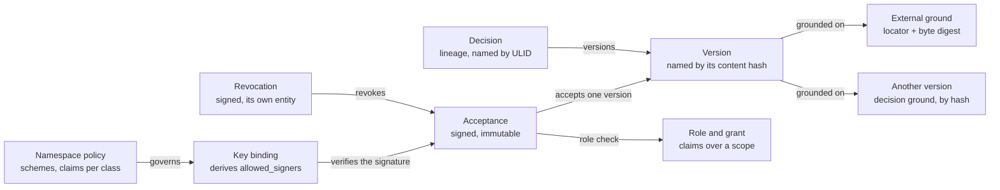

# Decision Ledger Protocol 1.0: Editor's Draft

5 October 2026 · Emil Klein

## Abstract

This document specifies the Decision Ledger Protocol, which makes a decision store verifiable from a repository alone. A companion document specifies the server-client protocol that carries reads and signed writes between a decision server and its clients. It states every requirement ruled up to 5 October 2026 and marks what only the extraction session can fix to the byte.

## Status of This Document

*This section describes the status of this document at the time of writing.*

This is an Editor's Draft dated 5 October 2026. It is written in the form of a W3C specification. It is not a W3C publication, has not been submitted to W3C or to the IETF, and has no standing at either.

It is a work in progress and should be cited only as such. Points marked **Extraction** are unspecified until the extraction session fixes them, and the test suite of section 11 does not yet exist.

This draft was written from the rulings, before the repository was read. The repository's `ledger-format-v1.md` is the normative format today. Where this draft and that document differ, the format document governs until the principal accepts this one. Two differences are known: the acceptance payload there carries `under`, and `A006` there is the role check over history.

Comments are raised as issues in the repository that hosts this specification. Rulings on its content are the principal's.

## 1. Conformance

Sections 3 to 11 are normative unless marked otherwise. Section 2, sections 12 to 14 and the appendices are non-normative. The text is incomplete wherever it says **Extraction**.

- **Sources.** The rulings of 1 and 2 October and of 4 and 5 October 2026. Where this text and a ruling differ, the ruling wins until the principal accepts this document.
- **Authority.** The specification and its test vectors are authoritative. Every implementation conforms to them, including the first one.
- **Keywords.** The key words MUST, MUST NOT, SHOULD and MAY are to be interpreted as described in BCP 14 (RFC 2119, RFC 8174) when, and only when, they appear in capitals.
- **Requirement ids.** `LP-n.m` for the ledger protocol, `SC-n.m` for the server-client protocol, `CF-n` for conformance. Ids are never reused.
- **Extraction.** Marks a point that only the existing implementation defines today. The extraction session fixes it to the byte. Until then no implementation can claim conformance on it.
- **SPARQL and SHACL.** Normative as definitions. No requirement obliges an implementation to run them.
- **Two protocols.** This document is the ledger protocol. The server-client protocol is a separate document. They are versioned separately, and the second states which versions of the first it carries.

| Profile | Binds | Role |
| --- | --- | --- |
| **W** writer | Ledger protocol | Files entities, signs acts, regenerates derived files. |
| **V** verifier | Ledger protocol | Decides validity of a store from the repository alone. |
| **R** reader | Ledger protocol | Consumes the export only. |
| **S** server | Both | Defined in the server-client protocol. A server is also a verifier. |
| **C** client | Both | Defined in the server-client protocol. A client is also a writer. |

Not protocol: command names, flags, prompts, message text, exit codes, how a server stores its index, and how a hosted server obtains a signature.

### Terminology

| Term | Definition |
| --- | --- |
| Store | The files of one namespace in a git repository. |
| Entity | One file recording one act. |
| Decision | A lineage of versions under one key. |
| Version | One hashed statement of a decision, identified by its content hash. |
| Act | Filing, revising, superseding, accepting, revoking, reviewing, binding a key or changing policy. |
| Holder | A human identity that holds an accepted grant. |
| Claim | A capability in the closed vocabulary that a role may exercise. |
| Ground | What a version rests on: another version or an external ground. |
| Foundation | The transitive closure of a version's grounds. |
| Pin | A trusted-source declaration naming a foreign server and namespace with its key material. |
| Finding | A gate class id and the subject it is reported against. |
| Test case | An input and its expected result, described in a manifest. |

## 2. Model at a glance

*This section is non-normative.*

**An acceptance covers a statement and its grounds through one hash**



*ledger entities · 9 kinds, 8 references*

An acceptance signs one version hash. That hash covers the version's grounds, so the signature reaches the whole foundation without naming it. Authority sits beside the content: the role check and the key binding decide whether the signature counts.

## 3. Store, identity and lexical forms

A store is a directory of files in a git repository, and the files are the truth. Every graph, index and export is a read model over them.

- **LP-3.1** (W, V) Every entity MUST be a file. No fact may exist only in a read model.
- **LP-3.2** (V) A store MUST be verifiable from the repository and its git history alone. A verifier MUST NOT fetch anything.
- **LP-3.3** (W, V) A version is identified by its content hash. Every other entity is identified by a ULID with a type prefix.
- **LP-3.4** (W, V) Hashed content MUST be strings only. There are no numbers, booleans or nulls in hashed content.
- **LP-3.5** (W, V) An entity is immutable once landed. Every change is a new entity. The one exception is a log file's `format:` declaration, which MAY be raised to the lowest format its content needs, with nothing else in the file changed.
- **LP-3.6** (W, V, R) An identity is a `mailto:` IRI. It is stored and hashed as the bare address, and emitted and compared as `mailto:`.
- **LP-3.7** (W, V) A model is never a holder. An identity that denotes a model MUST be refused wherever a holder or actor is required.
- **LP-3.8** (W, V) A namespace is local to its store. It has no identity outside it and is referred to from elsewhere only through a pin (section 7).
- **LP-3.9** (W, V) A decision key matches `^[A-Z][A-Za-z0-9]{0,63}$`. It is hashed, unique per namespace among live decisions, immutable across versions of one decision, and carried to the successor on supersession.

### Lexical forms

| Thing | Form |
| --- | --- |
| Hash | `sha256:` followed by 64 lowercase hex digits |
| ULID | 26 characters of Crockford base32, `[0-9A-HJKMNP-TV-Z]{26}` |
| Entity ids | `dec:<ns>/<ULID>`, `grant:<ULID>`, `gacc:<ULID>`, `unav:<ULID>`, `rev:<ULID>`, `ground:<ULID>` |
| Scope | `*`, `ns:<name>`, `set:<id>` or `pattern:<ref>`; a set id matches `[a-z0-9-]+` |
| Grant order | `primary` or `fallback-N`, N from 1 |
| Boolean-valued field | The string `true` when set, absent otherwise |

### Store layout

| Path | Holds |
| --- | --- |
| `.decisions/roles/<id>.yml` | One role per file |
| `.decisions/sig/<ulid>.<scheme>.sig` | One signature sidecar per scheme |
| `.decisions/ground/<sha256>` | Held ground bytes, named by their digest |
| `docs/decisions/<ns>.nt` | The committed export of a namespace |

**Extraction.** The remaining paths and the log-file layout. The exact file grammar, stated as a restricted subset that two parsers cannot read differently. The one exact spelling of a timestamp. The id prefixes of acceptances, change-sets, key bindings and policy entries.

## 4. Canonical form, hashing and signatures

One function of an entity's closed field list yields the bytes that are both hashed and signed. Everything about integrity follows from that.

### Hashing

- **LP-4.1** (W, V) An entity's hash is SHA-256 over the canonical serialisation of its closed field list, domain-separated by the prefix `ledger.<entity>.v1`.
- **LP-4.2** (W, V) A field is hashed when present and omitted when absent. Adding an optional field MUST NOT move any existing digest.
- **LP-4.3** (W, V) The canonical form is `v1`. A change that moves a digest is a new canonical form and requires a ruling.
- **LP-4.4** (W, V) A set-valued field is serialised in one defined order with duplicates removed.

| Entity | Prefix | Closed field list |
| --- | --- | --- |
| Acceptance | Extraction | `{decision, version, actor, at, scope, expires_at}` |
| Revocation | `ledger.revocation.v1` | `{revokes, actor, at, reason}` |
| Grant | `ledger.authority-grant.v1` | Extraction |
| Key binding | `ledger.identity-binding.v1` | Extraction |
| Ground | `ledger.ground.v1` | `{locator, digest}` |
| Version | Extraction | Extraction, plus `key`, `exported`, `grounds`, `source_prefix`, `source_method`, `source_keys` when present |

**Extraction.** The byte grammar: key order, set order and its comparison basis, string escaping, any Unicode normalisation, and how the prefix is framed into the hash input. Comparison basis matters because byte order and UTF-16 code-unit order differ above U+D7FF.

### Signatures

- **LP-4.5** (W, V) The signed bytes are exactly the canonical bytes the content hash is computed over.
- **LP-4.6** (V) Whether a signature is required is read from namespace policy, never from a tier.
- **LP-4.7** (W, V) A signature is a sidecar at `.decisions/sig/<ulid>.<scheme>.sig`, one per scheme. A verifier MUST verify every sidecar present.
- **LP-4.8** (W, V) The inline signature field is retired. It MUST be empty, and any value is refused.
- **LP-4.9** (W, V) A policy change MUST be signed under the policy in force before it.

| Scheme | Rule |
| --- | --- |
| `ssh` | An SSHSIG signature under the namespace string `ledger-accept@<ns>`. It is verified at the entity's `at` time against the validity window of the signer's key. |
| `dsse` | An envelope over the same bytes, verified against the key material the policy names. |
| `none` | Governed but unsigned. A policy that lists `none` MUST list it alone. Valid only for stores that predate signing. |
| `webauthn` | Reserved. Defined by a later decision. |

### Trust file

- **LP-4.10** (W, V) `allowed_signers` is derived from key-binding entries. A verifier MUST regenerate it and require the committed file to be byte-identical.
- **LP-4.11** (W, V) Key bindings are append-only: add, rotate and revoke are new entries.
- **LP-4.12** (V) The genesis holder's first binding is self-bound and references the genesis grant's external reference. Every later binding is signed under the policy in force.
- **LP-4.13** (V) An acceptance dated after its key's close is invalid. One dated before the close stays valid and is listed for re-acceptance, and it fails only after the policy deadline, if one is set.
- **LP-4.14** (V, R) An affirmation is a new acceptance under a live key. The latest valid acceptance of a version is the one that counts.

**Extraction.** The SSHSIG hash algorithm and sidecar encoding, the DSSE payload type, and the exact line format, option order and line order of `allowed_signers`.

## 5. Entities

Thirteen entity kinds make up a store. The file unit is the act: one file records one thing someone did.

| Entity | Identity | Hashed | Signed | What it records |
| --- | --- | --- | --- | --- |
| Decision | `dec:<ns>/<ULID>` | No | No | A lineage of versions. Superseded decision to decision. |
| Version | Content hash | Yes | No | Key, set, statement, `exported`, grounds, and source fields when it declares a trusted source. |
| Change-set | ULID | Extraction | No | The act that landed one or more files. |
| Acceptance | ULID | Yes | By policy | A holder accepts one version, with scope and optional expiry. |
| Revocation | `rev:<ULID>` | Yes | By policy | A holder revokes one acceptance, with a reason. |
| Review | ULID | Yes | Yes | A holder's verdict on a version: `reject` or `changes-requested`. Not yet implemented. |
| Ground | `ground:<ULID>` | Yes | No | A locator and the digest of the bytes it refers to. Not yet implemented. |
| Role | Role id | Extraction | No | The claims a role may exercise, and its owner. |
| Grant | `grant:<ULID>` | Yes | Extraction | A role over a scope to one holder at one order. |
| Grant acceptance | `gacc:<ULID>` | No | Extraction | The holder accepts a grant by its hash. |
| Unavailability | `unav:<ULID>` | Extraction | Extraction | An interval in which a holder does not hold active authority. |
| Key binding | ULID | Yes | Yes | A key added, rotated or revoked for an identity. |
| Namespace policy | Extraction | Yes | Yes | Required schemes, key type, class requirements, re-acceptance deadline. |

- **LP-5.1** (W, V) An acceptance is immutable after creation. Nothing is ever added to it, including by a revocation.
- **LP-5.2** (W, V) A revocation is its own entity and names the acceptance it revokes.
- **LP-5.3** (W, V) The digest of an acceptance's or revocation's signed payload is that entity's content hash.
- **LP-5.4** (W) Anyone, including an agent, MAY file a decision, a version or a ground. None has effect until a version is accepted.
- **LP-5.5** (W, V) Giving an existing decision a key, a ground or source fields is a new version and needs a new acceptance.
- **LP-5.6** (W, V) Interim acceptances from before the ledger are not imported. The holder accepts at import.

### Version fields added by the ground rulings

| Field | Form | Meaning |
| --- | --- | --- |
| `grounds` | Set of strings | Each entry is a version hash or a ground hash. |
| `source_prefix` | One absolute IRI prefix | Its presence makes the version a trusted-source declaration. |
| `source_method` | `content-addressed`, `signed` or `plain` | What trust in the source rests on. Required with `source_prefix`. |
| `source_keys` | Set of strings | Key material for a `signed` source. |

**Extraction.** The full field table of every entity: required or optional, hashed or not, and the triple each field is emitted as.

## 6. Authority, decision classes and claims

An act is valid only when its actor holds a grant whose role carries the claim that act requires. The class of the version decides which claim that is.

### Claims, roles and grants

- **LP-6.1** (W, V) Claims are a closed vocabulary: `accept-decision`, `sign-off-pattern`, `waive-invalidation`, `grant-role`, `revoke-grant`, `declare-unavailability`, `rotate-genesis`, `trust-source`.
- **LP-6.2** (W, V) The role check: the actor holds a live, accepted, available grant whose role may exercise the claim over the scope. It fails on no grant, grant not accepted, holder unavailable, wrong scope, or a fallback limit.
- **LP-6.3** (V) A grant is live only once its holder has accepted it by its hash.
- **LP-6.4** (V) A primary grant carries no limits. A fallback grant MAY carry `no-grants`, `no-grant-revocations`, `no-genesis`, `no-role-edits`.
- **LP-6.5** (V) The genesis grant is self-granted, has scope `*` and order `primary`, and carries an external reference. At most one genesis grant is live.
- **LP-6.6** (V) No two unrevoked, unsuperseded grants share role, scope and order.

### Decision classes

- **LP-6.7** (W, V) Every version belongs to exactly one leaf class. Membership is defined by presence of the version's own fields, so it is decidable from one file.
- **LP-6.8** (W, V) Leaf classes are disjoint. A version carrying two class-defining field groups is refused.
- **LP-6.9** (W, V) The set of write-gating classes is closed and ships with the vocabulary. A new one is a format amendment.
- **LP-6.10** (W, V) Each class states the claims its acceptance requires. That statement is the floor.
- **LP-6.11** (W, V) Namespace policy MAY add requirements to a class: further claims or a hardware-key requirement. It MUST NOT go below the floor.
- **LP-6.12** (V) An acceptance is valid only if its actor's role may exercise every claim the version's class requires, policy additions included.

| Class | Defined by | Floor |
| --- | --- | --- |
| `ordinary` | No `source_prefix` | `accept-decision` |
| `trusted-source` | `source_prefix` present | `trust-source` |

Because the classes are disjoint, `trust-source` stands alone. A holder of `accept-decision` only cannot accept a trusted-source version.

### What a verifier can and cannot check

- **LP-6.13** (V) Verifier-checkable in any implementation: the signature, the key binding and its window, the role check, the class claim and the policy.
- **LP-6.14** (W) Writer-behavioural: a writer MUST refuse to accept or revoke in a non-interactive session, for an agent identity, with a software key where policy requires a hardware key, and with an agent-held software key.

LP-6.14 binds one implementation and cannot be confirmed from a store. The guarantee that holds across implementations is the key, which makes the hardware-key policy the human-act property.

## 7. Ground, trusted sources and convergence

A version states what it rests on, and its hash covers that statement. The ground graph is therefore a Merkle DAG: pinning one hash commits to the whole foundation beneath it.

### Grounds

- **LP-7.1** (W, V) A version MAY state grounds. Each is another version, by its version hash, or an external ground, by its ground hash.
- **LP-7.2** (W, V) An acceptance covers the grounds through the version hash. Nothing about ground is added to the signed payload.
- **LP-7.3** (W, V) An external ground carries a locator and a digest of the bytes it refers to. Its identity excludes who pinned it and when.
- **LP-7.4** (W) A foreign decision MUST be grounded on by its original version hash and never re-filed. A restatement MUST ground on the original.
- **LP-7.5** (W, V) A store MUST hold the version file of every ancestor in a ground closure, so the foundation can be enumerated offline. Each file is checked against its hash.

### Held and referenced ground

| Bytes | Source | Result |
| --- | --- | --- |
| Held in the store | Any | The verifier checks the digest. |
| Referenced only | Trusted | Allowed. The digest is the pinner's attestation. |
| Referenced only | Not trusted | Refused. |

- **LP-7.6** (V) Held bytes are always digest-checked, whatever the source. Trust never removes a check that can be made.
- **LP-7.7** (V) Trust covers origin, not relevance. Whether a ground supports a decision is the acceptor's judgment.

### Trusted sources

- **LP-7.8** (W, V) A trusted source is declared by a decision proper: a version carrying `source_prefix`, accepted by a holder of `trust-source`.
- **LP-7.9** (V) A source is trusted while the tip version declaring it has an unrevoked, unexpired acceptance. Revoking that acceptance withdraws the trust.
- **LP-7.10** (V) Two live sources with overlapping prefixes and different methods are a conflict and fail verification.
- **LP-7.11** (W, V) A foreign namespace is pinned by a trusted source with the `signed` method: the server and namespace as prefix, plus the key material that verifies its acts.

| Method | Example | What a verifier can do offline |
| --- | --- | --- |
| `content-addressed` | Git commit, version hash | The locator is the digest. Trust concerns the publisher only. |
| `signed` | A foreign namespace's export | Check signatures against the pinned key material. |
| `plain` | A URL, a standards body | Nothing. Trust is a statement about who pinned it. |

### Convergence

- **LP-7.12** (V) Convergence MUST be visible: where several grounds of a version reach the same ancestor, that ancestor is reported once as a shared foundation.
- **LP-7.13** (V) Decision grounds converge on the version hash. External grounds converge on the byte digest, so mirrors and separate pinners of the same bytes count as one.

The foundation of a version is the transitive closure of its grounds:

```sparql
SELECT ?version ?foundation WHERE {
  ?version ledger:groundedOn+ ?foundation .
}
```

A shared foundation is an ancestor reached through more than one direct ground:

```sparql
SELECT ?version ?foundation (COUNT(DISTINCT ?ground) AS ?paths) WHERE {
  ?version ledger:groundedOn ?ground .
  ?ground ledger:groundedOn* ?foundation .
}
GROUP BY ?version ?foundation
HAVING (COUNT(DISTINCT ?ground) > 1)
```

Three grounds from three servers that all rest on one decision from a fourth then count as one foundation, not three.

### When a foundation moves

- **LP-7.14** (V) When a version in a ground closure is revoked or stops being its decision's tip, every version whose closure contains it is listed, with its distance from the moved version.
- **LP-7.15** (V) Only direct dependents must affirm or revise. Namespace policy MAY set a deadline after which an unaffirmed direct dependent stops being citable.
- **LP-7.16** (V) One revocation entity is the single cause reported on every dependent. It is signed and MAY be relayed by anyone.
- **LP-7.17** (W, V) A version MAY be accepted before its grounds. An accepted version resting on a ground that has never been accepted fails verification.
- **LP-7.18** (V) When trust in a source is withdrawn, referenced grounds pinned before the withdrawal are listed for review. Those pinned after it fail.

A copied statement with no declared ground is invisible to this graph. Only similarity hints can find it.

## 8. Verification, findings and derived state

Two verifiers conform when they report the same set of findings for the same store. A finding is a class id and a subject; nothing else about it is protocol.

- **LP-8.1** (V) Verification has two stages. The file gate checks one file at a time and refuses a bad file at parse. The graph stage checks properties across files.
- **LP-8.2** (V) The file gate runs before the graph stage. A store with a file-gate finding has no graph-stage result.
- **LP-8.3** (V) Cross-file properties are computed at verification time and never stored in any entity.
- **LP-8.4** (V) File-gate classes are named `L` and graph-stage classes `A`, each with a number. A new class takes the next free number, and a number is never reused.
- **LP-8.5** (V) Key immutability and key uniqueness compare across files but belong to the file gate.

### Classes fixed by ruling

| Class | Fails or lists when |
| --- | --- |
| `L001` | A decision has no allocation. |
| `L006` | A model is named as a holder or as the actor of a revocation. |
| `L011` | A required signature is absent or invalid, including one dated after its key's close. |
| `L012` | An acceptance was made under a since-closed key before the close. Listed for re-acceptance; fails only after the policy deadline. |
| `A003` | Two unrevoked, unsuperseded grants share role, scope and order. |
| `A005` | More than one genesis grant is live. |
| `A006` | An acceptance's actor has no live grant that may exercise every claim the version's class requires. |

The ground rulings add these, with numbers assigned when each lands: malformed ground reference, malformed source fields, two classes on one version, policy below the floor, dangling ground, untrusted referenced ground, held-bytes digest mismatch, unaccepted ground, source conflict, moved foundation, and ground under withdrawn trust.

**Extraction.** The complete class list with each class's exact condition and subject, the key classes' numbers as landed, and every fact a verifier reads from git, stated in terms of git objects.

### Derived state

A decision's state is a function of the entities present. No entity has a state field.

| State | Holds when |
| --- | --- |
| Proposed | The decision's tip version has no valid, unrevoked acceptance and no rejecting review. |
| Accepted | The tip version has a valid, unrevoked, unexpired acceptance by a holder with the class's claims. |
| Citable | Accepted, with no elapsed deadline on a re-acceptance or a moved foundation, and no failing ground. |
| Superseded | A successor decision supersedes it. The key carries over, and this is not obsolescence. |
| Revoked | Every acceptance of the tip version is revoked and there is no successor. |
| Rejected | A signed review with verdict `reject` exists on the version. |
| Needs re-acceptance | The acceptance that counts was made under a since-closed key. |
| Trusted (a source) | The tip version declaring the source has an unrevoked, unexpired acceptance by a `trust-source` holder. |

Each state is to be given as a named SPARQL query over the export in the next draft, once extraction fixes the predicates.

## 9. Export and the reader profile

The export is the one artefact a reader needs, and a verifier can rebuild every signed byte from it. It is derived, deterministic and held byte-identical.

- **LP-9.1** (W, V) The export of a namespace is sorted N-Triples at `docs/decisions/<ns>.nt`. A verifier MUST regenerate it and require the committed file to be byte-identical.
- **LP-9.2** (W, V) The export carries ledger-authored entities only. Commits and citations are never in it; they are a separate derived file that verification does not check.
- **LP-9.3** (W, V) The export carries every field of every signed payload and a reference to each sidecar, so a verifier holding only the export can rebuild the signed bytes.
- **LP-9.4** (W, R) A revocation is emitted as its own node naming what it revokes. No triple is added to an acceptance.
- **LP-9.5** (W, R) The export carries each version's grounds, each ground entity, the source fields and the class type of every version.
- **LP-9.6** (W, V) For a namespace that others pin, the export carries enough of the authority log to verify its acts from the pinned key material.

| Node | IRI form |
| --- | --- |
| Entity | `urn:<id>`, for example `urn:grant:<ULID>` |
| Version | `urn:sha256:<hex>` |
| Identity | `mailto:<address>` |
| Set | `urn:ledger-set:<id>` |
| Role | `urn:ledger-role:<id>` |
| Vocabulary | `urn:ledger:ns#` |

### Reader profile

- **LP-9.7** (R) A reader MUST keep every `rdf:type` and MUST ignore predicates it does not know.
- **LP-9.8** (R) A reader derives a set's id from the last segment of its IRI.
- **LP-9.9** (R) A reader treats a decision as accepted on the latest valid acceptance of its tip version.
- **LP-9.10** (R) A reader is not required to evaluate grounds. A store with a failing ground fails verification before a reader is reached.

LP-9.7 to LP-9.10 are coordinated with the analyzers' repository by issue and are not assumed to hold there yet.

**Extraction.** The N-Triples escaping, literal and datatype forms, sort order, line endings and final newline, and the form of a sidecar reference.

## 10. Relationship to the server-client protocol

The server-client protocol is specified in a separate document, The Decision Ledger Server-Client Protocol. It depends on this specification, and this specification never depends on it: nothing here requires a server, and no server can make an invalid store valid. The server and client conformance classes and the requirements numbered SC-n.m are defined there.

## 11. Test suite and implementation reports

An implementation conforms to a profile when it passes every approved test case that profile binds. The test suite is part of this specification, modelled on the W3C SPARQL and SHACL test suites. Conformance is behavioural: bytes out and findings out, not how they were computed.

- **CF-1** Every requirement has at least one vector. Every gate class has at least one negative vector, a store that must fail with exactly that class.
- **CF-2** A test case, called a vector here, is an input and its expected result. Manifests are RDF in the W3C test manifest vocabulary: each entry states its type, its action (the input store or file), its result (findings, bytes or a digest), the requirement ids it exercises and its approval status.
- **CF-3** The test suite is versioned and released as part of the specification. No implementation owns it; each pulls a released set.
- **CF-4** A permissive implementation does not conform. Accepting a store that a negative vector says must fail is a failure.
- **CF-5** Both protocols change additively. A change that moves a digest or reverses a finding is a new major version and requires a ruling.
- **CF-6** Where the prose and an approved test case disagree, the specification has a defect. Until it is corrected, the approved test case governs.
- **CF-7** A test case binds once the principal approves it. A proposed test case binds no one.
- **CF-8** Expected findings are compared as a set of class and subject pairs, never as text.
- **CF-9** An implementation publishes its results as an EARL report, one assertion per test case.

| Profile | Conforms when it |
| --- | --- |
| Writer | Produces entity files, sidecars and derived files byte-identical to the vectors, and refuses what LP-6.14 lists. |
| Verifier | Reports exactly the expected findings for every vector store, positive and negative. |
| Reader | Derives the expected decisions, keys, sets and acceptance status from each vector's export. |
| Server | Refuses every invalid, relayed or stale envelope in the vectors and commits the valid ones unchanged. |
| Client | Completes each grant, signs the expected bytes and refuses a drifted batch. |

### Proving the specification

Version 1.0 of each protocol requires two independent implementations that pass the vectors. The second is built from this text and the vectors alone, without reading the first one's source. Every place it has to guess is a gap in the specification, recorded and closed here.

## 12. Open items and the extraction list

*This section is non-normative.*

Nine points wait on extraction and twelve on a ruling or a design decision. None of the ruled requirements above depends on them.

### Fixed by the extraction session

- [ ] File grammar as a restricted subset, and the full store layout.
- [ ] Canonical byte grammar: key order, set order and comparison basis, escaping, prefix framing.
- [ ] Hash prefixes and closed field lists of the version, acceptance, grant and key binding.
- [ ] The one exact spelling of a timestamp, and the remaining id prefixes.
- [ ] Full field table of every entity, with the triple each field is emitted as.
- [ ] SSHSIG parameters, sidecar encoding and the DSSE payload type.
- [ ] Exact line format and ordering of `allowed_signers`.
- [ ] The complete gate class list with conditions and subjects, and what verification reads from git.
- [ ] N-Triples escaping, sort order and line endings of the export.

### For the principal

- [ ] Whether `rejected` is terminal.
- [ ] Whether `changes-requested` reviews are signed. Proposal: yes.
- [ ] The `webauthn` scheme.
- [ ] The form of `source_keys`: what key material pins a foreign namespace.
- [ ] Whether the locator belongs in a ground's identity, given that mirrors of the same bytes must converge.
- [ ] Whether fallback ordering uses covering scope or identical scope.
- [ ] Whether the C# implementation is the hosted server only or a full writer. That decides which vectors come first.

### Design work

- [ ] Class numbers for the ground classes, assigned as each lands.
- [ ] Grant revocations are unsigned today; signing them is tracked in product-cli #82.
- [ ] Whether a source prefix must end at a path boundary (section 13).
- [ ] Erasure of a holder's address against immutability (section 14).
- [ ] Freshness and non-equivocation across servers, tracked in the server-client protocol.

## 13. Security considerations

*This section is non-normative.*

The protocol's security rests on one thing: a signature by a key bound to a human holder. Each consideration below is a way that can fail or be mistaken for more than it is.

| Consideration | What can go wrong | What the protocol does |
| --- | --- | --- |
| Key compromise | A stolen key signs acceptances until its binding is revoked. | Acceptances dated after the close are invalid; earlier ones are listed for re-acceptance. |
| Backdating | An acceptance's time is asserted by its signer, so a stolen key can sign with an earlier date. | The landing commit bounds the time. What a verifier checks against git is an Extraction point. |
| Agent-held keys | A software key readable by an agent lets it produce a valid acceptance with any implementation. | Only a hardware-key policy prevents this across implementations. Writer refusals bind one implementation. |
| Canonical ambiguity | Two serialisations of one payload would let a signature be read two ways. | One canonical form, strings only, closed field lists. The byte grammar is an Extraction point. |
| Cross-context reuse | A signature made for one purpose is replayed for another. | Hash prefixes separate entity kinds. Signing namespaces separate login from acceptance. |
| Hash agility | SHA-256 is the only hash. | A replacement is a new canonical form and a new major version. |
| Attested digests | A referenced ground's digest is unverifiable offline. | Allowed only under a trusted source, and reported as attested, not checked. |
| Prefix confusion | A source prefix that does not end at a path boundary can match a hostile locator. | Open issue: require prefixes to end at a boundary. |
| Stale copies | A fetched export is old and lacks a revocation, so a review trigger never fires. | Open issue, tracked in the server-client protocol. |
| Equivocation | A holder shows different histories to different parties. | Open issue, tracked in the server-client protocol. |

## 14. Privacy considerations

*This section is non-normative.*

A store names people. Every acceptance, revocation, grant and key binding carries a holder's email address, and the protocol makes those records permanent.

- **Identities are personal data.** A `mailto:` identity appears in entity files, in signatures, in `allowed_signers` and in the export.
- **Exports can be public.** An exported decision is served anonymously, together with the acceptances that name its holders.
- **Erasure conflicts with immutability.** Entities are immutable and git history is permanent, so an address cannot be removed from a store once landed. This is an open issue for any deployment under data-protection law.
- **Signatures are not anonymous.** A public key in `allowed_signers` links every act signed with it, across namespaces and servers that bind the same key.
- **Read access reveals activity.** The inbox shows who proposed what and when. Tokens guard it, and non-exported decisions are never served anonymously.
- **Audit events name principals.** A server's audit log is personal data held outside the repositories.

A deployment should tell holders, before they accept a grant, that their address and acts become a permanent and possibly public record.

## A. References

### A.1 Normative references

| Key | Title | Publisher |
| --- | --- | --- |
| RFC2119 | Key words for use in RFCs to Indicate Requirement Levels | IETF |
| RFC8174 | Ambiguity of Uppercase vs Lowercase in RFC 2119 Key Words | IETF |
| RFC3986 | Uniform Resource Identifier (URI): Generic Syntax | IETF |
| RFC6068 | The 'mailto' URI Scheme | IETF |
| FIPS180-4 | Secure Hash Standard | NIST |
| RDF11-CONCEPTS | RDF 1.1 Concepts and Abstract Syntax | W3C |
| N-TRIPLES | RDF 1.1 N-Triples | W3C |
| SPARQL11-QUERY | SPARQL 1.1 Query Language | W3C |
| SHACL | Shapes Constraint Language | W3C |
| PROV-O | The PROV Ontology | W3C |
| SSHSIG | The SSH signature format, `PROTOCOL.sshsig` | OpenSSH |
| DSSE | Dead Simple Signing Envelope | Secure Systems Lab |
| ULID | Universally Unique Lexicographically Sortable Identifier | ULID specification |

### A.2 Informative references

| Key | Title | Why it is cited |
| --- | --- | --- |
| SERVER-CLIENT | The Decision Ledger Server-Client Protocol | The companion protocol (section 10) |
| OWL2 | OWL 2 Web Ontology Language | The class definitions of section 6 |
| SKOS | SKOS Simple Knowledge Organization System | The closed vocabularies |
| EARL10 | Evaluation and Report Language 1.0 Schema | Implementation reports |
| TEST-MANIFEST | The W3C test manifest vocabulary | Test suite manifests |
| RFC8785 | JSON Canonicalization Scheme | Comparison only; whether the canonical form matches it is an Extraction point |

## B. Changes

| Date | Change |
| --- | --- |
| 5 October 2026 | First draft from the rulings of 1, 2, 4 and 5 October. |
| 5 October 2026 | Test suite made part of the specification: rulings 19 to 21, CF-6 to CF-9. |
| 5 October 2026 | Restructured in W3C form: abstract, status, conformance, terminology, security and privacy considerations, references. |
| 5 October 2026 | Former sections 10 to 12 moved to The Decision Ledger Server-Client Protocol. Later sections renumbered 11 to 14; requirement identifiers unchanged. |
